# 第1章 平面·位置规律 + 相邻比较

> **本章要点速览**
> - **命题思维（通用）**：一组图看"恒定/等差/周期"；两组图"左边找规律、右边代规律"，**等差、恒定优先，运算很少考**；九宫格**横向为主（约95%）**、纵向次之（约5%，难题）；分组分类优先"两种规律"。每题先问两件事：**①怎么识别考点 ②怎么变**。
> - **位置规律识别**：每幅图**图案相同** + **个数相等**（3、3、3）→ 位置规律；个别少 1 个（3、3、2）→ 可能是**重合**，仍考虑；多 1 个（3、3、4）→ **排除**。
> - **平移两要素**：方向（直线：上下/左右/斜对角；绕圈：顺/逆时针）+ 步数（恒定高频、递增较少）。
> - **两个不同元素** → **拆分思维 + 就近假设**；**双胞胎**（长得一样）→ **先标记，再就近假设，但必须动**。
> - **多胞胎** → **找方向**（哪一行/列的黑块个数恒定，就沿哪个方向动；黑多看白）+ **走到头**（**循环走**高频，反弹走、下一排低频）。
> - **16宫格** → 先看**内部**：内部有规律 → **内外分开看**（绕圈）；内部无规律 → 常规平移（直线）。**点的运动**（端点/交点/十字交点/框内球）→ **关注内部**：内部都有什么就考什么。
> - **横/竖切一刀** → 拆成两部分，**两部分各一个规律**。
> - **25宫格/蜂窝** → 数**内部**个数定考点；黑块多 → **整体运动**，斜向运动变多；**方向可变**；数不过来就**找大区域**。
> - **隐藏外框（线条移动）** → **就近 + 找特殊**（唯一、斜线、虚线）；高频隐藏图形 **三角形、正方形、菱形**；头看不清就**看尾巴**。
> - **旋转**（顺/逆；45°、90°、180° 高频）、**翻转**（左右=竖轴对称，上下=横轴对称）；上下左右都变 = 转 180°。区分二者用**箭头法/时针法**，核心是**作图标准保持一致**。
> - **相邻比较**：图案相同但**有不动（像）**→ 分清哪些动（**移动/颜色互换**）、哪些不动；答案往往和前一幅**最像**。

---

## 0. 图推命题思维（通用方法）

这一节不针对某个考点，而是整个图推的"出题者喜好"和考场思考方式，后面所有章节都通用。

### 0.1 五种出题形式与出题者喜好

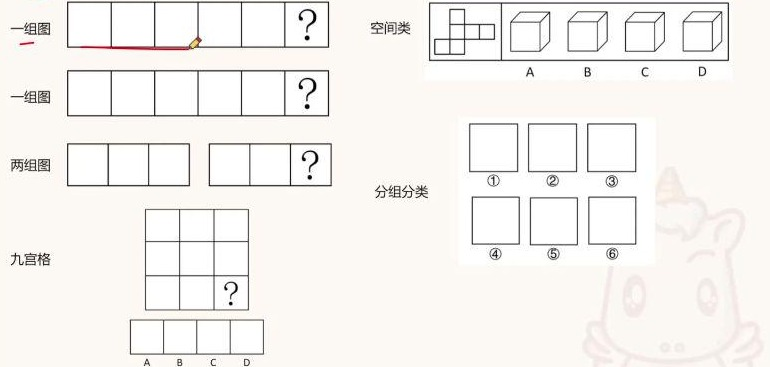

| 形式 | 怎么看 | 出题者喜好 | 补充 |
|---|---|---|---|
| 一组图 | 一排连在一起，从左往右看 | **恒定、等差、周期** | 周期 = 交替出现（1、2、1、2…） |
| 两组图 | 中间断开：**左边找规律，右边代规律** | **等差、恒定（优先）**；运算（很少考） | 左右两组的数值不必一样：左 1、1、1，右 2、2、2 也叫恒定；左 1、2、3，右 5、6、7 也叫等差（都 +1） |
| 九宫格 | 第一排找规律，第二排验证，第三排使用（相当于两次检验） | 等差、恒定、运算 | 方向见下表 |
| 分组分类 | 6 个图**平均分成 2 类** | **两种规律（优先）**；有规律和没规律（考得很少） | |
| 空间类 | — | 六面体、四面体、多面体、三视图、截面图、平面拼合、立体拼合等 | 平面拼合只在江苏、广东等少数省份出现，了解即可 |

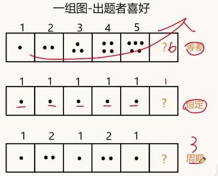

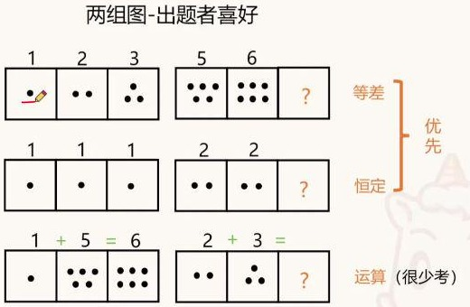

**九宫格的运算有两种**：

- **运算 1**：每行前两幅相加 = 第三幅（5+1=6，2+3=5，3+1=4）。
- **运算 2【难】**：每行三幅**加起来等于同一个数**（3+1+4=8，5+2+1=8，第三行 2+2+?=8 → 问号处 4）。凡是涉及这种"总和运算"，难度都很大。

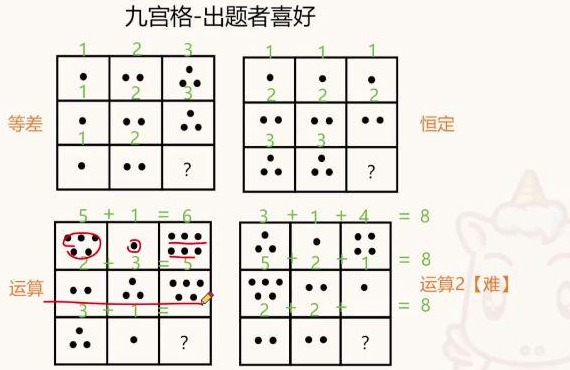

**九宫格的看图方向**：

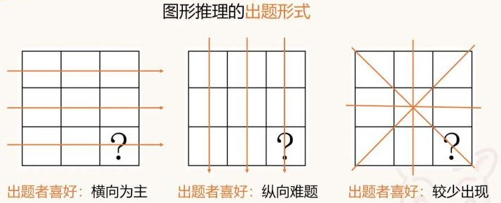

| 方向 | 比例 | 态度 |
|---|---|---|
| 横向（从左往右） | 约 95% | 优先考虑，重点掌握 |
| 纵向（从上往下） | 约 5% | 横向不行再看纵向，多为难题 |
| 米字形（对角线）、S 形等 | 不到 1% | 稍微了解，不必花精力 |

**分组分类的两种喜好**：①**两种规律**（优先）：如 ①③④ 各 1 个点、②⑤⑥ 各 2 个点，直接分；②**有规律和没规律**（很少考）：下图 ①③④ 是纯直线，⑤⑥ 是纯曲线，② 是"直线+曲线"——凑不成"纯曲线"一类，但可以换个说法："②⑤⑥ **有**曲线，①③④ **没有**曲线"，选 A。

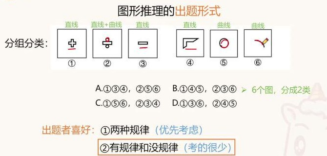

### 0.2 "3+3" 框架：从图形特征定位考点

所有平面考点先按"**有没有一样的图案**"一分为二，各 3 类，合称"3+3"。本章讲的是第一类的第一个考点——**位置规律**（及紧挨着的相邻比较）。

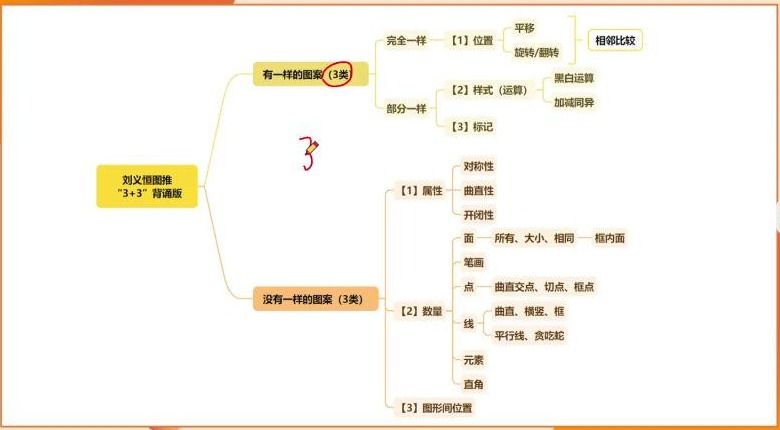

| 大类 | 细分 | 本书后续章节 |
|---|---|---|
| **有一样的图案**（3 类） | 完全一样 →【1】**位置**（平移、旋转/翻转、相邻比较） | **本章** |
| | 部分一样 →【2】样式（运算）：黑白运算、加减同异；【3】标记 | 后续章节 |
| **没有一样的图案**（3 类） | 【1】属性：对称性、曲直性、开闭性 | 后续章节 |
| | 【2】数量：面（所有、大小、相同—框内面）、笔画、点（曲直交点、切点、框点）、线（曲直、横竖、框；平行线、贪吃蛇）、元素、直角 | 后续章节 |
| | 【3】图形间位置 | 后续章节 |

> 老师强调：思维导图**注重理解，不要死记硬背**——考试给你的是图案，不是文字。

### 0.3 考场上的通用思考顺序

1. **每道题都问自己两个问题**：①我是怎么识别（定位）到这个考点的？②它怎么变（往哪动、动几步 / 哪些动哪些不动）？老师反复强调：**考场最大的难点是识别**。题型一打乱，识别不出就没有机会求结果；一旦识别出来，很多难题就成了送分题。
2. **用图形特征定位**：图案相同 + 个数相等 → 位置规律；背景是 16 宫格 → 想到"内外"；相邻两图大面积不动 → 相邻比较……（每节开头的"识别信号"就是干这个的）。
3. **先瞄一眼选项再动手**：找到可分析的元素后，**优先分析在四个选项里各不相同的那个元素**，一步选出答案，"性价比"最高；选项里完全一样的部分不用分析（例 1、例 4、例 8）。
4. **挑最好看的元素分析**：少的、唯一的、特殊的（交叉比五角星少、"一个"比"三个连着"清楚、斜线/虚线是唯一、黑块太多就看白块）。
5. **站在出题人角度排除不合理的方向**（不要"上帝视角"）：例 6 中三角形可能考面积、周长、顶点；面积"先增后减"不符合一组图"恒定/递增"的喜好，周长含根号根本算不了，于是只剩"顶点移动"。
6. **理解出题人的"度"（考情）**：高频模型直接考、不给提示（隐藏的三角形/正方形/菱形）；冷门模型会给台阶（考六边形会把顶点标出来）；太变态的（斜着切一刀、不给点的正多边形）基本不会考。
7. **规律可以"部分沿用"**：题目出难时，左右两组规律可以不完全相同，只要核心共性一致（例 3：左组"上下上下"、右组"下上下上"，共性是方向交替、每次 1 步）。
8. **就近假设 + 允许一次试错**：先按最近、最可能的情况推，推不通再换另一种，最多多走一步。

### 0.4 新题趋势：从 26 河南卷看命题

26 河南卷十道图推几乎每道都是难题（最简单的"对称轴+部分数"得分率也只有 60% 多），但拆开看，**大部分知识点平时都练过，难在"老考点 + 新形式"**。

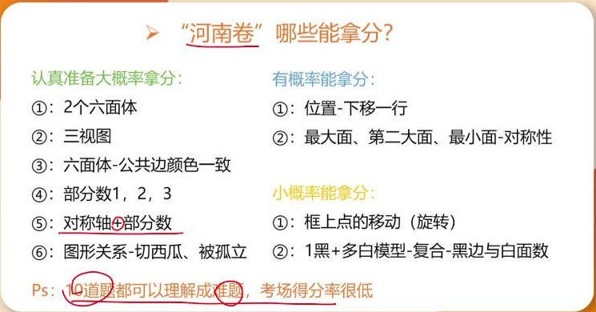

- **认真准备、大概率能拿分**：2 个六面体组合、三视图、六面体公共边颜色一致（垂直关系找颜色、中间找公共边，挖坑点和模拟题一样）、部分数、对称轴+部分数、图形关系（切西瓜、被孤立）。
- **有概率拿分**：位置——**下移一行**（见 2.4 走到头）；最大面、第二大面、最小面的对称性（"第二大面"是新概念）。
- **小概率拿分**：**框上点的移动（旋转）**（见 6.6）；"1 黑 + 多白"模型——黑边数与白面数的复合运算。
- 结论：按正常一年的学习，能稳拿 5~6 道，再蒙对 1 道左右，平均 6~7 道就是高分；对手多在 3~4 道，差距约 3 道题。

**出题人改编真题的常见手法：换颜色、换形式，知识点不变。** 老师的玩笑话：出题人"不要脸"就直接抄，"要脸"就把白色改成黑色——26 国考数白色的面，26 河南就改成数黑色的部分数。记住的应该是背后的知识点，而不是段子。

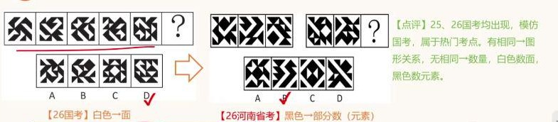

**学习与复盘建议**：新题难度大，平时尽量练难一点，考场心理落差才小；做错的题在思维导图对应知识点上做标记，同一知识点错得多（例如移动问题错了 5 题），说明这个点有问题，再去做该点的专项训练——这样的复盘才有效。

---

## 1. 位置规律总论：怎么判定

### 识别信号（看到什么，想到它）

- **每幅图的图案（组成元素）完全相同**，只是位置不同 → 位置规律（出题人作图时就是把同一组元素挪来挪去）。
- **数个数**，是判定位置规律最快的办法：

| 各图个数 | 判断 | 原因 |
|---|---|---|
| 3、3、3 | **优先**考虑位置规律 | 元素没变，只是位置变了 |
| 3、3、2 | **仍优先**考虑 | 某一幅里两个元素**重合**了，看起来少一个 |
| 3、3、4 | **排除**位置规律 | 重合只会让数量减少，不可能增加 |
| 3、3、1 | 可能性很低 | 要重合两次，出题人很少这样出 |

### 规律讲解

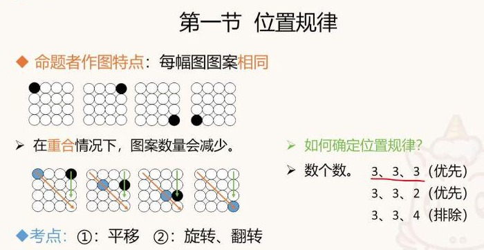

- 上图下方的例子：蓝球沿对角线往右下走，黑球从上往下走，第 4 幅图两者走到同一格**重合**，所以看上去只剩 1 个。
- 位置规律的两个考试方向：**① 平移**；**② 旋转、翻转**。
- 位置规律的元素**都在动**，很少出现某个元素不动；只要出现"有的动、有的不动"，就归到**相邻比较**（第 7 节）。

💡 解释：位置规律只改变元素的位置，不增删元素，所以"个数不变"是它的指纹；唯一的例外是两个元素走到同一格叠在一起，只可能"少"不可能"多"。所以数出"多一个"可以直接排除位置规律。

---

## 2. 平移·基础：方向、步数、拆分、双胞胎、多胞胎

### 识别信号（看到什么，想到它）

- 宫格背景（九宫格为主）+ 每幅图元素相同、个数相等（或个别图少 1 个）→ 平移。
- 元素只有 1 个 → 直接看方向和步数；2 个不同元素 → 拆分；2 个一模一样 → 双胞胎；很多个一样 → 多胞胎。

### 规律讲解

#### 2.1 平移两要素：方向 + 步数

确定是平移之后，只问自己两个问题：**往哪个方向？走了几步？**

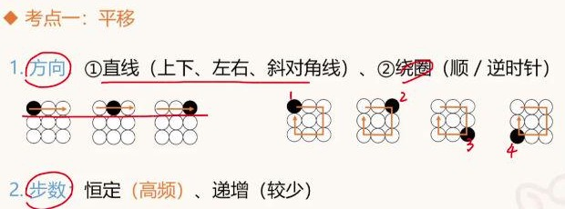

| 要素 | 分类 | 说明 |
|---|---|---|
| 方向 | ① 直线 | 上下、左右、斜对角线 |
| | ② 绕圈 | 沿宫格外圈打转：顺时针 / 逆时针（如左上→右上→右下→左下） |
| 步数 | 恒定（**高频**） | 每次都走一样多（如每次 1 步） |
| | 递增（较少） | 1 步、2 步、3 步……难度更大，考得相对少 |

#### 2.2 升级 1：两个不同元素 → 拆分思维 + 就近假设

出题人嫌 1 个黑块太简单，换成 2 个不同的元素（圆、三角形）。解法两个思想：

- **拆分思维**：圆和三角形**分开看**，各自找规律，不能整体看。
- **就近假设**：同一个终点可能有多种走法（例如圆可以直接往下走 1 格，也可以绕一大圈到同一格），**选最近的那条**——考试基本考的都是最近的距离。

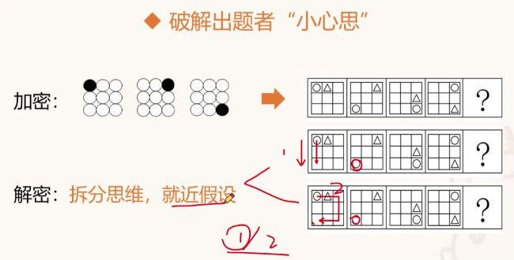

💡 解释：出题人设计规律时追求简洁，每次移动取最短路径；考生按"最近"假设去推，出错概率最低，推不通再换，最多试错一次。

#### 2.3 升级 2：双胞胎 → 标记 + 就近假设（但必须动）

两个元素**长得一模一样**，到下一幅图就分不清谁是谁（"双胞胎"题型）。解法：

1. **标记**：先在第 1 幅图给两个元素标 ①、②，做初步区分。
2. **就近假设**：判断第 2 幅图里哪个是 ①、哪个是 ②——取最近的距离，**但不能不动**。

> **"可以静，但不能这么静"**：移动距离为 0 不行，平移平移，一定要动起来。

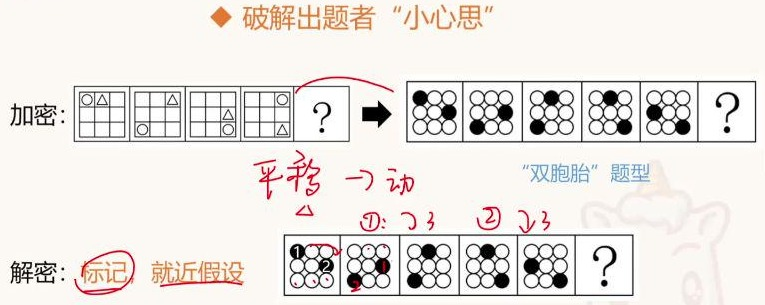

上图示例：第 1 幅 ① 在左上、② 在右中。第 2 幅黑块在右中和左下——右中这个如果是 ②，② 就原地没动，不允许；所以它是 ①（左上顺时针走 3 步到右中），② 则从右中顺时针走 3 步到左下。两个都是**顺时针 3 步**，规律就捋出来了。

#### 2.4 升级 3：多胞胎 → 找方向 + 走到头

黑块一多（如 4 个一样的），一个个就近假设不现实，需要两个新技巧。

**① 找方向：看每一行/每一列的个数**

- 如果是**横向**运动，黑块只在本行内左右走，所以**每一行的黑块个数保持相等**（比如第二行一直是 0 个）。
- 如果是**纵向**运动，**每一列的黑块个数保持相等**（比如第一列一直是 3 个）。
- 技巧：**黑块太多时看白块**。黑块被打散不好看，某一列里只有 1 个白球时，盯着白球从上往下移就简单多了。

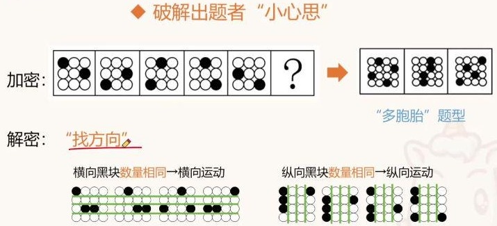

💡 解释：只在行内移动的元素不会跑到别的行，所以每行个数守恒；循环走（下面讲）同样不改变行内个数。因此"哪个方向的个数恒定"就是"沿哪个方向运动"的信号。

**② 走到头：怎么处理边界**

| 走法 | 含义 | 频率 |
|---|---|---|
| **循环走** | 走到头没路了，从这一行（列）的开头重新进来（1、2、3、4 → 回到 1） | **高频，重点掌握** |
| 反弹走 | 像撞墙一样，退回上一个位置往回走 | 低频 |
| 下一排 | 走到行末，进入**下一行的开头**（"下移一行"） | 低频（26 年新题），冲刺阶段再掌握 |

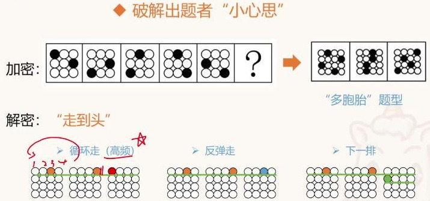

> 老师提醒：刚起步只记**循环走**。记的东西越多，考场思路越乱，下一排虽然是新题，但毕竟是低频考点，很多省份没考。

**拓展（课前复盘提到）："下移一行"真题**：26 河南（选 B）、20 四川（选 A）、24 联考（选 A）以及模拟题（选 B）都考过这个走法。26 河南的难点有两个：①为什么考位置？②怎么运动？知识点和以前一致，但形式创新，实战得分低。

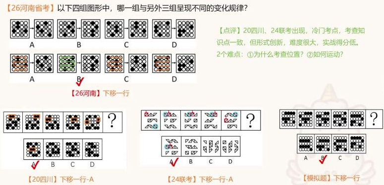

### 易错点 / 老师提醒

- 两个元素时，先看选项：**选项里位置各不相同的元素先分析**，往往分析一个就出答案，另一个不用看。
- 就近假设 ≠ 不动；双胞胎题里"不动"的假设要排除（题干中若某个位置不是每幅都有黑块，就证明它必须动）。
- 左右两组的规律可以"反相"：只要共性（方向交替、每次 1 步）一致就成立，不要以为出题人不严谨。

### 例题

**例1**（24山西）九宫格里有 1 个黑方块和 1 个黑点，问号处填哪个。

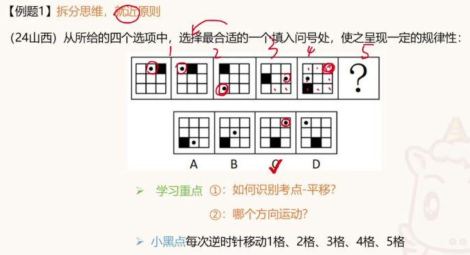

**思路**：
1. 识别：每幅图都有 1 个黑方块、1 个黑点，图案和个数都一样 → 位置规律（移动）。
2. 先看选项：黑方块在选项中只有两种位置（A、B 左下，C、D 下中），分析它最多排掉两个；**黑点在四个选项里位置各不相同**，分析黑点一步到位 → 先分析黑点。
3. 黑点（就近）：沿外圈**逆时针**依次走 1、2、3、4 步（上中→左上→左下→右中→左中），问号处走 5 步 → 右上角。只有 C 的黑点在右上，直接秒选。
4. 验证黑方块：外圈逆时针每次 1 步（右上→上中→左上→左中→左下），下一个是下中，C 仍符合。若先分析黑块，只能剩 C、D，还要再分析一次。

**答案**：C

**例2**（2022江苏）3×3 的球阵里每幅有 2 个黑球（长得一样），问号处是什么。

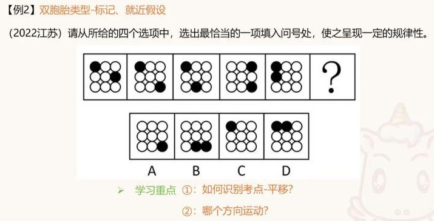

**思路**：
1. 识别：每幅都是 2 个黑球，个数一样 → 考移动；两个一模一样 → 双胞胎，先标记。
2. 标记第 1 幅：左上 = ①，右中 = ②。
3. 第 2 幅黑球在左上、右下。左上能不能是 ①（不动）？如果 ① 不动，每一幅的左上都应该是黑的，但第 4 幅左上是白的 → **必须动**。所以左上是 ②，右下是 ①。
4. ② 的规律：右中→左上，**逆时针 3 步**；验证：→下中→右上→左中，都对；问号处再逆时针 3 步 → **右下角**。据此排除 C、D，保留 A、B。（为什么不是顺时针 5 步？就近假设，取最近。）
5. ① 的规律：左上→右下，走 4 步（顺、逆时针都是 4 步，无所谓），其实就是在**左上、右下这条对角线上来回交替**；问号处在右下。
6. ①② 都到右下角 → **重合**，只剩 1 个黑球在右下 → A。（考的正是"重合时数量减少"。）

**答案**：A（课上老师先口误说 ① 走"3 步"，随即更正为 4 步；答案不受影响）

**例3**（23河北事业）两组图，3×4 格子里各有 4 个黑块，问号处填哪个。

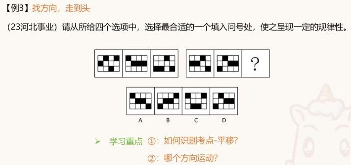

**思路**：
1. 识别：每幅都是 4 个黑块，个数相等 → 位置规律。
2. 找方向：左组第一排是 2、1、1 个，每一行个数不等 → 不是横向；每**一列**都恰好 1 个黑块 → **纵向运动**。
3. 左组逐列看（就近）：第 1 列向上 1 步（走到头**循环**到最下面）；第 2 列向下 1 步；第 3 列向上 1 步；第 4 列向下 1 步——**方向上下交替，每次都走 1 步**。
4. 代到右组（也是纵向）：第 1 列向下 1 步，再往下就穿出去循环到**最上面** → 问号处第 1 列黑块在最上：A、C 对，排除 B、D。
5. 第 2 列（A、C 在这里不同）：向上 1 步，再向上循环到**最下面** → 选 C。再验证第 3 列向下、第 4 列向上，均符合。
6. 疑问：右组是"下上下上"，和左组"上下上下"反了？没关系——出题难时规律可以不完全相同，共性（方向交替、每次 1 步）一致即可。

**答案**：C

---

## 3. 平移·16宫格：内外分开看、点的运动、拆分两部分

### 识别信号（看到什么，想到它）

- 背景是 **16 宫格**（4×4）→ 脑子里立刻把它和"**内外**"两个字连在一起：先看**内部**（中间 2×2）是否有共同的东西（个数相等 / 都有同一种点）。
- 内部有规律 → **内外分开看**；内部没规律 → 常规上下左右平移。
- 16 宫格被**横着或竖着切了一刀** → 拆分成两部分，两个规律。

### 规律讲解

#### 3.1 内外分开看

- **内圈** = 除了最外面一圈以外的部分（16 宫格中间 4 格）。
- 九宫格中心只有 1 格，内圈没法移动，所以很难考"内外"；16 宫格格子多了，内圈可以自己转一圈、外圈也转一圈，**内外方向可以不同**（如内圈逆时针、外圈顺时针）。
- 口诀：**内外分开看**（五个字）。16 宫格的内外分开看是**当下的高频**考法——否则出题人直接用九宫格就行了，何必画 16 格。

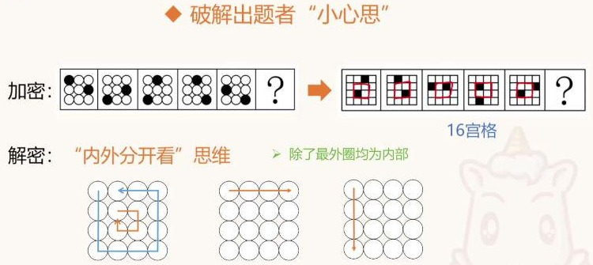

**16 宫格思路小结**：

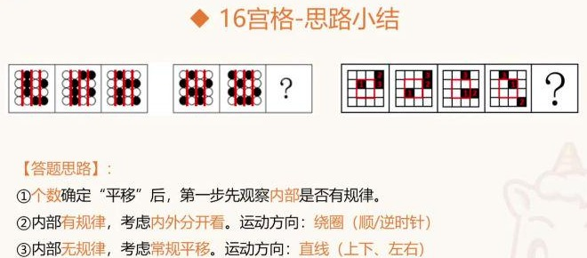

1. 用**个数**确定是平移后，**第一步先观察内部是否有规律**（这是检验"内外"想法的第一步）。
2. **内部有规律** → 内外分开看，运动方向是**绕圈**（顺/逆时针）。
3. **内部无规律** → 常规平移，运动方向是**直线**（上下、左右）。

上图左边的两组图：左组内部 2、2、2 个，右组内部却是 2、1 个 → 不能内外分开看 → 常规平移（纵向）。右边的一组图：内部一直是 1 个 → 内圈转、外圈转，内外分开看。

> 老师提醒：目前 16 宫格的**内部几乎不考重叠**（未来可能，但还没出过）。

#### 3.2 点的运动：关注内部

出题人把"小黑块移动"变形成"**点**的移动"：线条形状弯弯扭扭各不相同，但线上的某种**点**每幅都一样。

| 点的类型 | 含义 |
|---|---|
| 端点 | 线条的端头（"粗头"） |
| 交点 | 线条相交的地方 |
| 十字交点 | 两条直线十字交叉的点（交点里更细的一类，像十字路口） |
| 框内球 | 一个框围起来，里面有个小球 |

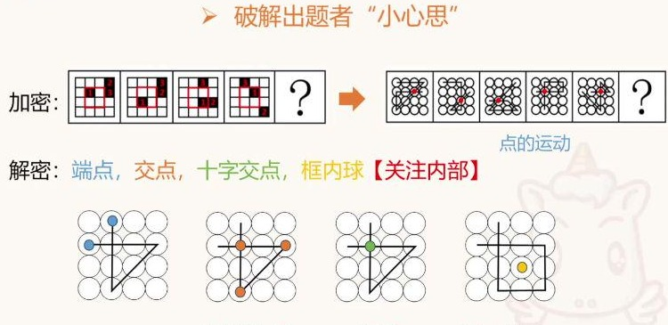

**不要死记这些概念**，只记四个字：**关注内部**——把内部圈出来，**内部大家都有什么，就考什么**。例如上图"加密"右侧的 16 宫格，内部每幅都有一个十字交点，它在右上→右下→左下→左上→右上打转，就是在考这个点。

#### 3.3 拆分两部分（非常规平移）

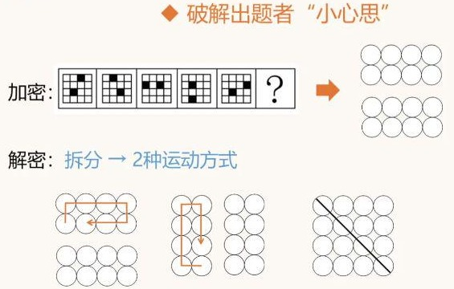

- 出题人像"水果忍者"一样把 16 宫格切一刀，目的就是**考两种运动方式**（例如上半部分顺时针绕圈、下半部分左右平移）。如果两部分还是同一种运动，切这一刀毫无意义。
- 拆分方式：**横向一刀、纵向一刀**为主；斜着一刀（运动路径很变态）可能但没必要，低概率。
- 思维：看到切开，就上下（或左右）**分开看**——**拆分思维**，而且大概率是两个规律。

### 易错点 / 老师提醒

- 内部有规律但**四个选项内部都一样** → 白高兴，内部排不了选项，只能转去分析外圈。
- 外圈元素多时，挑**数量少**的分析（交叉比五角星少）；选项只剩两个时，**对比两个选项的区别**，只分析那一个不同的元素。
- 顶点画在内框的边上（而不是格子中心），**仍然算内部**，别被画法骗了（例 6）。

### 例题

**例4**（24联考事业）16 宫格，每幅 5 个五角星、2 个交叉，问号处填哪个。

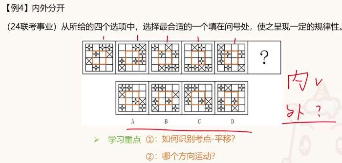

**思路**：
1. 识别：每幅都是 5 个五角星、2 个交叉，图案和个数都对得上 → 移动；背景变成 16 宫格 → 想到内外分开看。
2. 内部：每幅都有 1 个五角星，确实有规律——但四个选项内部五角星**都在右下**，分析出来也排不了选项（白高兴）→ 只能看外圈。
3. 外圈挑少的：五角星太多，选**交叉**分析。任选一个交叉，就近假设：**逆时针每次 1 步**，推到问号处，A、C 在该位置有交叉，B、D 没有 → 排除 B、D。另一个交叉在 A、C 中位置相同，不必再分析。
4. 对比 A、C：唯一区别是一颗单独的五角星的位置。找**参照物**：外圈有两颗连在一起的五角星（很好找），题干每幅都有一颗五角星紧跟在它旁边、**间距始终不变**（像"跟屁虫"）。A 中这颗星与两连星的间距变大了，不对 → 选 C。
5. 真要分析也可以：这颗星**顺时针每次 2 步**，问号处正好在 C 的位置。

**答案**：C

**例5**（23安徽事业）16 宫格上画着弯曲的线条，两组图，问号处填哪个。

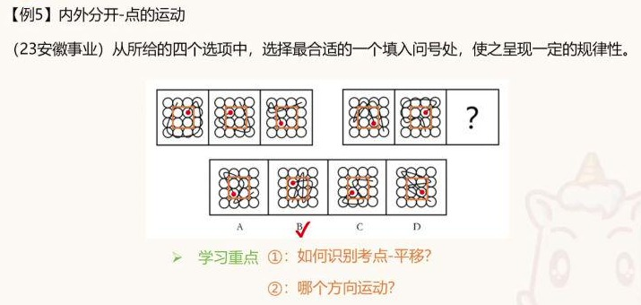

**思路**：
1. 识别（难点）：背景都是 16 宫格 → 有可能考移动；线条弯弯扭扭各不一样，但**每幅都有 2 个端点** → 端点的移动。
2. 16 宫格 → 看内部：每幅图**内部都有 1 个端点**（红点）→ 内外分开看。
3. 内部红点：左组 右上→左上→左下，**逆时针 1 步**；右组 右下→右上（逆时针 1 步），问号处 → **左上**。A、C、D 内部左上都没有端点，只有 B 有 → 选 B。
4. 验证外部：外圈的端点**顺时针 1 步**，右组问号处在第二个方块，B 仍符合。

**答案**：B

**例6**（26国考）16 宫格上画着一个黑色三角形，问号处填哪个。

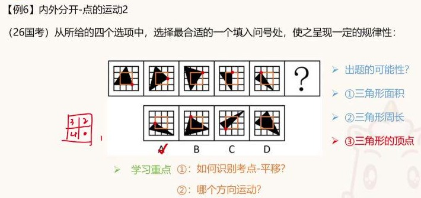

**思路**：
1. 识别（本课最难的识别）：站在考场还原——看到黑三角形，出题方向顶多三种：①三角形**面积** ②三角形**周长** ③三角形的**顶点**。
2. 排除面积：凭眼睛感受，前三幅面积在递增，第四幅又变小——先增后减不是规律（一组图只考恒定或递增）。
3. 排除周长：边长是根号三、根号五、根号十之类，考场根本算不了，出题人不会这么为难人。
4. 所以只能考**三个顶点的移动**（顶点个数相等）→ 位置规律；背景又是 16 宫格 → 看内部。
5. 内部：每幅都有 1 个顶点落在内部区域（橙色框上）。以前内部的点画在格子中间，这题故意画在内框边上，增加难度，但仍算内部。它沿内框**逆时针，每次 1 步**：第 1~5 个位置依次走过，问号处是第 6 个位置（内框左边中点）。只有 A 在这里有顶点，B、C、D 都没有 → 选 A。
6. 验证：另外两个顶点（外圈）也都是逆时针 1 步，A 没问题。

**答案**：A

**例7**（22国考）九宫格，每格是被一条横线切成上下两半的 16 宫格，问号处填哪个。

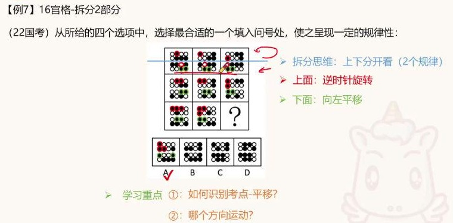

**思路**：
1. 识别：每格都是 16 宫格且被**横着切一刀**分成上下两部分；上半部分每格都是 4 个黑球，下半部分每格都是 5 个黑球，个数一致 → 位置规律。
2. 切一刀 → **拆分思维**，上下分开看，大概率两个规律。
3. 上半部分：有"3 个连着"和"1 个"，挑**1 个**的看，每次**逆时针绕圈 1 步**（3 个的那组同样）。
4. 下半部分：有 3 个连着、2 个连着，挑**2 个**的看，**整体向左平移 1 步**（走到头循环；看白球向左移也行）。
5. 横向（九宫格优先横向）前两排找到并验证规律，用到第三排：上半部分应拼出一个"U 形"。A 有；B、C 各少 1 个，D 少 2 个 → 选 A。下半部分向左平移验证也成立（出头的部分循环到右边）。

**答案**：A

---

## 4. 平移·25宫格与蜂窝：整体运动、方向可变、大区域

### 识别信号（看到什么，想到它）

- 背景是 **25 宫格**（5×5）或**蜂窝**（六边形排布），黑块很多。
- **不要把所有黑块都数一遍**（12 个一个个数完就一分钟了），只数**内部**：内部个数相等 → 有考位置规律的可能，并优先考虑内外分开看。
- 黑块多 → 出题人只能让它们**整体运动**（成片平移或整体旋转）→ 可以找**大区域**（连成一片的图案）。

### 规律讲解

#### 4.1 25 宫格 vs 16 宫格

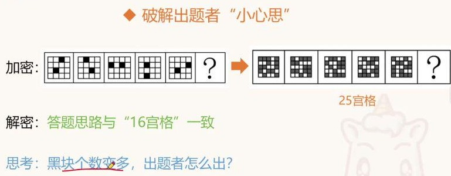

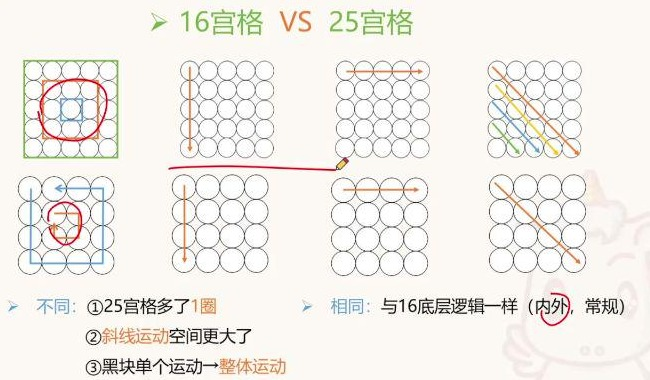

| | 25 宫格相对 16 宫格 |
|---|---|
| 不同 ① | **多了 1 圈**：共三层；除最外圈外，第一层和第二层都算内部（内 = 1 + 2） |
| 不同 ② | **斜线运动空间更大**（对角方向有 5 条斜线可走），考斜向运动的概率增加 |
| 不同 ③ | 黑块从**单个运动 → 整体运动**：黑块一多就不能一个个分别动，只能成片上下左右移、整体旋转 |
| 相同 | 底层逻辑一样：**先看内外**（内圈个数一样就内外分开看），内圈不行再考虑上下、左右、斜着的常规平移 |

#### 4.2 蜂窝

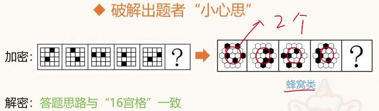

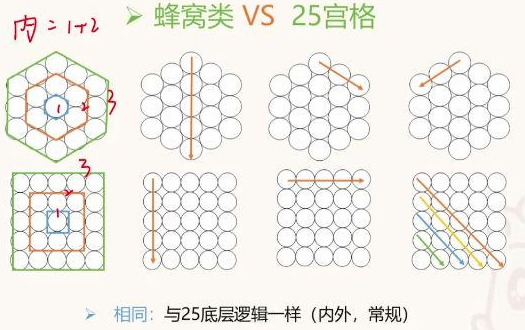

- 外轮廓像蜂巢，所以叫蜂窝。和 25 宫格一样有三层，内部 = 第 1 + 第 2 层，逻辑完全一致；上面"加密"图中蜂窝内部每幅都是 2 个黑块，所以可以出内外分开看。
- 区别：蜂窝**最方便考"斜着"运动**（整体往右上、右下、左下等方向移），横竖运动的可能性最低（考横竖不如直接用 25 宫格，作图更方便）。
- 出题人用蜂窝的两个出发点：①**内外分开看** ②**斜向运动**。

💡 解释：蜂窝是六边形排布，天然有三条运动轴（横向 + 两条 60° 斜向），斜向移动时图案不会"错格"，所以出题人爱考斜向；而正方形宫格的天然方向是横竖。

#### 4.3 方向可变 + 找大区域

- **方向可变**：以前运动方向固定不变，现在可以"先右上、再右下"交替变化（例 10），不能想当然认为方向一定固定。
- **大区域（大面积）**：黑块多时，找一块**连在一起的特殊图案**（如菱形、字母 C 形）。整体移动过程中，只要它没走到边缘，形状就不会被破坏——既能用来**判定考点**，也能直接**找答案**。

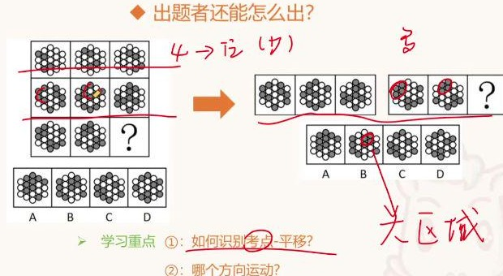

### 易错点 / 老师提醒

- 25 宫格、蜂窝不要全数，**数内部**；判定比求解更难，判定出来往往就送分了。
- 在同一圈里挑"**唯一**"的元素看（两个连在一起的），孤零零一样的单个黑块容易混。
- 同一圈都是一样的单个黑块时，改看**两个黑块夹着的白块**（唯一），从黑色思维转成白色思维。
- 规律找到后，时间紧可以跳过中间一排验证，直接用到最后一排。

### 例题

**例8**（25重庆事业）25 宫格黑白球阵，问号处填哪个。

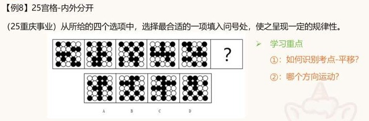

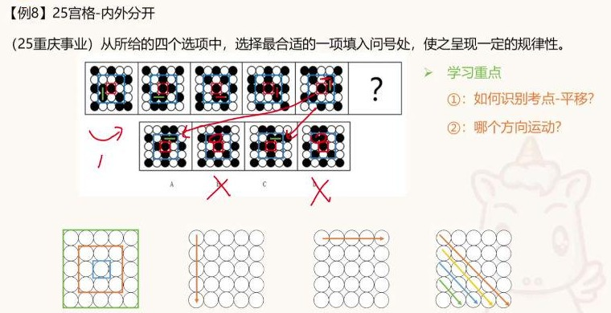

**思路**：
1. 识别：全部数（每幅 12 个）太慢；只数**内部**（中间 3×3），每幅都是 5 个 → 个数相等 → 位置规律，且高频考法是内外分开看。
2. 内部有三层，最内一圈先圈出来；在第二层里选**两个连在一起**的绿色线段（唯一，好区分；孤零零的单个都长一样，不好区分）。它**逆时针每次 1 步**，问号处应变成"横着"的两连 → A、C 有，B、D 没有，排除 B、D。
3. A、C 内部一样 → 只能看外部。外圈同样挑**两个连在一起**的（唯一）：**顺时针每次 2 步**，推到问号处是 A 的位置，C 不对。

**答案**：A

**例9**（25江苏选调）蜂窝形三角格，每幅有若干黑三角，问号处填哪个。

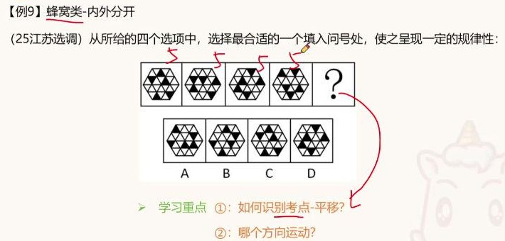

**思路**：
1. 识别：外轮廓都是蜂窝；题干和选项都是 **5 个**黑三角 → 相等，考平移概率极高；蜂窝 → 问自己有没有可能内外 → 圈出内部：每幅**内部都是 1 个** → 完全符合高频特征。
2. 内部黑三角：**逆时针每次 1 步**，推到问号处，只有 A 符合（B、C、D 都不对）。
3. 如果内圈选不出唯一答案怎么办？外圈 4 个一样的黑块很容易混，这时看**两个相连黑块中间夹着的那个菱形白块**（唯一）：它依次在蜂窝的左上→左边→左下→右下，逆时针，下一个在右边 → 同样选 A。
4. 结论：内外分开看的题，**难在识别，不难在求解**，一旦想到内外，基本就是送分。

**答案**：A

**例10**（24国考）九宫格，每格是一个蜂窝球阵，问号处填哪个。

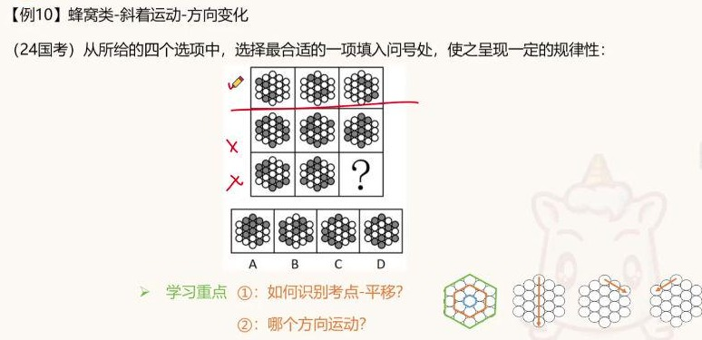

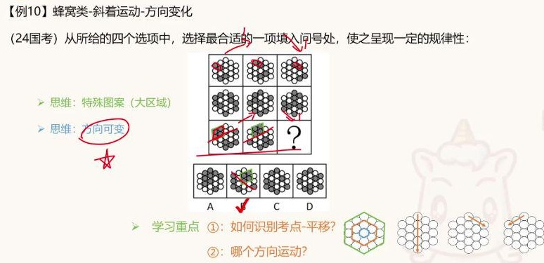

**思路**：
1. 识别：背景都是蜂窝；第一排每幅都是 **4 个**深色块，个数相等 → 移动。优先看个数少的第一排（后两排多，不好看）。
2. 第一排：两个连在一起的块，就近假设 → 第 1→2 幅**往右上走 1 步**（可能先试一下内外，不行就算了）。
3. 第 2→3 幅按右上继续走就对不上了（这两块跑到下面去了）——别慌，**把第一幅忘掉**，只看二、三两幅重新就近假设：是**往右下走 1 步**。所以规律是**方向可变**：先右上、再右下。
4. 省时间：跳过第二排，直接用到第三排——那个平行四边形（菱形）先往右上走 1 步（成立），接下来应往右下走 1 步，菱形会整体移下来。B 是唯一直观呈现这个菱形的选项 → 选 B。
5. 升级（出题人还能怎么出）：若删掉第一排，改成两组图（原第二、三排），个数多得数不了，就要找**大区域**：第二排找字母 **C 形**，它沿右上移动，别的球移动中可能碰到它也无所谓；第三排找**菱形**，只要不往左上移出边缘，形状都保留 → 直接找到 B。

**答案**：B

---

## 5. 平移·隐藏外框（线条运动）

### 识别信号（看到什么，想到它）

- 没有宫格背景，只有一些线段（常能看出内外两圈），**线段条数每幅相等** → 线条的平移。
- 宏观上能感到"内一圈、外一圈"→ 仍然带着内外分开看的思想，数**内部**线段更好数。

### 规律讲解

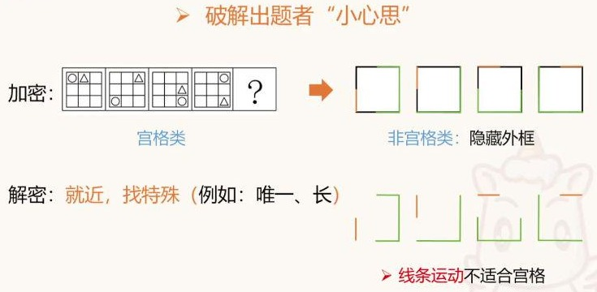

- **为什么要隐藏外框**：圆、三角形、交点都能在宫格里移动；但如果考**线条**移动，线段本身就压在正方形外框上。考试不是彩印，黑白印刷下线段和外框完全重叠，根本看不出来。所以出题人**不得不把外框删掉**，只留线段让你看——这不是故意加难度，是唯一的出法。只要考线条移动，就只能这么出。
- **解密**：①**就近**（端点挨着的那条最近）②**找特殊**（唯一的、长的、斜的、虚的、孤零零的线条）。
- **看头不清就看尾**：线段整体前进时，头部多出来的几段不好分辨，但尾部少掉几段一目了然。

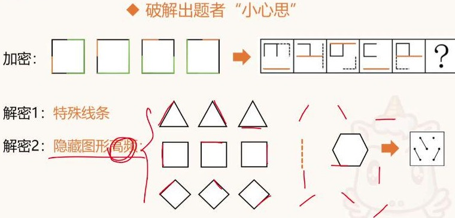

- **特殊线条示例**（上图"加密"右侧）：一堆实线里只有一条**虚线**，唯一、好看，先分析它：它沿长方形边框**顺时针**走，每次走一条边的**一半**；某一幅中虚线"消失"了，是因为和实线**重合**了。按规律推到问号处，就能排掉一些选项。
- **高频隐藏图形**：线段沿着一个看不见的图形的边走——**三角形、正方形、菱形**是最高频的三种，出题人**不会给任何提示**，必须背下来、看得出来。
- **五边形、六边形**等：如果不给提示直接出，就是在为难考生，出题人不会这么干；真要考六边形，会把顶点标出来给你台阶。这就是出题人的"度"。

### 易错点 / 老师提醒

- 选线条要选"**最好找**"的：大多数图只有 1 根斜线时，斜线最好找；孤零零的线下一幅可能连到别的线上，反而不好认。
- 有两根候选线时用**就近**（和上一幅的线有公共端点、挨在一起的那根）；错了大不了换另一根，最多一次试错。
- 运气差选了普通线条，可能四个选项都满足，白分析一遍——所以"找特殊"是在规避考运。

### 例题

**例11**（25浙江事业）每幅是若干虚线段组成的"内外两圈"，问号处填哪个。

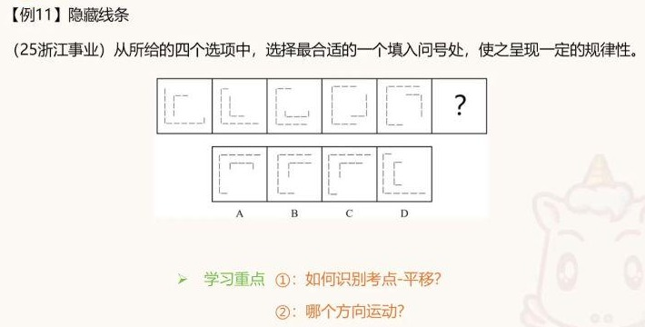

**思路**：
1. 识别：能感受到明显的内外结构；数好数的**内部**：每幅都是 **5 段**，选项也是 → 相等 → 线条平移；考线条，所以外框被隐藏了（如果把正方形外框画出来，题都没法出）。
2. 内圈：**逆时针**移动，每次头部多出 **2 段** → 每次走 2 步。
3. 问号处头部到底有几段不好分辨——**看尾巴**：尾部应再少 2 段，据此对比选项，只有 A 符合。
4. 验证外圈：**顺时针每次 1 步**（同样看尾巴，每次少 1 段），A 没问题。

**答案**：A

**例12**（20联考事业）每幅由 5 条线段组成，无外框，问号处填哪个。

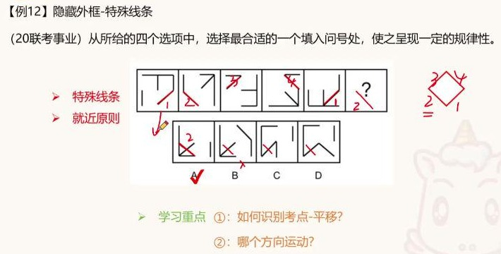

**思路**：
1. 识别：数线段，每幅都是 **5 条** → 数量相等 → 位置规律（隐藏外框）。
2. 找特殊线条：候选 ① 孤零零的短线（但第二幅它就和别的线连上了，容易懵）；候选 ② **斜线**——大多数图只有 1 根斜线，最好找 → 首选斜线。
3. 第 2 幅有两根斜线，选哪根？**就近**：左下那根和第 1 幅的斜线端点挨在一起，最近 → 选它。
4. 依次就近：第 1 幅右下 → 第 2 幅左下 → 第 3 幅左上 → 第 4 幅右上 → 第 5 幅回到右下。这正是**隐藏的菱形**（高频模型）四条边，4 步一循环；问号处轮到第 2 个位置（左下）。只有 A 在左下有这根斜线 → 选 A，不用全部分析。
5. 对比"运气差"的选法：选小短线——它沿一个隐藏的**正方形**走，问号处在右下，A、B 都行，还得再分析；选另一根绕着固定点转的线（45°、横、右下……）——问号处四个选项都有，完全白分析。所以**找特殊线条**非常关键。

**答案**：A

---

## 6. 旋转与翻转

### 识别信号（看到什么，想到它）

- 每幅图**组成完全一样**（外轮廓一样、都是同样的箭头/闪电/三角形），但**朝向**不一样 → 旋转或翻转。
- 相邻两幅像"镜子里的像" → 翻转；方向转了一个角度 → 旋转；两者混着出 → 用箭头法区分。

### 规律讲解

#### 6.1 旋转

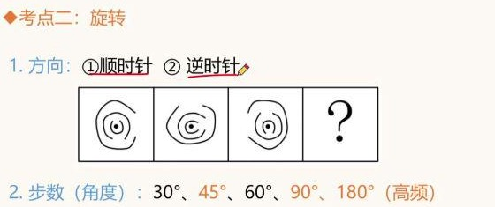

- **方向**：和闹钟同方向为**顺时针**，反方向为**逆时针**。上图缺口依次朝右、朝上、朝左——整体旋转 90°。
- **角度**：高频是 **45°、90°、180°**；30°、60° 可能出现，但很低频。

#### 6.2 翻转

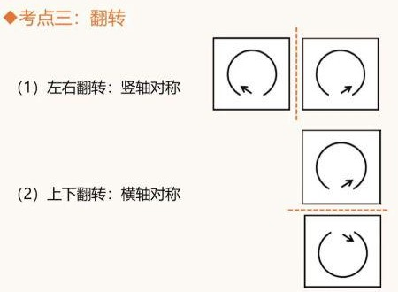

- **左右翻转**：沿**竖直**对称轴翻，左右方向相反（箭头原来朝左，翻后朝右）。
- **上下翻转**：沿**水平**对称轴翻，上下方向相反（原来朝右上，翻后朝右下）。

#### 6.3 区分旋转和翻转

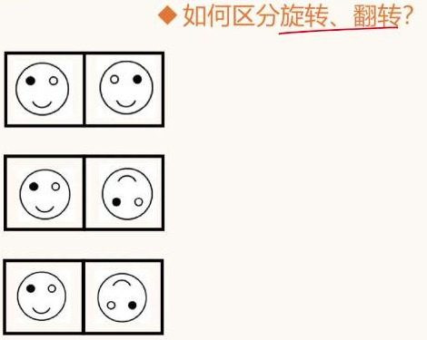

- 第 1 行：黑眼睛从左边到右边，嘴没动 → 左右翻转（竖轴对称）。
- 第 2 行：嘴从下边到上边，眼睛左右不变 → 上下翻转（横轴对称）。
- 第 3 行：嘴从下到上、黑眼睛从左到右，**上下左右都变了** → **旋转 180°**。

💡 解释：上下翻转一次再左右翻转一次，效果等于旋转 180°，所以"上下左右都反了"其实是旋转，不是翻转。

#### 6.4 箭头法 / 时针法

图案一复杂（比如一个图是通过旋转得到的，还是翻转后再旋转得到的），靠想象很难分清，这时用**箭头法**：

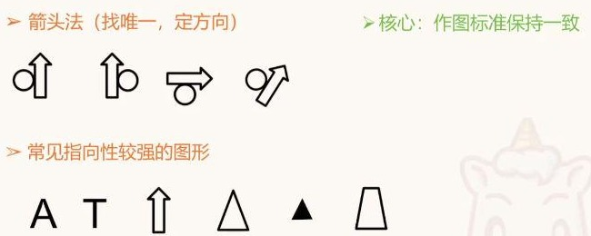

1. **找唯一**：在图中找一个唯一的、有方向感的元素作为基准。
2. **定方向**：以它为基准画一个箭头（例如从它垂直地画出去）。
3. **看左右**：看另一个参照物（圆、半圆等）在**箭头的左边还是右边**。
4. 判断：参照物在箭头**同一侧**的图，可以互相**旋转**得到；在**不同侧**的，是**翻转**关系。
- **核心：作图标准保持一致**——每幅图的箭头都要按同一个规则画；只要标准一致，以哪个元素画箭头、以哪个元素做参照物都行，结论一样。
- 上图第一行：① 圆在箭头**左边**，② 圆在箭头**右边**（①② 是左右翻转关系）。③ 箭头朝右、圆在它下方——顺着箭头方向看，下方是箭头的**右边**，所以 ③ 是 ② 旋转得到的；④ 箭头朝右上、圆在它左上方，是箭头的**左边**，所以 ④ 是 ① 旋转得到的。左右要按**箭头自己的朝向**判断，不是按屏幕的上下左右。
- **常见指向性较强的图形**（天然可当箭头）：字母 A、T，空心箭头，三角形，实心小三角，梯形。

**时针法**：本质是"拐弯的箭头"。每幅图取**同一个起点**（如箭头的尖）和**同一个终点**（如圆与箭头相切的点），从起点画弯箭头到终点，看是顺时针还是逆时针：方向相同 → 旋转得到；方向相反 → 翻转得到。

💡 解释：旋转不改变图形的"手性"（左手转来转去还是左手），翻转会把左手变成右手。所以"参照物在箭头左边还是右边"（或"起点到终点是顺时针还是逆时针"）在旋转下不变、在翻转下一定互换——这就是箭头法和时针法的原理。

#### 6.5 出题人怎么把"区分旋转翻转"出成难题

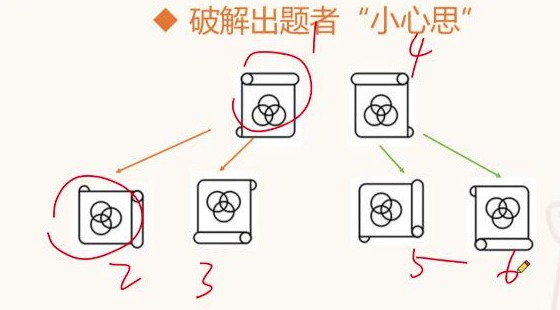

- 出题人先画一个图，用画图软件**左右翻转**得到第二个图；再把第一个图旋转两次、第二个图旋转两次，一共 6 幅。
- **出成分组分类**：问你哪些是由第一幅旋转得到、哪些是由第二幅旋转得到——只需区分旋转/翻转，难度还不大。
- **出成一组图**：把两类打乱交替排列，变成"**跳着看**"的规律（1、3、5 一类，2、4、6 一类）——难度极大增加。

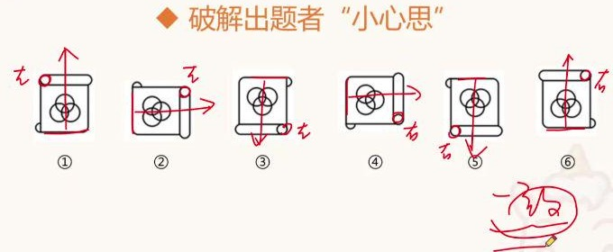

### 易错点 / 老师提醒

- 箭头法的左右**以箭头为参照**，想象自己站在箭头上顺着箭头方向看；不是以屏幕的上下左右为参照。
- 作图标准必须一致（例如每幅都从同一元素垂直画出），否则结论会乱。
- "旋转 + 移动"的复合考点也会出（例 14），选项差异细微时，要结合上一幅的位置看**运动是否连续**，别一紧张就选了跳得太远的选项。

### 例题

**例13**（26联考）九宫格，每格一个外部图形加一个内部小图形，问号处填哪个。

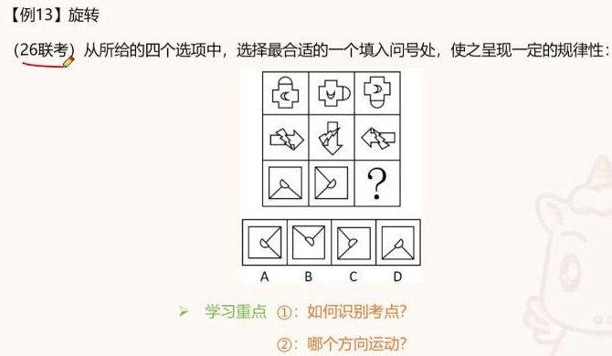

**思路**：
1. 识别：每行外轮廓都一样（都是十字/箭头/方框），组成一模一样 → 位置规律；外部一个图案、内部一个图案 → 内外分开看。
2. 外部：第一行半圆凸起朝上→朝右→朝下，**顺时针 90°**；第二行箭头朝右→朝下→朝左，顺时针 90°，没毛病。
3. 第三行外部借助**三角形**（两条从角上连到中心的线围成的三角）：在下→在左 → 问号处应在**上** → 符合的是 B。
4. 内部（验证）：第一行月亮开口朝右→朝上→朝左，是**逆时针 90°**（与外部方向刚好相反）；第三行内部半圆右上→左上 → 问号处左下，B 没问题。
5. 这是 26 联考的简单题——联考不是道道都难，只是有的省份抽到的全是难题。

**答案**：B

**例14**（26国考）每幅都是同样的回形线条上挂着 4 个小三角，问号处填哪个。

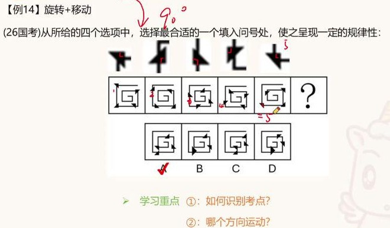

**思路**：
1. 识别：内部背景（回形线）都一样，三角形都是 **4 个** → 画得一模一样 → 考移动。
2. 盯住一个三角形（上方放大图）：它有两个行为——①沿线条**整体向下移动**；②同时在**旋转**：直角朝向依次右上→右下→左下→左上→右上，每次**顺时针 90°**。这是"旋转 + 移动"的复合考点。
3. 问号处直角应转到右下，按此对比选项：A、C 符合，B、D 方向错。
4. A、C 很像：A 的三角形离上一幅的位置近一点，C 一下跳到中间，太夸张 → 选 A。考场一紧张容易误选 C。

**答案**：A

**例15**（23内蒙古事业）每幅都是卷轴+三个圆，朝向各不相同，问号处填哪个。（本课最难的一题）

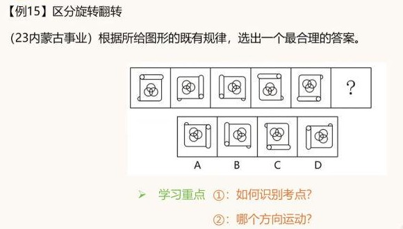

**思路**：
1. 识别：内部都是 3 个圆，外轮廓都一样 → 完全一样 → 位置规律。第 2、3 幅很直观是**左右翻转**（竖轴对称），但第 1→2 幅既不是翻转，也转不过来 → 考"区分旋转翻转"。很多人到这一步做不下去，只能蒙。
2. **箭头法**：以唯一的"卷轴的轴"（像一根粉笔）为基准，每幅都从它**垂直**画一个箭头（标准一致）；再看小半圆在箭头的左边还是右边。
3. 结果：第 1 幅右、第 2 幅左、第 3 幅右、第 4 幅左、第 5 幅右 → **1、3、5 在右，2、4、6 在左**（跳着看）→ 问号处应在**左边**。选项中 A、B 在右，C、D 在左 → 排除 A、B。（课上老师一度口误说"2、4、6 在右"，随即更正为"在左"。）
4. 再看 2、4、6 这一类的箭头朝向：第 2 幅朝左 → 第 4 幅朝下，是**逆时针 90°**，所以第 6 幅应朝**右**。D 朝右、C 朝上 → 选 D。
5. 验证 1、3、5：箭头朝下 → 朝右 → 朝上，同样逆时针 90°。

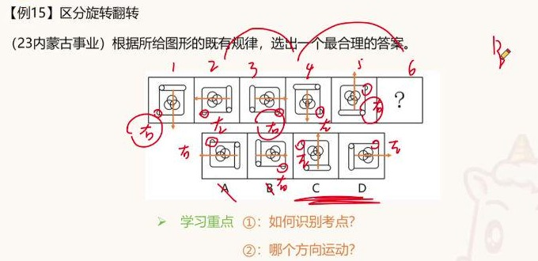

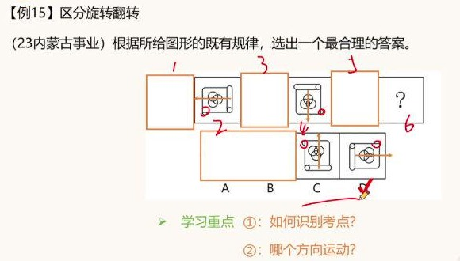

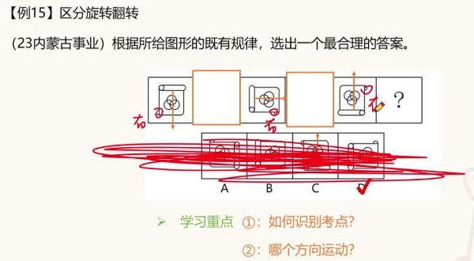

**答案**：D

### 6.6 拓展：26 河南"框上点的移动（旋转）"

课前复盘提到的新题（老师归为"小概率能拿分"的难题，课上未展开）。课件点评：知识点不难，考的是**旋转**；但形式和图案都创新——内部线条不一致，导致定位考点极难，考场得分率很低。混淆点：三个面容易想到"图形关系"，外框一致容易想到"框点"。如果改成下方那排"内部线条一致"的图，定位就很轻松、成了送分题——内部图案不一致导致迷惑性极强，对"旋转"的理解要求更高，有点"反套路"。课件标注答案 D（⑤和⑥交换）。

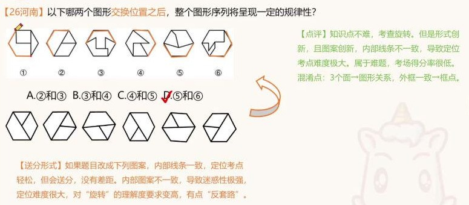

---

## 7. 相邻比较

### 识别信号（看到什么，想到它）

- 和位置规律一样：图案相同、个数相等（都是 4 个小球……），所以一开始很容易判成位置规律。
- 关键区别：**有不动**。相邻两幅图中有大面积元素**没动**，所以前后两幅**非常像**（"像"）→ 相邻比较。
- 口诀：**位置规律"都在动"，相邻比较"有不动"。**

### 规律讲解

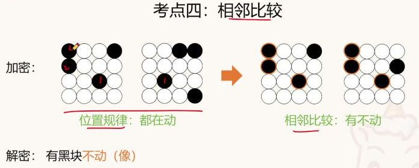

- 位置规律在出题时很少出现不动的元素，可以潜意识理解成：只要是移动问题，**每个元素都在动**。
- 相邻比较：只要出现不动的元素就算。上图右侧：三个球不动，只有一个球整体向下走了一步——局部动，所以前后非常像。
- 这也是它在思维导图里被放在位置规律后面的原因：题干特征太像，要学会"快速拐弯"。

**两个学习重点**：①如何识别？有黑块**不动**（像）。②如何变化？**哪些动**（移动、颜色），**哪些不动**。

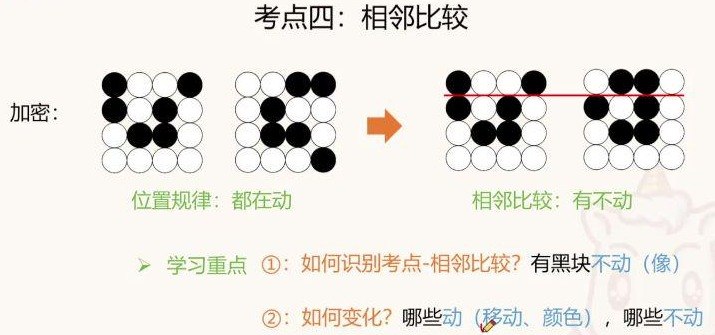

| 动的方式 | 说明 |
|---|---|
| **移动** | 动的部分上下左右平移或旋转 |
| **颜色互换** | 黑变白、白变黑（互换一次）；判断方法：动的那部分黑块个数变了（如 2 个变 4 个），就不可能是移动，只能是颜色互换 |

- **先看动还是先看不动？看少的、好扫的那一个**：不动的部分少、好扫就看不动（例 16）；不动的部分太多、动的只有一排就看动（例 17）。

**出题人可能的升级方向**（目前还没出到这个难度）：

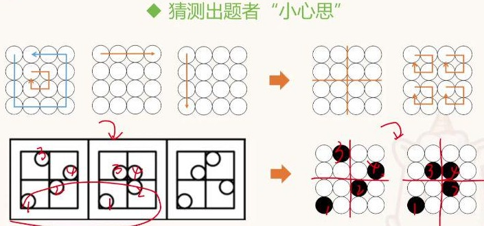

- 把 16 宫格从"内外分开""上下左右"变成**切成四个区域、每个区域各自旋转**；
- 把例 16（方框里的小圆）换成 16 宫格里的黑白块：1、2 移动、下面两个不动，3、4 顺时针移动——一模一样的题，换成黑白块后更难定位。

### 易错点 / 老师提醒

- 看到 4 个一样的球别急着按位置规律推，先看**有没有不动的**；只要有不动，就是相邻比较。
- 相邻比较理解透了，答案往往就是和**前一幅最像**的那个，可以秒选。

### 例题

**例16**（25联考）2×2 方框，每个小格角上有一个小圆，问号处填哪个。

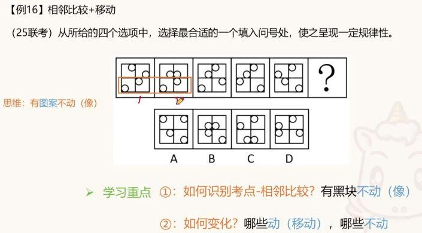

**思路**：
1. 识别：每幅 4 个小圆，本应考虑位置规律；但前两幅**下半部分不动**，只有上面两个在动 → 有不动 → 相邻比较。
2. 先看不动（扫起来方便）：1→2 下边不动；2→3 左边不动；3→4 上边不动；4→5 右边不动——**下、左、上、右**轮流不动。问号处轮到**下边不动** → A、B 符合，排除 C、D。
3. 再看动的：每个动的小圆都在自己的小格里**顺时针走 90°（一个角）**（如 1 号从右上角到右下角，2 号同样顺时针 90°）。第 5→6 幅动的是上面两个：左上格的小圆应到左上角，右上格的小圆应到右上角 → A。

**答案**：A

**例17**（25联考事业）6×6 黑白方格，问号处填哪个。

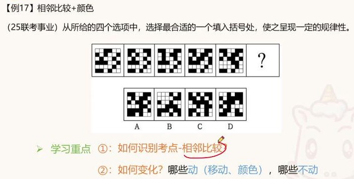

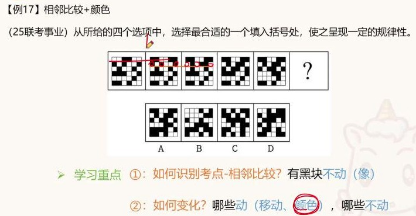

**思路**：
1. 识别：黑块太多，不能靠数个数定考点。相邻两幅**几乎一模一样**，大面积不动 → 相邻比较（相邻比较既有不动的部分，也有动的部分，所以图案特征是"很像"）。
2. 不动太多、动的只有一排 → 看**动**的。第 1→2 幅第一行：原来 2 个黑块变成 4 个，不可能是移动 → **颜色互换**（黑变白、白变黑）。
3. 第 2→3 幅：第一行不变，第二行颜色互换；之后依次是第三行、第四行……所以第 5 幅→问号处轮到**第五行**颜色互换 → A。
4. 秒杀：确定是相邻比较后，找和第 5 幅**最像**的选项，A 与它大面积相同，直接选 A。

**答案**：A

---

## 本章小结

### 串讲思维导图

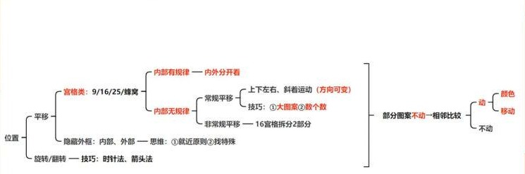

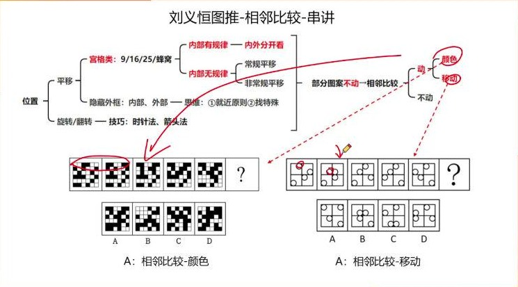

### "特征 → 规律 → 做法"速查表

| 看到的特征 | 考点/模型 | 做法 | 例题 |
|---|---|---|---|
| 图案相同，个数 3、3、3 或 3、3、2 | 位置规律 | 数个数定考点；多一个就排除 | — |
| 九宫格里 1~2 个不同元素 | 平移 | 拆分 + 就近假设；先分析选项中各不相同的元素 | 例 1 |
| 两个一模一样的元素 | 双胞胎 | 标记 ①② → 就近假设，但必须动；注意重合 | 例 2 |
| 很多一样的黑块 | 多胞胎 | 看每行/每列个数定方向（黑多看白）；走到头循环走 | 例 3 |
| 16 宫格 | 内外分开看 | 先看内部：有规律 → 内外分开（绕圈）；无规律 → 直线平移；选项内部一样就看外部 | 例 4 |
| 16 宫格 + 线条/三角形 | 点的运动 | 关注内部：内部都有的点（端点、交点、十字交点、框内球、顶点）就是考点 | 例 5、例 6 |
| 16 宫格被横/竖切一刀 | 拆分两部分 | 两部分各一个规律（如上旋转、下平移） | 例 7 |
| 25 宫格、黑块多 | 整体运动 | 数内部定考点；在同一圈里找"唯一"的两连块 | 例 8 |
| 蜂窝 | 内外 / 斜向 | 内部 1 个 → 内外；否则斜向运动，方向可变，找大区域 | 例 9、例 10 |
| 无宫格、只有线段 | 隐藏外框 | 数线段；找特殊线（斜线、虚线、唯一）+ 就近；三角形/正方形/菱形；看尾巴 | 例 11、例 12 |
| 组成相同、朝向不同 | 旋转/翻转 | 顺/逆 + 角度（45°/90°/180°）；翻转看对称轴；内外可反向 | 例 13、例 14 |
| 旋转翻转混在一起、跳着看 | 区分旋转翻转 | 箭头法/时针法：同侧 = 旋转，异侧 = 翻转；再看朝向 | 例 15 |
| 相邻两幅大面积不动（像） | 相邻比较 | 分清动与不动；动 = 移动或颜色互换；看少的那部分；最像秒选 | 例 16、例 17 |

### 口诀汇总

> - 图案相同数个数：3、3、3 优先，3、3、2 优先（重合），3、3、4 排除。
> - 平移问两句：往哪走？走几步？
> - 两个元素：**拆分思维，就近假设**。
> - 双胞胎：**先标记，再就近；可以静，但不能这么静**。
> - 多胞胎：**找方向（看行列个数），走到头（循环走）**；黑多看白。
> - 16 宫格：**内外分开看**；点的运动：**关注内部**——内部都有什么就考什么。
> - 切一刀 = **拆分思维**，两个规律。
> - 黑块多：**整体运动、找大区域、方向可变**。
> - 隐藏外框：**就近，找特殊**；三角形、正方形、菱形要背；头不清看尾巴。
> - 旋转翻转：**箭头法——找唯一、定方向，作图标准保持一致**。
> - 位置规律**都在动**，相邻比较**有不动（像）**。

### 易错坑汇总

1. 数出"多一个"还硬套位置规律——重合只会让数量减少。
2. 就近假设时把"不动"也当成最近——平移必须动；若某位置不是每幅都有黑块，就证明它在动。
3. 走到头后不知道去哪——默认**循环走**；反弹走、下一排是低频。
4. 左右两组规律不完全一样就怀疑自己——共性一致即可（例 3 方向交替）。
5. 16 宫格内部有规律就高兴——先看选项内部是否都一样，一样就只能看外圈。
6. 内部的点画在内框边上就不认——仍然算内部（例 6）。
7. 25 宫格、蜂窝把所有黑块全数一遍——只数内部。
8. 默认运动方向固定——现在方向可以变（例 10 先右上后右下）。
9. 隐藏外框随便挑一根线分析——要找特殊线，否则可能四个选项都满足。
10. 用屏幕的上下左右判断箭头法的左右——要以箭头自身方向为参照，且每幅作图标准一致。
11. 把"上下左右都变"当成翻转——那是旋转 180°。
12. 看到 4 个一样的球就按位置规律推——先检查有没有不动的，有不动就是相邻比较。
