# 第2章 平面·样式规律 + 标记

> **本章要点速览**
> - **定位**：前两幅图之间**有一样的图案**。完全一样的归**位置规律**（第1章），部分一样的归**样式规律**或**标记**（本章）。
> - **样式规律**有两个考点：画面以**线条**为主的考**加减同异**，以**黑块**为主的考**黑白运算**。两者本质相同，都是**相同位置的运算**。
> - **加减同异**：看到**相同位置的线条**，同时题型是**两组图或九宫格**，就想到它。做法是**看图三反推**用的是加、同还是异。考试主要考**加、同、异**，其中九成以上是**求异**，相减几乎不考。
> - **加减同异的三大难点**：
>   - ①**九宫格横向不行就考虑纵向**。
>   - ②**拆分思维**：图形被刻意分成两部分，或曲线、直线（线条、小球）混在一起时，两部分可以各有一个规律。
>   - ③**“动”（结合位置）**：图1、图2分别和图3比，打勾或打叉。两勾时图3不动，两叉时图3动，一勾一叉时打叉的那幅动（13相同则图2动，23相同则图1动）。
> - **黑白运算**：识别信号是**外轮廓一样，内部黑块个数不一样**，还有九宫格、外轮廓奇怪。规则要从题中现找，而且**黑+白不一定等于白+黑**。提速有两招：首选**相同区域**，其次**对比选项找差异**。
> - **位置规律与黑白运算怎么选**：**个数相等，优先位置规律；个数不同（尤其变多、出现新颜色或挖空），优先黑白运算**。
> - **标记**：识别信号是**每幅图都有一样的小元素**（黑点、白点、箭头、小三角等），而且背景不一样。
>   - 标记**位置**：上、下、左、右、内、外。
>   - 标记**点**：曲直性、引发的线条数量。
>   - 标记**线**：直线或曲线、最长或最短、线的位置。
>   - 标记**角**：直、锐、钝，即大、中、小。
>   - 标记**面**：单独面或相交面、相同区域或不同区域、**形状、属性、面积**。面积的**大、中、小**是新趋势。
>   - **多个标记**（每幅图都是2个）：看标记物之间的关系（例如两个面共用一条边还是只有一个公共点），或者**连线**后与原图的关系（平行、垂直）。

---

## 0. 本章在“3+3”体系中的位置

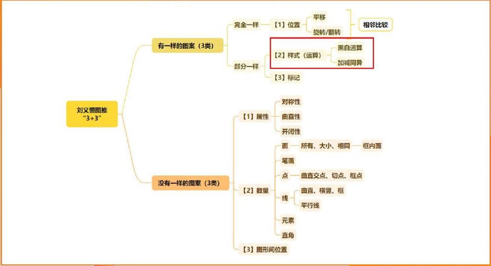

义恒老师把图推分成“3+3”两大类，每类各有 3 个考点：

| 大类 | 细分 | 考点 |
|---|---|---|
| **有一样的图案**（3类） | 完全一样 | 【1】位置（平移、旋转/翻转，相邻比较）→ 第1章 |
| | **部分一样** | 【2】**样式（运算）**：黑白运算、加减同异 → 本章 |
| | | 【3】**标记** → 本章 |
| 没有一样的图案（3类） | — | 属性、数量、图形间位置 → 后续章节 |

老师强调，拿到题先问自己：**前两幅图之间有没有关联（有没有一样的东西）？**
- 有关联，就在“位置、样式、标记”三个方向里找。
- 没有关联，就去考虑属性、数量、图形间位置。

这套宏观框架不会变，出题人创新的只是后面的细节。宏观思路清楚了，就不会纠结“这题为什么不是面、为什么不是线”。

---

## 1. 样式规律总览：加减同异 vs 黑白运算

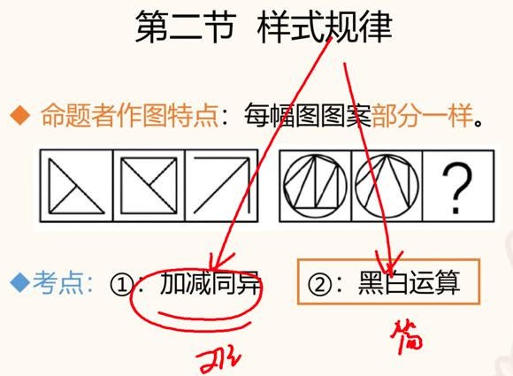

**命题者作图特点：每幅图的图案“部分一样”。**
- 位置规律是图案**完全一样**，只是挪了位置。
- 样式规律是**有一样的地方，但又不完全一样**。比如两幅图里有同样的三角形、同样的箭头，也就是**局部相同**。

样式规律有两个考点。老师的手写批注说：**加减同异偏难，黑白运算偏简单。**

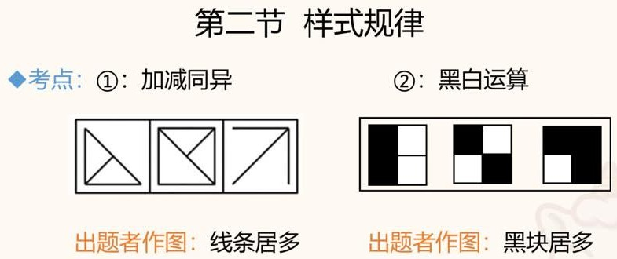

| 考点 | 出题人作图 | 初步判断 |
|---|---|---|
| 加减同异 | **线条居多** | 题目主要由线条构成 |
| 黑白运算 | **黑块居多** | 名字里就带“黑”，画的多是小黑块 |

---

## 2. 考点一：加减同异

### 识别信号（看到什么，想到它）

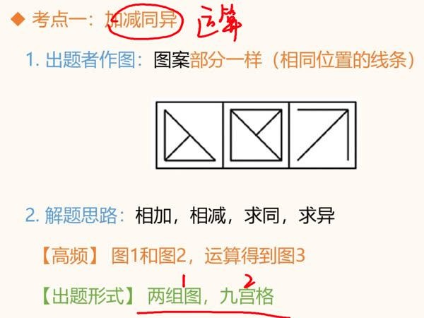

1. **相同位置的线条**（最关键，要背下来）。
   - 两个三角形随手画在不同位置，并不奇怪。
   - 奇怪的是同样的线条被**刻意画在同一个位置**。出题人这样做，就是要你判断这些线条是**保留还是抵消**，也就是要你做**运算**。
2. **出题形式只有两种：两组图、九宫格。** 这本身就是一个识别特征。

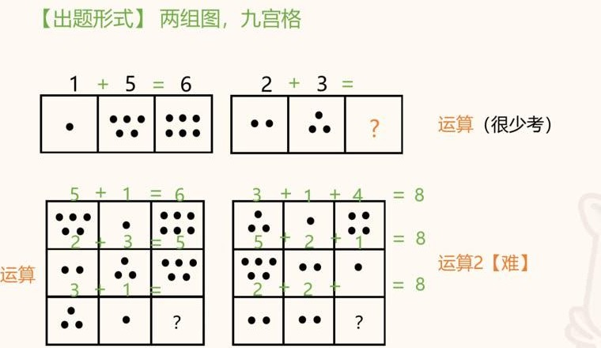

> 💡 为什么是两组图或九宫格？
> - 加减同异的本质是**运算**（图1和图2算出图3）。
> - 两组图能体现“1+5=6”，九宫格能体现“5+1=6”“3+1+4=8”这类行内运算。
> - 一组图、分组分类等题型没法表达运算，所以出题人不会用它们来考加减同异。

### 规律讲解

#### 2.1 四种运算

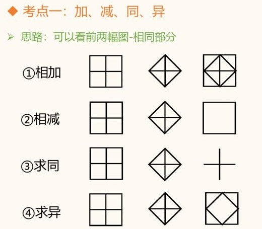

老师建议先把**前两幅图的相同部分**找出来，比如图中的“十字”。再看这些相同部分在第三幅图里怎么样了，就容易判断是哪种运算：

| 运算 | 定义 | 示意图结果 |
|---|---|---|
| **相加** | 相同部分和不同部分**全部叠在一起** | 田字格 + 菱形，全都保留 |
| **相减** | **图1减去图2中和它一样的部分**，只留下**图1剩下的** | 只剩图1的正方形外框 |
| **求同** | **只保留相同部分** | 只剩“十”字 |
| **求异** | **删掉相同部分，把剩下的不同部分重新组合**（图1、图2的都要） | 正方形外框 + 菱形外框 |

> 补充：其他资料也常把求异叫“**去同存异**”，把求同叫“**去异存同**”，意思相同。

#### 2.2 求同 vs 求异（最常考的两个）

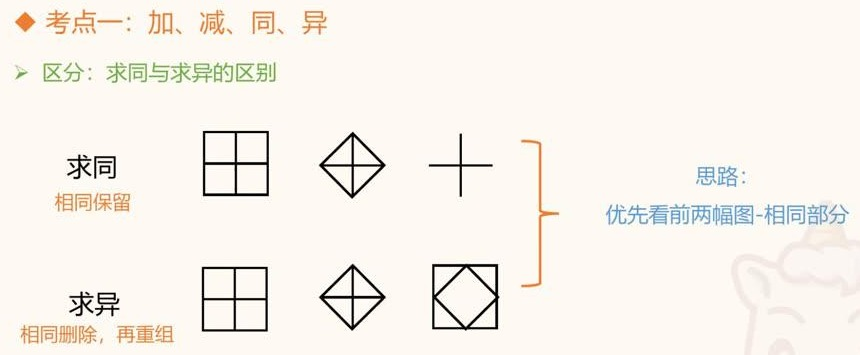

- **求同**：一样的东西**保留**。
- **求异**：一样的东西**删掉**，剩下的**重新组合**。
- 解题思路：**优先看前两幅图的相同部分**，再看它在图3里是被保留了，还是被删掉了。

#### 2.3 相减 vs 求异（容易混，但相减几乎不考）

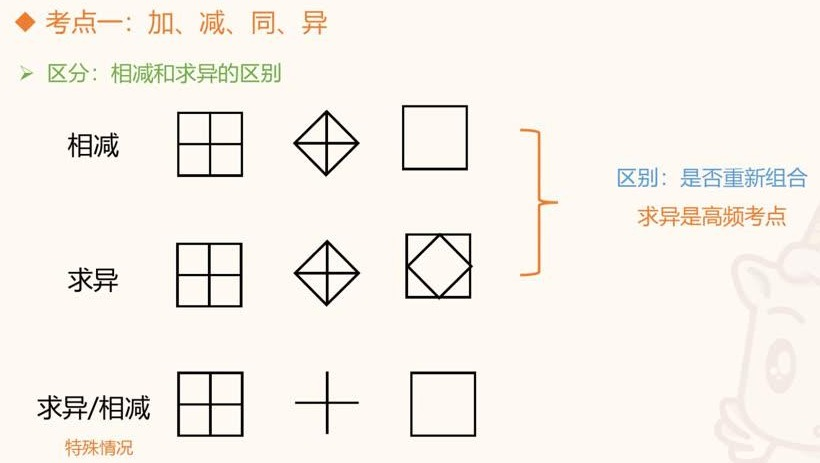

- **求异**：图1和图2**地位平等**，删掉共同部分后，**两幅图各自剩下的都保留**，再重组。
- **相减**：**有主有次，图1更重要**。图1减去和图2一样的部分，**只保留图1剩下的**，图2剩下的不要。
- 老师用了一个比喻：
  - **相减**像老板对照员工的直播时间，把和员工重叠的时段划掉，剩下的是老板自己的时间。两人地位不平等，只看老板那份。
  - **求异**像两位同事把各自时间里重叠的部分删掉，再合在一起。两人地位平等。
- **特殊情况：图2没有自己独有的部分时**（比如图2只是一个“十”字，完全包含在图1里），求异和相减的结果**完全一样**。
- 老师强调：**相减几乎不考**，没听懂也不用复盘。考试主要考**加、同、异**三种，其中**90%以上考求异**。

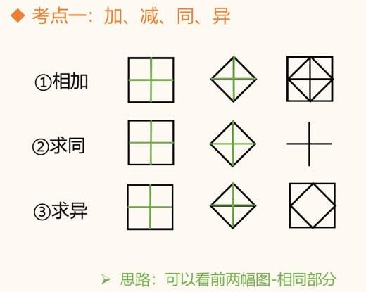

#### 2.4 解题三步（考场顺序）

1. **定位考点**：看到“相同位置的线条”，再加上两组图或九宫格，锁定加减同异。
2. **看图三反推运算**：看**图3保留了什么**。
   - 相同部分还在，而且不同部分也在，是**相加**。
   - 只剩相同部分，是**求同**。
   - 相同部分没了，不同部分留下来，是**求异**。
3. **用另一排（行）验证**，再推问号处，最后对比选项。

> 老师强调：学每一道题都要问自己两件事：①**我是怎么识别出这个考点的**；②**具体是加减同异里的哪一种**。第①步不重视，题型一打乱就不会做了。

### 易错点 / 老师提醒
- **外框可以考，也可以不考**：如果题干每幅图和所有选项都有同一个外框，外框就“一直都在”，不用管它。反过来，如果图1、图2都有的外框在图3里**也出现了**，那就**不可能是求异**（求异会把共同的外框删掉）。
- 选项里有“特殊线条”时，不要只凭一条线就下结论，要把每个关键差异对回题干逐一核对（见例3的陷阱）。
- **理解比得分率更重要**：理论阶段做错题没关系，关键是弄懂思路。

### 例题（基础）

**例1**（26联考事业）九宫格，前两幅图的黑色图形叠在一起得到第三幅

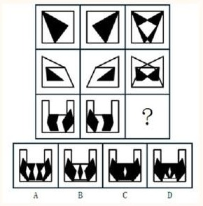

**思路**：
1. **定位**：九宫格可以考运算。第一行图1、图2的三角形和图3的外轮廓相似，图案部分一样又有关联，所以考加减同异。
2. **用图3反推**：乍一看像求异（图1、图3有一样的，图2、图3也有一样的）。但**外框是图1、图2的相同部分，在图3里却保留了下来**。如果是求异，外框应该被删掉，所以只能是**相加**。
3. **复合考法（新题难点）**：相加之后，**两图重叠的区域颜色变白**，也就是“相加 + 相同区域颜色互换”。外框变不了白（线变白就消失了），只有黑色的面才会变白。第二行验证：前两幅图的小三角形重叠，重叠处变白，规律成立。
4. **快速找答案**：第三行两个图形叠加后，中间会构造出一个**较大的菱形**。C、D 中间的菱形偏小，只有 A 完全匹配。即使误当成求异，也基本不影响选出 A。

**答案**：A

**例2**（22四川事业）九宫格，黑白小块组成的图形

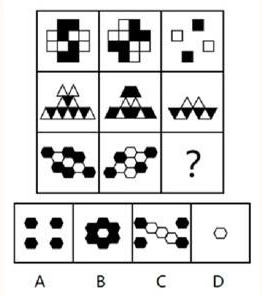

**思路**：
1. **定位**：图1、图2的“十字/菱形”图案很像，里面还有黑块，但图3没有外框。有关联又不完全一样，所以考加减同异。
2. **图三反推**：找图3里方块在前两幅图中对应的位置，发现是**前两幅图中一样的东西保留了下来**，白色格子也一样，所以是**求同**。第二行的四个三角形也是前两幅图的共同部分，验证通过。
3. **第三行**：比较前两幅图的六边形。同一位置**颜色不同（一黑一白）也算不一样**，只有中间那个白色六边形完全相同，其余都要删掉。最后只剩一个白色小六边形。

**答案**：D

**例3**（26天津事业）两组图

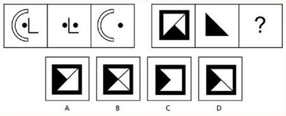

**思路**：
1. **定位**：图1、图2里的“L”形和圆点很像，“C”形弧线也在图1中出现，有些线条是重复的，所以考加减同异。
2. **图三反推**：图3的“C”来自图1中**不同的部分**，说明不同的东西被保留，是**求异**。验证：“L”和左边的圆点是相同部分，被抵消了；弧线和右边的圆点是不同部分，被保留了，规律成立。
3. **第二组**：图1是黑框正方形加对角线加黑三角，图2是黑色直角三角形，两者求异。
4. **陷阱**：有人盯着对角线这条“特殊线条”就冲 B。A、B 的关键区别是**右下这条线要不要**。回到题干看，图1、图2在这个位置**都有线**，求异要删掉，所以 B 错。

**答案**：A

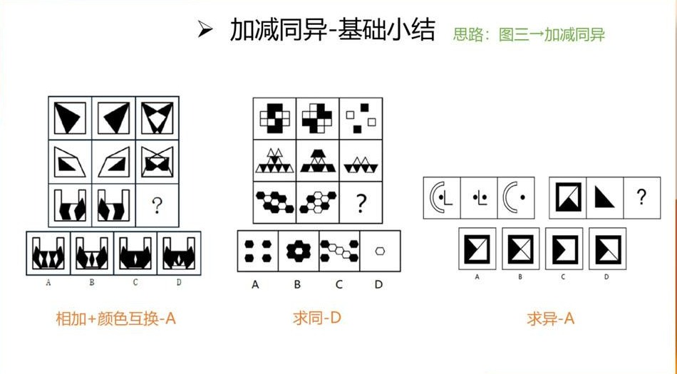

---

### 难点一：方向变化（九宫格横向不行，考虑纵向）

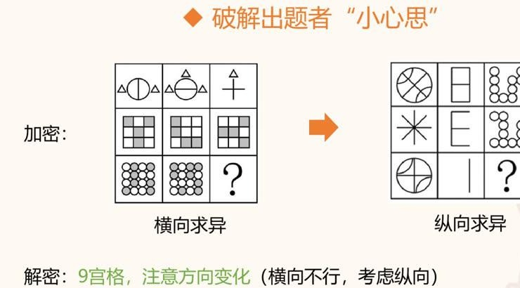

原来的九宫格是**横向**运算。出题人为了加难度，会改成**纵向**。
- 左图是横向求异：每行的相同圆被抵消。
- 右图是纵向求异：同一列的外轮廓很像，比如第一列都是圆、第二列都是“日/E”形。第二列的“E”到第三行就被抵消了。

> **口诀：九宫格注意方向变化，横向不行，考虑纵向。**

**例4**（24联考）九宫格，圆、方框和中间线条

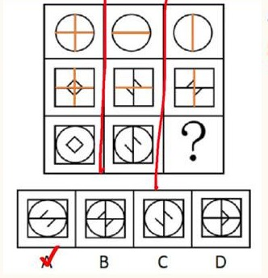

**思路**：
1. **定位**：每幅图都有圆，前两幅图还有同样的横线。图案关联度大，部分一样，又是**相同位置的线条**，所以考加减同异。
2. **先试横向（陷阱）**：
   - 第一行：图1是圆加“十”字，图2是圆加横线，图3是圆加竖线。看起来像“横线抵消、竖线保留”的横向求异。有人直接套到第三行，看到竖线就选 C。
   - 但细看，第三行横向求异时，相同部分删掉后剩下的线条方向对不上，C 一定错。A 里的横线又找不到来源，**横向根本找不到答案**。
   - 用**第二行验证**也会失败：“十”字像求同，中间的菱形又像求异，一行里要套好几条规则，是在自己骗自己。
3. **改为纵向**：
   - 第一列：前两个图的相同部分是“十”字，在第三行里消失了；圆、菱形、正方形外框都保留了，是**纵向求异**。
   - 第二列验证：相同的横线被删掉，圆、正方形、两条斜线保留，规律成立。
4. **第三列**：相同部分是竖线，删掉；保留横线和两条斜线，外框是圆加正方形。

**答案**：A

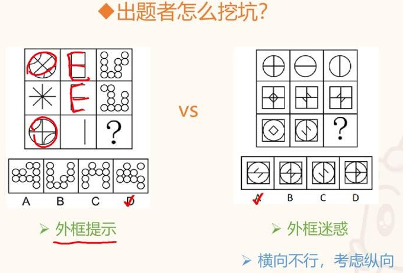

> **出题人最坏的地方**：
> - 以前的外框是**提示**，比如同一列都有“E”、都有圆，告诉你往纵向想。
> - 现在的外框可以变成**迷惑**，诱导你横向思考。
> - 对策：**一定要用第二排（或另一行）检验**。一检验就能发现横向不成立，马上改成纵向。

---

### 难点二：拆分思维（两部分 → 两个规律）

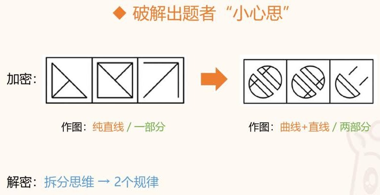

- 左边的作图是**连成一体**的，而且全是直线，所以只有**一个规律**。
- 右边的作图有明显的**割裂感**：被刻意分成左下、右上**两部分**，并且**曲线、直线都有**。这就提示可以**拆开看，两部分各有一个规律**。
  - 右图示例：左下部分的半圆和横线是前两幅图的共同部分，被保留，是**求同**；右上部分保留的是图1、图2各自独有的线，是**求异**。
  - 也可以**按曲线、直线来拆**，比如曲线一个规律、直线一个规律。
- 以后看到**刻意分出来的两部分**，或者**两类元素**（线条和小球、曲线和直线），就要想到可以有**两个规律**。

**例5**（26上海，据讲稿）九宫格，大圆内有线条和小圆

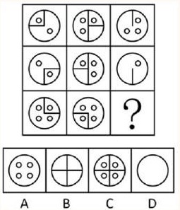

**思路**：
1. **定位**：线条、小圆都在相同位置重复出现，是相同位置的线条，所以考加减同异。
2. **先去掉无关项**：外面的大圆题干每幅都有，选项也都有，**不用管**。只看内部的两类东西：①**线条**，②**小圆**。
3. **图三反推**：
   - 线条：图3的线是前两幅图**一样的**，所以是**求同**。
   - 小圆：图3的小圆是图1里**不同的**那个。如果也是求同，这里就不该出现，所以小圆只能是**求异**。
   - 到这一步才反应过来：内部有两类东西，就可以**拆成两个规律**。老师说，这题并不是一眼就能看出要拆分，而是在做的过程中发现“同一个规律说不通”，才想到拆分。
4. **第二行验证**：线求同，保留共同的线；球求异，相同的圆抵消，不同的保留，规律成立。
5. **第三行**：
   - 线条求同：前两幅图的线**没有一样的部分**，所以一条都不留。
   - 小圆求异：四个位置**一模一样**，全部删掉。
   - 结果是只剩外圆的空圆。注意，不是“没有答案”，而是答案中间没有图案。

**答案**：D

> 考情：拆分思维**上海**考得最多，其他省份不多。

---

### 难点三：结合位置（“动”）：谁动？

这是**所有省份都必须掌握**的难点，也是当前难题的主流方向（四川、浙江、北京、山东、江苏等都主要考“动”）。

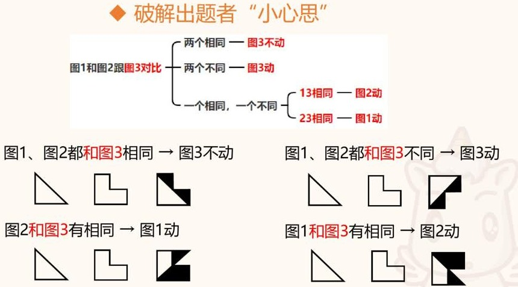

**判断方法：你就是“审判官”，拿图1、图2分别和图3对比，打勾（位置对得上）或打叉（位置对不上）。**

| 对比结果 | 结论 | 示意 |
|---|---|---|
| 1-3 ✓，2-3 ✓（两个相同） | **图3不动**，直接运算 | 三角形、L 形都对得上，直接求异（相同的变白，不同的变黑） |
| 1-3 ✗，2-3 ✗（两个不同） | **图3动** | 两个都对不上，问题出在图3。求异后把结果**顺时针转90°**就对上了 |
| 1-3 ✓，2-3 ✗ | **图2动**（13相同） | 谁有矛盾谁动。打叉的是图2，把图2的 L 形顺时针转90°，再求异 |
| 2-3 ✓，1-3 ✗ | **图1动**（23相同） | 打勾的图2、图3不能动，动了形状就对不上。只能动打叉的图1，把图1转一下，再求异 |

> 💡 解释：打勾说明这幅图的朝向和图3一致，没有转过。图3里有一部分对不上，一定是某幅图先转了再参与运算。一勾一叉时，打叉的那幅就是转过的。两叉时，图1、图2彼此一致而和图3都不一致，说明是**运算结果（图3）整体转了**。

**操作细则**：
- **分两步走**：先判定是加减同异里的哪一种（看图3），再判定谁动。
- **旋转选最小角度**（“用最小的力气”，也就是就近原则）。比如能逆时针转45°的，就不要顺时针转315°。
- **先考虑旋转，不用先考虑翻转**。
- 转动方向要**用另一排验证**。有时一排里顺时针、逆时针都说得通，必须靠另一排确定（例8）。
- **考场上不必把整个图画出来**，只盯**特殊线条**，看它转过去后和哪条线抵消，速度更快。
- 老师提醒：**不要把“纵向”和“动”结合起来考虑**，连出题人自己都不愿意这么出，真这么出就放弃。

**例6**（20江苏）图1动

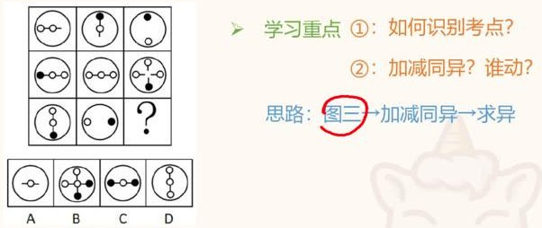

**思路**：
1. **定位**：圆形外框相同，中间的线条也相同，是**相同位置的线条**，所以考加减同异。所有图和选项都有外圆，外框不用看。
2. **哪一种**：图3里的黑球来自图2，不同的东西保留了下来，是**求异**。
3. **谁动**：
   - 图2和图3的黑球位置一致，打**勾**。
   - 图1和图3的白球位置对不上，打**叉**。
   - 一勾一叉、23相同，所以**图1动**：把图1**逆时针转90°**（最小角度），白球转到下方，再和图2求异，中间相同的圆和线抵消，就得到图3。
4. **第二行验证**：图1逆时针转90°后，黑球到了下方。和图2求异，中间的圆抵消，黑球、白球保留，规律成立。
5. **第三行**：图1逆时针转90°，竖着的一串变成横向，黑球到右侧。再和图2求异：黑球与黑球抵消，白球与白球抵消，只剩中间的白球和短线。

**答案**：A

**例7**（21江苏）图2动

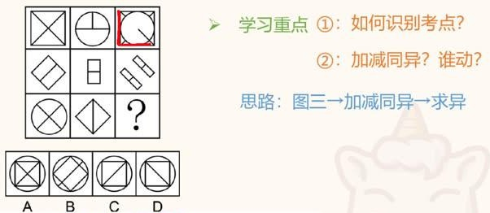

**思路**：
1. **定位**：圆和圆一样，正方形和正方形一样，线条位置都对得上，是相同位置的线条，所以考加减同异。
2. **哪一种**：图3的外框是图1中**不同**的部分保留下来的，是**求异**。
3. **谁动**（老师先看特征更明显的那一行）：
   - 图1和图3的斜放正方形外框位置对得上，打**勾**。
   - 图2是正放的“日”字形，图3里的“日”字形是斜的，对不上，打**叉**。
   - 13相同，所以**图2动**。怎么动最省力？往左稍微一转就对上，是**逆时针45°**。往右要绕一大圈，不划算。
4. **另一行验证**：第一行图2的“T”逆时针转45°后，正好和图1的线条抵消，“T”就不见了，规律成立。
5. **第三行**：图2（菱形加竖线）逆时针转45°，竖线歪成斜线，和图1“×”中的一条斜线抵消，另一条斜线保留。再加上圆和正方形。
   - 从正方形的位置就能排除 A、B、D。
   - 唯一容易混的是 B：B 里的菱形没转，不对。
6. **考场快解**：把那条竖线“歪一下”，看它和哪条线抵消，剩下的那条线直接对应 C，不用把整张图画出来。

**答案**：C

**例8**（26国考）图3动

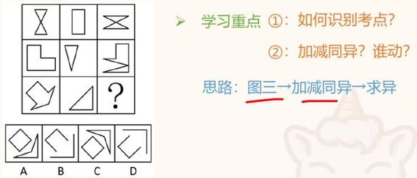

**思路**：
1. **定位**：三角形插进长方形里，像是“挖掉”一块，正方形、长方形的轮廓也很接近，是相同位置的线条，所以考加减同异。
2. **哪一种**：图3像是图1的长方形轮廓被图2抵消掉一部分后剩下的，删掉相同、保留不同，是**求异**。
3. **谁动**：
   - 第一行图2的长方形是竖的，图3的长方形是横的，二和三打**叉**。
   - 图1和图3的位置也对不上，打**叉**。
   - **两个叉，图3动**。
4. **方向不确定**：第一行求异后，顺时针90°和逆时针90°都能得到图3，打个问号。
5. **用第二行定方向**：求异后凹进去的缺口本来应该朝下，现在朝右，说明是**逆时针90°**。所以规律是求异后整体逆时针转90°。
6. **第三行（考场思路）**：
   - A、B 没有转动，直接排除，只在 C、D 里选。
   - C、D 的区别是一条线要不要保留。把三角形移过去后，这条线属于不同部分，求异时应该保留，所以选 C。

**答案**：C

### 加减同异串讲

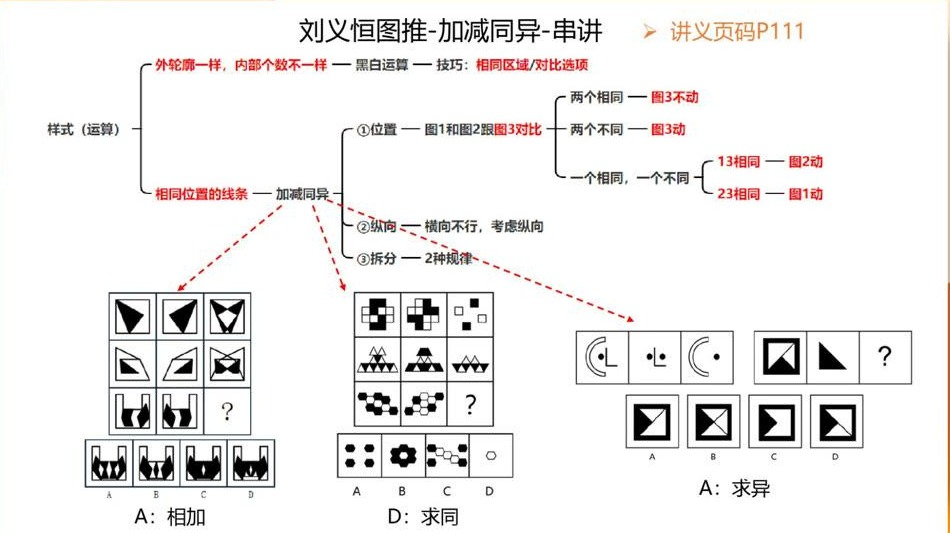

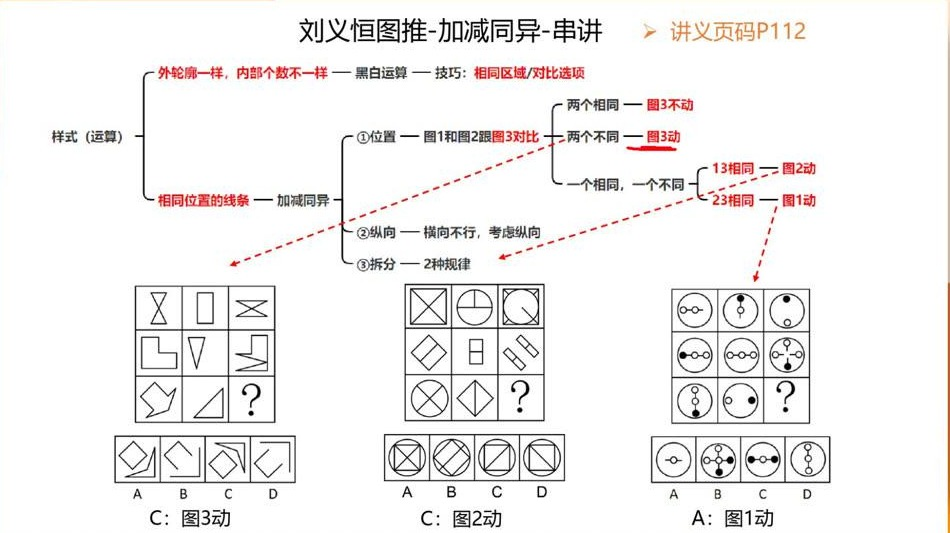

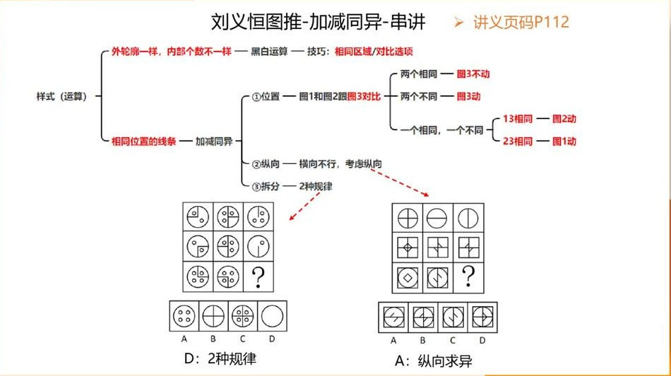

**考情**：
- **纵向**：广东、联考考得较多。
- **拆分**：上海考得多。
- **动（结合位置）**：所有省份都要掌握，是现在难题的主流方向。

---

## 3. 考点二：黑白运算

### 识别信号（看到什么，想到它）

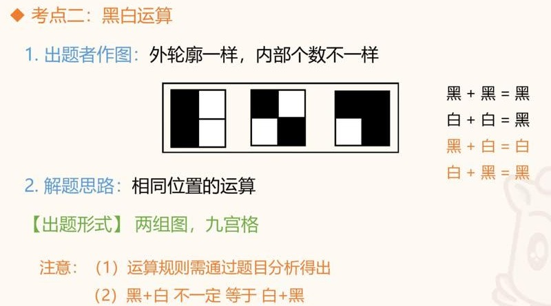

1. **外轮廓一样，内部黑块个数不一样**（核心信号）。
2. 画面以**黑块（或灰块、斜线块）居多**。
3. **九宫格**。九宫格能考运算，黑块题大概率考黑白运算。
4. **外轮廓奇怪**，比如台灯形、房子形。位置规律没法在这种轮廓里移动黑块。
5. 出现**新颜色**（斜线、网格），或者有**挖空**。位置规律不可能凭空多出东西，也没法移动到空的地方。

> 老师的判断顺序：前两个特征（九宫格、外轮廓奇怪）往往更先起作用，个数不同用来最终确认。几个特征叠加时，基本可以断定是黑白运算。

### 位置规律 vs 黑白运算（与第1章的区分，务必掌握）

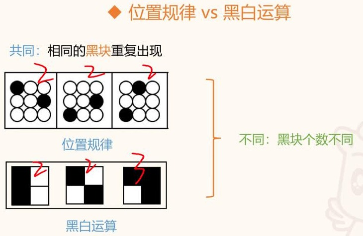

两者都是方框里画小黑块，很像，**靠数黑块个数来区分**：

| 黑块个数 | 优先考虑 |
|---|---|
| **每幅都相等**（如 3、3、3 或 2、2、2） | **位置规律** |
| **少一个**（如 3、3、2） | 仍可能是位置规律，因为移动时可能发生**重合**。先试位置规律，不行马上换黑白运算 |
| **个数不同，尤其是变多**（如 2、2、3，或 3、2、5） | **黑白运算**（概率极大） |

> **口诀：个数相等，优先位置；个数不同，优先黑白运算。**

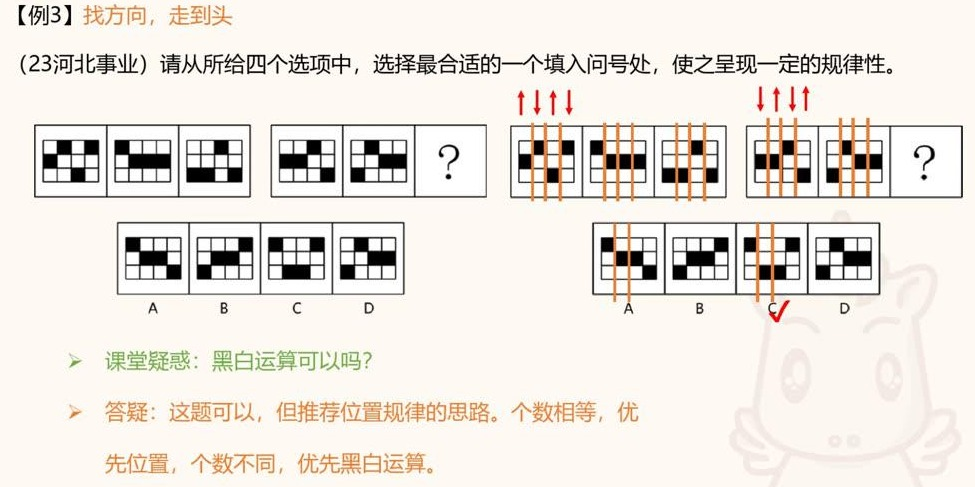

上节课（第1章）的“找方向，走到头”例题（23河北事业，答案 C）有同学问能不能用黑白运算。
- 老师的回答是**可以**，但更推荐**位置规律**：题干每幅都是**4个**黑块，个数相等。
- 而且位置规律下每个小块都能找到单独的移动规律，思路更强。

### 规律讲解

**解题思路：相同位置的运算。** 把图1、图2**同一位置**的颜色组合起来，得到图3这个位置的颜色。

以上方“外轮廓一样”那张图为例（图1左列黑、右列白；图2黑白棋盘格；图3只有左下是白）：

| 图1 | 图2 | → 图3 |
|---|---|---|
| 黑 | 黑 | 黑 |
| 白 | 白 | 黑 |
| 黑 | 白 | **白** |
| 白 | 黑 | **黑** |

注意两点：
1. **运算规则不用背，要从每道题里分析出来**。每道题的规则都可能不同。
2. **黑+白不一定等于白+黑**。要把它们当成**两条独立的规则**，有时结果相同，有时不同。

> 💡 解释：黑白运算是“有顺序”的：前一幅的颜色和后一幅的颜色组成一对，这一对决定结果。“黑在前白在后”和“白在前黑在后”是两种不同的组合，出题人可以给它们指定不同的结果。

### 提速技巧（考场十秒解法）

把每条规则都列出来太慢（颜色一多，要写六条），考场上要用技巧。

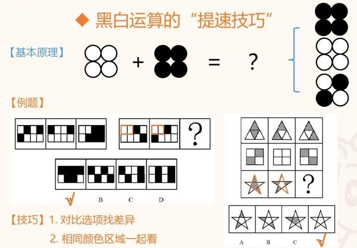

**基本原理：四个白圆 + 四个黑圆 = ？**
- 结果可能全黑，也可能全白。
- 但**不可能两黑两白**：同一条规则（白+黑）不可能在同一题里算出两个不同的结果。

**技巧一（首选）：相同区域。** 在问号那一组里，找出**图1、图2颜色组合完全相同的几个格子**，它们在答案里的颜色**必须一样**。拿这一点直接去卡选项，不用关心具体规则是什么。

**技巧二（备选）：对比选项找差异。**
1. 先看选项在**哪个位置差别最大**。
2. 再去已知的组（或已知的行）里，找出这个位置对应的颜色组合的规则。
3. 位置要挑**区分度大**的：四个选项都一样的位置，找了也排除不了选项。
4. 如果已知组里**找不到**这个颜色组合的规则，就换一个位置。

> 相同区域是首选，对比选项作为第二选择。考场一紧张可能找不到相同区域，这时就用对比选项。老师强调这不是蒙题大法：蒙题可能出错，这个方法不会错。

**示范1**（上图左，两组图）
- 第一组黑块数是 3、2、5，个数不同，定位黑白运算。
- 直接看第二组：左上两个格子在图1、图2里都是“白+白”，结果必须同色。只有 A 这两格同色，B、C、D 都不同色，**选 A**。
- 换别的相同区域同样能做，解法不唯一。
- 用对比选项的做法：以一对对角线格子为相同区域，只能排除 C、D。A、B 的区别在于“白+白”等于什么。回左边找到“白+白=黑”，还是**选 A**。

**示范2**（上图右，九宫格）

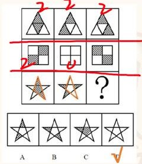

- 第一行都是 2 块，这时还可能是位置规律。但第二行是 2、0、2，**个数不同**，所以**定位黑白运算**。
- 第三行里橙色框出的区域，在图1中全是斜线（黑），在图2中全是白。**同一条规则“黑+白”作用在整块区域上，结果必须一致**：要么整块黑，要么整块白。
- 逐个检查选项，只有 D 这块区域颜色一致，**选 D**。

### 与加减同异的关系：不用刻意区分

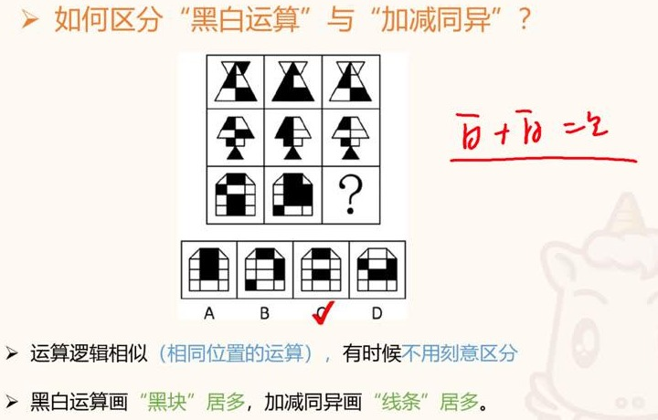

- 两者的**底层逻辑都是“相同位置的运算”**，只是名字不同，它们本来就同属样式规律这一大类。
- 比如例9可以说成加减同异的**求同**，也可以说成黑白运算的**黑+黑=黑**，两种说法都对。
- **哪个方法快就用哪个**。求异和黑白运算“选一个用就行”。
- **唯一的硬区分**：出现**白+白=黑**时只能用黑白运算。加减同异只能把已有的东西保留或删掉，**两个“没有”加不出一个“有”**。
- 宏观上还是那句话：黑块多，用黑白运算的思维；线条多，用加减同异的思维。

### 例题

**例9**（26国考）外框创新：台灯、房子形外轮廓

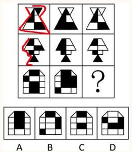

**思路**：
1. **定位**：
   - ①**九宫格**，能考运算。
   - ②**外轮廓很奇怪**，像台灯。位置规律做不了这种轮廓：黑块总不能“跳楼”一样跳来跳去。
   - ③各图**黑块个数不一样**。
   - 三个方面叠加，锁定黑白运算。
2. **直接看第三行找相同区域**，前两行都不用看。
3. **不会找相同区域时，可以先瞄一眼选项**：
   - C 在某处有两个方块，把这两格对应到第三行图1、图2的同一位置，它们的运算结果必须相同。
   - 按这一点检查：B、D 不满足，A、C 满足，范围缩小到 A、C。
4. **再找一次相同区域**：另外两格在图1、图2里都是“白+白”。A 这两格颜色不同，C 相同，**选 C**。
5. **老实做法也行**：从前两行找出“白+黑=白”，同样选 C。

**答案**：C

**例10**（23广东）颜色创新：出现斜线（新颜色）

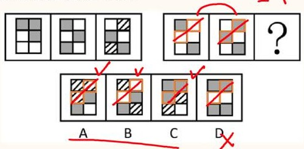

**思路**：
1. **定位**：两组图，外轮廓一样，灰块个数不一样。图3还**多出了斜线**这种新颜色，位置规律不可能多出东西，所以**黑白运算**的概率极大。
2. **不要去找全部规则**：灰+白、灰+灰、白+灰、白+白……要写好多条，太慢。直接从问号处找相同区域。
3. **相同区域**：第二组里有一对对角线格子，图1都是白、图2都是灰，“白+灰”的结果必须一样。
   - A、B、C 这两格颜色一致，保留。
   - D 不一致，排除。
4. **再找规则**：A、B、C 这两格的颜色各不相同（A 斜线、B 白、C 灰），所以只要知道“白+灰=？”就能锁定答案。回第一组找：白+灰=**斜线**，只有 A 符合。

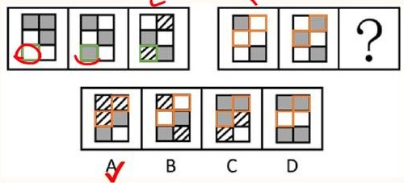

5. 如果选了另一对相同区域，可能要多找一步。比如某个角度只能排除一个选项，就再去找“白+白=灰”排除 C。选哪块相同区域有运气成分，多一步差距不大。

**答案**：A

**例11**（23浙江）内部创新：挖空

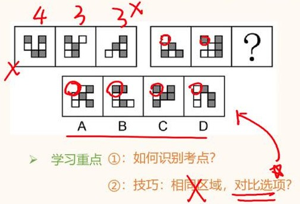

**思路**：
1. **定位**：黑块数是 4、3、3，个数不一样，而且还**挖了空**。挖空的格子没法移动，考不了位置规律，所以定位**黑白运算**。
2. **方法一：相同区域（首选）**：
   - 问号组里有一对**斜对角线**格子，图1都是灰、图2都是白，“灰+白”的结果必须一致。
   - A 一白一灰，不一致；B 一个空缺一个白，也不一致；C 一致。
   - 再用另一对格子检查，A 错、B 错、C 对、D 错，**选 C**。
3. 为什么不先去找空白的规则？空白一加进来，规则就很多了：空+空、黑+空、白+空……找起来慢。**只要多一种颜色，就优先看问号处的相同区域**。
4. **方法二：对比选项**（找不到相同区域时用）：
   - 先看左上角，四个选项在这里各不相同，需要“白+黑”的规则。但已知组里**找不到白+黑**，这个角度不行，**换一个**。
   - 右下角是“黑+黑”，已知组里查到“黑+黑=空白”，**选 C**。
5. D 为什么错：同一条规则算出的结果必须保持一致，D 在相同区域上的结果不一样。

**答案**：C

**例12**（23上海）形式创新：金字塔

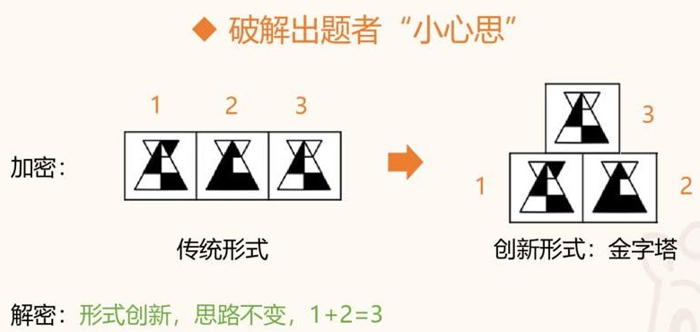

- **金字塔形式**：底下相邻的两个元素运算，得到它们正上方的那个元素，本质还是 **1+2=3**。
- 运算是**按相同位置**进行的：A 的第 n 格和 B 的第 n 格运算，结果放在 C 的第 n 格。这一点一定要弄清楚，否则这题做不了。
- 联考和上海都考过。

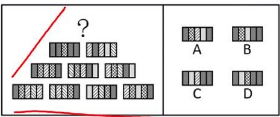

**思路**：
1. **定位**：
   - 形式很奇怪，但金字塔是“两个变一个”，**数量在不断减少**，符合运算的特征。
   - 各元素的色块各不相同，颜色又多。
   - 颜色多的题基本都在考黑白运算。
2. **选方法**：
   - 相同区域要找图1、图2里一样的格子。顶层这两个元素一样的格子很少（只有第1格、第3格），左边对应位置也不一样，**用不了相同区域**。
   - 只能**对比选项**。
3. **挑区分度最大的一格**（老师的内心活动）：
   - 第1格：四个选项都是深灰，找了也排除不了，不选。
   - 第2格：两种颜色，能排除两个，不够理想。
   - **第3格**：A、C 是斜线，B 是浅灰，D 是网格。如果答案在 B、D 里就一步到位，在 A、C 里也只需再验一步，**性价比最高**。
4. **找规则**：顶层两个元素的第3格分别是**网格（交叉纹）**和**斜线**。在金字塔底部左侧（蓝色三角）找到同样的组合：底层两个元素的第2格分别是网格和斜线，上面对应第2格的运算结果是**网格**。所以“网格+斜线=网格”。
5. **选项**：第3格是网格的只有 D。

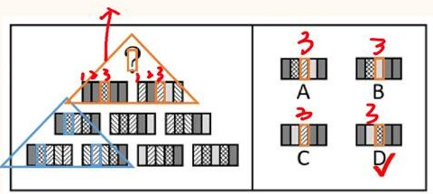

**答案**：D

### 黑白运算串讲

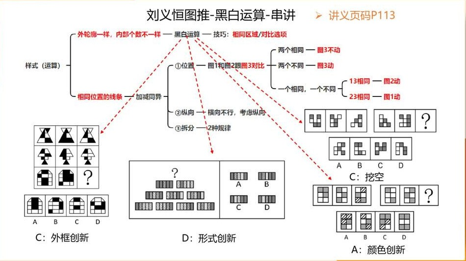

- 黑白运算知识点很少，关键只有一句话：**外轮廓一样，内部个数（图案）不一样，就定位黑白运算**。
- 技巧两个：**相同区域**（例9、例10、例11直接出答案）和**对比选项**（例12）。
- 要吃透的是**什么情况用哪个**。有空白或新颜色、规则变多时，先看问号处的相同区域。相同区域用不了时，用对比选项，并挑区分度最大的位置。

> **补充：遍历**。样式规律里还有一个考点叫**遍历**，属于送分题，讲义里没有。老师会在第六天的串讲里简单带一下，这里不展开。样式规律的主要精力放在**黑白运算**和**加减同异**上。

---

## 4. 考点三：标记

### 识别信号（看到什么，想到它）

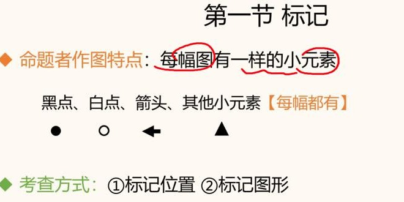

- **每幅图都有一样的小元素**：黑点、白点、箭头、小三角、小方块、小圆都可以。**个数可以不一样，但每幅都得有。**
- 背景（主体图形）**各不相同**，唯一一样的是标记物。
- **和位置规律怎么区分**：同样是小球，如果**背景完全一样**，考的是小球的移动（位置规律）；如果**背景不一样**，小球只是一个“功能性的小元素”，考的是**标记**。
- **考查方式**：①**标记位置**，②**标记图形**。

### 4.1 标记位置

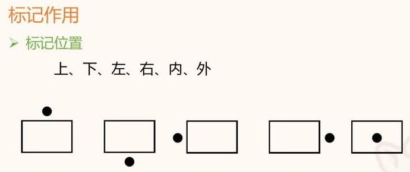

标记在图形的**上、下、左、右、内、外**。这部分非常简单，不用专门练。

### 4.2 标记点

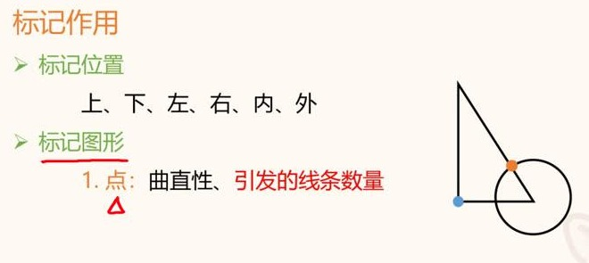

- **曲直性**：
  - 蓝点所在的都是**直线**，是纯直线的交点。
  - 橙点所在的既有**曲线**又有**直线**，是曲直交点。
- **引发的线条数量**：从这个点**发出去的线有几条**。
  - 蓝点发出 2 条。
  - 橙点发出 4 条：曲线穿过这个点时，要**拆成两条**来算。

**标记例1**（25广东事业）小方块标记交点

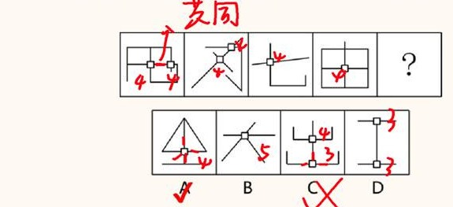

**思路**：
1. **定位**：让你想到标记的**不是那些线条，而是每幅图都有的小方块**。这是一个很小的图案，换成圆也无所谓，只要每幅都有，就是标记。
2. **标记了什么**：小方块都在**线的交点**上，是**标记点**。
3. **标记了几个**：有的图标 1 个，有的图标 2 个。这是出题人**故意迷惑你**：个数不影响出题，却会干扰你做题。按“单个”的思路看每个标记点就行。
4. **规律**：每个被标记的点都**引发 4 条线**。
   - 难点在于图1里两个标记点**共用一条线**。有人给左边的点算了这条线，右边的点就不算了，数出来就会少，然后觉得规律不对。
   - **共用的线两边都要算**，所以左、右都是 4。
5. **选项**：A 是 4，B 是 5，C 上面是 4、下面是 3。C 是很多人一开心就选的陷阱，其实下面那个不对。D 两个都是 3。

**答案**：A

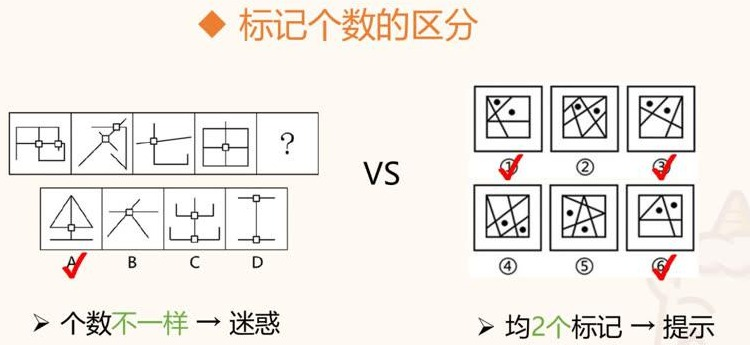

> **标记个数的区分**：
> - 标记**个数不一样**（有的 1 个，有的 2 个），是**迷惑**，用单个标记的思路做。
> - **每幅都控制成 2 个**，是**提示**，要考虑两个标记之间的**关系**。
> - 如果大家都是一个，个数就完全无所谓。

### 4.3 标记线

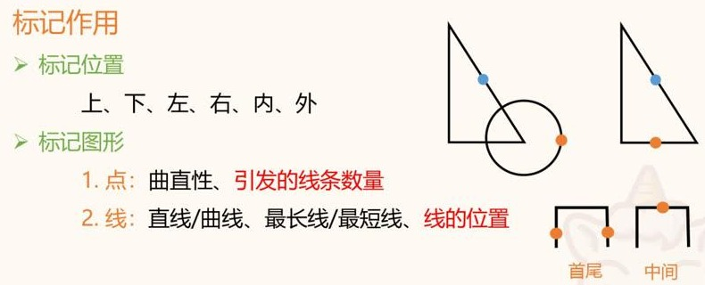

点落在**线上**，就是标记线。可能的考法有三种：
- **直线 / 曲线**：比如蓝点在直线上，橙点在曲线上。
- **最长线 / 最短线**：比如标记三角形里最短的边，或者最长的边。
- **线的位置**（难点）：
  - 像“订书针”那样的形状，两端的线长得一样，分不清哪个是开头哪个是结尾，只能笼统地叫“**首尾**”。
  - 标记在正中间的，叫“**中间**”（二分之一处）。
  - 更常见的考法是**以端点为参照物，数第几条线**。

**标记例2**（24江苏）回形（螺旋）线里的小圆圈

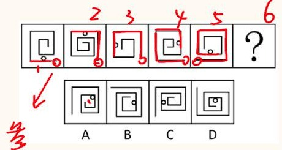

**思路**：
1. **为什么不是位置规律**：小球确实可能考移动，但这题**背景各不一样**。位置规律要求作图完全一样，所以这里的小球是**标记**。
2. **标记了什么**：小球都在线上，是**标记线**。三种考法里，这题都是直线，长短也不好区分，所以考**线的位置**。
3. **找参照物**：以每幅图螺旋线的**端点**为参照，小球依次标记从端点数起的**第 1、2、3、4、5 条**线，问号处应该是**第 6 条**。
4. **选项**：
   - A 的小球碰了两条线，落在角落里，一定错，不用数。
   - B 正好是第 6 条。
   - C 是第 5 条，少一个。
   - D 是第 8 条左右。

**答案**：B

> **陷阱（选 D 的同学注意）**：有人看小球的方位，依次是下、上、左、右……于是选“上方”的 D。可一组图的规律要么**恒定**，要么**递增（1234）**，要么**交替（1212）**，从来没考过“1234、1234”这种循环报数。

### 4.4 标记角

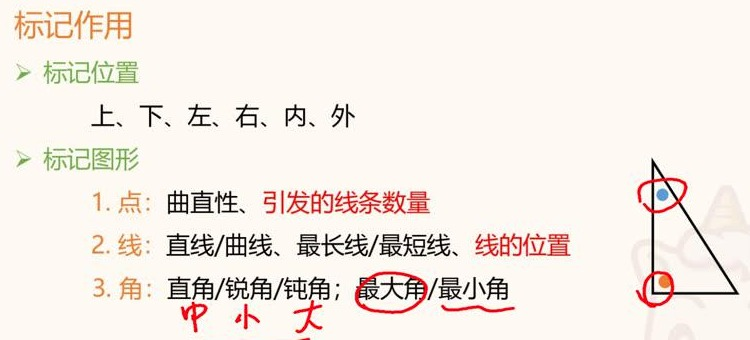

- **直角、锐角、钝角**，换个说法就是**中等角、小角、大角**。
- 所以标记角主要考的就是**角的大小**：最大角、最小角。
- 在直角三角形里，最大的角是直角，最小的是那个锐角（比如 30°）。
- 标记角**考得很少**，而且很简单。例题只能找到 2020 年的，近几年的新题基本不考这种简单考法。

**标记例3**（20四川事业）六图分两类，小白圈标在角旁边

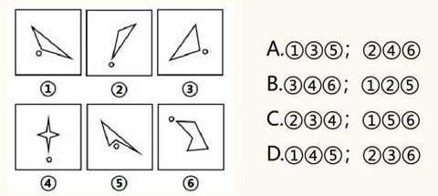

**思路**：
1. **定位**：背景各不相同，但每幅图都有一个**小白圈**，很特殊，所以定位**标记**。
2. **标记了什么**：
   - 如果标记的是线，白圈会画在线的旁边。
   - 现在它明显在**角的旁边**，所以是**标记角**，看角的大小。
3. **分类**：
   - ①③⑤标记的是**大角**（钝角）。**凹进去的角也算角**，而且算比较大的角，“你看不起谁呢”。
   - ②④⑥标记的是**小角**（锐角）。

**答案**：A（①③⑤；②④⑥）

### 4.5 标记面

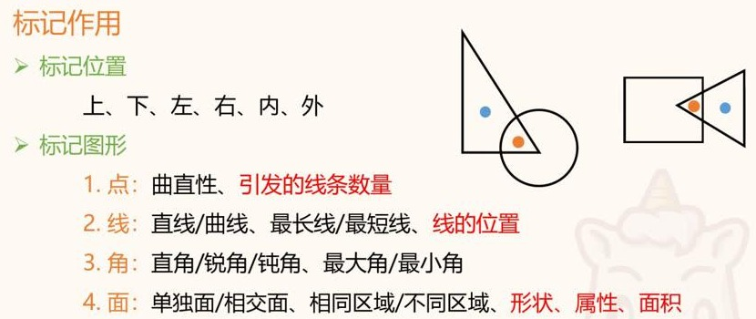

| 考法 | 含义 |
|---|---|
| **单独面 / 相交面** | 两个图形重叠的部分是**相交面**，不重叠的部分是**单独面** |
| **相同区域 / 不同区域** | 一个封闭面算一个区域。两个标记点**能直接“见面”**（在同一个封闭区域里）就是相同区域，**见不到面**就是不同区域 |
| **形状** | 被标记的面是几边形，比如三角形、四边形 |
| **属性** | 被标记的面是否**对称**，**曲直性**如何（纯直线，还是曲线加直线） |
| **面积** | 被标记的面在全图中是**第几大**，要排个序。**新趋势：大、中、小都考，“中”（第二大面）是新考点** |

> 老师建议只背**“形状、属性、面积”这六个字**。这是万金油，只要和“面”有关就能用，贯穿整个图推。其他几条理解就行，不用死记。

**标记例4**（26联考事业）九宫格，●、▲、■ 标在不同的面里

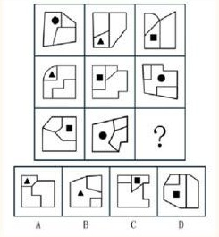

**思路**：
1. **定位**：每幅图都有圆、三角形或方块这类小元素，是**标记**，每幅图标记一个面。
2. **先粗排**：第三行已经有 ■ 和 ●，按每行三种各一个的规律，要补一个 **▲**。C、D 里没有三角形，排除。
3. **标记了什么面**：面的考法很多，不能每条都拿来套，太浪费时间，要**直观感受图案本身**。这些被标记的面有大有小，于是往**面积大小**上想。
   - ●：第一幅图里两个面谁大不好说，先打个问号。换别的图看，● 标记的都是**最大面**。
   - ▲：在第二幅图里明显是**最小面**。
   - ■：验证后是**第二大面（中）**。
4. **选项**：▲ 要标在最小面上，A 符合。

**答案**：A

> **新趋势**：以前只考“最大、最小”，现在开始考“**中**”，也就是第二大面（后面面的对称性部分也会用到第二大面）。这已经是今年第二次考到，要重视。

### 4.6 多个标记

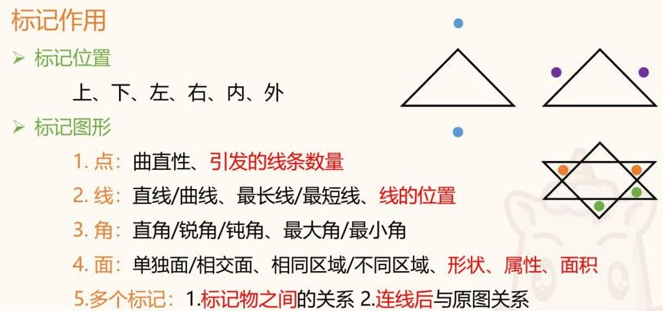

多个标记通常是**两个**。两个标记在一起，就要**比较**它们。考法有两个方向：

1. **标记物之间的关系**（标记多在图形**内部**）：
   - 看两个被标记的面挨得近还是远、分离还是相交。
   - 相交的话，是**相交于一个点（公共点）**，还是**相交于一条线（公共边）**。
2. **连线后与原图的关系**（标记多在图形**外部**）：
   - 把两个点连起来，看这条连线和原图的关系，比如和**对称轴平行、垂直**。
   - 难点是：图形规则时，对称轴是一条**看不见的线**，要自己想出来比较。

> 判断方向：**标记在里面**，多半比较标记物之间的关系；**标记在外面**，连线的概率很大。**能不连线就先别连**。

**标记例5**（24浙江）六图分两类，每幅图两个黑点

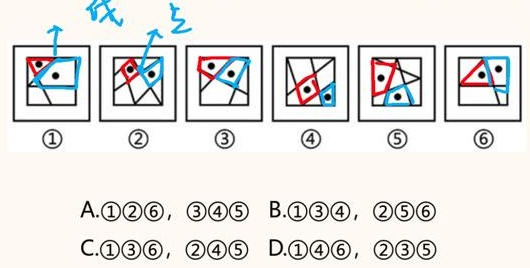

**思路**：
1. **定位**：中间的分割完全不一样，但每幅图都有**两个点**，所以是**多个标记**，要考两者的关系或连线。
2. **能不连就先别连**：连线一般用在标记在外面的情况。这题先从单个标记看。
3. **标记了什么**：每个点标记的是一个**面**，把两个面分别描出来（红、蓝）。
4. **两个面的关系**：
   - ①③⑥两个面**共用一条线**，也就是有**公共边**（像“脸贴着脸”）。
   - ②④⑤两个面**只碰在一个点**上，也就是**公共点**（像“亲嘴鱼”嘴巴碰在一起）。
5. **为什么不建议连线**：连线看“经过点还是经过线”也有道理，但连线会受手抖影响，歪一点就可能多经过一条线，不可靠。

**答案**：C（①③⑥；②④⑤）

**标记例6**（26陕西事业）六图分两类，斜线填充图形外有两个点

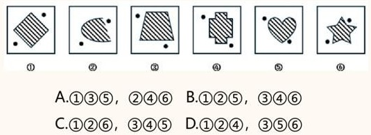

**思路**：
1. **定位**：背景不一样，但**每幅图都有两个黑点**，是多个标记，考两者的关系。
2. **要不要连线**：点都在图形**外面**，外面没什么可标记的，标记线也很难考，所以决定**连线**。
3. **连线后和原图比**：
   - 出题人为什么要在图案中间画一道道斜线？就是给你对比用的。
   - 前面讲的是和“看不见的对称轴”比，这题直接给了**实线**（填充的斜线）。
   - 两点连线和中间斜线的关系：①**垂直**、②**垂直**、③**平行**、④**平行**、⑤**平行**、⑥**垂直**。
4. 分类：①②⑥是垂直，③④⑤是平行。

**答案**：C（①②⑥；③④⑤）

> **老师点评**：这题“有水平，但不多”。两个点的方向本身就几乎暴露了答案，很多不会做的同学能直接猜对。如果把梯形的斜边换个方向，让点的方向不那么规整，难度就上来了。

### 标记串讲

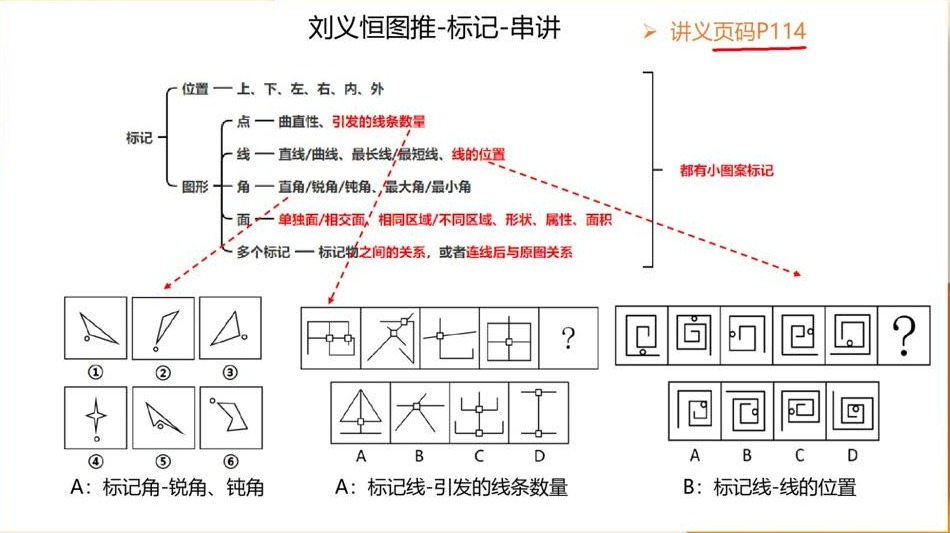

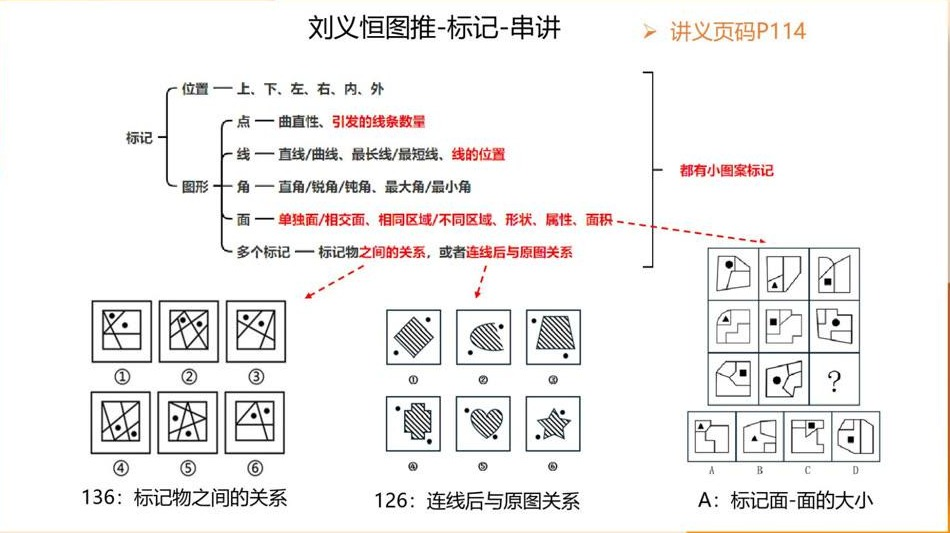

**标红的才需要重点记，其他理解即可**：
- 点：**引发的线条数量**。
- 线：**线的位置**（第1条、第2条、第3条……）。
- 角：非常简单，不用强调。
- 面：单独/相交、相同/不同区域，核心是**形状、属性、面积**六个字。**面积的大、中、小**里，“中”是新趋势，今年可能有很多考点和它有关。
- 多个标记：**标记物之间的关系**（相交于点还是相交于线），或者**连线后与原图的关系**。

---

## 5. 宏观思路：“有一样的图案”三类一网打尽

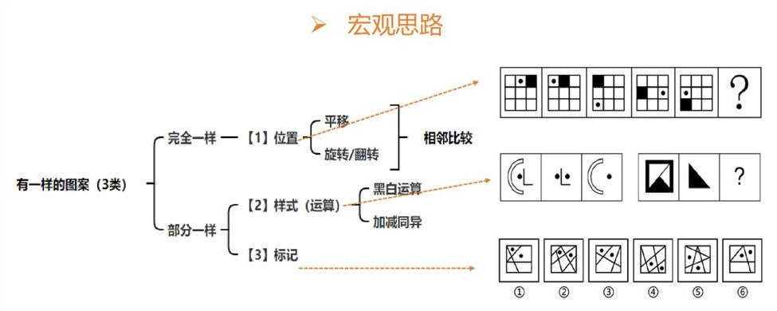

前两幅图之间**有一样的东西**，比如黑点一样、黑块一样、“C”形一样、标记点一样，就归入这三类：

| 类别 | 一样到什么程度 | 典型特征 |
|---|---|---|
| **位置规律** | **完全一样** | 都是黑点、都是同样的方格背景，只是位置变了 |
| **样式规律** | **部分一样** | 有局部一样的线条或黑块（比如一样的“C”形），而且在**相同位置** |
| **标记** | **只有标记物一样** | 背景不一样，唯一一样的是小标记物 |

两天的课已经把“有一样图案”的三类全部讲完，占了“3+3”的一半。

---

## 附：上节课答疑（位置规律补充）

以下是开课答疑中对第1章三个疑问的补充。

**答疑1：黑白运算能不能做“找方向、走到头”那道题？**（23河北事业，答案 C）
见上文第3节“位置规律 vs 黑白运算”：可以做，但推荐位置规律。原则是**个数相等优先位置，个数不同优先黑白运算**。

**答疑2：16宫格拆分题的两个规律没看懂**（22国考）

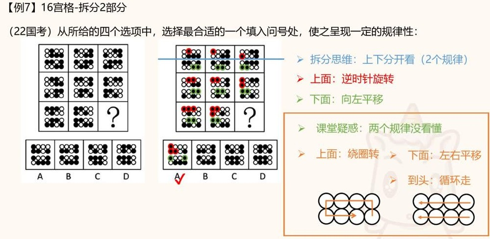

- **拆分思维**：上下分开看，有两个规律。
- **上面**：红色标记**绕圈转**，逆时针沿一圈依次走，第1、第2……第8个位置。
- **下面**：绿色标记**整体向左平移**，每次一格，**走到头就循环**回到第一个位置。
- 答案：A。

**答疑3：区分旋转、翻转时，箭头法的左右不会看；箭头法和时针法是二选一吗？**（23内蒙古事业）

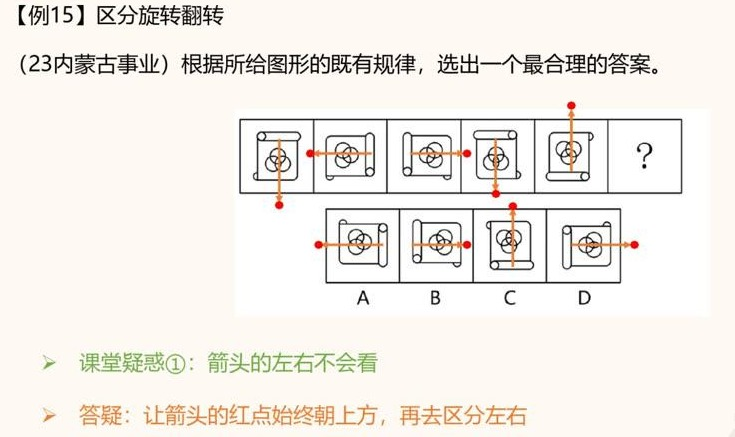

- **箭头法左右看不清，是因为没有选好参照物**。办法是先把图（在脑中）转一下，让**箭头的红点始终朝正上方**，再判断目标元素（如半圆）在箭头的左边还是右边。
- **箭头法的适用范围很大**：凡是要区分旋转、翻转的题都能用，包括后面的空间题。它只是一种工具。

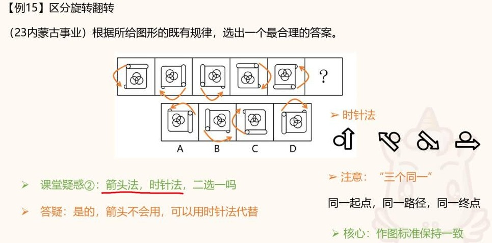

- **箭头法和时针法二选一**：箭头法不会用、空间想象不好、分不清左右时，就用**时针法**代替，效果完全一样。
- **时针法的“三个同一”**：**同一起点、同一路径、同一终点**，核心是**每幅图的作图标准保持一致**。
- 用在这题上：
  - 以每幅图的**圆**为起点、**半圆**为终点画箭头，方向依次是逆、顺、逆、顺、逆，交替出现，所以问号处应该是**顺时针**。
  - A、B 是逆时针，C、D 是顺时针，在 C、D 里选。
  - 第1、3、5幅的交替规律已经确定，只需再看第2、4、6幅：它们的箭头位置依次是下、右，下一个轮到**上**（逆时针方向变化），所以选 **D**。

---

## 本章小结

### 速查表：特征 → 规律 → 做法

| 看到的特征 | 想到的规律 | 做法 |
|---|---|---|
| 前两幅图有一样的东西，**完全一样**，只是挪了位置 | 位置规律（第1章） | 平移、旋转/翻转，相邻比较 |
| **相同位置的线条**，两组图或九宫格 | **加减同异** | 看图三反推是加、同还是异（九成是求异），再用另一行验证 |
| 九宫格横向推不出答案，或第二行验证失败 | 加减同异·**纵向** | 改为按列运算 |
| 图形被刻意分成**两部分**，或有两类元素（线和球、曲和直） | 加减同异·**拆分** | 两部分各找一个规律 |
| 图1或图2和图3的**朝向对不上** | 加减同异·**动** | 打勾打叉：两勾时图3不动，两叉时图3动，一勾一叉时打叉的动。旋转取最小角度，方向用另一行确定 |
| **外轮廓一样，内部黑块个数不同**；黑块多；外轮廓奇怪；有新颜色或挖空 | **黑白运算** | 相同位置运算。首选**相同区域**，其次**对比选项**（选区分度最大的位置） |
| 黑块个数**都相等** | 优先**位置规律** | 个数相等优先位置，个数不同优先黑白运算 |
| 形式怪，如**金字塔** | 黑白运算·形式创新 | 下面两个运算得到上面一个，按相同位置运算 |
| **每幅图都有一样的小元素**，背景不同 | **标记** | 先问“标记了几个？标记了什么？” |
| 标记在交点上 | 标记点 | 曲直性、**引发的线条数量**（曲线穿过要算两条，共用线两边都算） |
| 标记在线上 | 标记线 | 直线或曲线、最长或最短、**线的位置**（从端点数第几条） |
| 标记在角旁 | 标记角 | 大、中、小（凹角也算大角） |
| 标记在面里 | 标记面 | 单独或相交、相同或不同区域、**形状、属性、面积**（大、中、小） |
| **每幅都是2个标记** | 多个标记 | 在内部时看标记物之间的关系（公共边还是公共点）；在外部时连线，看和对称轴或实线平行还是垂直 |

### 口诀汇总
> - **相同位置的线条**：定位加减同异。
> - **看图三，反推加减同异。**
> - 考试主要考**加、同、异**，**90%考求异**，相减几乎不考。
> - 求同是**相同保留**；求异是**相同删除，再重组**。
> - **九宫格注意方向变化：横向不行，考虑纵向。**
> - **两部分，两个规律。**（拆分思维）
> - **两勾图3不动，两叉图3动，一勾一叉，叉的那个动。**（13相同则图2动，23相同则图1动）
> - 旋转**选最小角度**（就近原则），先旋转、后翻转。
> - **个数相等，优先位置；个数不同，优先黑白运算。**
> - 黑白运算：**规则现场找，黑+白不一定等于白+黑。**
> - **相同区域为首选，对比选项为备选。**
> - 黑白运算和加减同异**不用刻意区分**，哪个快用哪个。**白+白=黑只能用黑白运算。**
> - 标记：**每幅都有**的小元素。个数不一样是**迷惑**，**均为2个是提示**。
> - 面：**形状、属性、面积**（六字要背）。
> - 多个标记：**能不连就先别连**。标记在外面时再连线。

### 易错坑汇总
1. **求异误判**：图1、图2的共同部分（比如外框）如果出现在图3里，就**不是求异**（例1是相加）。
2. **只盯一条特殊线**：要把选项之间的每处关键差异都对回题干核对（例3中 B 多了一条本该抵消的线）。
3. **颜色不同也是“不同”**：求同时，同一位置一黑一白不算相同，要删掉（例2）。
4. **横向硬套**：九宫格横向“看似成立”时，也要用第二行验证。外框可能是出题人设的**迷惑**（例4）。
5. **拆分想不到**：一个规律解释不通时，就看内部是不是有两类东西（例5）。
6. **谁动判断顺序**：先确定是加减同异里的哪一种，再判断谁动。转动方向如果一排里有两种可能，要换一排确定（例8）。
7. **位置规律和黑白运算混淆**：先数黑块个数。少一个可能是重合（仍属位置规律），多出来、出现新颜色或挖空才是黑白运算。
8. **黑白运算列全部规则**：太慢，而且颜色一多规则就多。直接从问号处找相同区域。
9. **对比选项选错位置**：四个选项都一样的位置找了也没用。已知组里找不到对应颜色组合时，要换位置（例11）。
10. **共用线漏数**：两个标记点共用一条线时，两边都要算（标记例1）。
11. **被标记个数迷惑**：个数一会儿 1 个一会儿 2 个，是干扰项（标记例1）。每幅**都是2个**，才考关系。
12. **标记线误当位置规律**：背景不同就是标记。小球方位“1234、1234”不是合法规律（标记例2）。
13. **多个标记硬连线**：标记在内部时，优先看两个被标记面的关系。连线容易因为手抖出错（标记例5）。
