# 第3章 平面·属性规律 + 数量规律（面）

> **本章要点速览**
> - **总定位**：前两幅图**没有一样的图案** → 在"属性 / 数量 / 图形关系"三类里选 → **先属性、后数量**，属性里**对称性优先级最高**。
> - **对称性（大哥）**：图形**规则、美观** → 对称性 → **先识别，后细化**。
>   - 识别：轴对称（能画轴）/ 中心对称（不能画轴、转180°重合）/ 轴+中心（有**互相垂直**的对称轴）。识别时只画1条或2条垂直的轴，**不要一次画完**。
>   - 识别挖坑：去掉一条线成为轴对称（**拐弯算两条**）、**对称外框迷惑 → 关注内部填充**、A与非A（对称/不对称）、**整体对称 → 整体思维**。
>   - 细化：**1条轴 → 方向**；**多条轴 → 数量**；方向、数量都不行 → 轴与原图形的**线（重合/平行/垂直）、面（穿过几个面）、点（穿过几个点）、笔画**。
>   - 多个规则图形（两个部件就**拆分**）：**1+1**（各1条轴）→ 两轴**平行/垂直/相交**；**N+N**（不是1+1）→ **识别、运算**。
>   - 多条对称轴时数量没规律、又不能结合笔画 → **直接放弃对称性**，别卡住。
> - **曲直性（二哥）**：局部出现曲线，比例为 **1/2 或 2/3** → 曲直性；高频区分"全直线"与"曲线+直线"，可灵活归为"有曲线/无曲线"。**全是曲线 → 不考曲直，多半考数量**。
> - **开闭性**：**生活化图形**（或明显缺口）→ 开闭性；区分全开放（无面）/ 全封闭 / 半开半封（面外有线），可灵活归为"有面/无面"。
> - **数量规律·面**：**面 = 白色的封闭区域**（黑色不是面）；作图特征 **分割、封闭、生活化** → 数面；考查形式：常规图形、汉字字母数字、**立体图（面 = 底面数 + 底面边数）**。立体图考平面数量：**面为主，点其次**。

---

## 0. 上节课答疑（三个疑惑）

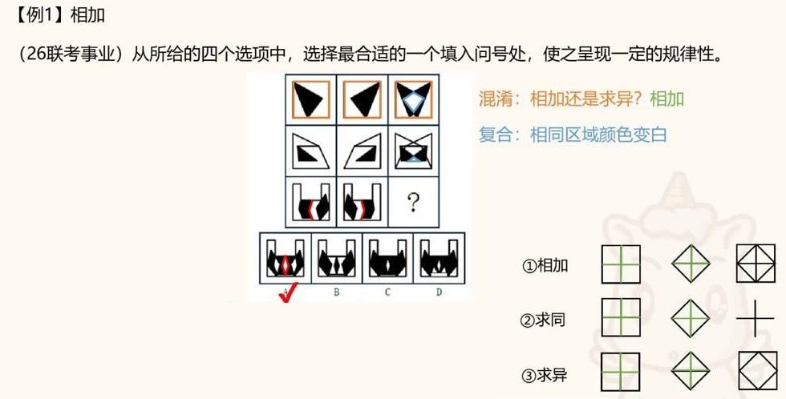

**疑惑①：26联考事业【例1】，"外框相加、内部黑面求异"行不行？** 行。用**拆分思维**（内外分开看）：两个外框相加得第三个外框，内部求异也得到第三幅图。解题思路**不唯一**。第2章讲这题时还没讲拆分思维，所以没用这种解法。

右下角三行小图是三个概念的区分（本章统一用语）：

| 运算 | 含义 |
|---|---|
| **相加** | 相同部分 + 不同部分全部叠在一起 |
| **求同** | 只保留相同部分 |
| **求异** | 删掉相同部分，保留不同部分 |

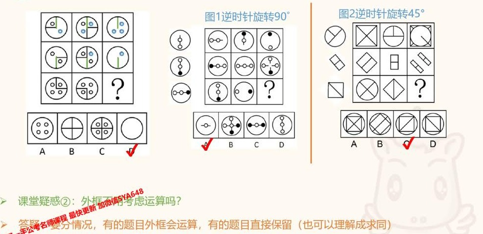

**疑惑②：外框不用考虑运算吗？** **分情况**：
- 有的题外框**直接保留**（也可理解为求同）：左题绿线求同、蓝球求异，但圆外框每幅图都有、直接保留；中间题黑球求异，如果圆外框也"求异"它就该消失，可它保留了 → 所以**外框要独立出来看**，别和内部混在一起。
- 有的题外框**参与运算**：右题完整外框旋转45°后，"日"字形把一部分挖空，得到第三个外框。

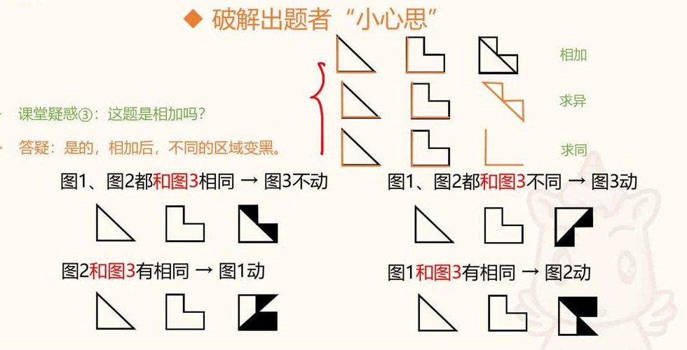

**疑惑③：这题是相加吗？** 是。**相加之后，相同的区域变白、不同的区域变黑**。上节课说成"求异的区域变黑"不严谨，应说"不同的区域"，免得和求异混淆。课件下半部分是判断哪幅图"动"的方法：图1、图2都和图3相同 → 图3不动；都和图3不同 → 图3动；图2和图3有相同 → 图1动；图1和图3有相同 → 图2动。

---

## 1. 宏观定位：没有一样的图案怎么办

### 识别信号
前两幅图之间**没有任何一样的东西**（一点关联都没有）。有一样的东西 → 位置 / 样式 / 标记（前两章）；没有 → 属性 / 数量 / 图形关系（本章起）。

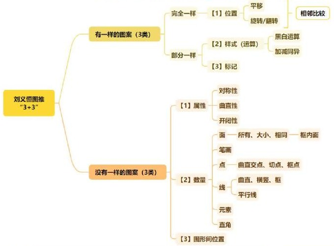

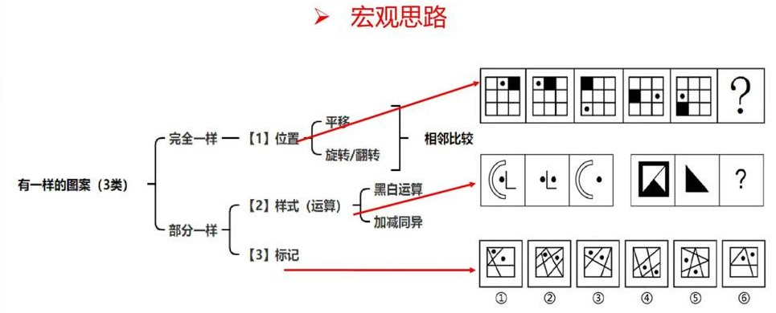

回顾"有一样的图案"：
- **完全一样**（画的东西一模一样）→ **位置规律**（平移、旋转/翻转，相邻比较）。
- **部分一样**（个别元素一样）→ **样式规律**（黑白运算、加减同异）。
- **标记**：背景不一样，但都有一个相同的小元素 → **标记最好定位**。考场上主要是区分**位置（完全一样）和样式（部分一样）**。

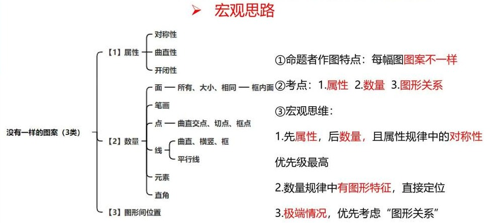

### 规律讲解：没有一样的图案的宏观思维
1. **先属性，后数量**；属性里**对称性优先级最高**。
2. 数量规律里的考点都有**图形特征，要直接定位**，不能靠挨个试错（后面几章会让你背特征）。
3. 极端情况优先考虑"图形关系"（本课没展开，讲完数量规律再讲）。

**提速做法**：属性有三个考点，挨个试错太慢。常规思路：**先看对称**，只要**瞄到一幅图明显不对称，直接去数量规律**。
- 多数省份（如**四川、浙江、国考**）属性基本只考对称性 → 对称不行 → 数量（第一条线）/ 图形关系（第二条线）。
- **联考**省份范围更大，曲直性、开闭性也考。曲直性会单独形成"**曲线思路**"，开闭性单独形成"**生活化思路**"，后面串讲再讲。

---

## 2. 属性规律总览

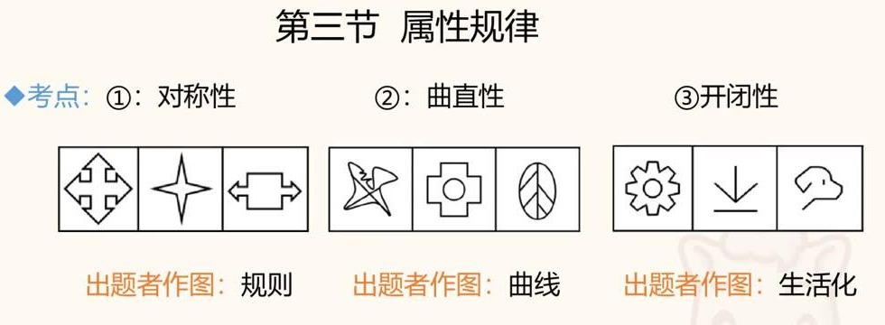

| 考点 | 出题者作图特征（识别信号） | 地位 |
|---|---|---|
| **对称性** | 图形很**规则、美观** | **大哥**，考频最高、要求最高 |
| **曲直性** | 作图中**出现曲线**（比例 1/2、2/3） | **二哥** |
| **开闭性** | **生活化**图形 / 明显缺口 | 联考为主 |

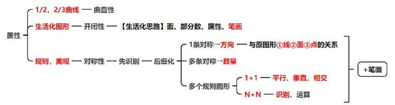

---

## 3. 对称性（一）：基础识别与识别挖坑

### 识别信号（看到什么，想到它）
- 每幅图图案不同 + 图形**规则、美观**（像奥迪、奔驰车标，对称就是美；宝马车标整体不对称，只有中间部分对称）。
- 解题思路：**每幅图图案不同 → 优先属性 → 对称性（规则）**。

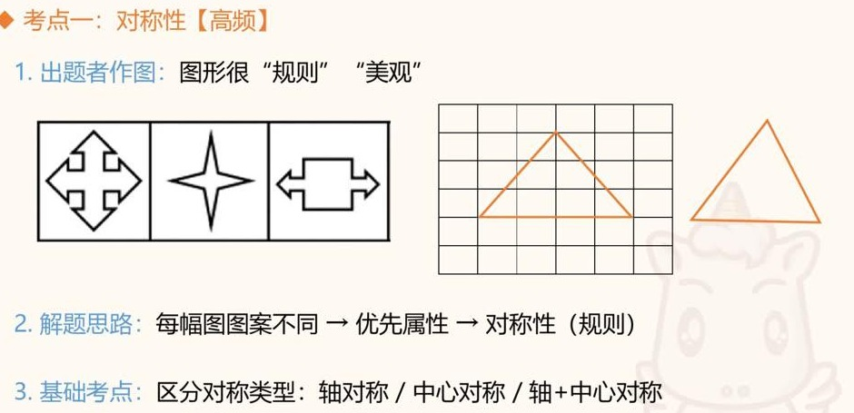

### 规律讲解

#### 为什么对称轴是"大哥"
对称图形**很难画**：没有网格辅助，左边长一点、右边短一点就不对称了。所以只要题里出现真正规则的图形，就是**出题人刻意为之，想考对称性**。它的要求也最高：本来想出等边三角形，排版时被拉长一点就变成等腰，对称轴数量就变了，所以出题人会格外"保护"它。考场上每幅图都不一样时，**优先属性，属性里优先对称性**。

#### 三种对称类型的区分（基础考点）

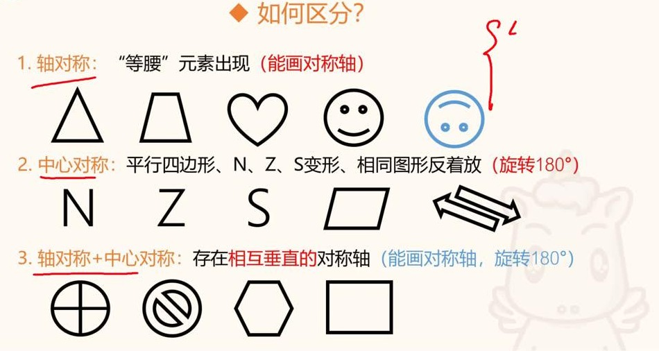

| 类型 | 判断标准 | 典型图形 |
|---|---|---|
| **轴对称** | 有"**等腰**"元素，左右相等，**能画对称轴** | 三角形、梯形、心形、笑脸（倒过来的笑脸也是） |
| <strong>中心对称</strong> | <strong>不能画对称轴</strong>，但<strong>旋转180°</strong>能与自身重合（左上↔右下，右上↔左下） | 平行四边形、N、Z、S 及其变形、相同图形反着放 |
| **轴+中心对称** | **存在相互垂直的对称轴**（能画轴，又能转180°重合） | 圆里画十字、禁止标志、正六边形、长方形 |

**一句话记忆**：能画轴的是"轴对称"和"轴+中心"；**两者的区别只看能不能画出互相垂直的对称轴**。中心对称看的是转 **180°**，不是360°（转360°任何图形都回到自己）。

> 💡 解释：沿两条互相垂直的直线各翻折一次，效果等于绕交点旋转180°。所以有两条互相垂直对称轴的图形必然中心对称；反过来，既有对称轴又中心对称的图形，过中心、垂直于原轴的那条线也一定是对称轴。因此"轴+中心"等价于"有互相垂直的对称轴"。

**识别时怎么画轴（重要）**：识别阶段只做三个动作：能画轴 / 不能画轴；能画的再分"画1条"和"画2条互相垂直的"。**哪怕能画5条，也只画1条**（它代表轴对称）；能画垂直的就画2条。**不要一次把对称轴全画完**，否则就跳到"数量"去了，碰到考识别的题反而做不出来。

#### 识别的四种挖坑方式
1. **创新题型**：题目直接告诉你考轴对称（例2）。难点不在识别考点，而在"看"。
2. **对称外框迷惑**（联考特色）：见下图。
3. **A与非A**：对称 vs 不对称（例3）。
4. **整体对称**：九宫格九个图连起来看才对称（例4）。

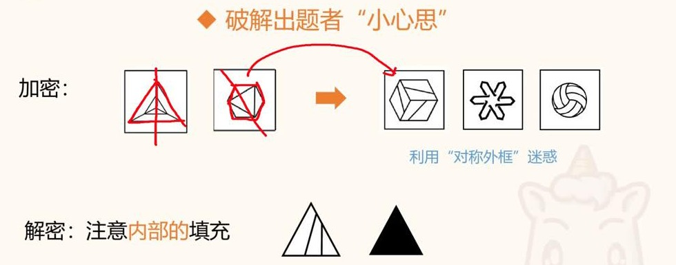

**加密**：等边三角形、正六边形给人"一定对称"的感觉，做多了就容易掉进陷阱。出题人用**对称的外轮廓**（六边形外轮廓的立方体、六角星、排球）包住**不对称的内部线条**：画轴一看，内部线条左右不相等 → 不是轴对称；转180°也回不去 → 也不是中心对称。**解密：注意内部的填充**（例如三角形内部的两条线只画在一侧就不对称，涂满黑色则对称）。

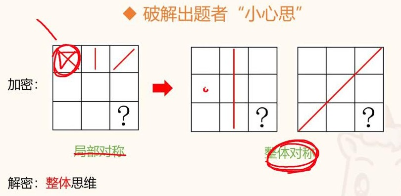

**加密**：原来是看单个图的对称（局部对称），现在把九宫格**九个图看成一个整体**，整体沿竖线或对角线对称。**解密：整体思维**。

### 易错点 / 老师提醒
- **别一上来就画对称轴、数条数**：先用考场思维定位（有没有一样的图案 → 属性 → 规则 → 对称 → **先识别**）。
- 识别只问一个问题：**有没有互相垂直的对称轴**。
- 细节挖坑常见于**联考、四川**（整体对称上海也要准备）；其他省份考得不多，了解即可。
- **"A与非A"（对称/不对称）分类是不严谨的考法**，只有部分省份会考（如四川、联考），最严谨的分类是轴对称/中心对称。不要把这种思路延伸到数量规律（如"有平行线/没平行线"那类分法，几乎不考）。

### 例题

**例1**（26辽宁）六个图形分为两类。

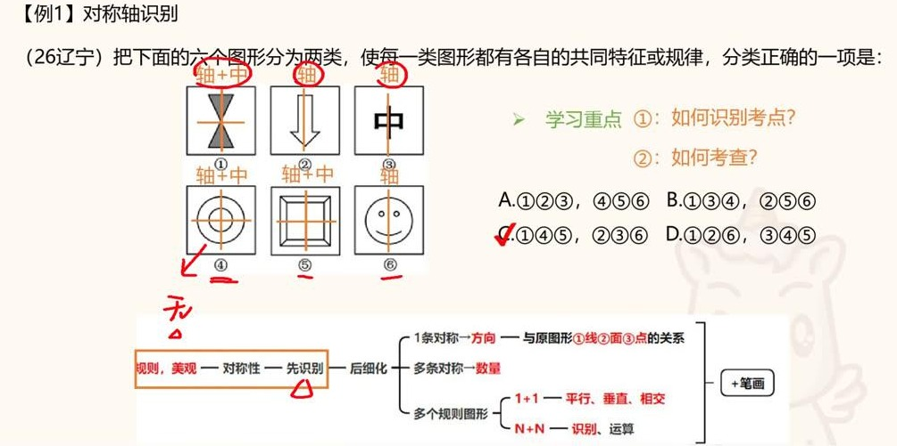

**思路**：
1. 定位：前两幅图没有一样的东西（沙漏、箭头、"中"字各不相同）→ 属性 → 图形规则美观 → 对称性 → **先识别**。
2. 逐个判断有没有互相垂直的对称轴：①沙漏 轴+中；②箭头 轴；③"中" 轴（"中"字竖画**下面比上面多出一点**，画不了横轴，这个细节很多人没注意）；④同心圆 轴+中；⑤方框 轴+中；⑥笑脸 轴。
3. ①④⑤ 轴+中心，②③⑥ 轴对称。
- 有同学质疑：④有无数条轴、⑤有4条、⑥有1条，这样分不严谨。问题在于他**跳步去数数量**了。识别阶段不需要数全，只问有没有垂直关系。

**答案**：C

---

**例2**（26天津事业）五个图形中，去掉一条直线后能成为轴对称图形的有几个？

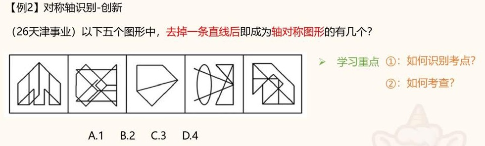

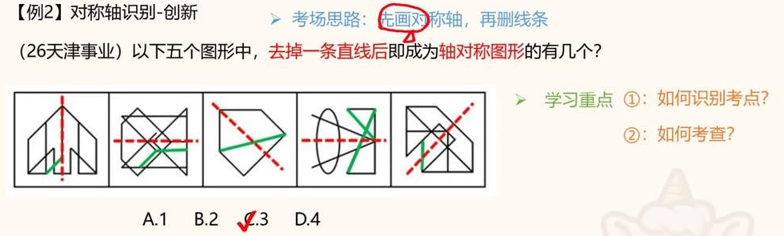

**思路**（**考场思路：先画对称轴，再删线条**）：
1. 题目直接告诉你考点，识别没有难度，难在"看"。这类题模仿的是**联考事业单位**（目前最重要的卷子，甚至超过国考，各省都在模仿）。
2. 先定轴：轴两侧应相等，**只要找不同**。
   - ① 由五边形外轮廓感受到竖直轴 → 左下角一条线多余 → 删1条 ✓
   - ② 轴是横的（看不清就把试卷转过来）→ 多余的是一条**折线**，**拐弯就算两条** → 要删2条 ✗
   - ③ 外轮廓和①类似，轴是斜的 → 删中间一条 ✓
   - ④ 横轴 → 两条斜线都不对称 → 删2条 ✗
   - ⑤ 右上方向的斜轴 → 删一条 ✓
3. ①③⑤ 共3个。

**易错**：**只要出现拐点就算两条线**。

> 💡 解释：题目说的"直线"指一条笔直的线段。折线由两段不同方向的线段组成，所以删掉它等于删了两条直线。

**答案**：C

---

**例3**（24江西）六个图形分为两类（A与非A）。

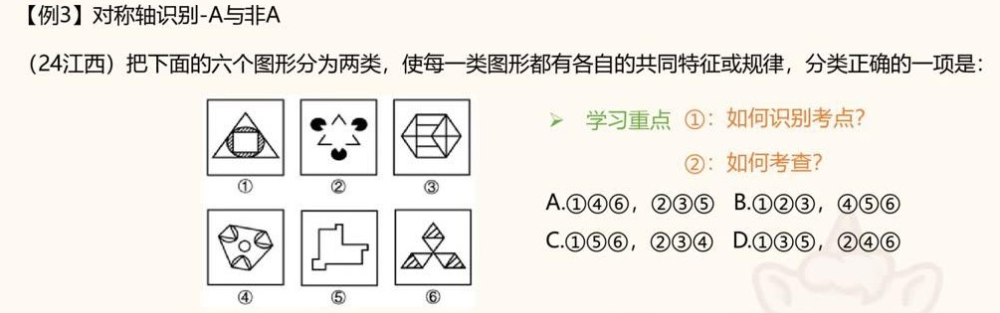

**思路**：
1. 定位：前两幅图没有一样的东西 → 属性 → 图形看起来美观 → 对称性 → 先识别。
2. ① 画竖轴后，中间的**阴影是斜线填充**，斜线方向破坏了对称（如果涂黑就对称了）→ 不对称。
3. ② ③ ④ 左右相等，能画对称轴（只需判断能不能画，不用画全）。
4. ⑤ 细节挖坑：**L 形两边长度不一样**（右边稍长）→ 不对称。
5. ⑥ 和①作图方式完全一样，内部斜线阴影 → 不对称。
6. ①⑤⑥ 不对称，②③④ 对称。**关注内部填充**。

**答案**：C

---

**例4**（21上海事业）九宫格，选出符合规律的一项。

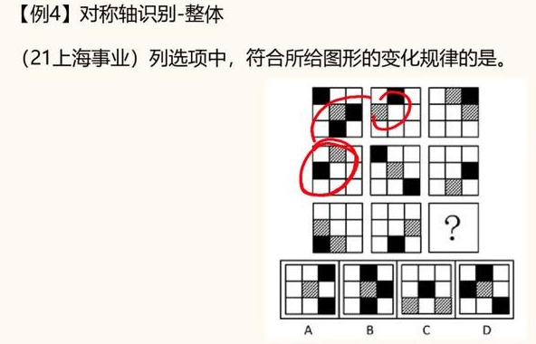

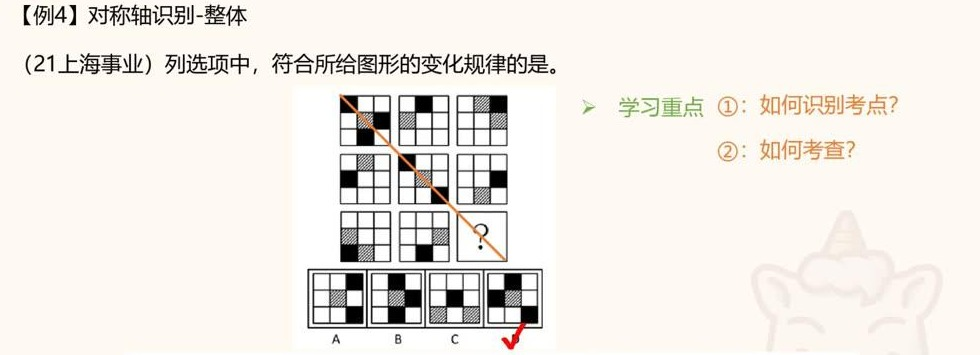

**思路**：
1. 前两幅图不一样 → 属性。单看有的图并不规则，按常理应该排除对称性。
2. 但**有两幅图画得一模一样**：一幅是巧合，两幅都一样就一定是刻意的 → 出题人想考它们之间的关联 → 像是左右翻转 → **整体对称轴沿左上到右下的对角线**：对角线两侧的格子两两对称。
3. 问号在对角线上，它自己必须关于这条斜线对称 → 选**本身带斜向对称轴**的一项。
4. 为什么不考黑白运算？整体画得很规则，如果考黑白运算，没必要把两幅图画得一模一样。（如果题目只有一行，颜色变化多，确实可能先想到黑白运算，这种想法有道理。）

**结论**：单图思维做不出来，必须**九个图一起看（整体思想）**。**如何识别才是考试最大的难点，听图推课就是听"识别"两个字。**

**答案**：D

---

## 4. 对称性（二）：细化考法（识别不出答案时）

### 识别信号
识别分不出类（例如题干全是轴对称）→ 进入**细化**：先看对称轴有几条。

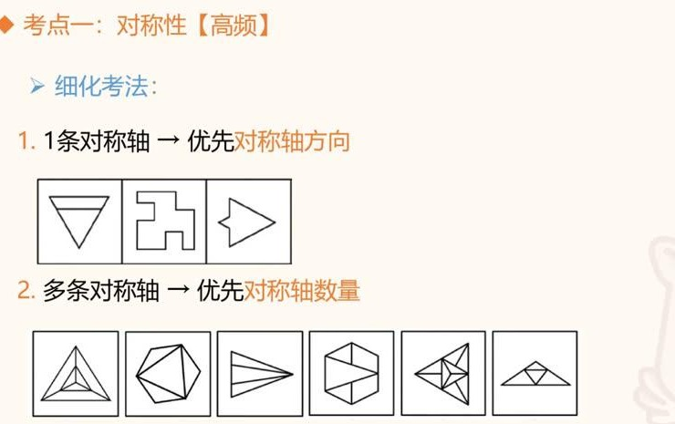

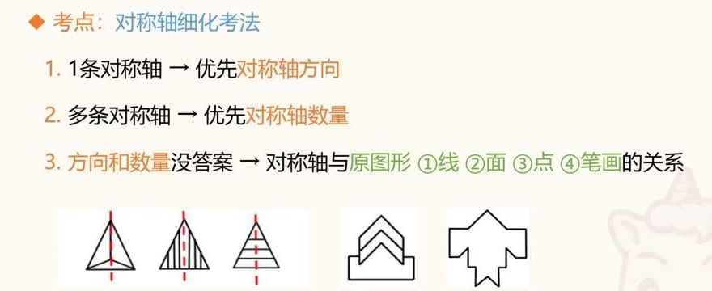

### 规律讲解

| 画出的对称轴 | 优先考虑 | 说明 |
|---|---|---|
| **都是1条** | **对称轴方向** | 如上图第一组：每次顺时针转45° |
| **多条（>1）** | **对称轴数量** | 如上图第二组：3、3、1、1、3、1 |
| 1条，方向没规律 | 与原图形 **①线 ②面 ③点** 的关系 | 基本只在**1条对称轴**时考 |
| 任何情况 | **④笔画**（+笔画） | 最新趋势，1条、多条、多个规则图形都可能结合 |

**线、面、点、笔画为什么按这个顺序**：
- **① 线（最好看，放第一）**：出题人想考线，就会在内部**刻意画一些明显的线**。轴与线只考三种关系：**重合、平行、垂直**（上图三个三角形：轴与内部线重合 / 与竖线平行 / 与横线垂直）。线都是斜着乱画的，考线的概率就不高。
- **② 面（第二好看）**：数对称轴**穿过几个面**（上图箭头形：一个穿过3个面，一个穿过1个面）。
- **③ 点（难看、低频，放第三）**：数对称轴**穿过几个点**，**优先数原图形自带的点**（顶点、交点）；轴从线段中间穿过，算"穿过线"，不算点。
- **④ 笔画**：一笔能连成的算一笔（例如外框能一笔连完就是一笔）。笔画是第4章内容，这里先了解。

**今年思路的三处优化**（老学员注意，只看思维导图看不出来）：
1. **只有1条对称轴时才考线面点**；多条对称轴几乎不考线面点。
2. 加入了**笔画**，而且单独放在最后（它和1条轴、多条轴、多个规则图形都能结合；**江苏、国考**都这样出过）。
3. 多个规则图形区分 **1+1** 和 **N+N**（见第5节）。

> **关键推论**：多条对称轴 + 数量没规律 + 又不能结合笔画 → **直接放弃对称性**。否则会一直卡在对称轴上反复试错。1条对称轴的可能性更多（方向 → 线面点 → 笔画）。

### 易错点 / 老师提醒
- **先识别，后细化**。刚讲完"1条轴看方向"，就直接画轴看方向、不做识别，最容易掉坑（例5）。
- 细化看数量时，不要以为考的是"奇偶"（例6改编）。考试就是在这套框架里出题，最新的考法已经包含在内。

### 例题

**例5**（25重庆事业）选一项填入问号处。

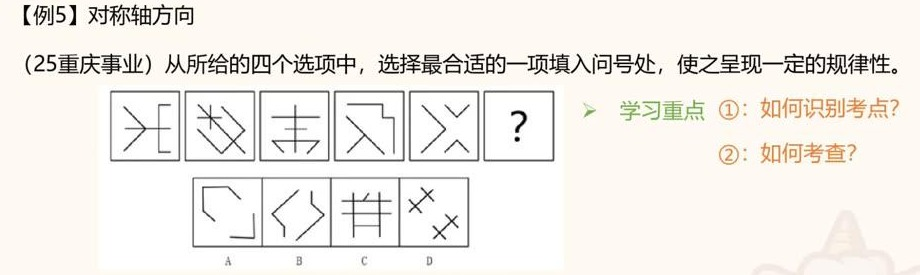

**思路**：
1. 定位：没有一样的图案 → 属性 → 线条很规则 → 对称性 → **先识别**。
2. 题干都是轴对称（各1条轴）。识别选项：A 1条轴 → 轴对称；B 两组线旋转180°后重合 → **中心对称**；C 歪着的，左右不等 → 不对称；D 能画**两条互相垂直的轴** → **轴+中心**。
3. 只有 A 是轴对称，识别这一步就出答案了。
- **陷阱**：跳过识别，直接画出 D 的一条轴，发现"顺时针45°"刚好接上方向规律，就选了 D。**D 是考试中最常见的挖坑点**，考方向的题经常这样挖坑。

**答案**：A

---

**例6**（24福建事业）六个图形分为两类。

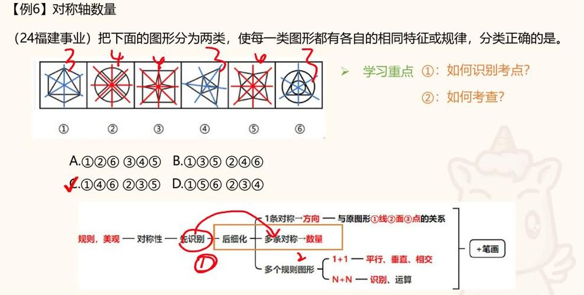

**思路**：
1. 定位：规则美观 → 对称性。很多同学又跳步直接数轴了。
2. **① 先识别**：①④⑥ 只能画一条（不存在互相垂直的轴）→ 轴对称；②③⑤ 有互相垂直的轴 → 轴+中心。识别这一步已经出答案。
3. **② 细化数量**（识别没答案时才用）：3、4、4、3、4、3 → 同样是 ①④⑥ / ②③⑤。

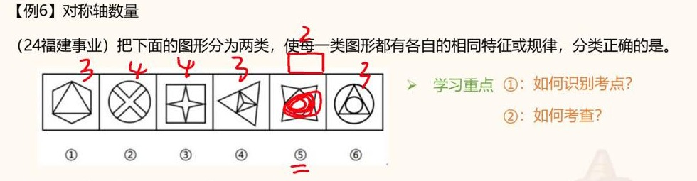

**改编（老师挖坑示范）**：把⑤改成长方形（2条轴）。上来就数条数的人会得到 3、4、4、3、2、3，分不清类；从识别角度看，依然是 轴、轴+中、轴+中、轴、轴+中、轴，分类很严谨。说明**考的是识别**，不是奇偶。

**答案**：C

---

**例7**（25浙江事业）选一项填入问号处。

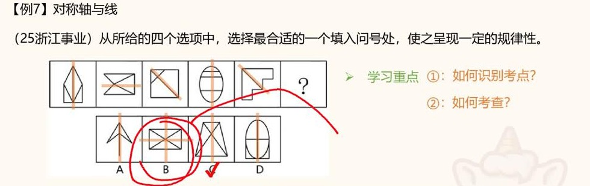

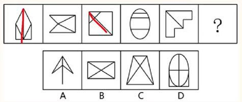

**思路**：
1. 定位：规则 → 对称性 → **先识别**：题干全是轴对称；B 是矩形加对角线，有互相垂直的轴 → 轴+中心 → **排除 B**（有同学兴奋地选了 B，和例5的 D 是同一个坑）。
2. 细化：都是1条轴 → 方向（竖、横、斜、竖、斜）没规律 → 看**线**：内部刻意加了线。
3. 轴与内部线的关系：①重合、②不重合、③重合（斜线）、④不重合（椭圆里只有横线）、⑤重合（左上斜线）→ 问号处应**不重合**。
4. A（箭头竖线与轴重合）、D（椭圆竖线与轴重合）都是重合；C（梯形内交叉线，没有竖线）不重合。

**答案**：C

---

**例8**（26联考事业）选一项填入问号处。

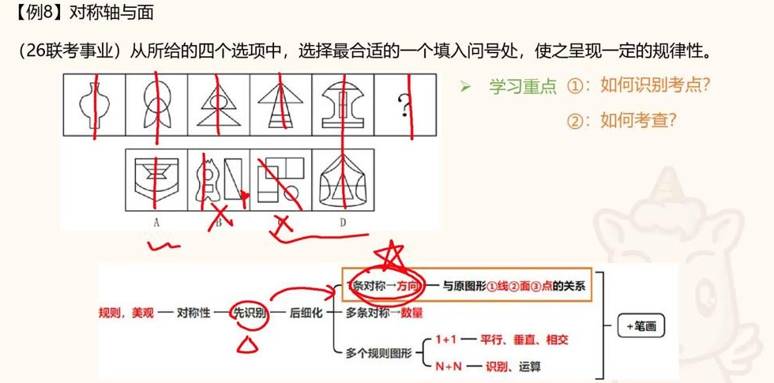

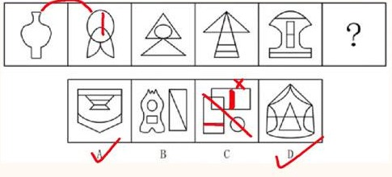

**思路**：
1. 定位：没有一样的图案 → 规则 → 对称性 → **先识别**：题干全是轴对称。B 左右不同，不对称；C 乍看对称，但**横线位置、线条长度不一样** → 不对称（老师自己也差点看漏，联考出题人会在这种细节挖坑）。剩 A、D。
2. 细化：1条轴，方向全是竖直 → A、D 都是竖直，方向区分不了。
3. 线：内部没有明显与轴重合的线 → 看**面**：面数给人递增的感觉 → 对称轴穿过的面数依次为 **1、2、3、4、5** → 问号处应为 **6**。
4. A 穿过6个面，D 只穿过4个面 → 选 A。选 D 的同学考虑了方向，很好，但要再多想一步：A、D 方向相同。
- 有同学试"交点"：0、1、2、1，没规律，行不通。**一个封闭区域就是一个面**。

**答案**：A

---

**例9**（20国考）六个图形分为两类。

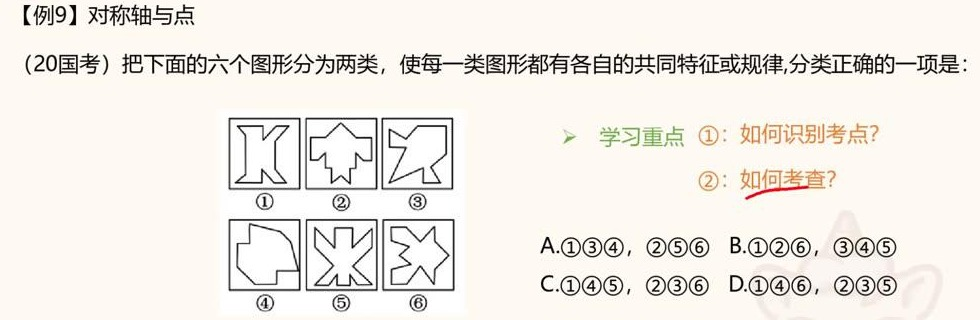

**思路**：
1. 定位：规则 → 对称性。题干全是1条对称轴 → 识别分不了类。
2. 方向：要分成两类，每类得有3个同方向的；只有两个横向，分不出 → 方向不行。
3. 线：没有刻意的内部线；面：每幅图都只有一个面 → 看**点**。
4. 对称轴穿过图形**自身的点（顶点）**：②③⑥ 轴穿过**2个点**；①④⑤ 轴从两条边中间穿过，是**2条线（0个点）**。
- 也可以理解成"对称轴与边垂直"（①④⑤轴与两条边垂直），也能做。但老师更建议从**点**的角度：考试考点就是这样出的；真要考线的垂直关系，出题人一般会在中间加一条线，更刻意。

**答案**：C（①④⑤，②③⑥）

---

**例10**（26国考，最新题，难度大）选一项填入问号处。

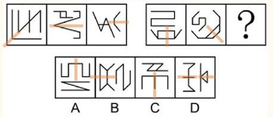

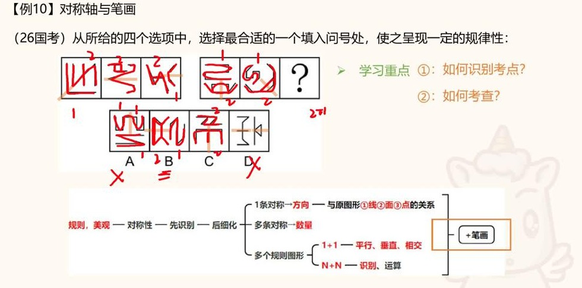

**思路**：
1. 前两幅图没有一样的东西。宏观上，**题干和选项每幅图都是两个部件** → 两个是刻意的：要么考两者关系，要么比来比去 → **只要数量凑成两个，就要拆分，分开看**。
2. 整体看不对称；**分开看**：每幅图都是**一个轴对称部件 + 一个中心对称部件**（如 L 形能画轴，Z/N/"2" 形转180°重合）。
3. 识别排除：D 两个部件都是轴对称 → 排除。A、B、C 识别上排不掉。
4. 线面点一般只在**整体有1条对称轴**时考；这里两个部件，整体画不出一条轴，**线面点不考**。
5. 有同学想数面：左组 0、1、2 递增，右组 1、1 相等 → 左边用什么规律右边也得用什么规律（第1章讲过），行不通。
6. 这些图是"简笔画"（**出头的端点**多）→ 考**笔画**。题干每幅图都是 **2笔 + 1笔 = 3笔**。A 上下各一笔，共2笔 ✗；B 2笔 + 1笔 = 3笔 ✓；C 2笔 ✗；D 也是2笔，而且识别时已排除。
7. 笔画是第4章内容，现在做不出来很正常，**先打个问号，学完笔画再回头看**。

**答案**：B

---

## 5. 对称性（三）：多个规则图形——1+1 与 N+N

### 识别信号
题干每幅图有**两个（多个）部件**：内/外、黑/白、左/右 → **先拆分**。分开后每个部件都规则 → 对称性 → 看每个部件各有几条对称轴。

### 规律讲解

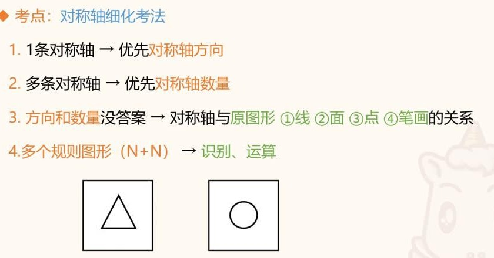

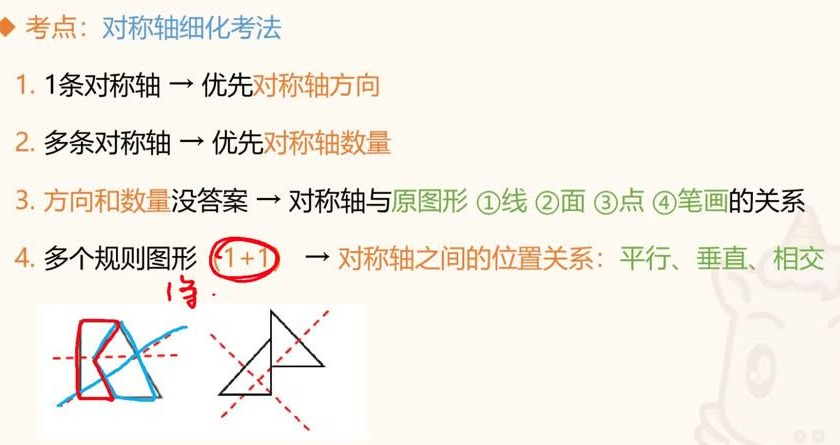

| 类型 | 条件 | 考法 |
|---|---|---|
| **1+1** | 两个图形**各只有1条**对称轴 | 两条轴的**位置关系：平行、垂直、相交** |
| **N+N** | **不是 1+1**（N 可以是0、2、3、4、无数……，如 1+0、0+0、4+3） | **识别**；识别不出 → **运算** |

- **N+N 的识别**：例如外框都是正方形（轴+中心），内部一个是三角形（轴对称）、一个是圆（轴+中心）→ 内外分开识别，两幅图不同类。
- **N+N 的运算**：正方形4条轴，三角形3条轴 → 外比内多1条。**圆有无数条轴，没法比，只能考识别**。
- **为什么 1+1 一定是"平行/垂直/相交"**：想考两轴平行，两个图必须都只有1条轴。如果一个是正方形（两条互相垂直的轴），就没法说它和另一条轴是否平行。所以**两个"1"是出题人刻意凑出来的**。
- 这是今年的调整：以前用"内外 / 黑白"来区分，现在改用"是否 1+1"区分：**1+1 → 平行、垂直、相交；不是1+1 → 识别（再不行 → 运算）**，相当于 A 与非A，不会混。

### 易错点 / 老师提醒
- **两个部件太刻意了，一定要有拆分的想法**（内外分开看、黑白分开看）。
- 判断走哪条线，只看**对称轴数量**：两个都是1 → 1+1；否则 → N+N。

### 例题

**例11**（25江苏选调）选一项填入问号处。

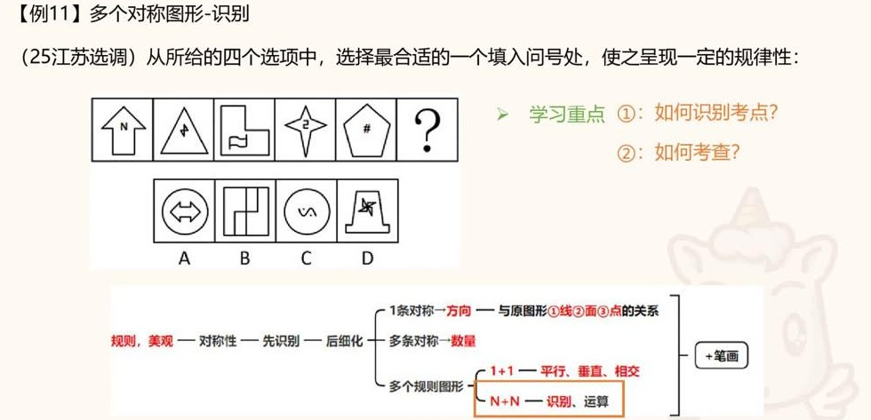

**思路**：
1. 宏观：每幅图都是"外面一个大外框 + 里面一个小东西" → 两个 → **内外分开看（拆分）**。
2. 内外单独看都规则 → 对称性 → 多个规则图形。内部（N、闪电、~、2、#）都没有对称轴，是0条 → 不是 1+1 → 走 **N+N → 识别**。
3. **外框**：箭头、三角形、L 形框、四角星、五边形都是**轴对称**（有的故意拉长了一点，但仍是轴对称）。选项外框：A 圆、B 正方形、C 圆 → 都是轴+中心；**D 梯形 → 轴对称** ✓。只看外框就出答案。
4. 内部验证：题干内部全是中心对称（上下、左上右下旋转180°都能复原）；D 内部的风车也是中心对称 ✓。

**答案**：D

---

**例12**（22贵州）选一项填入问号处。

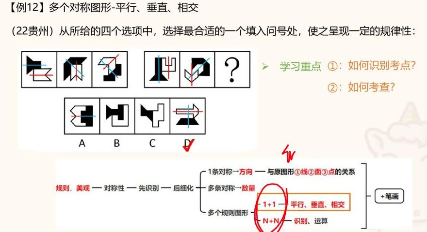

**思路**：
1. 宏观：一个黑色部件 + 一个白色部件 → 两个 → **黑白分开看**。黑色画得都不一样，白色也不一样 → 没有一样的图案。
2. 单独拎出来都规则 → 对称性 → 多个规则图形 → 看轴数：黑色1条、白色1条 → **1+1 → 平行/垂直/相交**。
3. 分别画出两条轴：第一组为 **平行、相交、垂直**，第二组前两幅也按这个顺序 → 问号处应为**垂直**。
4. 选项：A 两轴重合 ✗；B 白色部件不对称 ✗；C 两部件都是中心对称（0+0）✗；**D 两轴垂直** ✓。
- **改编**：如果题干都像 C 那样（闪电 + 另一个中心对称图形，0+0），就走 N+N 识别：题干全是"中心对称 + 中心对称"，选项里出现"中心对称 + 轴对称"就排除。

**答案**：D

---

**对称性串讲：各例题对应的分支**

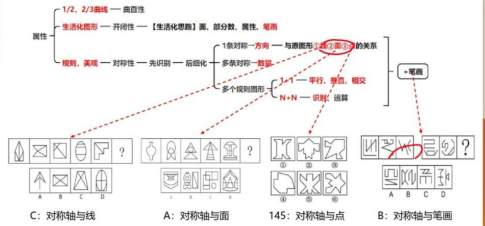

| 分支 | 例题 | 答案 |
|---|---|---|
| 先识别（轴 / 轴+中） | 例1 | C |
| 识别·A与非A（内部填充） | 例3 | C |
| 识别·整体对称 | 例4 | D |
| 1条轴 → 方向（识别先排 D） | 例5 | A |
| 多条轴 → 数量（识别即可） | 例6 | C |
| 1条轴 → 线（重合） | 例7 | C |
| 1条轴 → 面（穿过面数） | 例8 | A |
| 1条轴 → 点（穿过点数） | 例9 | C |
| + 笔画 | 例10 | B |
| N+N → 识别 | 例11 | D |
| 1+1 → 平行/垂直/相交 | 例12 | D |

---

## 6. 曲直性（二哥）

### 识别信号（看到什么，想到它）
- 每幅图画了**曲线**，而且是**局部曲线**：曲线图占 **1/2** 或 **2/3** → 曲直性。
- **全部是曲线 → 基本不考曲直性**（概率极低），更可能考数量。
- 解题思路：**每幅图图案不同 → 1/2、2/3 曲线 → 曲直性**。

### 规律讲解

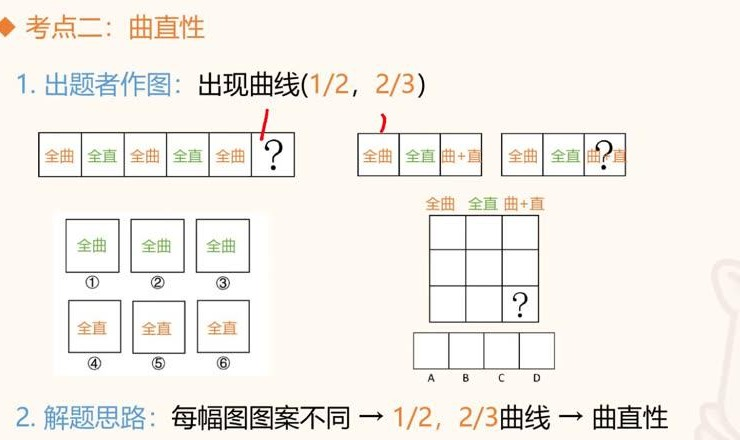

出题者要出曲直性，作图时必然要画曲线。题型一共四种，曲线占比很固定：

| 题型 | 常见分布 | 曲线图占比 |
|---|---|---|
| **一组图**（5幅+问号） | 全曲、全直交替（或全直、曲+直交替） | 6幅中3幅 → **1/2** |
| **两组图** | 每组"全曲、全直、曲+直" | 6幅中4幅 → **2/3** |
| **分组分类**（六图分两类） | 三个全曲 + 三个全直（全曲也可换成曲+直） | 6幅中3幅 → **1/2** |
| **九宫格** | 同两组图：每行/列"全曲、全直、曲+直" | 9幅中6幅 → **2/3** |

**只要算出曲线图（算上问号处）占 1/2 或 2/3，就直接定位曲直性**。不必背"曲线能考交点、切点……"那一堆，否则考场上会混。

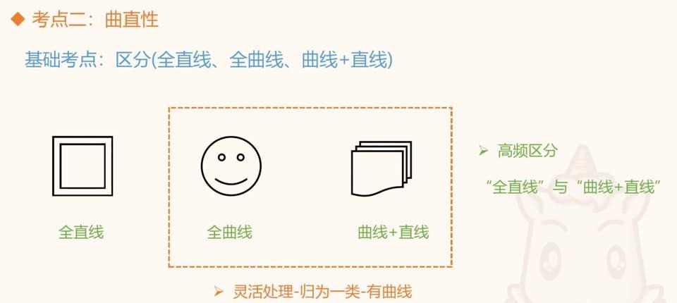

- 基础考点：区分 **全直线、全曲线、曲线+直线**。
- **高频区分："全直线" vs "曲线+直线"**：曲+直里往往只有一点点曲线，混在直线里让你不敏感，这是出题人最爱的混淆方式。
- **灵活处理**：出题人有时不严谨，把"全曲线"和"曲线+直线"归为一类 → **有曲线 / 没曲线**。

**字母题的曲直性**（面例2中讲到）：**大写字母**考曲直性的概率极大（A 纯直、C 纯曲、B/D 曲+直）；小写字母几乎全是曲线，考不了。但还要看**字体**：真要考曲直，会用黑体这类干净字体；衬线字体（T 结尾带弯、C 收尾带一小段直）考不了曲直性。

### 易错点 / 老师提醒
- **最大难点是"对称性 vs 曲直性"的区分**。规则的图也可能考曲直，**大哥（对称）要先看，大哥不行，别忘了看二哥（1/2、2/3 的比例）**。
- 排对称要快：识别时有一幅图是特例（如轴+中心，其他都是轴对称），分不了类；多条轴数量又没规律 → 对称直接放弃。**思维导图捋清楚了，才排得快**。
- 生活化是很弱的特征（几乎什么都能考），**曲线特征强于生活化特征**。

### 例题

**例13**（26联考事业）一组图，选一项填入问号处。

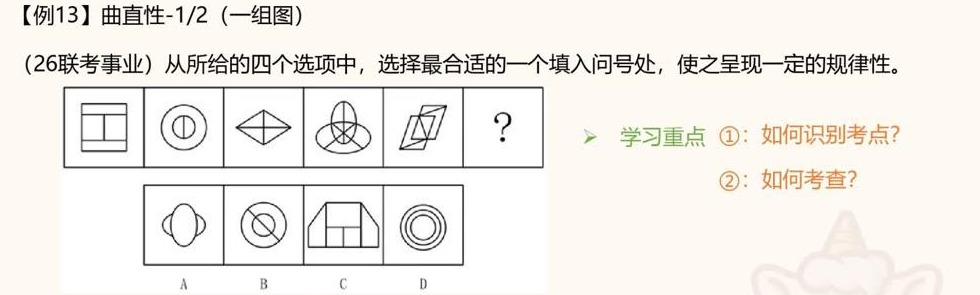

**思路**：
1. 定位：没有一样的图案 → 属性。图形规则，**不敢不先看对称**：但第5幅（平行四边形）是中心对称，其他有多条轴也有0条轴 → 识别、细化都行不通 → 放弃对称。
2. 二哥：题干出现曲线，若问号处也有曲线 → 6幅中3幅 → **1/2** → 曲直性。
3. 题干：全直、曲+直、全直、曲+直、全直 → 问号处应为**曲+直**。
4. A 全曲、C 全直、D 全曲，只有 **B**（圆 + 斜直线）是曲+直。
- 这是最新联考题。看似简单，混在试卷里一半人做不出来，难点就是会先卡在对称轴上。

**答案**：B

---

**例14**（26内蒙古）六个图形分为两类。

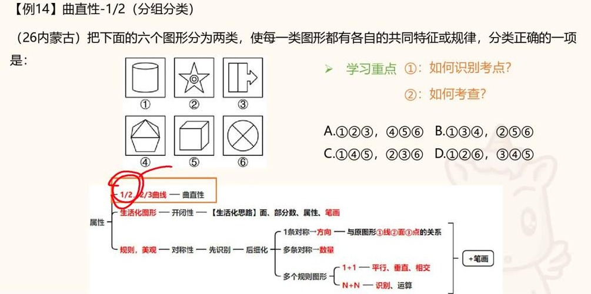

**思路**：
1. 定位：没有一样的图案 → 属性 → 规则 → 先看对称。**先识别**：⑥能画两条互相垂直的轴 → 轴+中心，其他都只画1条（⑤是立方体空间图，其他都是平面图，不借助空间角度，就把它看成三个面的平面图）→ 5比1，分不了类。多条轴看数量也不行 → 对称直接排掉（这就是"多条对称轴考数量，不行就停"的好处；如果⑥也只有1条轴，就会沿着方向、线、面、点一路试错）。
2. 有同学问：②五角星明明有5条轴，为什么只画1条？因为这是**识别**，能画5条也只画1条，它代表轴对称；能画互相垂直的才画2条。**不要一次把轴画完**，那是跳步。
3. 曲线：①圆柱、②五角星+圆、⑥圆+叉 有曲线，6个中3个 → **1/2** → 曲直性。
4. ①②⑥ 有曲线，③④⑤ 全直线。

**答案**：D

---

**例15**（25安徽）九宫格，选一项填入问号处。

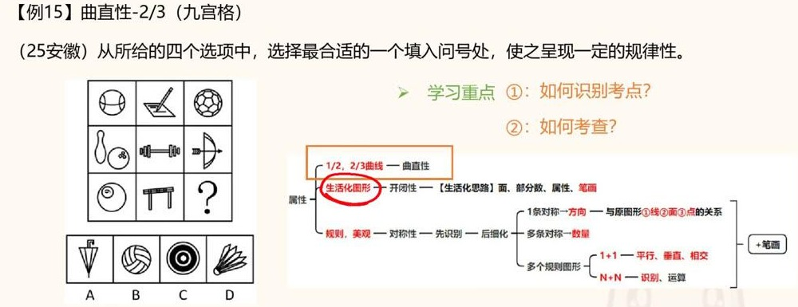

**思路**：
1. 定位：有图不对称 → 不考虑对称性。
2. 有同学觉得图形很生活化（体育用品）→ 想到开闭性。可以作为方向，但**生活化是很弱的特征**；曲线特征更强。
3. 比例：如果问号处有曲线 → 9幅中6幅 → **2/3** → 曲直性（定位更快）。
4. 第一列全曲线，第二列全直线，第三列曲线+直线 → 问号处为曲+直。A 直线，B、C 曲线，**D 羽毛球既有曲线又有直线**。

**答案**：D

---

## 7. 开闭性

### 识别信号
- **生活化图形**（小狗、齿轮、下载图标这类日常事物，和三角形、正方形那种几何图形感觉完全不同）；或者**明显缺口**（好好一个圆、一朵云被橡皮擦擦出一个口子，是刻意行为）。
- 目前主流是第一种：**生活化图形 → 开闭性**。
- 解题思路：**每幅图图案不同 → 生活化 → 开闭性**。

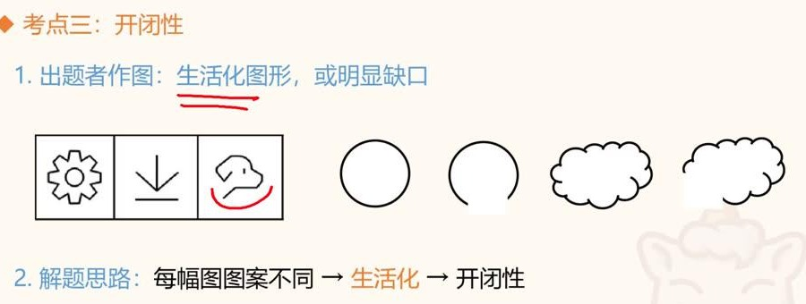

### 规律讲解

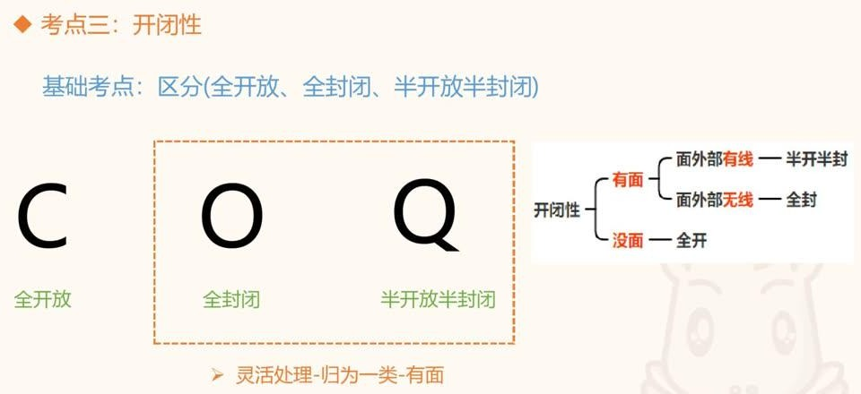

先分**有面 / 没面**，有面的再看**面的外部有没有线**：

| 分类 | 判定 | 例 |
|---|---|---|
| **全开放** | **没面** | C |
| **全封闭** | 有面，**面外部无线** | O |
| **半开放半封闭** | 有面，**面外部有线**（出头） | Q |

- **灵活处理**：全封闭和半开半封可以**归为一类 → 有面**（有面 / 没面）。
- 易错：面**内部**加了线仍然是全封闭，**只看面的外部**；线出头到外面了才是半开半封。

### 易错点 / 老师提醒
- 考情：**开闭性喜欢生活化图形**。常规几何图形题几乎不考开闭性。
- 生活化图形既能考开闭性，也能考数量（面、部分数、属性、笔画 → "生活化思路"，后面串讲时统一讲）。
- 前期动作慢可以在脑子里快速过一遍三个属性（对称行不行、曲直比例对不对、是不是生活化），熟练后要**直接定位**。

### 例题

**例16**（26联考事业）选一项填入问号处。

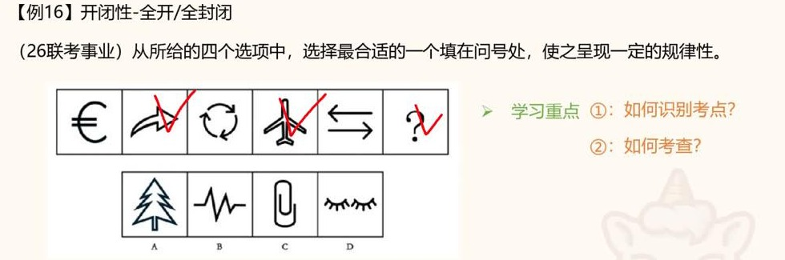

**思路**：
1. 定位：没有一样的图案 → 属性。有些图有点规则，但有图明显不对称（如弯箭头）→ 对称性不考虑。
2. 曲直：除了第5幅纯直线，其他基本都有曲线 → 构不成 1/2、2/3 → 曲直性不考虑。
3. 图形**生活化** → 开闭性：€ 无面、弯箭头**有面**、循环箭头无面、飞机**有面**、双箭头无面 → 无、有交替 → 问号处**有面**。
4. A 圣诞树有封闭区域；B 折线、C 回形针、D 睫毛都没有面。也可以说成题干"全开放、全封闭"交替，选全封闭的 A。

**答案**：A

---

## 8. 属性规律串讲：完整实战框架

考试就是在这个框架里考，今天练的所有题都是为了建立它：

1. **1/2、2/3 曲线** → 曲直性（二哥）。
2. **生活化图形** → 开闭性（另有"生活化思路"：面、部分数、属性、笔画）。
3. **规则、美观** → 对称性（大哥）→ **先识别**（能画轴 / 不能画；能画的分"1条"和"互相垂直"。哪怕有5条也只画1条）→ 识别不行 → **后细化**：
   - 1条轴 → 方向 → 不行 → 与原图形的线、面、点的关系；
   - 多条轴 → 数量 → 不行 → 放弃（除非结合笔画）；
   - 多个规则图形 → 都是1 → 1+1 平行/垂直/相交；不是1+1 → 识别 → 识别不出 → 运算；
   - 实在不行 → 考虑与**笔画**结合。

**省份差异**：联考、四川：识别挖坑（细节、A与非A）、整体对称都要掌握；上海：整体对称也要准备；其他省份这些细节考得不多，了解即可。**不管哪个省份，对称轴都是重点**。

---

## 9. 数量规律·面

### 识别信号
- 每幅图图案不同，属性（对称/曲直/开闭）不行 → **数量规律**。数量规律考点：**① 面 ② 笔画 ③ 点 ④ 线 ⑤ 元素 ⑥ 角**，本章只讲**面**。
- **面的作图特征**：**①图形被分割 ②封闭面明显 ③生活化**，看到就数面。
- 解题思路：**每幅图图案不同 → 属性 → 数量 → 面（分割、封闭、生活化）**。

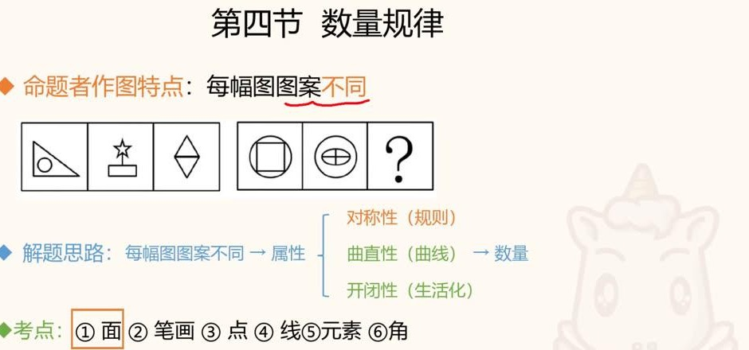

**关于"角"**：讲义写的是"**直角**"。锐角、钝角是十几年前的考点，现在几乎不考，那类题**少刷**。图推不是学得越多越好：从三个里选一个，比从十个里选一个简单。**要做减法**（仅限目前考情，出题人若重新考锐角，想准备也可以）。

### 规律讲解

#### 什么是面

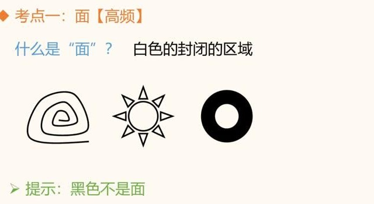

**面 = 白色的 + 封闭的区域**，两个条件缺一不可：
- 螺旋线：**不封闭 → 没有面**。
- 太阳：中间1个圆 + 8个三角 = **9个面**。
- 黑色圆环：**黑色不是面**，只有中间白色的洞算 **1个面**。

#### 出题者怎么画"面"

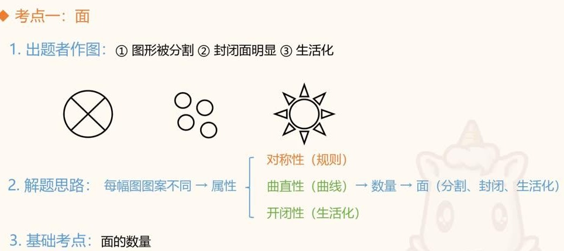

| 作图方式 | 出题人怎么画 | 图形感受 |
|---|---|---|
| **① 图形被分割** | 先画一个圆，再加一条线（2面）、再加一条线（4面） | 一个图被线切开 |
| **② 封闭面明显** | 画一个小圆，复制、粘贴、再粘贴（4面） | 明显独立的封闭面 |
| **③ 生活化** | 画图软件自带或网上现成的图，如太阳 | 日常事物 |

**基础考点：面的数量**。口诀：**分割、封闭、生活化**，理解即可，不必死记。

#### 面的三种考查形式

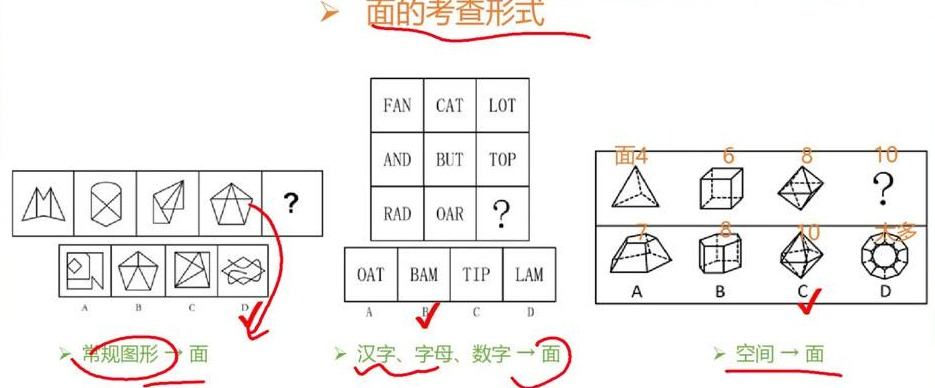

1. **常规图形 → 数面**（面例1）
2. **汉字、字母、数字 → 数面**（面例2）
3. **空间立体图 → 数面**（面例3）：主要是**上海、四川、联考**这三套卷考，其他省份考得不多。

#### 立体图数面技巧：面数 = 底面数 + 底面边数
- 找**上、下底面**（中间的截面不算底面），底面是几边形，每条边就带出一个侧面。
- 数的是**外表面**，**虚线部分也要数**。
- 双锥类（如八面体）：中间那个多边形不是底面，底面数为0，**上半部分数一圈、下半部分再数一圈**。

> 💡 解释：棱柱、棱锥的每个侧面都"站"在底面的一条边上，所以侧面数 = 底面边数，总面数 = 底面数 + 边数。双锥上下两半各有一圈侧面，每圈的面数都等于中间多边形的边数。

### 易错点 / 老师提醒
- **定位要快**：瞄一眼找到不对称的图，直接进数量，不要先把三个属性挨个试一遍。
- **看起来是空间图，也可能考平面数量**：空间类题只能考拼接，要求图与图之间有关联（一拼成二、二拼成三）；没关联就考不了空间，只能数平面的点、线、面。
- 立体图的数量考法只有三个方向：**点、线、面**。数线太麻烦，出题人基本不考。**面最高频；面数不出（如整个图只有一个面）就数点**。

### 例题

**面例1**（23安徽事业，课件【例1】）选一项填入问号处。

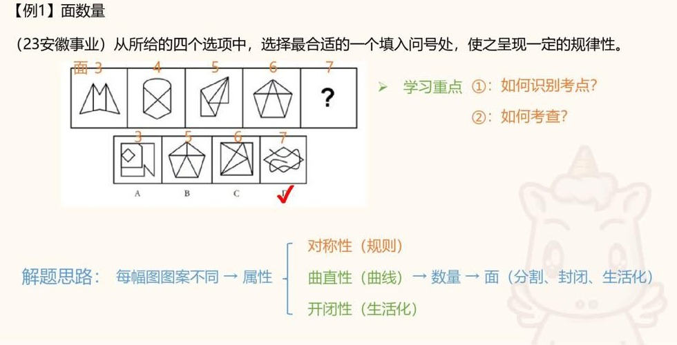

**思路**：
1. 定位：没有一样的图案 → 先过对称：①②④有对称性，**③不对称** → 直接跳到数量（这才是快的地方）。
2. 图形给人"被分割"的感觉 → 数面：3、4、5、6 → 问号处应为 **7**。
3. A 3、B 5、C 6、**D 7**。

**答案**：D

---

**面例2**（25河南事业，课件【例2】）九宫格字母，选一项填入问号处。

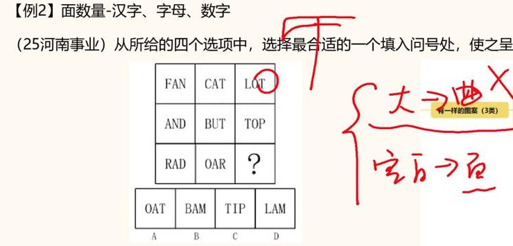

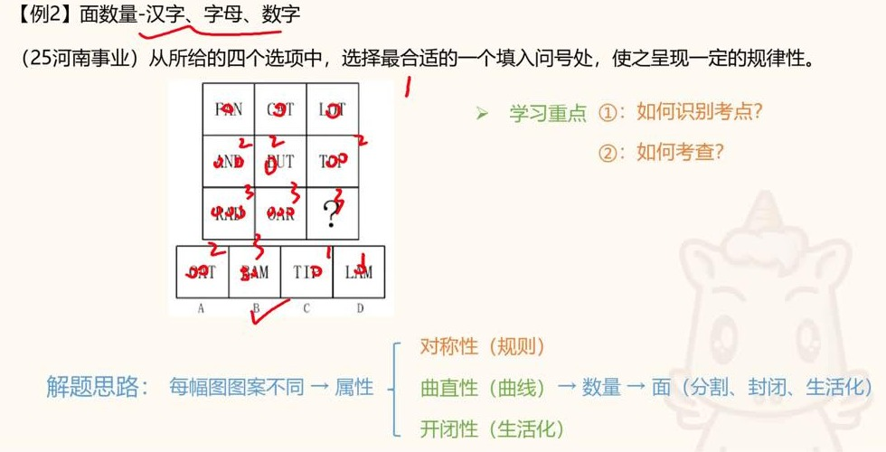

**思路**（考场心路）：
1. **大写字母 → 先想曲直性**（大写 A 纯直、C 纯曲、B/D 曲+直，考曲直的概率极大；小写全是曲线，考不了）。
2. 但看**字体**：这里的 T 结尾带了一点曲线，C 收尾带了一点直线，每个字母边缘都是又曲又直 → 出题人不会用这种字体考曲直 → 排除曲直性。
3. 字母中有**空白的封闭区域 → 数面**：
   - 第一行 FAN、CAT、LOT：各 **1** 个面（A、A、O）；
   - 第二行 AND、BUT、TOP：各 **2** 个面（A+D、B 的两个、O+P）；
   - 第三行 RAD、OAR：各 **3** 个面 → 问号处 **3**。
4. OAT 2、**BAM 3**（B 两个 + A 一个）、TIP 1、LAM 1。

**答案**：B

---

**面例3**（23上海，课件【例3】）立体图形，选一项填入问号处。

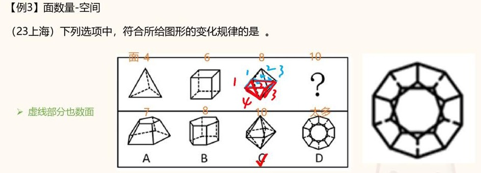

**思路**：
1. 画了虚线 → 出题人希望你看成空间图。但图与图之间没有拼接关联 → 考不了空间题 → **实际考平面数量**。
2. 数量方向：点、线、面，面最高频 → 先数面。用**底面数 + 边数**：
   - 四面体：1 + 3 = **4**；立方体：2 + 4 = **6**；八面体：中间正方形不是底面，上4 + 下4 = **8** → 问号处 **10**。
3. 选项：
   - A：上下底面 2 + 五边形5条边 = **7**；
   - B：六棱柱 2 + 6 = **8**；
   - **C**：中间五边形不是底面，上5 + 下5 = **10** ✓；
   - D：从上往下看的视角，上下各一个五边形底面：2 + 5 + 5 = **12**（为了防止出题人真考12，D 也要会数）。

**答案**：C

---

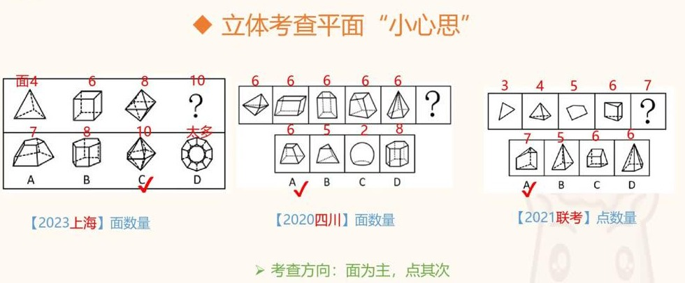

**面例4**（2020四川）立体图形面数量：题干每个图都是 **6** 个面（三棱双锥 0+3+3，棱柱类 2+4，五棱锥 1+5）→ 选6个面的一项。**答案**：A（A 6、B 5、C 2、D 8）

**面例5**（2021联考）立体图形**点数量**：每个图**只有一个面**，没法考面 → 数点：3、4、5、6 → 问号处 **7**（背面看不见的点也要数进去）。**答案**：A（A 7、B 5、C 6、D 6）

**考查方向：面为主，点其次。**

---

> **下接**：面的细化考法（**所有面、大小面、相同面**）和笔画、点见**第4章**；线、元素、直角见**第5章**。

---

## 本章小结

### 速查表：特征 → 规律 → 做法

| 看到的特征 | 想到的规律 | 做法 |
|---|---|---|
| 前两幅图没有一样的东西 | 属性 / 数量 / 图形关系 | 先属性后数量，属性先看对称 |
| 图形规则、美观 | 对称性 | **先识别**：轴 / 中心 / 轴+中（有互相垂直的轴） |
| "去掉一条线成为轴对称" | 对称识别·创新 | 先画轴，再删线；**拐弯算两条** |
| 外框很对称、内部线条乱 | 对称外框迷惑 | **关注内部填充** |
| 单图不规则，但有两幅图一模一样 | 整体对称 | 九宫格整体看，找整体对称轴 |
| 识别分不了类，每图1条轴 | 对称轴方向 | 方向不行 → 线（重合/平行/垂直）→ 面（穿过几个面）→ 点（穿过几个点） |
| 识别分不了类，每图多条轴 | 对称轴数量 | 数量不行（又不能结合笔画）→ 放弃对称 |
| 每图两个部件（内外/黑白） | 多个规则图形 | **拆分**；1+1 → 平行/垂直/相交；N+N → 识别/运算 |
| 简笔画、出头端点多 | 对称 + 笔画 | 数笔画（第4章） |
| 曲线占 1/2 或 2/3 | 曲直性 | 全直 / 全曲 / 曲+直；或有曲线 / 无曲线 |
| 全是曲线 | 不考曲直 | 转数量 |
| 生活化图形 / 明显缺口 | 开闭性 | 有面 / 无面；面外有线 → 半开半封 |
| 有图不对称 + 图形被分割 / 封闭面明显 / 生活化 | 数量·面 | 数白色封闭区域 |
| 大写字母 | 先想曲直（看字体），再想面 | 字体不干净 → 数空白区域 |
| 立体图但图间无关联 | 平面数量 | 面 = 底面数 + 边数；面数不出 → 数点 |

### 口诀汇总
> - **对称轴是大哥，曲线是二哥**：大哥先看，大哥不行别忘了二哥。
> - **先识别，后细化**。
> - **一条看方向，多条看数量**；方向、数量不行 → **线、面、点、笔画**。
> - 识别只问：**有没有互相垂直的对称轴**。识别只画1条或2条，**别一次画完**。
> - **拐过来算两条**。
> - **关注内部填充**。
> - **整体思想**。
> - **两个就拆分**（内外分开看、黑白分开看）。
> - **1+1 → 平行、垂直、相交；不是1+1 → 识别、运算**。
> - **曲线看比例：1/2、2/3**。
> - **生活化 → 开闭性**。
> - **面：白色的、封闭的**；**分割、封闭、生活化**。
> - **立体面数 = 底面 + 边数**；**面为主，点其次**。
> - 识别是最大难点，**图推就是在定位考点**；**做减法**。

### 易错坑汇总
1. 学了对称轴就一上来画轴、数条数 → 跳过识别，掉进"轴+中心冒充一条轴"的坑（例5 D、例7 B）。
2. 识别阶段把轴全画出来 → 本该考识别的题做成了数数量（例1、例6改编）。
3. 折线当成一条线（例2）。
4. 被对称外框骗过，没看内部填充 / 阴影斜线 / L 形长短 / 横线位置（例3、例8 C）。
5. 只会单图思维，想不到九宫格整体对称（例4）。
6. 两个部件不拆分，整体找对称轴找不到（例10、例11、例12）。
7. 左边用一种规律、右边用另一种规律（例10 数面：左递增、右相等）。
8. 多条对称轴数量没规律还硬磨对称性，不及时放弃（例13、例14）。
9. 把"全曲线"题当曲直性；把生活化当强特征而忽略曲线比例（例15）。
10. 数面把黑色区域算进去；不封闭的区域也算面（螺旋）。
11. 立体图数面漏数虚线（背面）面；把双锥中间的截面当底面。
12. 大写字母无脑考曲直，没看字体（面例2）。
