# 第4章 平面·数量规律（面的细化、笔画、点）

> **本章要点速览**
> - **本课实际内容**：面的细化（接第3章的"面"）+ 笔画 + 点。课程标题里的"线"放到了下一课，见**第5章**。
> - **总思路**：每幅图都不一样 → 先属性（对称性优先）后数量。但**有明显图形特征的细化考点直接定位**（明显大面、处处有三角形、一模一样的面），不必每次都把"对称 → 数量"走一遍。
> - **所有面**：分割后每块形状一样 / 每幅图都有三角形 / 每幅图只有两种面（三角形＋四边形）→ 看形状、数三角形、三角形与四边形做运算（**相减最常见**）。
> - **大小面**：有"**明显**"的大面或小面 → **形状**（自身、与外框、传给下一幅的外框）＞**属性**（对称性、曲直性）＞**面积**（占原图一半，低频）；新趋势是"**大、中、小面**"。
> - **相同面**：有明显一模一样的面（**大小＋形状**都相同）→ 数个数或组数。
> - 面细化口诀 **6＋6**：所有、大小、相同 ＋ 形状、属性、面积。
> - **笔画**：旧特征是日、田、五角星、圆相交；新特征是**面特征、多端点、生活化**。两种数法：**笔画数＝奇点数÷2**（0个奇点也是1笔，不连通的部分相加），或者**去外框**。
> - **点（交点）**：线与线相交的位置，**端点不是点**。它的特征和笔画一样（面特征、多端点），所以按**面 → 笔画 → 点**的顺序试。
> - **点的细化**：每幅图都有曲线时，圆形先看**切点**，再看**框点**（框上点、框内点，框也可以是多边形）；不是圆就看**曲直交点**。

---

## 0. 课前答疑（第3章补充）

**① 中心对称怎么判断？** 图形旋转180°后和原图完全重合，就是中心对称。拿不准就把书倒过来对比。老师特意在图上方标了一个红点再旋转，说明两张图不是复制粘贴。（这页还提到：出题人会用"对称的外框"迷惑你，这时要注意**内部的填充**。）

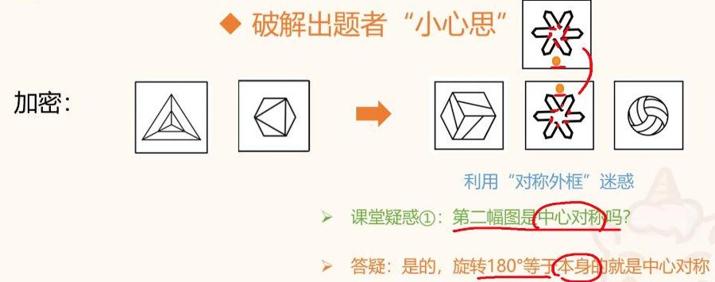

**② 例8（26联考事业）对称轴与面**：规律是**对称轴穿过的面数**依次为1、2、3、4、5，所以问号处是6，选 **A**。不少同学不是不会数面，而是把"穿过的面数"和"总面数"弄混了。
**③ 能不能数对称轴与图形的交点？** 不行。交点数是2、3、4、5、7，前面看着像递增，最后一个断了。

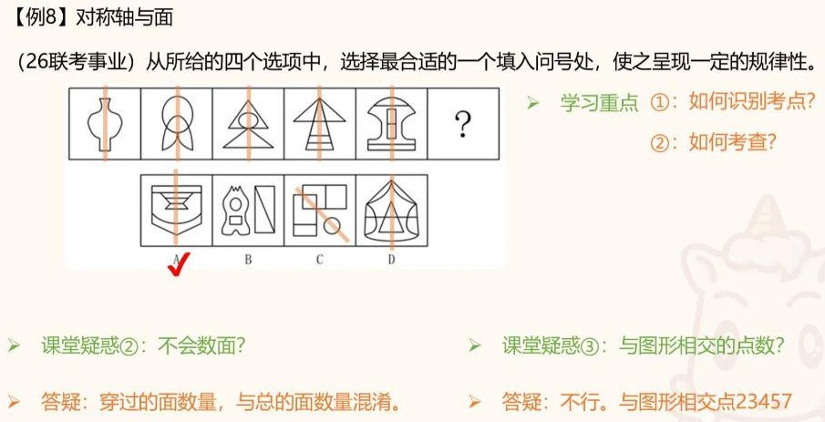

**④ 例3（23上海）空间图形数面**：面数依次为4、6、8、10（虚线后面的面也要数），选 **C**。
- 数立体图形的面：**总面数＝（露在外面的）底面数＋侧面数**，每条底边对应一个侧面。
- B：上下底面2个＋6个侧面＝8。
- C：中间那个"底面"在内部，不是外表面，不能数。上半圈5个面＋下半圈5个面＝0＋5＋5＝10 ✓。
- D：上底面＋下底面＝2，上下各一圈5个侧面，共2＋5＋5＝12，太多。

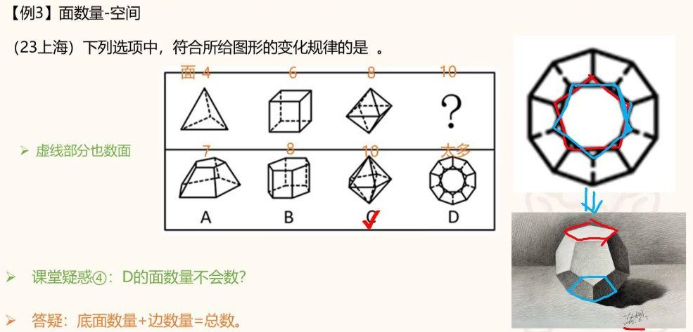

> 💡 解释：棱柱、棱台的每个侧面都"挂"在底面的一条边上，所以侧面数＝底面边数。多层结构就一层一层加。

---

## 1. 宏观框架：每幅图都不一样时怎么想

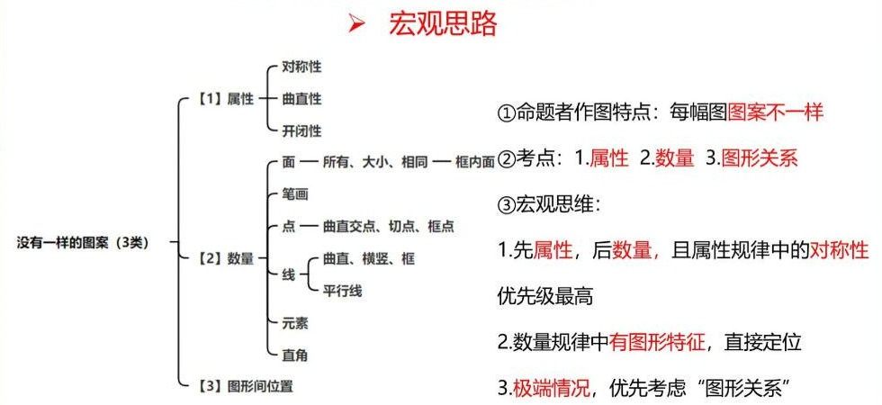

- **命题特点**：每幅图的图案都不一样 → 考点分三类：**属性、数量、图形关系**。
- **宏观思维**：
  1. 先属性、后数量，属性里**对称性优先级最高**；
  2. 数量规律里如果有明显的图形特征，直接定位；
  3. 极端情况优先考虑图形关系。
- **单独的思路**：每幅图都有**曲线**时，走曲线思路（曲直性和曲线类考点）；出现**生活化图形**时，先看**开闭性**（一眼就能看出来），不行再考虑笔画。
- 老师强调：**越细化的考点越好定位**。大小面、三角形、相同面的特征很明显，可以直接定位。真正容易混的是基础考点（面、笔画、点），它们才需要走"对称 → 数量"这条链。
- 做题提醒：题目上方"【例X】最大面-形状-自身"之类的考点名是给你复盘用的，考试时没有。练题时别先看它，不然等于背答案。

面的基础考法（上一章）回顾：常规图形数面、汉字/字母/数字数面、空间图形数面。

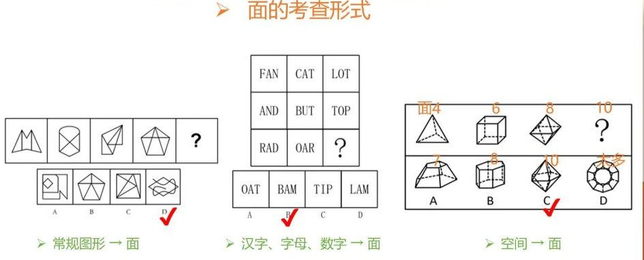

---

## 2. 面的细化①：所有面

### 识别信号（看到什么，想到它）
- 分割出来的**每一块形状都刻意一样**（全是三角形或全是四边形……）；
- **每幅图都有三角形**；
- 每幅图恰好**只有两种面**（三角形＋四边形），这也是刻意的；
- **每幅图面数都相等**（比如都是6），而且单独数面选项也都一样，说明要考面的细化。三个细化里，大小面和相同面的特征很显眼，忘不了；**最容易忘的是所有面**，这时要回头检验三角形。

### 规律讲解
"所有面"指分割后的**每一个面**。前两种考法把每个面都用上，是**整体思想**；第三种只用其中一部分面，是**拆分思想**。

| 考法 | 思想 | 图形特征 | 做法 |
|---|---|---|---|
| 每个面形状一样 | 整体 | 每一块都是同一种几边形 | 看是几边形 |
| 只有2种面，三角形与四边形做运算 | 整体 | 每幅图刻意只凑出两种面 | 分别数三角形、四边形，再做运算 |
| 部分面：只数三角形 | 拆分 | 每幅图都有三角形，但还有别的面 | 只数三角形的个数 |

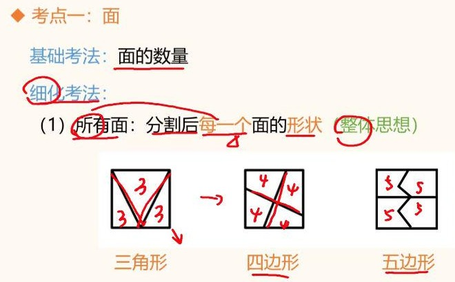

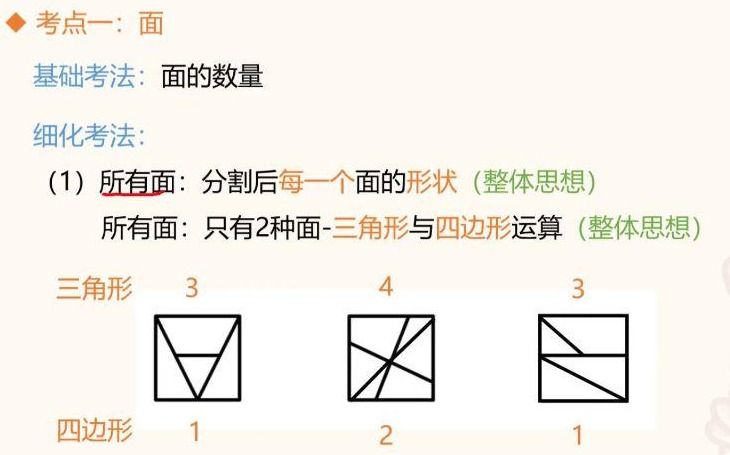

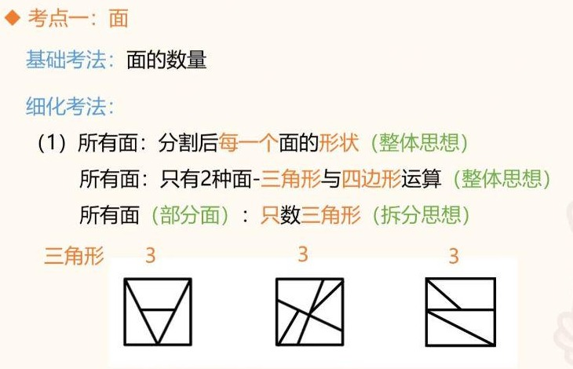

**为什么总是三角形和四边形？**
- 分割成五边形、六边形会显得非常刻意，一眼就能看出来。出题人自己也不好画，出出来反而更简单。
- 三角形、四边形太常见，特征反而被淡化，更难定位。所以要**提高对三角形的敏感度**：每幅图都有三角形，就往"所有面"上想。
- 三角形的使用顺序：**先单独数三角形 → 不行再数四边形 → 还不行就算两者的运算**。

**运算怎么判断**（三角形与四边形的数量关系）：

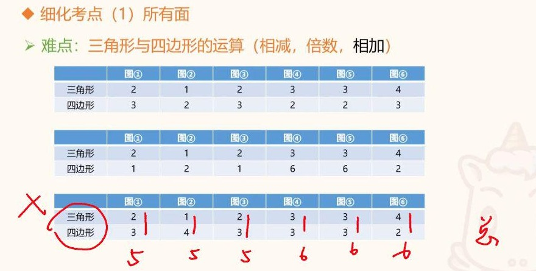

| 运算 | 数字给人的感觉 | 频率 |
|---|---|---|
| 相减 | 两个数很接近（比如都差1），把多出来的圈出来，思路就清楚了 | **90%以上** |
| 倍数 | 两个数跨度大，一对比就明显（1和2、2和4，总会出现3和6） | 较少 |
| 相加 | 考场上最想不到，因为脑子里只有"相减或倍数" | 难点 |

- 老师提醒：三角形数量＋四边形数量＝总面数，等于直接数面，出题人不会这样出（那就成送分题了）。"相加"的难点要到后面的**黑白块**（黑块数＋白块数）才会出现。能不能考相加，要看具体知识点。

### 易错点 / 老师提醒
- **从0开始的递增是难点**：一组图多数从1、2、3开始，一旦从0开始，第一幅图没有特征，而大家习惯先看第一幅图，就定位不了。这时从后面几幅图反推。
- "最大面"的"最"只能有一个。如果两块面差不多大，或者图很模糊，就说明不考大小面。
- "所有面"和"相同面"要分清：相同面要求**大小和形状都一样**。学得越多越容易混，要主动区分。

### 例题

**例4**（26浙江）问号处应选哪一项？每幅图被分割成几块。

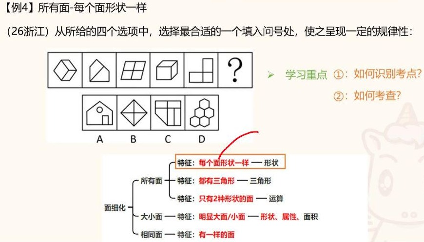

**思路**：
1. 前两幅图没有一样的图案 → 属性、数量、图形关系。题里没有曲线，也不是生活化图形，所以走"对称轴 → 数量"。第二幅图不对称，转向数量。
2. 最明显的提示是第三幅图（田字形被分成4个一样的四边形），看上去很刻意，说明分割后每个面的形状一样。
3. 排除相同面：左侧的图里两块梯形形状不同（一块有直角、一块没有），所以不是相同面，只能是"每个面形状一样"。
4. 验证：题干每幅图分割出的面都是**四边形**（面数不必相等）。A 有圆，B 是三角形，C 全是四边形 ✓，D 每块形状一样但都是六边形，和题干的四边形不符。
5. 有同学问能不能按"有相同面、没有相同面"间隔分组：这种说法有争议，也不严谨，考试不会这样出。

**答案**：C

---

**例5**（20联考事业）把六个图形分成两类。

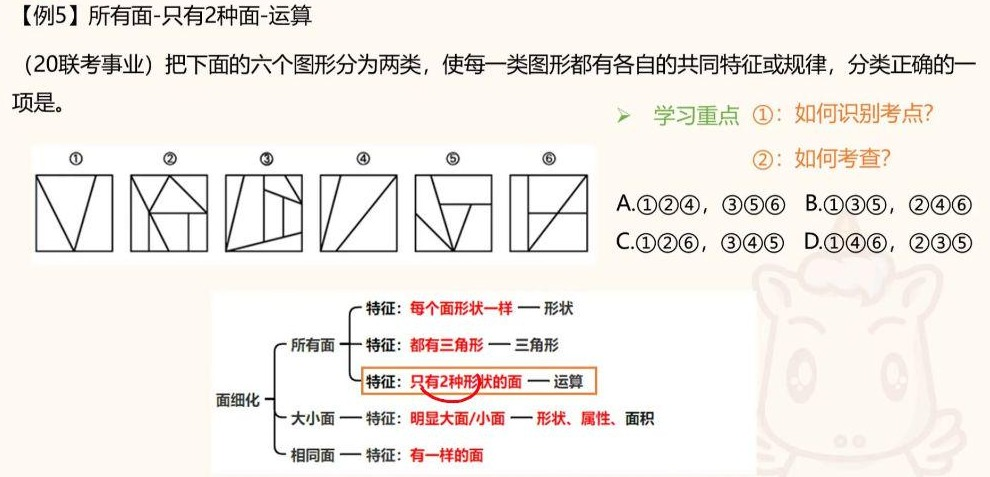

**思路**：
1. 不对称，转向数量。出题人给的提示是面比较少的图（生怕你看不见），而且各图差距太大，不像是数面。
2. 两个特征：**每幅图都有三角形**，而且每幅图**都只有三角形和四边形两种面**。两种面 → 分别数、做运算。
3. 数出来：①三角形2、四边形1；②4、3；③3、4；④2、1；⑤2、3；⑥2、3。
4. ①②④ 三角形比四边形**多1个**，③⑤⑥ **少1个**。
5. 有人想看最大面：①的最大面还算清楚，后面几幅图有两块差不多大的面，⑤也很模糊。"最"只能有一个，所以不考大小面。
6. 老师补充：国考做过更标准的版本（三角形、四边形分别是4/3、3/4……，每幅图总数都是7），直接数三角形是4还是3就能分类。

**答案**：A（①②④，③⑤⑥）

---

**例6**（24广西）问号处应选哪一项？

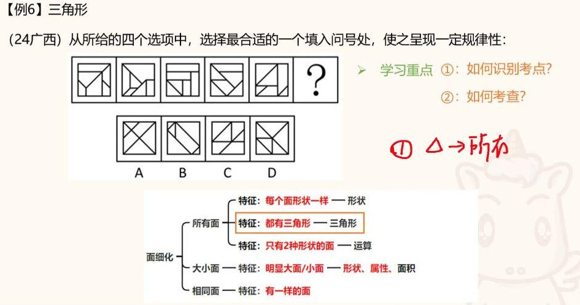

**思路**：
1. 外框都是正方形，分割后面的形状各不相同 → 对称轴不行 → 数量。
2. 越往后的图三角形越明显。难点在于**第一幅图没有三角形**，这是出题人故意挖的坑：规律**从0开始递增**。
3. 三角形个数：0、1、2、3、4 → 问号处应为5。A 有4个（两块是四边形，删掉），B 有5个 ✓，C 有3个，D 有6个。
4. 两种定位方法：
   - 直接法：后面几幅图都有三角形，反推所有图都在考三角形 → 所有面。
   - 保底法：先数面，题干每幅都是**6个面**，选项也都是6个面，数面数没法区分 → 面数相等却没答案，就要考虑面的细化。大小面、相同面的特征不明显，于是检验所有面。
5. 老师提醒：很多人一上来就数面，这题数面无效。记住"每幅图都有三角形 → 所有面"就能一步到位。

**答案**：B

---

## 3. 面的细化②：大小面

### 识别信号
- 每幅图有**明显的大面**或**明显的小面**，出题人会画得一眼就看出来，不需要你去比较。
- 如果还要纠结哪一块最大、哪一块最小，基本就不考大小面。
- **小面比大面难**：大面通常画得很醒目，小面有时感觉没那么强烈，要特别留意刻意画出的小面。
- 大小面可以**直接定位**，不必再走"对称 → 数量"；否则进了数量规律，要挨个试的考点太多，一道题5分钟都做不完。

### 规律讲解
难点在于**大小面和形状、属性、面积的结合**：

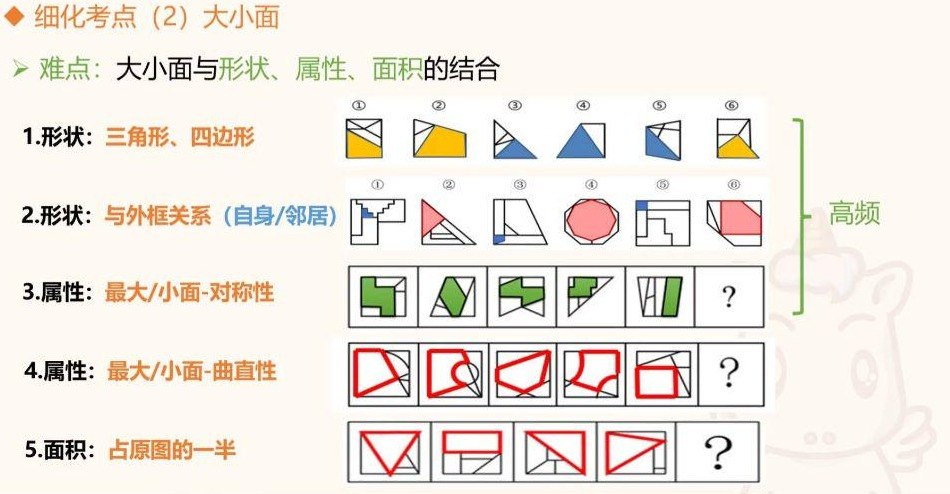

| 角度 | 具体考法 | 说明 |
|---|---|---|
| 形状·自身 | 最大面或最小面是几边形 | **最高频，优先考虑** |
| 形状·与外框 | 最大面或最小面与整个图形的外框形状相同（相似） | 比看自身难一点 |
| 形状·邻居（传递） | 本图最大面或最小面的形状 ＝ **下一幅图的外框** | 难度最大 |
| 属性·对称性 | 最大面或最小面是否对称 | 高频 |
| 属性·曲直性 | 最大面或最小面是纯直线围成，还是曲线＋直线围成 | 少数省份考（如深圳） |
| 面积 | 最大面占原图的一半 | 低频（十几年前的考点），可以选择性掌握 |

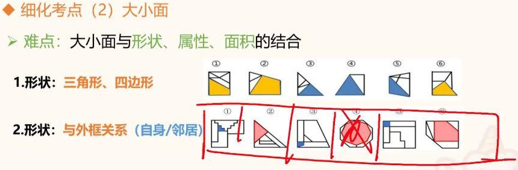

- **属性为什么只有对称性和曲直性？** 属性本来有对称、曲直、开闭三种，但"面"一定是封闭区域，不可能考开闭性。
- **对称性**：出题时大面一定画得很规则（平行四边形之类）。这需要你**同时**对大面和对称轴敏感，缺一个都做不出来。别机械地去数大面的边数（数出8、6……没有规律）。
- **曲直性**：题干如果是"纯直线"和"曲线＋直线"交替，得分率很低；如果都是"曲线＋直线"，就有"每幅图都有曲线"的特征，好做很多。多数省份（包括国考十几年）只考对称性，不用太焦虑。
- **必须掌握**：形状和对称性。
- 老师更正：课件里例8、例9的标题写成了"最大面"，其实考的是最小面。应该理解为"**大小面**的形状与外框、传递"，大面小面都可能考。

**新趋势：大、中、小面**（26年联考新出）

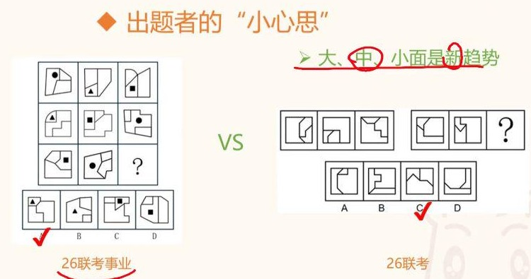

- 以前只考大面或小面，现在出现了"**中面**"（第二大的面）。
- 要考"中"，就必须同时有"大"和"小"做对比，所以只能出成**两组图**（每组依次是大、中、小）或者**九宫格**（每行依次是大、中、小）。
- 26联考事业的九宫格题：圆点标的是最大面，三角形标的是最小面，方块标的是中面（答案A，之前讲过）。
- 老师分析：国考的题型位置比较固定，第四题九宫格一般留给黑白运算、加减同异。所以国考如果借鉴这个考点，大概率放在第三题、两组图的位置。

### 易错点 / 老师提醒
- 大小面靠"**明显**"直接定位。定位后先看**形状**，再看属性，最后看面积。
- 最小面比最大面更容易被忽略。
- "与外框"是和整个图形的外轮廓比，比的是形状一样（相似），不是大小一样。

### 例题

**例7**（22河南事业）最大面·形状·自身

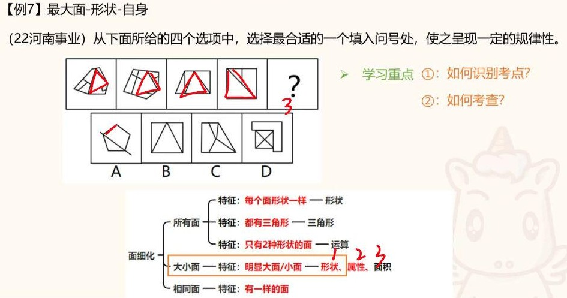

**思路**：
1. 每幅图都有明显的大面，而且大面都是**三角形**，特征直接跳到眼前，不用再走"对称 → 数量"。
2. 定位到最大面，先看形状：题干的最大面都是三角形。
3. 选项：A 的最大面是四边形，B 是三角形 ✓，C 是五边形，D 不行。

**答案**：B

---

**例8**（23联考）最小面·形状·与外框（课件标题写成了"最大面"，老师已更正）

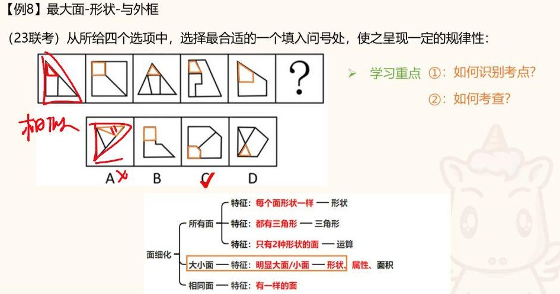

**思路**：
1. 出题人刻意画出了明显的小面（第四幅、第五幅尤其明显），所以要想到小面。
2. 小面自身的形状没有规律，于是和外框比：第一幅的小面是直角三角形，外框也是直角三角形；第三幅的小面是三角形，外框也是三角形。规律是**每幅图的最小面与外框形状相同（相似）**。
3. A：右边那块稍小一点（如果你觉得左右一样大，就说明没有小面，直接排除），但它和外框不相似，排除。B、D 小面与外框形状不同。C ✓。

**答案**：C

---

**例9**（24联考事业）小面·形状·与外框·传递

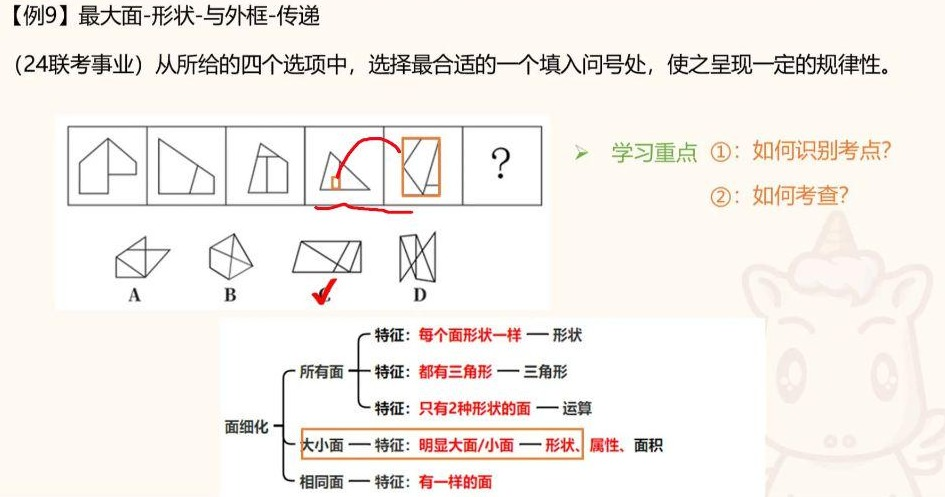

**思路**：
1. 最大的提示是第四幅图里**刻意画出的极小矩形**，第五幅、第三幅的小面也很明显，必须想到小面。
2. 小面自身的形状（三角形、四边形……）没有规律，和本图外框也不一样，只能去找"别人"的外框。第五幅图的外框很大、很规整 → 想到**传递**。
3. 验证：每幅图的最小面，形状就是下一幅图的外框。图1的小面 → 图2的外框；图3的小三角形 → 图4的三角形外框；图4的小矩形 → 图5的矩形外框。
4. 图5的最小面（右下角带一条斜边的小四边形）传下去，就是 C 的外框。

**答案**：C

---

**例10**（26联考）大、中、小面·对称性

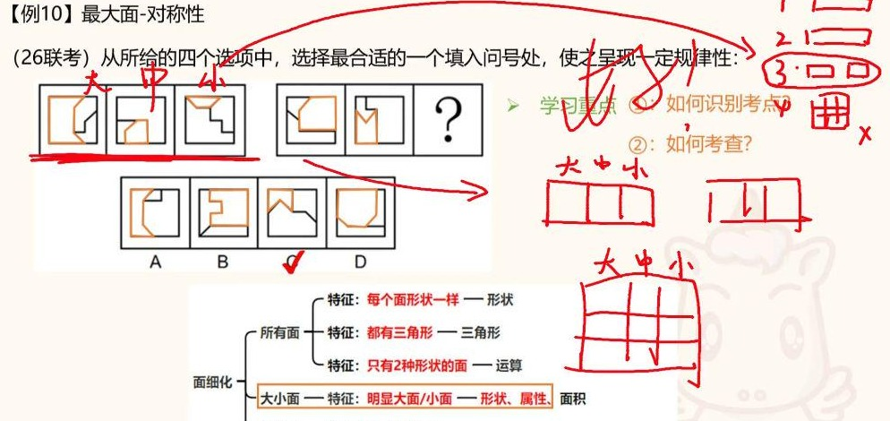

**思路**：
1. 第一反应是"面挺大"，同时第一幅图的大面很规则、有对称轴，于是想到"最大面对称性"。
2. 但第二、三幅图的**最大面并不对称**，对称的是另一块面：第二幅是**中间大小的面**，第三幅是**最小的面**。
3. 两组图都是这个规律：第1幅的**大面**对称，第2幅的**中面**对称，第3幅的**小面**对称。第二组的问号处要选"最小面对称"的图。
4. 选项中 A、B 对称的是中面或大面，C 对称的是最小面 ✓（选项的面大小有些模糊，但 C 对称的一定不是大面）。
5. 这道题的意义在于"中"这个**新概念**。它必须和大、小搭配出现，所以只能出成两组图或九宫格。

**答案**：C

---

**例11**（25深圳事业）最大面·曲直性

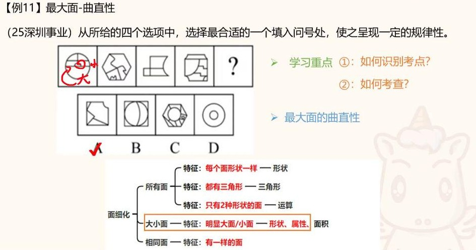

**思路**：
1. 两个特征要同时抓住：每幅图都**有曲线**，每幅图都有**明显的大面**。把两者结合，就是考大面的曲直性。
2. 出题人还画了明显的小面，这是挖的坑。先试小面，小面的曲直性对不上，属于正常的试错过程。
3. 看大面：每幅图的**最大面都由曲线和直线共同围成**。
4. 选项：A 的最大面由曲线＋直线围成 ✓；B、C、D 的最大面都由纯曲线围成（圆、圆环），排除。

**答案**：A

---

## 4. 面的细化③：相同面 ＋ 面细化口诀

### 识别信号
- 图中有**明显的、一模一样的面**。

### 规律讲解
- **相同面**必须同时满足两个条件：**大小一样、形状一样**。
- 考法：**个数**（有几个相同的面）或**组数**（有几组相同的面）。
- 图例：5个一样的小圆，是5个相同面（个数）；六边形分成上下两半，每半各有一块梯形环和一块梯形，每种各2个，共**两组**相同面（组数）。
- 补充：右边的套叠三角形、同心圆形状一样但大小不同，按定义**不算**相同面。

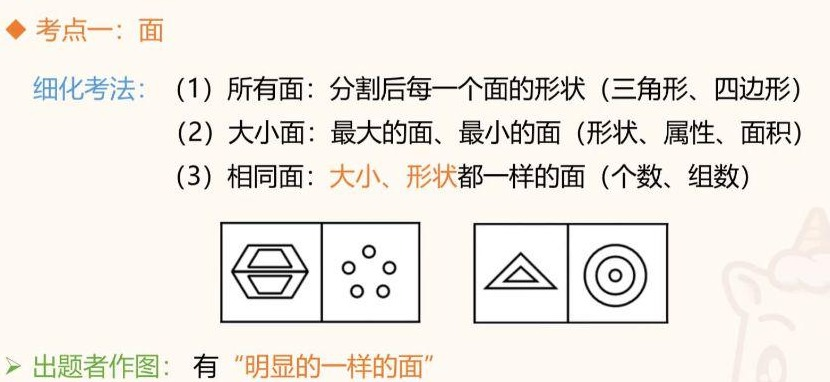

### 易错点
- 只有形状一样、大小不一样（比如同心圆）不是相同面。笔画例1里就是这样排除相同面的。
- 注意是一组图还是两组图。出题人会把两组图挨得很近，看错组就会掉坑。

### 例题

**例12**（25联考事业）相同面（两组图）

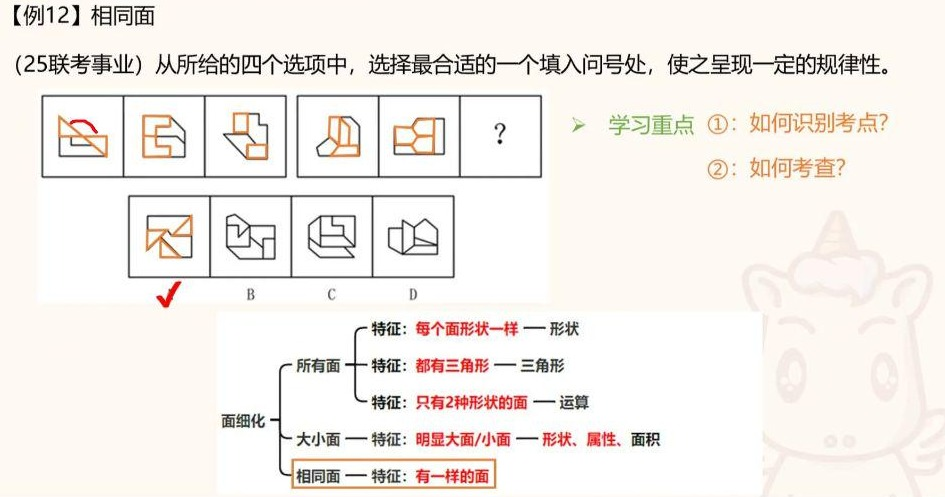

**思路**（两种定位方法）：
1. **保底法**：前两幅图不同，也不对称 → 数量 → 数面：左组每幅4个面，右组每幅5个面。但选项全是5个面，数面没法区分。面数有规律、选项却都一样，说明**出题人一定想考面，只是要考面的细化** → 在所有面、大小面、相同面里试。
2. **直接法（更推荐）**：第二幅图上下两块长得一模一样，第五幅图也有一模一样的面，这就是相同面的提示。第五幅也可能让人想到所有面，但那是五边形和四边形，运算一般只用三角形和四边形，五边形太难，排除。
3. 数相同面：左组，图1两个三角形、图2两个L形、图3两个长方形，都是**2个**相同面；右组，图4三个梯形、图5三个五边形，都是**3个**。
4. A 有3个一样的三角形 ✓。

**答案**：A

---

### 面细化小结与口诀

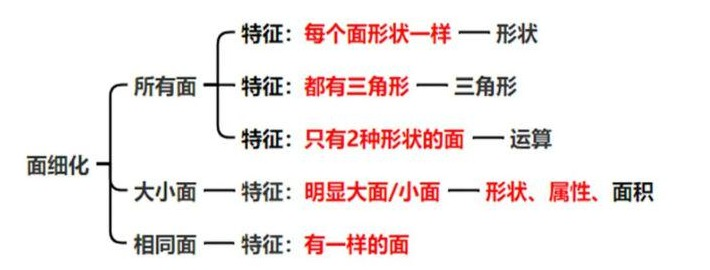

- **所有面**：重点考三角形和四边形。特征是"每个面形状一样 → 形状""都有三角形 → 数三角形""只有2种面 → 运算"。
- **大小面**：特征是"明显大面或小面"，与形状、属性、面积结合。
- **相同面**：特征是"有一样的面"。

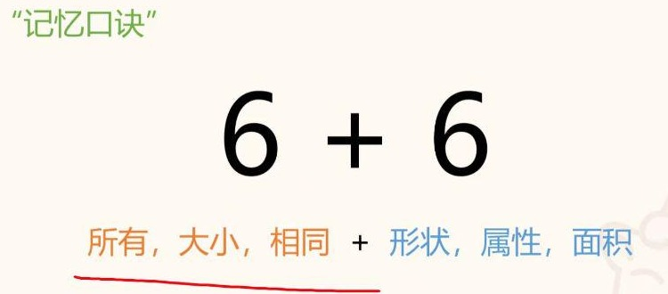

> **口诀"6＋6"：所有、大小、相同 ＋ 形状、属性、面积**
> 前6个字是面的三个细化方向，后6个字是能结合的三个角度（不局限于大小面，只是和大小面结合得最多）。

---

## 5. 笔画数

### 5.1 什么是笔画
- **笔画**：在**线段不能重复**的前提下，一笔画成。
- **点可以重复经过，线段不能重复走**。画的时候经过一个交叉点两次没关系，但同一段线不能走两遍。
- 复杂的图不可能真的动手去画，要靠技巧来数（见5.4、5.5）。

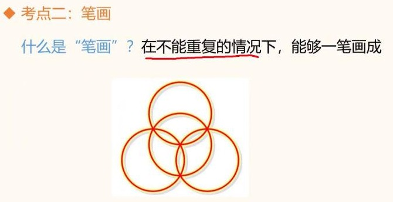

### 5.2 出题人怎么画笔画题
听懂出题人的画图思路，后面"去外框"就好理解了。
1. **最基础的一笔图**：一条线（1笔）、十字（2笔）、圆（1笔）、五角星（1笔，大家从小就会连笔画）、闪电（1笔）。
2. 这些太简单，于是**加外框**：一条线变成"**日**"，十字变成"**田**"，圆变成"**圆相交**"，五角星外面加圆。这就是老版本笔画题爱考**日、田、圆相交、五角星**的原因。
3. 还不够难，就**加更多外框**。外框加得再多，**也不影响笔画数**，只会让图更复杂。
4. 最后把所有线**改成同一种颜色**，就是考场上看到的图。这时图有两个特征：像在考面（很多封闭区域），以及外框没包住线、**线不小心出了头**（多端点）。

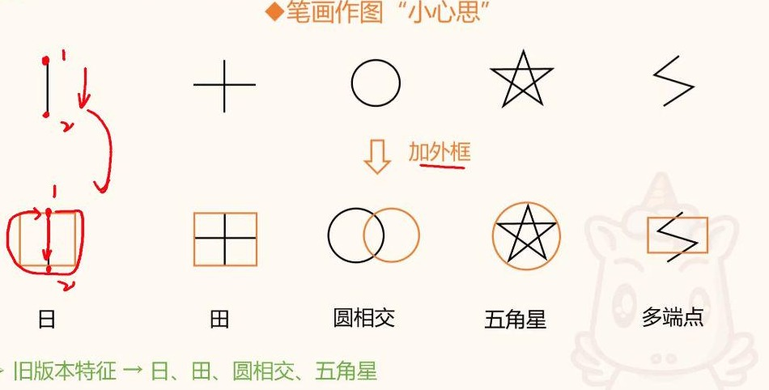

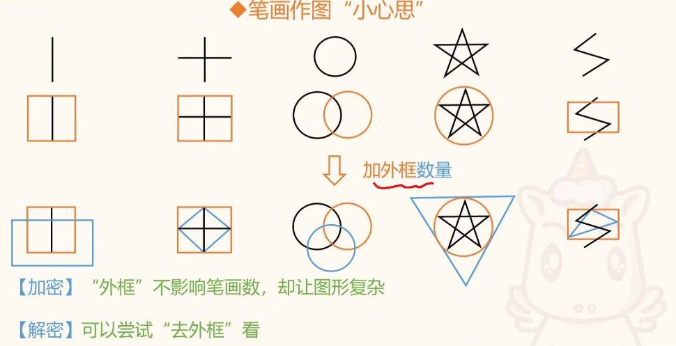

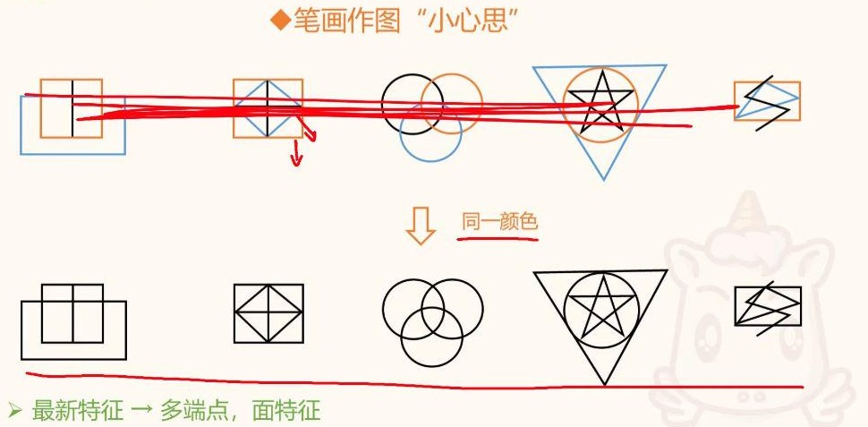

- **什么是外框**：从一个点出发、能回到原点的**闭环**就是外框。"外框"并不一定在最外面，只要是个闭环就行。

> 💡 解释（外框为什么不影响笔画数）：外框是一个闭环。加上它以后，和原图相接的每个点都多出**2条线**（沿框出去、再沿框回来），线条数的奇偶不变。所以奇点数不变，笔画数也不变（见5.4）。画的时候，走到接触点先绕框一圈回到这里，再接着走原来的路线就行，这正是老师"绕一大圈回到起点再往下走"的演示。如果框和原图的交点落在原来某条线的中间，这个点连出4条线，也还是偶点。

### 5.3 识别信号（为什么想到笔画）

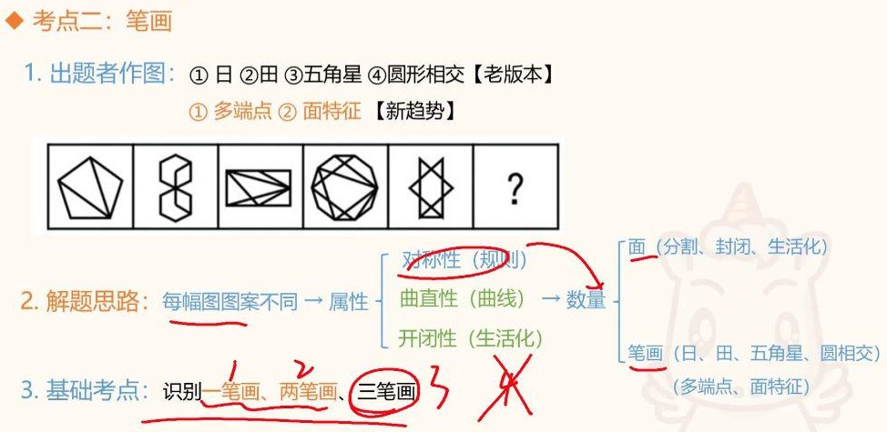

| 类型 | 特征 | 说明 |
|---|---|---|
| **旧特征**（约5年前的主流） | 日字形、田字形、五角星、圆相交 | 看到这些图形（或它们的变形）→ 笔画 |
| **新特征** | **面特征** | 老师自创的说法：第一反应像在考面（正方形被胡乱分割）。如果面数没规律，或者面数**差距太大、太多**，就直接跳到笔画 |
| | **多端点** | 有"出头"的端点（不止一个），这是在提醒你考笔画 |
| | **生活化** | 生活化图形先看开闭性（一眼能看出）。开闭性不行，再考虑笔画 |

- 当下的两个高频考点是**面和笔画**：面不行就考虑笔画。所以哪怕图画得像在考面，面没答案就马上数笔画。
- 宏观顺序：图案不一样 → 属性（对称） → 数量（在面、笔画里选）。
- **考查范围**：主要考**一笔画、两笔画**，近几年开始出**三笔画**，四笔及以上基本不考。所以某幅图如果明显要五笔，就可以直接排除笔画（见点的例1）。
- 老师强调笔画只有两个重点：**① 为什么考虑笔画（定位），② 怎么数笔画**。

### 5.4 数笔画方法一：数奇点

**奇点**：以一个点为中心，向外发出的线条数是**奇数**。

| 点的样子 | 发出的线条数 | 是否奇点 |
|---|---|---|
| 线的端点（出头的头） | 1 | **是**（端点也是奇点，别忘了数） |
| 拐角 | 2 | 否 |
| **T字**交叉（一条线的中间接出另一条线） | 3 | **是** |
| 十字交叉 | 4 | 否 |
| 五条线汇于一点 | 5 | 是 |

- 数的时候**以点为中心，把线断开来数**。一条线（包括曲线）穿过这个点，要算成2条。所以T字是3条，不是2条。
- 考试中的奇点基本是1、3、5条，更多的很少。**实战就是找T字和端点**。

**一笔画的判断**（两个条件都要满足）：
1. 线条之间是**连通**的；
2. 奇点数为**0或2**。

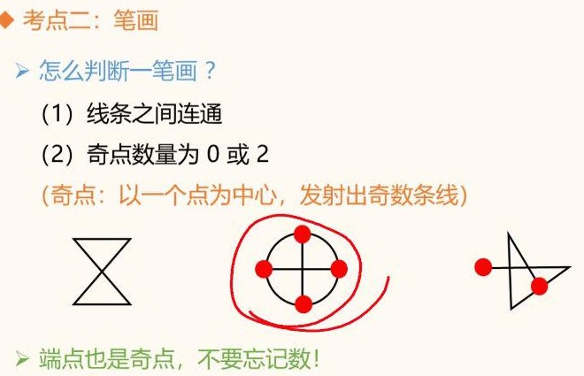

练习（上图）：
- 沙漏形：4个角各2条线，中间交叉点4条线，**0个奇点** → 一笔画。
- 圆内十字（十字的四头都连在圆上）：四个T字点各3条，中心4条 → **4个奇点** → 2笔。
- 三角形加一条穿出的线：出头的端点1个，T字点1个 → **2个奇点** → 一笔画。

**多笔画的判断**：
1. **笔画数＝奇点数÷2**。奇点数一定是偶数，数出奇数个说明数漏了。
2. **不连在一起的部分要分别算，再相加**。
3. 0个奇点也是**1笔**，不是0笔。

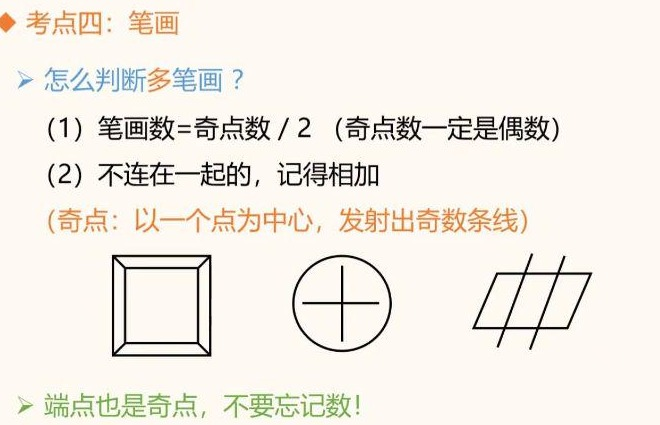

练习（上图）：
- 画框形（内外两个正方形、四角用斜线相连）：8个角都是3条线 → 8个奇点 → **4笔**。
- 圆内十字（**十字没碰到圆**）：十字4个端点 → 4÷2＝2笔，外面的圆是独立的一笔 → 共**3笔**。
- 平行四边形上穿过两条斜线：4个出头端点是奇点，斜线与边的交点都是4条线（偶点）→ 4÷2＝**2笔**。
- 外框算不算独立的一笔，只看它**和别的线连不连**，和它是不是"外框"无关。

> 💡 解释（奇点和笔画数的数学道理，即欧拉一笔画定理）：
> - **为什么一笔画的奇点只能是0或2？** 一笔画的途中，每经过一个点都是"进来一次、出去一次"，用掉2条线，所以途经的点发出的线条数一定是偶数。只有**起点和终点**可能多出一条而成为奇点。起点和终点不同 → 恰好2个奇点；画回起点 → 0个奇点。
> - **为什么笔画数＝奇点数÷2？** 每一笔只有一个起点和一个终点，最多"用掉"2个奇点。有 k 个奇点就至少要 k/2 笔，而连通图一定能用 k/2 笔画完（每一笔从一个奇点画到另一个奇点）。
> - **为什么奇点数一定是偶数？** 每条线段有两头，所有点发出的线条数加起来等于2×线段数，是偶数。奇数的个数必须是偶数个，和才会是偶数。
> - **为什么0个奇点是1笔？** 有图就至少要画1笔。0个奇点只说明这一笔能画回起点。

### 5.5 数笔画方法二：去外框
既然外框不影响笔画数，就把碍眼的外框去掉，让图变清楚。

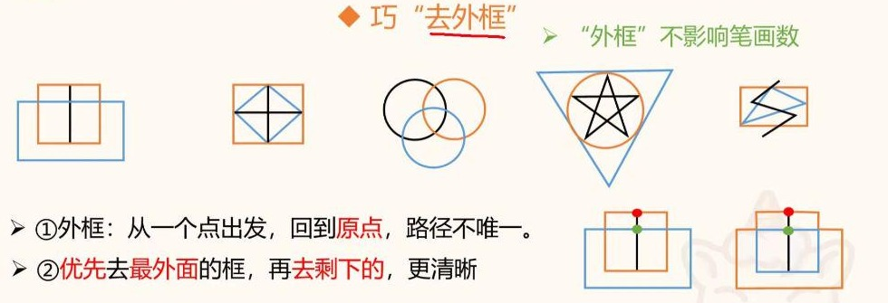

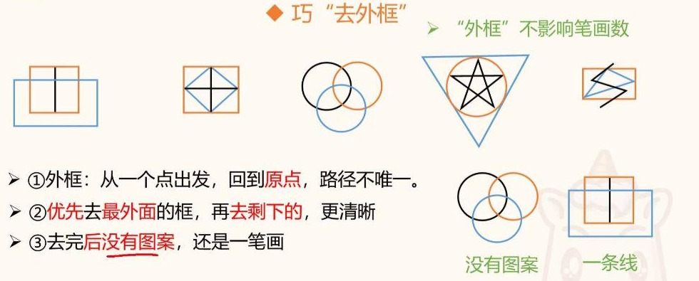

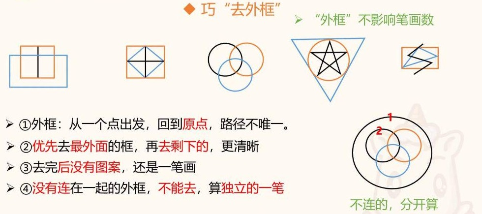

**去外框四条规则**：
1. **外框**：从一个点出发、回到原点的闭环，**路径不唯一**。三角形、正方形、五边形……任何一个能回到原点的圈都可以去掉。
2. **优先去最外面的框**，再去剩下的，思路更清楚。比如先去最外面的橙框，再从绿点出发把蓝框去掉，最后剩中间一条线。
3. **去完后没有图案**，还是**一笔画**（比如三个圆相交全去完）。
4. **没有连在一起的外框不能去**，要算**独立的一笔**。比如大圆和里面的圆不相连，就是2笔。

- 不用把外框去完。去外框只是为了看清楚，比如田字形去掉一个框后，剩"正方形＋一条线"（日字形），已经能看出是一笔，就不用再去了。
- 能去几次都无所谓，只要最后能数清笔画就行。

> 💡 补充（去外框的一个隐藏前提）：如果去框后，剩下的部分被拆成几块，其中某块是**没有端点、没有T字的闭合小圈**，而它原本只靠刚去掉的框和别的部分相连，那它原本可以在画框的途中顺带画掉，**不能再单独加一笔**。例如大圆里有两个和它相切的小圆：整体0个奇点，是1笔；去掉大圆后看起来却像2笔。遇到这种图，用数奇点复核。

### 5.6 两种方法怎么选
- 两个方法选一个就行，但**都要会**。有的题去外框快（面特征题，正方形里画几条线），有的题数奇点快（多端点题，直接找T字和端点）。
- 觉得数奇点慢，是因为还不熟。熟练后扫一眼就能找到T字和端点。

### 5.7 易错点 / 老师提醒
- **端点也是奇点**，千万别漏。
- T字交叉是奇点（3条），十字交叉不是（4条）。曲线穿过一个点要拆成两条来数。
- 奇点数一定是偶数；0个奇点也是1笔。
- 不连在一起的部分要分别算，再相加。
- 五角星是一笔画，要记住。
- 看到五角星不要马上判定是笔画，五角星也可能考对称。必须先用宏观思路排除对称，再定位笔画。
- 去外框时要确认去掉的真是一个闭环，别把不闭合的线当成框去掉（见例3的⑥）。

### 5.8 例题

**例1**（25浙江事业）五角星、日、田，把六个图形分成两类。

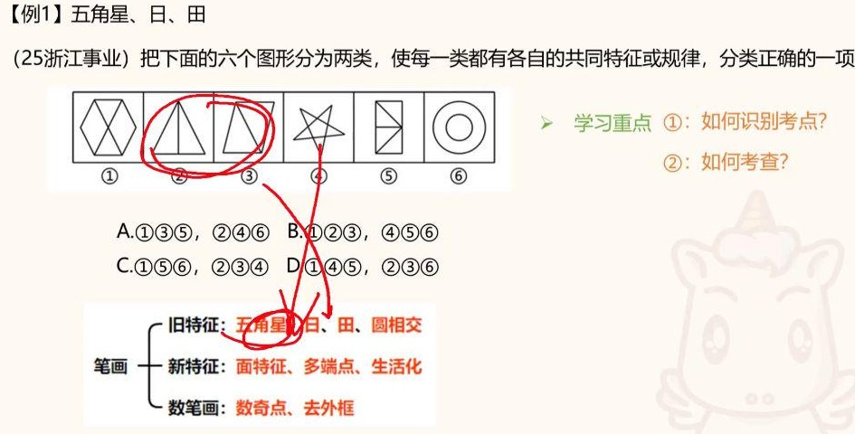

**思路**：
1. **先宏观**：这题能不能考对称？①既是轴对称又是中心对称，③（平行四边形）只是中心对称，没法分成两类，排除对称性 → 数量。
2. 可能会试相同面：⑥的同心圆形状一样但**大小不同**，不满足相同面的两个条件，排除。
3. ④是五角星，②③像日字形的变形，⑤像田字形的变形，都是老版本的笔画特征 → 定位笔画。
4. **去外框**：①去掉六边形外框，中间是一个大交叉，2笔；②去掉三角形外框，剩一条线，1笔；③去掉平行四边形外框，1笔；④五角星类，1笔；⑤去掉长方形外框，剩一个"＞"（1笔）和一条线（1笔），共2笔；⑥两个圆**没连在一起，不能去**，2笔。
5. **数奇点**：①4个 → 2笔；②③各2个 → 1笔；④2个 → 1笔；⑤4个 → 2笔；⑥0个，但分成两部分 → 2笔。
6. ①⑤⑥ 两笔，②③④ 一笔。

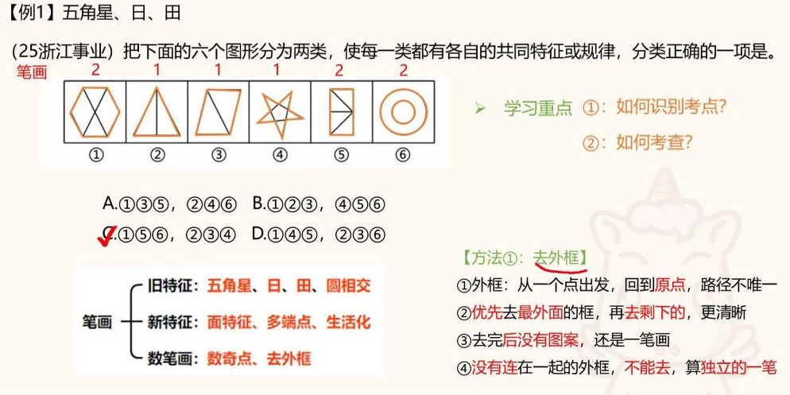

**答案**：C（①⑤⑥，②③④）

---

**例2**（26陕西事业）面特征、去外框

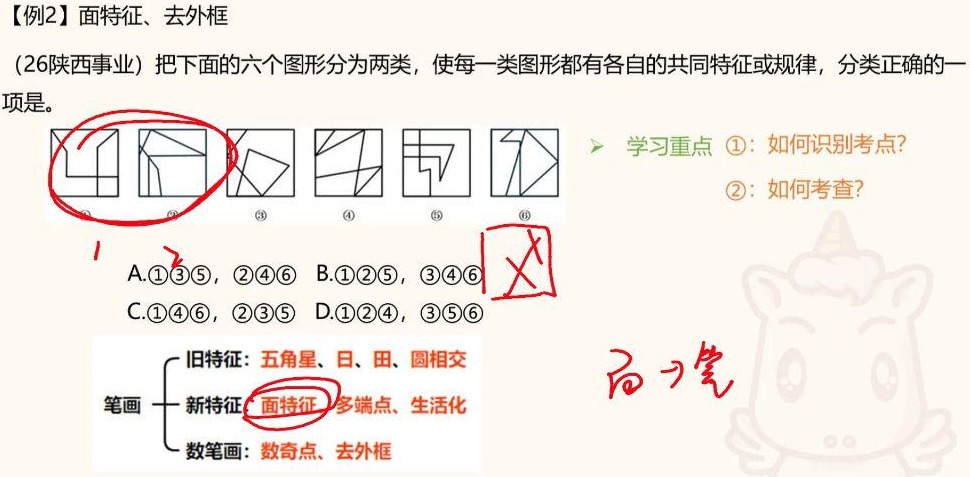

**思路**：
1. 前两幅图是一个正方形被分割，面的数量和形状都不同，属于"没有一样的图案" → 不对称 → 数量。
2. 第一反应像在考面（面特征）。但①只有4个面、很清楚，②的面多得多，各图差距太大，不好分类，所以不数面，下一步考虑笔画。
3. 为什么不是大小面？③的最大面是一个很不规则的多边形，出题人真要考大小面，会画成规整的三角形、四边形。这么不规则，说明它不想考大小面。

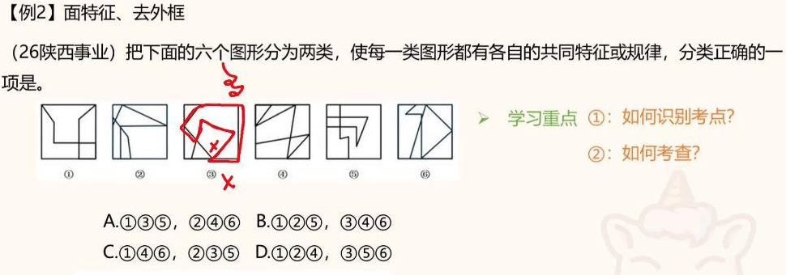

4. **去外框**：把正方形外框去掉就清楚了（不用全去）。①剩两条线，2笔；②2笔（觉得不好看，可以在外框上找一点，再去一个闭环）；③本身就连成一笔（也可以再去一个框，剩下闪电形）；④1笔；⑤剩两条线，2笔；⑥1笔。
5. **数奇点**：①4个 → 2笔；②4个 → 2笔；③2个 → 1笔；④2个 → 1笔；⑤4个 → 2笔；⑥2个（都是三条线交汇的T字点）→ 1笔。

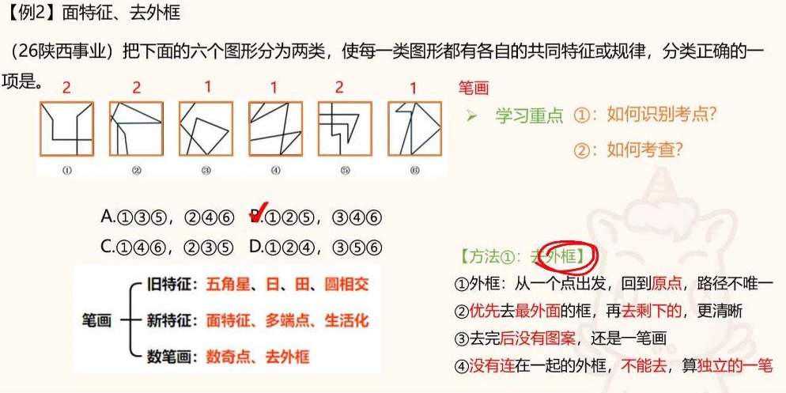

**答案**：B（①②⑤，③④⑥）

---

**例3**（25国考）多端点

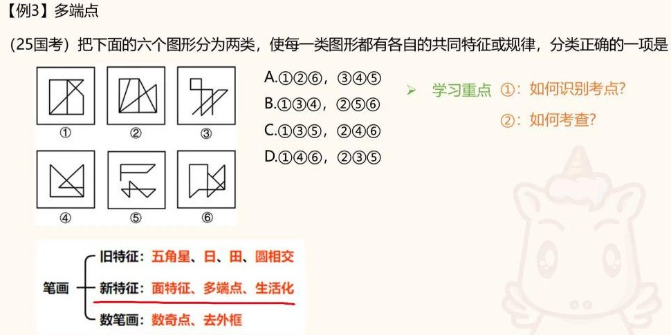

**思路**：
1. 不对称 → 数量。③⑤有明显的**出头端点**（多端点），这是提醒你考笔画。
2. 这题**数奇点更快**（找T字和端点就行），去外框在⑥容易出错。
3. **数奇点**：①2个 → 1笔；②4个T字 → 2笔；③两个出头端点，其余都不是 → 1笔；④2个T字 → 1笔；⑤上半部分1个T字＋1个端点 → 1笔，下半部分0个奇点 → 1笔，两部分不连，共**2笔**；⑥4个T字 → **2笔**。
4. **去外框**：①去掉外面的框，再去掉绿色的框，剩一条线，1笔；②去外框后中间两条线，2笔；③先去一个正方形，再去V字形，剩下连在一起的两条线，1笔；④先去外面的五边形，再去三角形，1笔；⑤上下分开，各算一笔，共2笔；⑥**易错**：外框不好找，很容易误去掉一段不闭合的线，得出1笔的错误结论，实际是2笔。

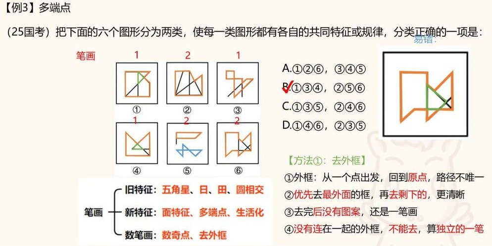

**答案**：B（①③④，②⑤⑥）

---

**例4**（26浙江）生活化、三笔画

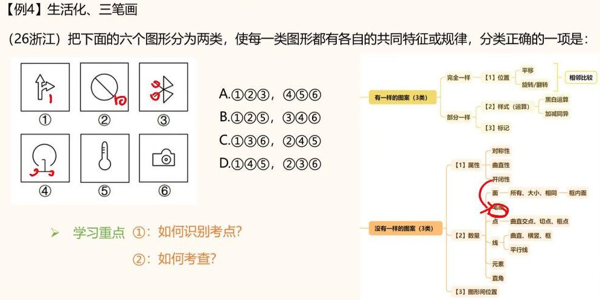

**思路**：
1. 路标、禁止标志、蓝牙、温度计、相机都是**生活化图形**，所以第一步看**开闭性**（一眼就能看出来）。全封闭的图凑不成3:3，开闭性不行，再考虑笔画。
2. 为什么不看曲直性？有曲线的图不是一半，比例不对，不是什么都要试一遍。
3. 为什么强烈感觉是笔画？①只有一个外框，②像日字形的变形（圆加一条线），③④有明显的多端点。这是在用生活化图形考笔画。
4. **数笔画**：①箭头是一个闭合轮廓，1笔；②圆和斜线连在一起，去掉圆外框，1笔；③蓝牙符号，去掉两个三角形框，1笔；④上面的圆弧是1笔，下面的"丄"形有4个奇点，是2笔，两部分分开，共**3笔**；⑤去掉温度计的外轮廓，剩三条刻度线，**3笔**；⑥相机的机身轮廓、镜头外圈、镜头内圈是独立的三部分，**3笔**。
5. 记住：外框和别的线**连在一起**就不算笔画，可以去掉；**分开**的就要单独算一笔。
6. ①②③ 一笔，④⑤⑥ 三笔。（课件上没有打勾，答案按讲稿的数法得出。）

**答案**：A（①②③，④⑤⑥）

---

### 5.9 笔画串讲

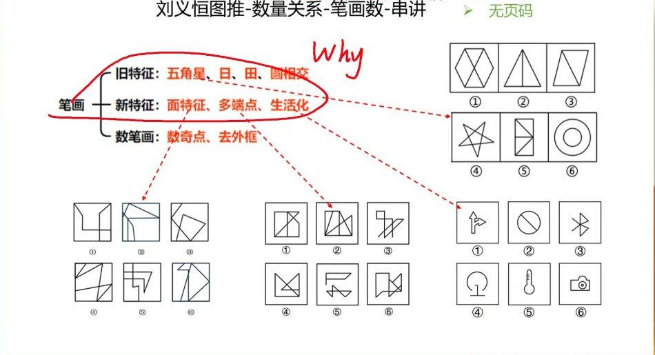

- 旧特征：五角星、日、田、圆相交（例1）。
- 新特征：面特征（例2）、多端点（例3）、生活化（例4）。
- 数笔画：数奇点、去外框。
- 讲义还把特征分成"强特征、弱特征"，老师会在第六天串讲（见第8节的思维导图）。

---

## 6. 点数量（基础考法）

### 6.1 什么是点
- **点＝线与线相交的位置，即交点**。
- 长方形的四个角也是点（两条边相交）。
- **端点不是点**。数笔画时要数端点，数点时不能把端点算进去。

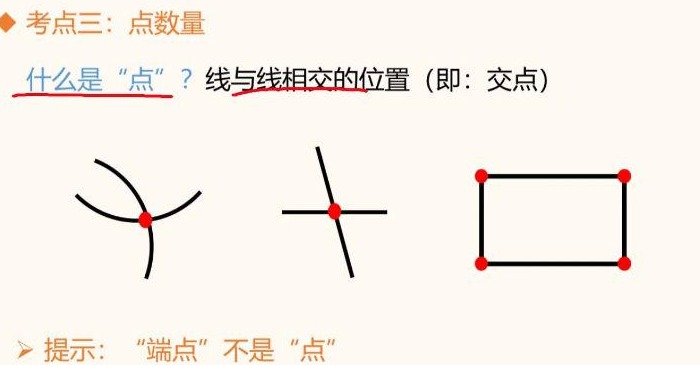

> 💡 解释：数笔画时，端点算奇点（发出1条线）；数交点时，端点**不算**，因为它不是两条线相交出来的。两个考点对端点的处理正好相反，最容易混。

### 6.2 出题人怎么"画点"
出题人**不会在数量上为难你**（点数一般从0、1、2开始，不会从5、6开始），而是**在特征上为难你**。想清楚少量交点怎么画，就能总结出点的特征。

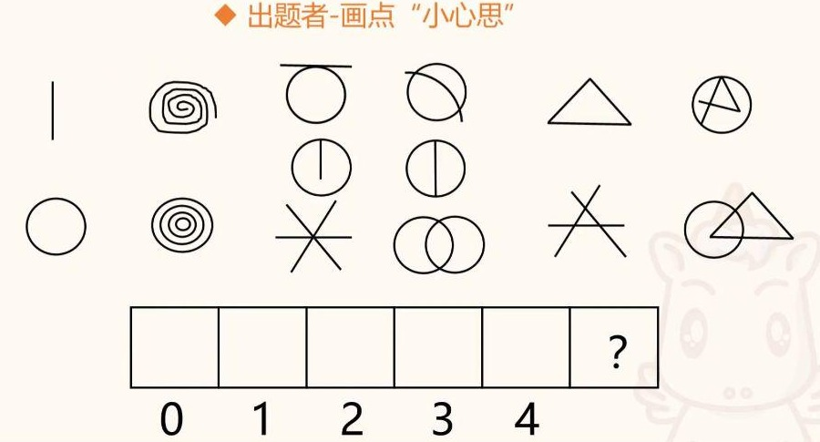

| 交点数 | 出题人的画法 | 图上的特征 |
|---|---|---|
| 0 | 不敢用折线或多条直线（一拐弯、第二条线一碰就出点），只能用一条直线、平行线、圆、同心圆、蚊香状螺旋 | 线条很"孤立" |
| 1 | 多条线汇于同一点（米字）；圆加切线（切点）；圆里一条线只碰到圆一次 | **刻意停住**：线再往下一点就会多一个交点，故意留空说明在凑点数 |
| 2 | 圆加弧线、圆加直径、两圆相交 | — |
| 3 | 三角形自带3个；把三角形的边往外伸出头，仍是3个 | 出头 |
| 4 | 为了凑4个，"想碰又不敢碰"，线**半路停下** | 出现**出头的端点** |
| 5个及以上 | 数量越多越好画 | — |

概括成两个特征：**① 面的特征，② 多端点**。它们和笔画的特征一模一样，所以点和笔画很难区分。

### 6.3 识别信号与排序（面 → 笔画 → 点）

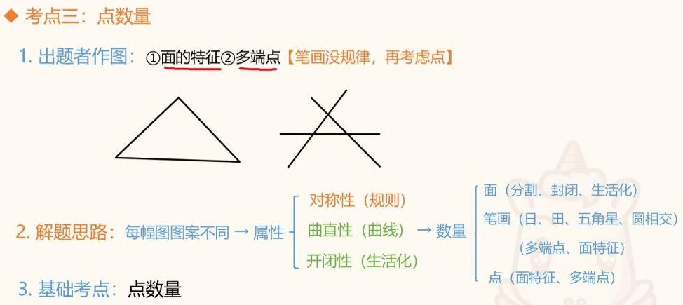

- 点的特征：**面特征、多端点**。遇到这类图，**先试笔画，笔画没规律再考虑点**。
- 理由是**考频**：笔画几乎每个省份每年都会考（约90%的概率出一道），点数量五年里只出一两题。
- **面特征**可能考面、笔画、点，按面 → 笔画 → 点的顺序试；**多端点**可能考笔画、点，先笔画后点。
- 区分不了就不区分，按考频顺序试。高频的先试，减少试错次数。

**出题人故意让面、笔画、点混淆**（下图三行，每行是一道题，三行的第一幅图相同）：

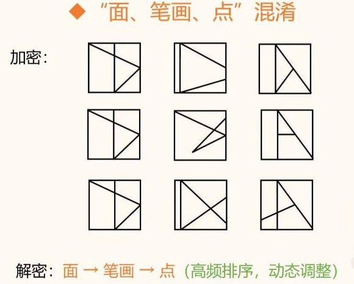

- 第1行：面数5、4、4，不行；去掉正方形外框后每幅都是**一笔** → 考**笔画**。
- 第2行：面数5、4、4，不行；笔画1、1、2，不行 → 考**点**。四个角大家都有，**不用数**，只数其余的交点：每幅图各4个（加上四个角都是8个）。
- 第3行：面数5、5、5 → 考**面**。
- 结论：三道题外观几乎一样（都是正方形被分割），能出的方向就是面、笔画、点三个。**考试时按面 → 笔画 → 点的顺序试**。其他细化考点（大小面、三角形）可以直接定位，唯独这三个基础考点出题人能故意画得一样。

**数点小技巧**：每幅图都有的点（比如正方形外框的四个角）可以不数，只比较其余的点，更快。

### 6.4 例题

**例1**（25河南事业）点数量，把六个图形分成两类。

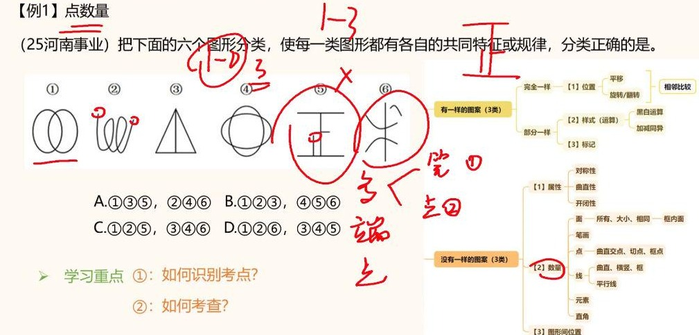

**思路**：
1. 前两幅图没有关联 → 先看对称：①③④能画对称轴，其余不能，但选项里没有"①③④"。老师提醒：这种分法能出但不严谨，只有实在没有更好的规律时才选它。
2. 有人会把汉字看成生活化去试开闭性，①③④全封闭，同样不严谨，也不在选项里。
3. 数量：⑤⑥有**出头的端点**（多端点）→ 可能是笔画，也可能是点，按考频先想笔画。
4. 但不用老老实实去数笔画：⑤"正"字要五笔左右，太多了（笔画一般考1～3笔，以前主流是1～2笔，3笔是近两年才出的）→ 直接排除笔画，定位到点。
5. 数交点：①2、②2、③4、④4、⑤4、⑥2。

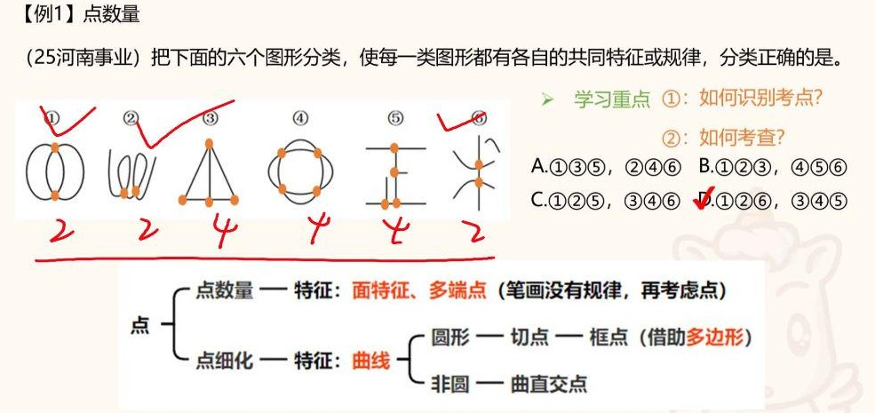

6. 老师提醒：数点本身几秒钟就能完成，难点在于**为什么要数点**，定位才是重点。

**答案**：D（①②⑥，③④⑤）

---

## 7. 点的细化：切点、框点、曲直交点

### 识别信号
- **每幅图都有曲线**。曲线是强特征，要把它单独拎出来，走曲线思路，不用再走"对称 → 数量"的常规链条。
- 曲线又分两种：
  - **圆**：每幅图都画了闭合的圆（椭圆也算圆，不要太死板）→ 先看**切点**，再看**框点**；
  - **非圆**：只要有一幅图的曲线不是闭合的圆（断开一点点也算）→ **曲直交点**。
- 如果只有一半的图有曲线，就考虑曲直性；如果每幅图都有曲线，就要考虑和曲线有关的数量问题。

### 规律讲解

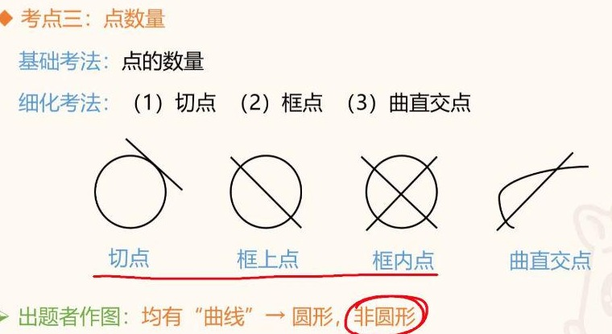

| 细化考法 | 含义 | 怎么想到 |
|---|---|---|
| **切点** | 直线（或曲线）与圆相切的点 | 每幅图都有圆 → **先看切点**，有没有相切一眼就能看出来 |
| **框上点** | **内部线条与外框的交点** | 切点不行，就看和外框有关的点 |
| **框内点** | 内部线条在框内的交点 | 同上 |
| **曲直交点** | 曲线与直线的交点 | 有曲线，但不是闭合的圆 |

**框上点的易错点**：

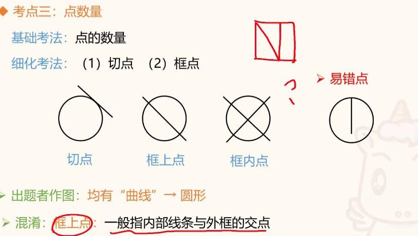

- 圆里一条线从顶上往下画，停在圆心附近：**框上点1个，框内点0个**。下端是**端点，不是点**，不算0.5个。
- 老师画的红色方框（正方形里一条竖线，加一条从左上角连到竖线底端的斜线）：**框上点是3个**。竖线的上、下两端各1个，斜线在左上角与外框相交1个（它和另外两个一样，都是内部线条与框的交点）。**外框自带的顶点不算**，所以不是6个，也不是2个。学了很久的人也常数错。

**框也可以是多边形**（难度更大）：

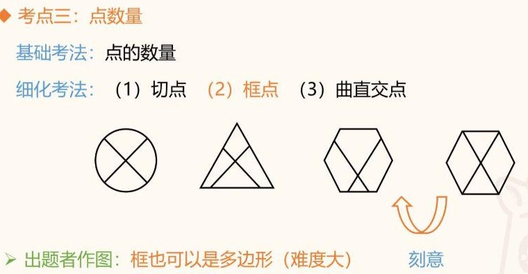

- 外框最常见的是圆，出难题时会用三角形、六边形等多边形。
- 同样的图，线稍微往上一点，就像在考对称轴、笔画或相同面，能考的东西太多，没法定位。稍微往下挪一点，外框感更强，内部线条"**刻意**"交在框里，就是在考框内点。

### 易错点 / 老师提醒
- 框上点只数**内部线条与外框的交点**，外框自带的顶点不算，线条停在框内的端点也不算。
- 每幅图都有圆，就是在考和圆有关的点。先切点（最简单），再框点。
- 圆和非圆的区分：闭合的算圆（包括椭圆），只要有一幅图断开，就按非圆处理。
- 多边形外框的框点题，要靠"外框感"和"刻意凑点"（想碰又不敢碰）来定位。

### 例题

**例2**（26四川）切点

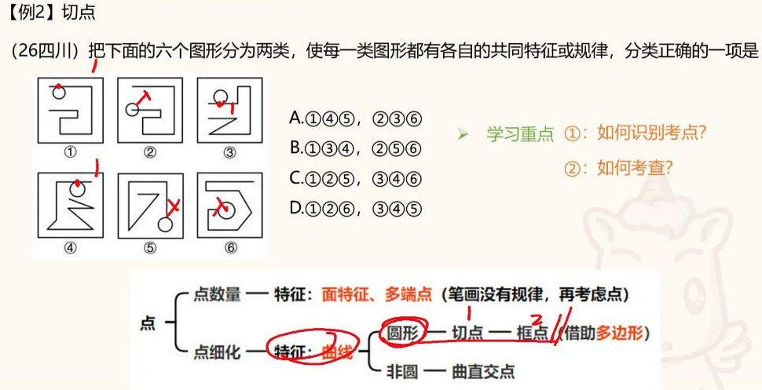

**思路**：
1. 有同学以为小圆是"标记"。如果真考标记，一般会画得更小、**实心**、更醒目，不会画成空心圆还让它和线相交，所以不是标记。
2. 不是标记，也就不用走"对称 → 数量"：**每幅图都有圆（曲线）**，这是强特征，直接走曲线里"圆"的思路：先看切点。
3. ①有相切，②没有（线的端点接在圆上，不是相切），③有，④有，⑤没有，⑥没有。
4. 按切点数0和1分类。

**答案**：B（①③④，②⑤⑥）

---

**例3**（24江苏选调）框上点

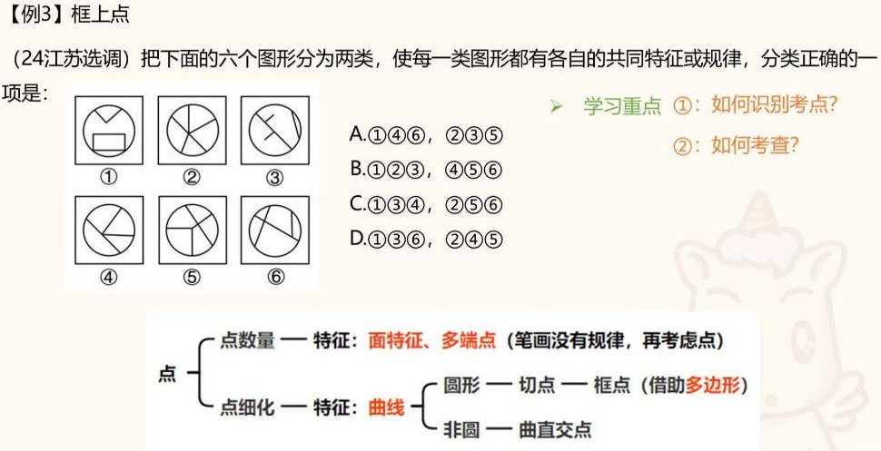

**思路**：
1. 每幅图都有圆 → 走圆的思路，不用对称、数量那条线。
2. 先看切点：都没有相切关系，一眼排除。
3. 看框点。框点分框上、框内两个角度，这题的框上点比较明显：①4、②5、③4、④4、⑤5、⑥5。
4. 难点在于定位：因为每幅图都画了圆，所以想考圆；切点不行，就直接定位到框点。

**答案**：C（①③④，②⑤⑥）

---

**例4**（23联考）框内点·多边形

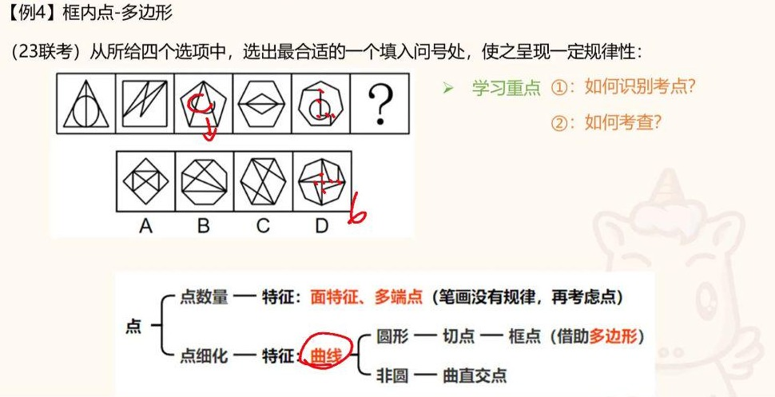

**思路**：
1. 前两幅图不同，也不对称 → 数量。考点太多，要抓两个感受：
   - **外框感**：每幅图都有一个多边形外框，边数依次增加。看不出有外框，这题就会很难。
   - **刻意凑点**：③最明显。内部的线想碰又不敢碰，如果是考面，它应该连过去形成闭环，现在故意断开，就是在凑点数。
2. 内部在凑点，又有外框 → 框内点。数出来：1、2、3、4、5 → 问号处应为6。
3. A、B、C 的框内点都很少，D 有6个 ✓。
4. 为什么不是框上点？因为③刻意在**内部**凑点。
5. 试错曲直性：①③⑤有曲线，恰好一半，本来要选纯直线的图，可四个选项都是纯直线，没有区分意义，所以不是曲直性。
6. 注意：思维导图把这题放在"曲线"分支下，只是为了排版方便，其实框点既能用曲线（圆）出题，也能用**多边形**出题。

**答案**：D

---

**例5**（26浙江）曲直交点

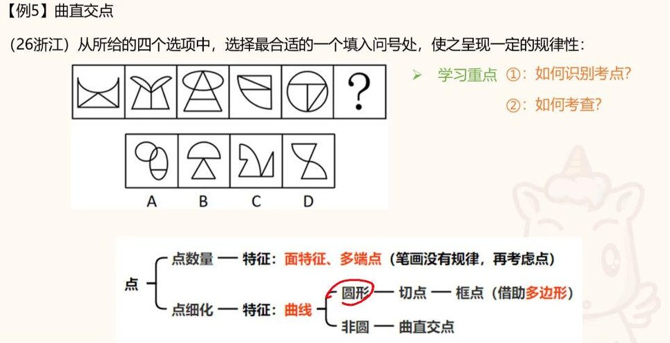

**思路**：
1. 每幅图都有曲线 → 曲线思路。再判断是圆还是非圆：只要有一幅图的曲线不是闭合的圆，就走**非圆**思路 → **曲直交点**。
2. 数曲线与直线的交点：题干每幅图都是**3个**。
3. A、B、C 都只有2个，D 有3个 ✓。
4. 难点在于为什么想到曲直交点：每幅图都有曲线，所以考和曲线有关的点；又不是圆，所以是曲直交点。（为什么不数曲线、直线的条数？要到讲"线"时再串讲。）

**答案**：D

---

### 点的小结与曲线思维导图

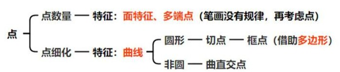

- **点数量**：特征是面特征、多端点。笔画没有规律时，再考虑点。
- **点细化**：特征是曲线。圆形 → 切点 → 框点（可借助多边形出题）；非圆 → 曲直交点。

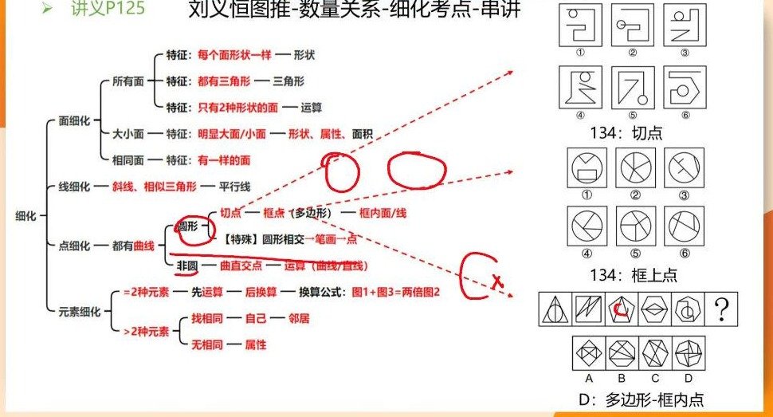

- 讲义P125的曲线思路中，本课只讲了一部分。**圆相交**（【特殊】圆形相交 → 笔画 → 点）、**框内面/框内线**、**线**都还没讲，后面的课再讲。

---

## 8. 线：见第5章

课程标题里的"线"这节课没有讲，放到了下一课，完整内容见**第5章第2节**：直线、曲线怎么数，两种线的运算，平行线。

> 💡 补充（帮助区分，非老师原话）：**笔画**问的是"最少几笔画完"，看连通性和奇点；**线条数**问的是图里有几条直线或曲线。直线被截断仍算一条，曲线在拐点处断开。所以一笔画的图可能有很多条线，比如五角星是1笔，却有5条直线。两者是不同的考点，别混。

---

## 本章小结

### 特征 → 规律 → 做法 速查表

| 看到的特征 | 想到的规律 | 做法 |
|---|---|---|
| 分割后每一块形状都一样 | 所有面·形状 | 看是几边形 |
| 每幅图都有三角形（可能从0开始） | 所有面·数三角形 | 数三角形个数，从后面的图反推 |
| 每幅图只有两种面（三角形＋四边形） | 所有面·运算 | 分别数；数字接近用相减，跨度大用倍数 |
| 面数全都相等、单独数面没答案 | 面的细化 | 按所有、大小、相同逐一检验（别忘了所有面） |
| 有明显的大面或小面 | 大小面 | 形状（自身 → 外框 → 传递）→ 属性（对称 → 曲直）→ 面积（占一半） |
| 两组图或九宫格，对称的面大小在变 | 大、中、小面 | 大面、中面、小面依次对称 |
| 有明显一模一样的面 | 相同面 | 数个数或组数（大小和形状都要一样） |
| 日、田、五角星、圆相交 | 笔画（旧特征） | 数奇点或去外框 |
| 像在考面，但面数差距太大或太多 | 笔画（面特征） | 去外框通常更快 |
| 出头的端点多 | 先笔画，再点 | 数奇点（找T字和端点） |
| 生活化图形 | 先开闭性，再笔画 | — |
| 笔画没规律，或某幅图要画很多笔（如5笔） | 点数量 | 数交点，大家都有的点不用数 |
| 每幅图都有闭合的圆 | 切点 → 框点 | 先看相切，再看框上点、框内点 |
| 多边形外框＋内部刻意相交或想碰不敢碰 | 框内点（或框上点） | 数框内（框上）的交点 |
| 有曲线，但不全是闭合的圆 | 曲直交点 | 数曲线与直线的交点 |

### 口诀汇总
> - **6＋6：所有、大小、相同 ＋ 形状、属性、面积**
> - **面 → 笔画 → 点**（高频排序，动态调整）
> - **笔画数＝奇点数÷2**；0或2个奇点是一笔画；不连在一起的相加
> - **端点也是奇点；端点不是交点**
> - **外框不影响笔画数**。去外框：回到原点、先去外面、去完没图案还是一笔、不连的不能去
> - 大小面看"**明显**"；**大、中、小面是新趋势**
> - **从0开始是难点**
> - 运算：接近用相减（90%），跨度大用倍数，相加最难想到
> - 笔画旧特征：**日、田、五角星、圆相交**；新特征：**面特征、多端点、生活化**
> - 点细化：**圆 → 切点 → 框点；非圆 → 曲直交点**

### 易错坑汇总
1. 数对称轴穿过的面数时，别和总面数混。
2. 立体图形数面时，虚线后面的面也要数；在内部的面（不是外表面）不数。
3. 三角形＋四边形相加等于总面数，出题人不会考；三角形规律从0开始时，第一幅图没有三角形。
4. "最大面"的"最"是唯一的。两块差不多大就说明不考大小面；小面比大面更容易被忽略。
5. 大小面和外框比的是"形状相同（相似）"，也可能和下一幅图的外框比（传递）。
6. 相同面要求大小和形状都一样，同心圆不算。注意区分一组图和两组图。
7. 数奇点：端点要算，T字是3条，曲线穿过的点要拆开数；奇点数一定是偶数；0个奇点是1笔。
8. 去外框：去掉的必须是闭环；不连在一起的框不能去，要算一笔；去完没图案还是一笔；剩下独立的闭合小圈时，用数奇点复核。
9. 看到五角星不要马上判定笔画，要先排除对称。
10. 笔画一般只考1～3笔，图要画很多笔时直接转向点。
11. 数交点时端点不算；框上点只数内部线条与外框的交点，外框自带的顶点不算，线条停在框内的端点也不算。
12. 实心的小圆才可能是标记，空心圆和线相交是在考点。
13. 题目上方的"【例X】考点名"是复盘用的，考试时没有，练题时别先看。
