# 第5章 平面·数量规律（元素、直角）+ 图形关系

> **先说明本课实际讲了什么**：这节课把"数量规律"剩下的三个考点讲完了——**线（含平行线）→ 元素（含部分数）→ 直角**。标题里的"图形关系"老师在课上明确说"**放到明天讲**"（下一课和思维导图串讲一起讲），所以本章第5节只做说明，具体内容见下一章。另外，开课前的答疑补充了上节课（第4章）的几个细节，放在第0节。

> **本章要点速览**
> - **定位总流程**：每幅图图案不同 → 属性（对称性看"规则"，曲直性看"曲线"，开闭性看"生活化"）→ 数量（面、笔画、点、线、元素、角）。曲直性、开闭性各有单独思路，平时的主线是"对称 → 数量"。
> - **线·识别信号**：①单一线条（孤零零加的线）②每幅图都有曲线 ③多边形（内外、左右、黑白、大小）→ 数线。**同时出现时：线特征 > 面特征**。
> - **线·考法**：只要出现**两种线**（曲/直、横/竖、黑框/白框、大框/小框、内/外）→ 先单独数A，再单独数B，都不行就算**A与B的运算**（相减、倍数、相加）。新趋势：差值**递减**（4,3,2,1,0,-1 或 1,0,-1）。
> - **曲线的完整思路**：部分图有曲线（占1/2或2/3）→ 曲直性；全部有曲线 → 数量：全是圆 → 切点/框上点/框内点；有非圆 → **先数曲直交点，再数曲线/直线**。
> - **线·细化 = 平行线**：信号是**斜线**（尤其两条斜线平行地画）和**相似三角形**；考"组数"；多数情况一个方向只画**2条**，一个方向超过2条基本不考平行线。
> - **元素·识别信号**：**独立**（本可以连起来画却故意分开）。基础考**个数**和**种类**：颜色不同算两种，大小不同算一种（与"相同面"相反）。
> - **元素·细化**：整体只用了**2种元素** → **先运算（谁比谁多几个，用"圈"的方法数）后换算（公式：图1+图3=2×图2，或按递增去猜）**；**超过2种（或1种）** → **找相同：先找自己，再找邻居**；都没有相同 → **考属性**（对称、曲直、开闭；分"自身的"和"整体的"）。
> - **部分数**：连在一起就是一部分，用于**生活化图形**；**部分数数"黑色"，面数数"白色"**。
> - **九宫格运算**：两种形式（前两个相加=第三个；每行三个相加和相等），最适合考**面和元素**（好数）。
> - **直角·识别信号**：**直角三角形、十字架、矩形（正方形/长方形框）**；题里出现"去直角"的动作（斜着切掉一个角、从角上拉斜线）更要数直角。
> - **十字架 vs 田**：直角少（单个十字架=4个）→ 数直角；直角多（田字=16个）→ 数笔画。
> - **直角·易错**：**白色框（线条图）要数外直角；黑色框（实心图）不数外直角**。
> - **图形关系**：本课未讲，下一课讲。

---

## 0. 课前答疑：上节课（第4章）的补充

**① 讲义P46【2021联考】点数量：C选项不是6，是8。** 那道题数的是**点**不是面，老师讲义里按面数成了6，改成8。

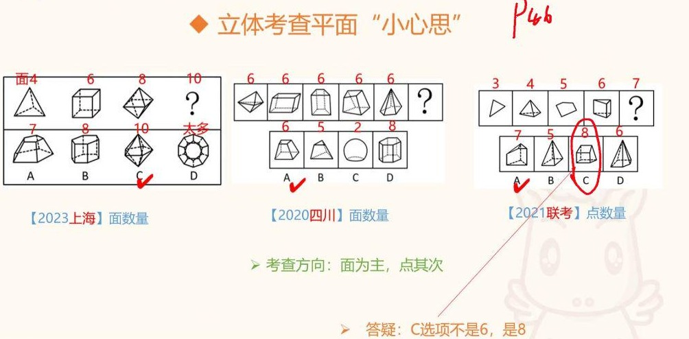

**② 【例1 五角星、日、田】（25浙江事业）为什么不能用"相同面"？**
- 为什么对称要排掉：第③幅是**中心对称**。中心对称没法细化（细化是看**一条**对称轴的方向、它和线/面/点的关系），所以看到第③幅对称这条路就排掉了，转去考虑数量。
- 为什么不是相同面：第⑥幅（两个同心圆）的面**大小不一样**，不能叫相同面；即使硬用相同面，第④幅（五角星）有5个相同面，也分不出两类。所以这题不是相同面。

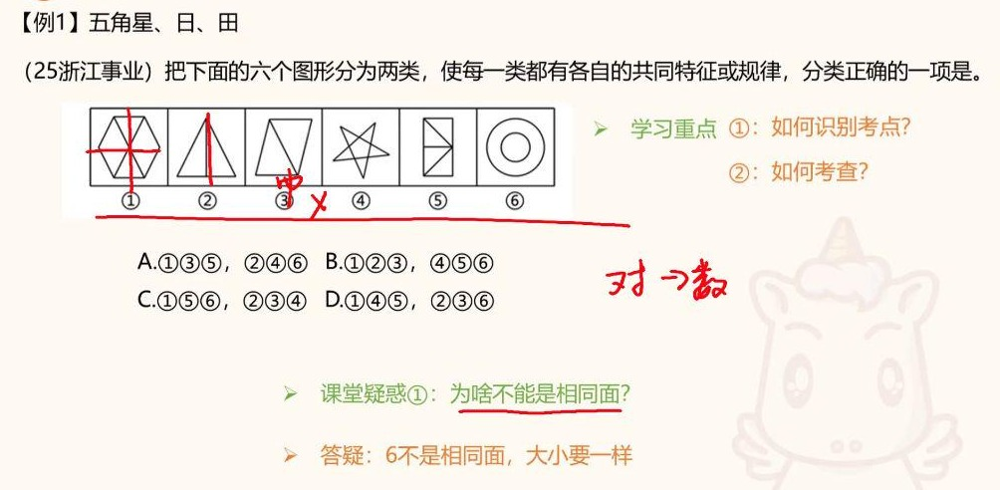

**③ 怎么区分"圆"和"非圆"？** 只看图里的**曲线部分**：**曲线没有形成闭环的都叫非圆**。
- 圆（闭合曲线）上的交点其实也可以叫"曲直交点"，也可以叫"框上点"。但出题人画了圆，就是想考圆（切点、框上点、框内点）；想考曲直交点，画普通曲线就够了。
- **只要有一幅图的曲线不是圆，就考不了框上点这一套**，只能走非圆的思路（曲直交点）。
- 圆上的切点可以算框上点；非圆曲线上的切点不算（非圆没有"框"）。

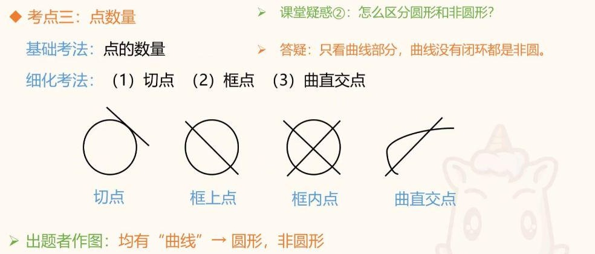

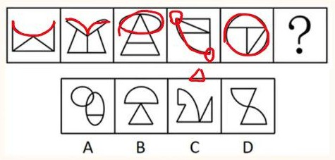

**④ 学了数量规律思路乱？** 正常。前期是一个考点一个考点地介绍概念，第6节课会把所有知识点串起来，讲清楚优先级、怎么区分、怎么定位。现在先把每个概念（什么是曲直交点、什么是框上点……）搞懂就行。

---

## 1. 定位回顾：数量规律在整个思路中的位置

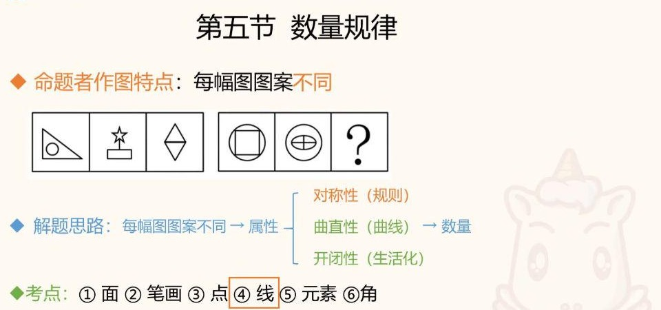

拿到一道题，先问**有没有一样的图案**：
- **有一样的**：完全一样 → 位置（平移、旋转/翻转）；部分一样 → 样式（黑白运算、加减同异）、标记。
- **没有一样的**（每幅图画的东西都不一样，如三角形、圆、长方形、五角星）→ 先看**属性**：
  - **对称性**：图形**规则**时优先考虑，是"大哥"；图形不规则就直接跳到数量。
  - **曲直性**：图里出现**曲线**时考虑。
  - **开闭性**：出现**生活化**图形时考虑。
  - 曲直性、开闭性是单独拎出来的两条线，有各自的思路；平时的主线是**对称性 → 数量规律**。
- **数量规律**六个考点：面、笔画、点（上一章已讲）＋ **线、元素、角**（本章）。

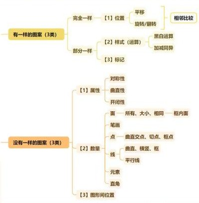

> 老师强调：做每道题都要回答两个问题——**①如何识别考点（凭什么想到它）②如何考查**。"原因"比答案重要。

---

## 2. 线

### 识别信号（看到什么，想到数线）

| 信号 | 说明 |
|---|---|
| **单一线条** | 图里有孤零零、不和别的线连着的线条，是出题人故意拎出来提醒你数线的 |
| **每幅图都有曲线** | 曲线难画，出题人能不画就不画；每幅都画，说明就是要考曲线 |
| **多边形** | 多个多边形（外框），通常带"两种"的感觉：内/外、左/右、黑/白、大/小 |

> 口诀：**单一、曲线、多边形**（数线的三个原因，必须背）。
> 课件提示：线特征和面特征**同时出现时，线特征 > 面特征**。

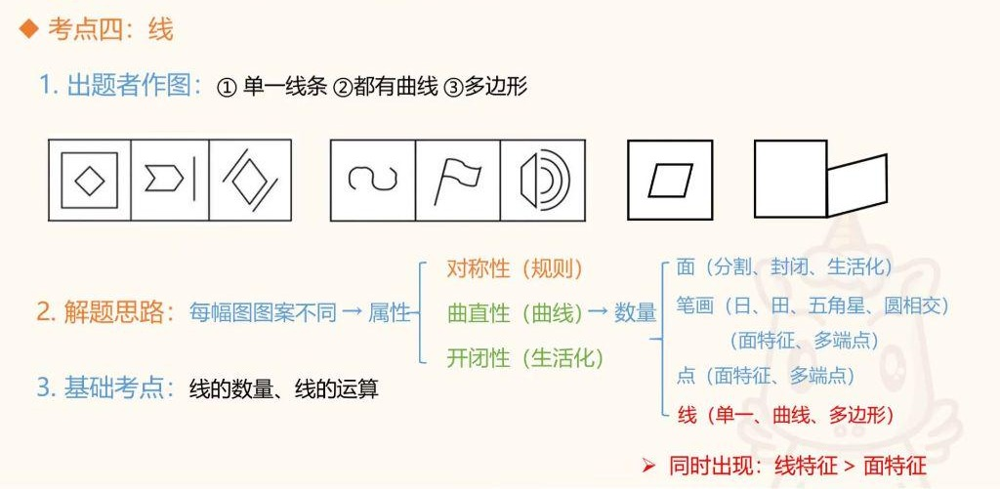

### 规律讲解

#### 2.1 怎么数线：先搞清直线和曲线的定义

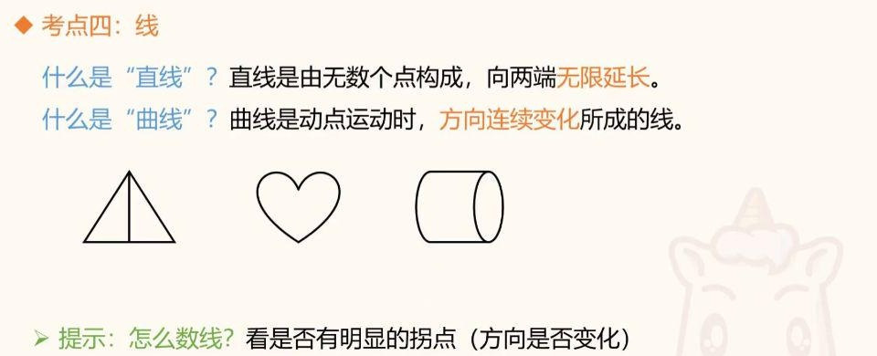

- **直线**：由无数个点构成，**向两端无限延长**。所以一条直线中间被别的线碰到、被一个点隔开，**仍然是一条线**，不要数成两条**线段**。例：三角形中间加一条竖线 = **4条**线（底边虽然被竖线分成两段，仍算一条）。
- **曲线**：动点运动时**方向连续变化**形成的线。数曲线看**有没有明显的拐点（方向突变）**：
  - 圆 = 1条；数字 **8** = 1条（整条光滑，方向连续变化，没有拐点）；
  - 数字 **3** = 2条（中间尖的地方方向突变，是拐点）；
  - 课件上的**爱心** = 2条（上面凹下去的地方、下面尖的地方都是拐点；如果画成很圆滑、没有尖角的爱心，才算1条）；
  - 圆柱侧视图 = 2条曲线 + 2条直线。
- 考试不会出特别有争议的曲线，出现**明显拐点就分开数**即可。

> 💡 解释：数线本质是数"方向连续的一整笔"。直线的定义决定了"共线的两段=同一条线"；曲线的定义决定了"方向突然改变的地方要断开"。

#### 2.2 出题者怎么作图

1. **单一线条**：比如一组图要出8、7、6条线：正方形套菱形（8条）；五边形箭头旁边加一条竖线（7条）；菱形旁边加两条斜线（6条）。出题人本来可以把那两条线连到菱形中间去，但那样同一个图就能考三角形个数、两笔画、框内点、直角、对称轴……很难定位；现在它**孤零零地加在旁边**，就是在提醒你数线。个别图这么画很正常，每幅图都这么画就太明显了——所以只要看到**个别图有孤零零的线**，就要想到数线。
2. **都有曲线**：见 2.4。
3. **多边形**：多边形天然有"内部/外部"（或左右、黑白），要有**拆分思维**，分开数。例：正方形里套一个平行四边形，内4条、外4条，考"内外相等"。
   - **拆分 vs 整体两种数法都要会**：正方形和一个四边形靠在一起、共用一条边——**拆开看**是 4+4（公共边两边各算一次，考"左右相等"）；**看成一个整体**是 4+3=7条。不是说一共8条，别断章取义。

#### 2.3 基础考法：线的数量、两种线的运算

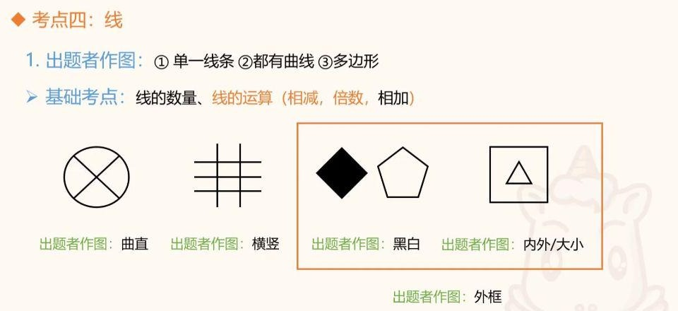

- 简单题只数一种线；**考试最大的难点是运算**，因为线常常"两种"一起出现：
  - **曲线/直线**（圆里画叉）；**横线/竖线**（井字）；**黑框/白框**；**内框/外框、大框/小框**。
- **只要出现两种，就想考两者之间的关系（运算）**——不管在哪个考点里都一样（比如面里每幅图都是三角形+四边形，也是在引导运算）。数量规律里**考运算概率最高的就是线**。
- **做法三步走**：先单独数A → 不行再单独数B → 都不行就看**A和B之间的运算**（多几、少几、倍数、和）。
- **新趋势**：差值**递减**，如 4,3,2,1,0,**-1** 或 1,0,**-1**（以前多是"每幅都多1"）。本节四道例题全部是这种，考场上的难题高频。

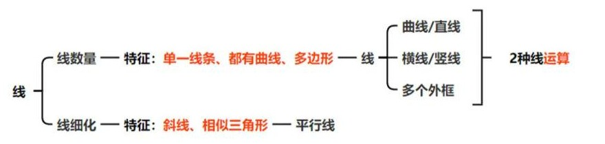

#### 2.4 曲线的完整思路（本课首次串起来）

目前学过两个和曲线有关的考点：曲直交点（上一章）和数曲线（本章）。拿到有曲线的图，先问自己：**是部分图有曲线，还是全部图都有曲线？**

| 情况 | 走哪条线 |
|---|---|
| **部分**图有曲线（占 1/2，或九宫格里 2/3） | 属性：**曲直性** |
| **全部**图都有曲线 | **数量**，再分： |
| ├ 全部是**圆**（闭合） | 切点、框上点、框内点（和"框"有关的考点） |
| └ 有**非圆**（只要有一幅不是圆） | **①先数曲直交点**（好数）→ **②不行再数曲线、直线及其运算** |

- 为什么曲直交点优先：数曲线不行还得数直线，还要做运算，慢；先数完一大堆再发现考的是曲直交点，心态会崩。老师的优先级原则：**要么按考频排，要么按"哪个好数先数哪个"**，试错成本最低。
- 反过来，如果某幅图的**曲线和直线根本不相交**（没有曲直交点可数），或者图里有**孤零零的单独曲线**，就直接去数曲线/直线。

#### 2.5 细化考法：平行线

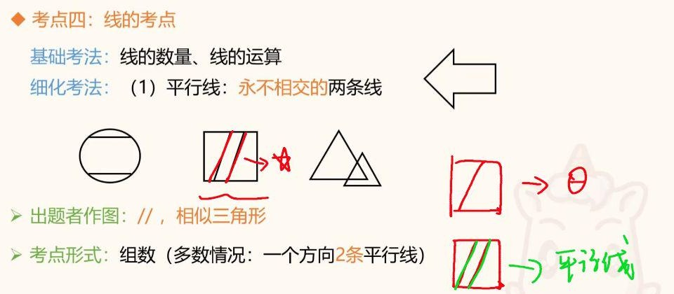

- **定义**：**永不相交的两条线**。所以同一直线上的两段（延长后重合）**不算**平行线。
- **考点形式**：数**组数**（不是条数）。
- **为什么看"斜线"**：正方形本身就有横、竖两组平行线。在正方形上再加横线或竖线，只会让某一组的**条数**变多，**组数不变**。要画出**3组及以上**，就**必须加斜线**（哪个角度斜都行）。所以斜线是平行线的最大特征。
  - 只画**一条**斜线：不一定考平行线（可能是"日"字形去考笔画等）；
  - 同样的斜线**画了第二条**（两条斜线平行地画）：非常刻意，不画两条就出不了平行线 → **优先考虑平行线**。
- **为什么看"相似三角形"**：画一个三角形，复制粘贴再来一个，三条边两两平行，轻松凑出3组。四边形复制不行（正方形/长方形还是只有横竖两个方向，还是2组）；五边形复制能凑5组，但太明显，而且一组图要从1组画到5组，出题人自己都嫌麻烦——所以实际只考**三角形**（奇数边）。
- **怎么排除平行线**：出题严谨的话，**一个方向上基本只画2条**平行线。如果某个方向上线**多于2条**（比如正方形里又加了几条竖线），出题人大概率是想考别的（如三角形/四边形的运算，或者用斜线"去直角"来考直角），平行线就可以先放一放。

> 口诀：**定位平行线看两样——斜线、相似三角形；一个方向多于2条，平行线基本不考。**

> 💡 解释：平行线的组数 = 图中"有2条及以上线条的方向"的个数。横、竖只有两个方向，所以第3组必然来自斜方向；相似三角形的三条边正好是三个方向。

### 易错点 / 老师提醒
- 数直线**不要数线段**：被截断的共线部分仍是一条线。
- 数曲线看**拐点**，不是看能不能一笔画出来。
- 多边形题"拆分"和"整体"两种数法都要会，按题目需要选。
- 思维导图是告诉你出题方向，**不是让你按"曲线→横竖→外框"一个个代进去试**；要根据图形特征直接定位（比如图里根本没有明显的横竖线，就别去数横竖线）。
- 两种线的运算，**数完两串数字看不出关系时别慌**，盯着两串数看差值，常常是递减。
- 多边形题问"能不能数点"：多边形的边数和顶点数相等，这类题数点和数线结果一样；但考试更常考线，而且一旦图里有孤零零的单独线条，数点就麻烦了，所以按线来数。

### 例题

**例1**（26联考事业）曲线与直线-运算：五幅图各不相同，都有曲线，选问号处。

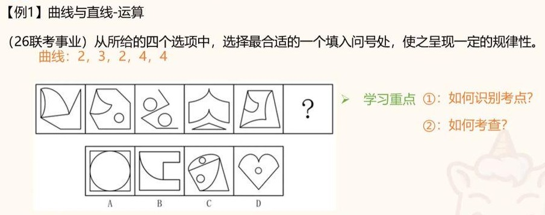

**思路**：
1. 定位：图案各不相同 → 对称（不规则，不行）→ 数量。**每幅图都有曲线**，而且是"全部都有"→ 走数量。有的曲线不是圆 → 非圆，两个方向：曲直交点 / 曲线与直线。
2. 为什么不数曲直交点：**第③幅的曲线和直线根本不相交**，没有曲直交点可数 → 只能数曲线和直线。
3. 数曲线（拐点处断开）：2、3、2、4、4，无规律；两种线大概率考运算 → 再数直线：约 6、6、4、5、4，也没规律。
4. 看两者关系：直线比曲线多 **4、3、2、1、0** → 递减，下一个应为 **-1**（直线比曲线少1条）。
5. 验证选项：A 曲线1（圆）直线4，多3 ✗；B 曲线1，不可能少1 ✗；C 曲线4 直线4，相等 ✗；D 曲线3 直线2，少1 ✓。

**答案**：D

> 这题两个难点：①怎么识别（全部有曲线 → 非圆 → 第③幅没有交点 → 数曲线/直线）；②数字上的难度（递减到负数）。是26年最新趋势，重点掌握。

**例2**（22江苏）横线与竖线-运算：九宫格，每幅图是一个框加上一些横线/竖线/斜线。

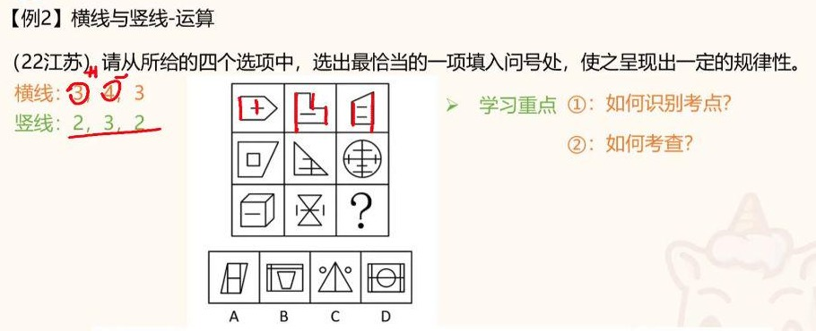

**思路**：
1. 定位：图案不同，图形不对称 → 数量。为什么是线？①**单一线条**：框里加的线都是孤零零的（出题人没把它们连起来，要是连成一片你反而会去数面）；②加的线有明确方向，**不是横的就是竖的**，出题人刻意往横竖线引导。
2. 两步走：先数横线（3,4,3，无规律）→ 再数竖线（2,3,2，无规律）→ 看运算：**每幅图横线都比竖线多1**。第二、三行验证：横4竖3、横3竖2、横4竖3……全部多1。
3. 选项：A 横3竖2 ✓；B 横5竖3 ✗；C 横竖各1 ✗；D 横3竖4（少1）✗。

**答案**：A

> 难点：图里还有**斜线**，是干扰线，要用拆分思维只看横竖线（全是横竖线的话就简单多了）。

**例3**（22联考）黑框与白框-运算：两组图，每幅是一黑一白两个多边形。

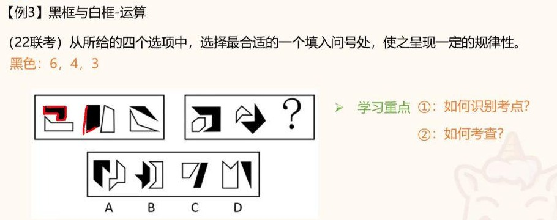

**思路**：
1. 定位：两组图前后有相同元素但**不能考黑白运算**（黑白运算要求相同位置叠加，这里形状不同没法算），也没有位置、标记 → "没有一样"的思路 → 对称（不规则，排）→ 数量。为什么数线：**多边形**；而且一黑一白，**明显两种** → 拆分分开数。
2. 黑框边数 6、4、3，白框边数 5、4、4，单独都没规律 → 运算：黑比白 **多1、相等、少1**（1,0,-1 递减）。第二组同样是多1、相等，所以问号处应**黑比白少1**（白比黑多1）。
3. 选项：A 黑6、白7，白多1 ✓；B 黑7、白6，反了 ✗；C 两者相等 ✗。

**答案**：A

**例4**（25重庆事业）大框与小框-运算：每幅图是两个大小不同、上下/斜着摆的多边形。

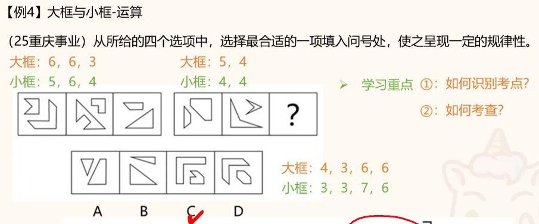

**思路**：
1. 定位：删掉第③幅的话其余都比较规则，可能会先想对称——**第③幅不对称**，把对称排掉 → 数量。和上题一样是**多边形**，只是两个框从黑白换成了都是白的。
2. 两个框怎么区分？位置上说不清左右/上下，但**一大一小**很明显 → 按大小拆开数（除了黑白、左右，还要有"大小"的概念）。
3. 大框 6,6,3，小框 5,6,4，都无规律 → 运算：大比小 **+1、0、-1**。第二组：大5小4（+1）、大4小4（0）→ 问号处 -1。
4. 选项：A 大4小3（+1）✗；B 大3小3（0）✗；C 大6小7（-1）✓；D 大6小6（0）✗。

**答案**：C

> 学员问"为什么不考横竖线"：这题的图里根本没有明显的横线竖线，没法数。思维导图是告诉你出题方向，不是让你一条条代进去试。连着四道都是 1,0,-1 递减——这是难题的高频考法，要记住。

**例5**（25浙江事业）平行线：六个图分两类。

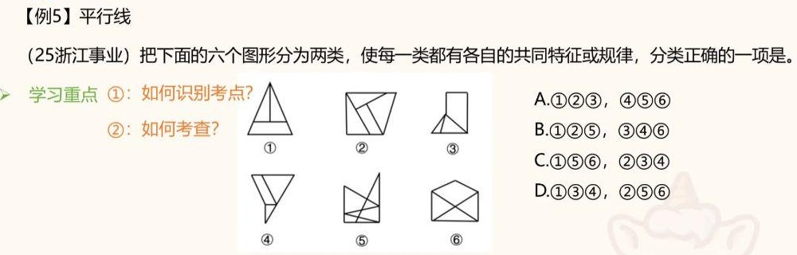

**思路**：
1. 定位：第②幅不对称 → 数量。考场上的干扰很多：每幅都有三角形（数三角形？），有交叉（笔画？），面也能数……
2. 为什么优先平行线：图里**两条斜线平行地画**（如②），而且不止一幅这样画——太刻意了，要画出两组以上平行线就得这么画 → 平行线概率最高，值得先验证。（不是说一定不考面、笔画，而是平行线的概率被斜线抬高了，所以先数它。按"数面 3,3,3,4,7 太多、笔画 1、2、3 不对、三角形细化也难"一个个试，会很慢。）
3. 数组数：①⑤⑥ 各**1组**；②③④ 各**2组**。
4. 如果在某个方向上再加一条线，虽然组数不变，但出题人一般不会这么画，那就不太像平行线题了。⑥里看着像平行的两条线其实不平行，别被干扰。

**答案**：C（①⑤⑥，②③④）

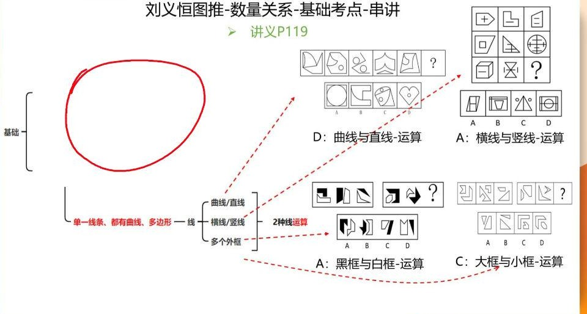

---

## 3. 元素

### 识别信号（看到什么，想到元素）

- **独立**：图里是一个个**分开的小图案**（本来可以连起来画，出题人偏偏断开）。
- 这个特征和数量规律的其他考点区分度极大：面、笔画的图线条都是连在一起的，元素是分开的。**其他考点可能混，元素基本不会混。**
- 有时题干前后有一样的图案（看起来像"有一样"的题），但独立感非常强，照样直接定位元素。元素不太受"一样/不一样"这个大框架的约束。
- **但不能跳步**：定位元素之前，先问一句"有没有对称的可能"，整体不对称才去考元素。
- 特征是"**连在一起 + 生活化**"时，数的是**部分数**（见 3.6）。

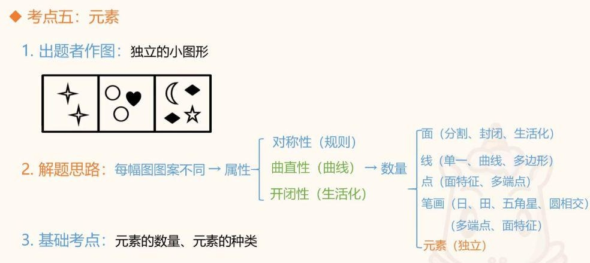

### 规律讲解

#### 3.1 什么是元素；基础考法：个数、种类

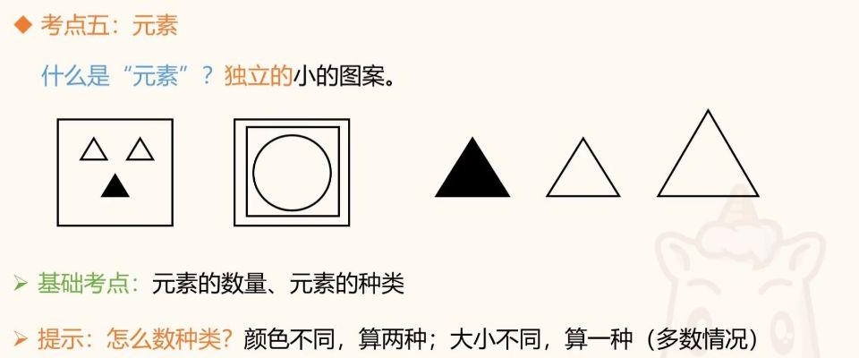

- **个数**：字面意思，数有几个。
- **种类**：
  - **颜色不同 → 算两种**（黑三角和白三角是两种）；
  - **大小不同 → 算一种**（大三角和小三角是一种）；
  - **方向不同**：本课先不管，都算一种（后面再讲）。
- 图例：左边"方框+两个白三角+一个黑三角"= **3种**（白三角、黑三角、正方形外框——**外框也算元素**）；右边"两个正方形套一个圆"= **2种**（圆1种，两个正方形大小不同但算同一种）。
  - 为什么右边不是3种？要按**独立**的线条看：圆一个、外正方形一个、内正方形一个。有人把两个正方形之间的环形看成一个图形，那是在用"面"的眼光看，不是元素。
- **最容易混：元素种类 vs 相同面**——大小不同**不能**叫相同面，但在元素种类里大小不同**算同一种**。记反了就全错。

> 💡 解释：相同面要求形状、大小都一样（能完全重合）；元素种类只看"是什么图形、什么颜色"，不管大小。

#### 3.2 九宫格的数量运算

九宫格常考两种运算：
1. **前两幅相加 = 第三幅**（如 1、3、4：1+3=4）；
2. **每行三幅加起来的和相等**（如 1+3+4=8，每行都等于8）。

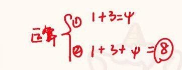

- **哪些考点适合九宫格运算？面和元素**——因为它们好数，好数的东西才能加难度。线的运算不会让你把7条、4条、3条加成14条，笔画相加也太过分；出题人要控制难度，九宫格求和基本出在面和元素上。

#### 3.3 细化（1）：只有2种元素 → 先运算，后换算

"2种"是**整体**看的：一排看过去整组图只用了两种图案（比如只有圆和正方形），哪怕某一幅只画了其中一种，也算"2种"。两种 → 想比较 → 运算。

**① 运算**（相减、倍数、相加）：谁比谁多几个、少几个。
- **更快的数法——"圈"**：不用把两种都数完。心里知道要比较，就把两种一一抵消，**多出来的圈起来**：第一幅多出一个正方形就圈一个，第二幅又多一个正方形……很快看出"每幅都是正方形比圆多1"。元素好数，所以可以这样圈（曲线直线那种就不行）。

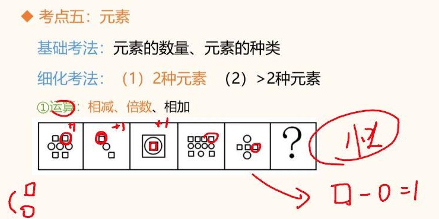

**② 换算**：把一种元素换算成另一种，再看总数。
- 什么时候用：还是两种元素，但运算不成立（比如月亮多1、圆多1、然后相等，这样行不通）。
- 出题原理：换算后的总数基本都是**递增**的，常见 1,2,3,4,5；1,3,5,7,9；1,4,7,10……
- **两种方法**：
  1. **背公式**：**图1 + 图3 = 2 × 图2**，列方程解出换算比例。
  2. **猜**：找一幅只有一种元素的图做起点，按递增去猜。例：第一幅1个月亮，第二幅1个圆——猜"1个圆=2个月亮"，代到第三幅（1月+1圆=3）成立，第四幅（2月+1圆=4），第五幅（1月+2圆=5）→ 1,2,3,4,5，问号处为6。

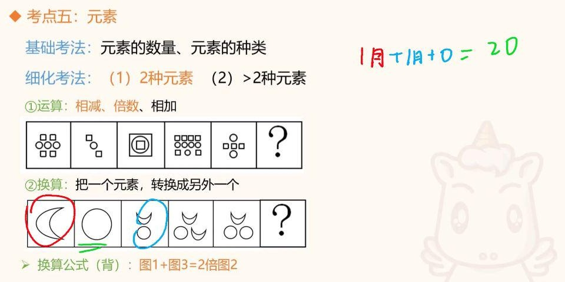

- 公式推一遍：图1 = 1月，图3 = 1月+1圆，2×图2 = 2圆 → 2月 + 1圆 = 2圆 → **1圆 = 2月**。
- 想省脑子就背公式；理解透了可以直接猜，更快。

> 💡 解释：如果换算后的总数是等差数列 a, a+d, a+2d，那么 a + (a+2d) = 2(a+d)，这就是"图1+图3=2×图2"。

#### 3.4 细化（2）：超过2种元素 → 找相同

只要**不是2种**（1种、3种、4种都算），就用一个思路：**找相同**。不需要背它具体考什么规律，找到相同的东西，规律自然就出来了。

**顺序：先找自己（每幅图内部），再找邻居（相邻两幅图之间），都没有相同 → 考属性。**
> 口诀比喻：**买东西先看自己兜里有没有钱，没钱再找邻居借**——总不能一上来就找邻居借。

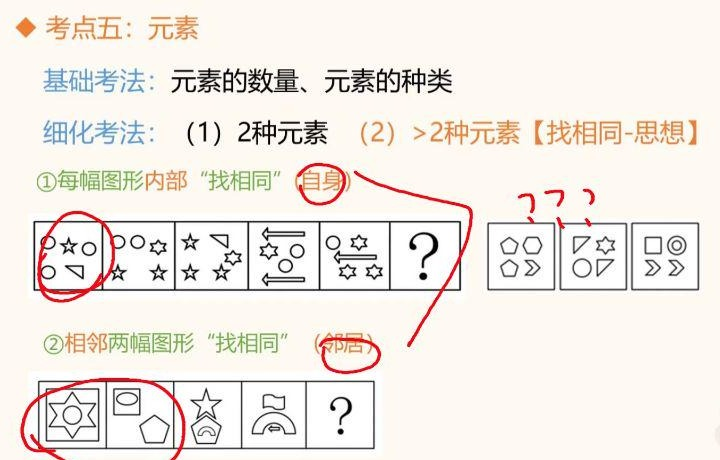

- **找自己**（上图第一行）：第一幅 3个圆+1个五角星+1个三角形（3:1:1），第二幅 2个五角星、2个圆、1个六角星（2:2:1），第三幅 3:1:1，第四幅 2:2:1……交替出现 → 考的是比例。右边三个图都是 2:1:1，比例一样，那就看相同元素的**位置**（相邻还是对角）。考点各不相同，但思路都是"找相同"。
- **找邻居**（上图第二行）：每幅图内部三种图形都不重复，就和隔壁比：第一幅和第二幅有一样的正方形，第二幅和第三幅有一样的五边形，第三幅和第四幅有一样的拱形 → 相邻两幅有一个相同元素，一路**传递**下去。

**无相同 → 考属性**（对称、曲直、开闭）：

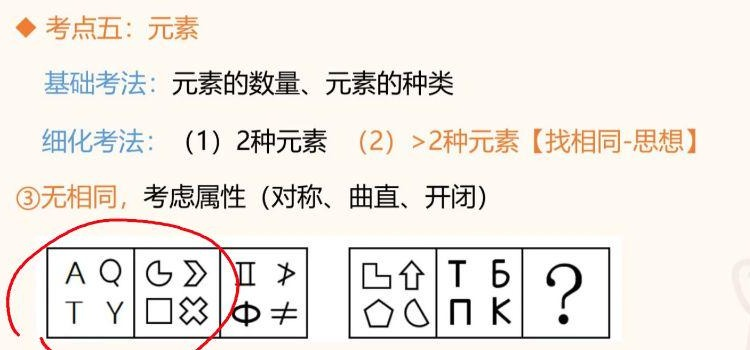

- 例：第一幅 A、Q、T、Y，第二幅和它没有任何相同元素，自己内部也没有相同 → 找属性：
  - 对称：A、T、Y 对称，Q 不对称（3个对称1个不对称）；
  - 曲直：每幅图都只有一个元素带曲线（Q、◔、Φ），**而且带曲线的元素位置在变**（右上→左上→左下）→ 很可能考这个；
  - 开闭：数有封闭区域的元素个数 2、4、3，调个顺序就是 2、3、4 递增，也能考。
  - 注意"有面的元素个数"和"面的总数"是两种不同的说法，看清限定词。
- 属性分**两个角度**：**自身的**（单个元素自己的属性，如某个元素带曲线、它的位置在变）和**整体的**（一幅图里所有元素合在一起看，是纯直线、纯曲线，还是曲线+直线）。

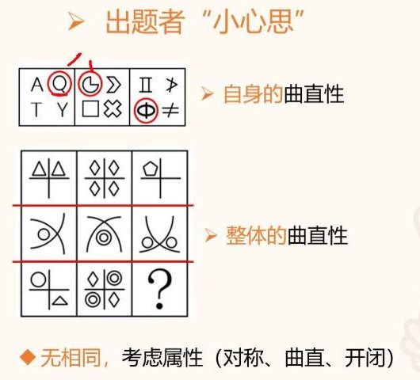

#### 3.5 元素细化的完整导图

| 情况 | 做法 |
|---|---|
| **= 2种元素** | **先运算**（谁多谁少，用圈）→ **后换算**（公式 图1+图3=2×图2，或按递增猜） |
| **≠ 2种元素**，有相同 | **找相同**：先**自己** → 再**邻居**（找到相同后规律可能是比例、位置、内外相等、传递……不用背） |
| **≠ 2种元素**，无相同 | **考属性**：对称、曲直、开闭（分自身/整体） |

#### 3.6 部分数

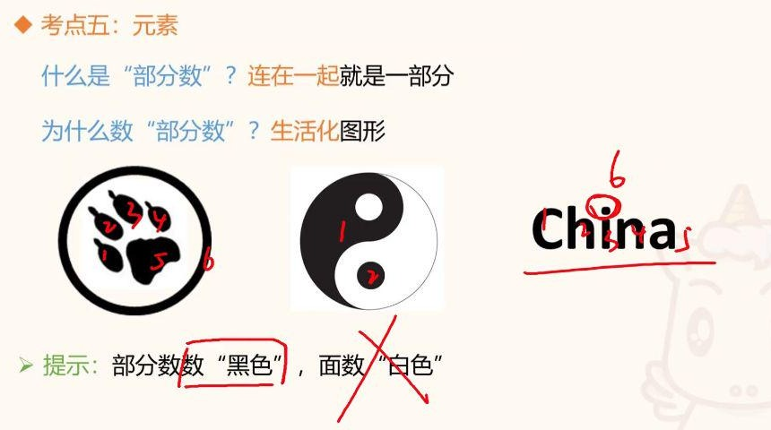

- **什么是部分数**：**连在一起的就是一部分**。
- **为什么数部分数**：**生活化图形**（生活化图形有两个方向，部分数是其中之一，其余下一课总结）。
- **怎么数**：**部分数数"黑色"，面数"白色"**。
  - 猫爪：4个脚趾 + 1个掌心 + 外圈圆环 = **6部分**；
  - 太极图：黑色的大块1个 + 黑色小圆点1个 = **2部分**（面也是2个——但面数的是白色区域，部分数数的是黑色的线条/实心部分）；
  - "China"：C、h、i 的竖、i 上面的点、n、a = **6部分**。**最容易漏的就是 i 上面的点**。
- 要公平对待，别"双标"：数太极时如果把白色区域也加进去，那数猫爪时是不是也要把白色加进去？统一只数黑色（连在一起的线条、黑块）。

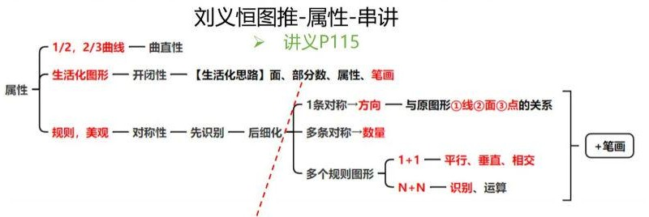

### 易错点 / 老师提醒
- **元素种类 vs 相同面**：大小不同，元素里算**一种**，相同面里**不算**相同。
- 数元素要按**独立**的线条看，别用"面"的眼光把连在一起的区域当成一个元素。
- "2种元素"看整组，不看单幅。
- 大于2种时**不要背考点**（比例、位置、内外、传递都出过），只记"**找相同：自己→邻居→无相同找属性**"。
- 部分数数黑色、面数白色，别记反；"China"的 i 点别漏。
- 讲义P128（26广东那题）"属性"那里写成了开闭性，应为**曲直性**。
- 定位元素前一定先过一下对称性，**不能跳步**；对称性排除要找到"明显不对称"的那幅图。
- 选项里常有**长得很像**的干扰（Λ 和 A、正方形和长方形），要严格比对。

### 例题

**例1**（24重庆选调）九宫格黑点，求问号处。

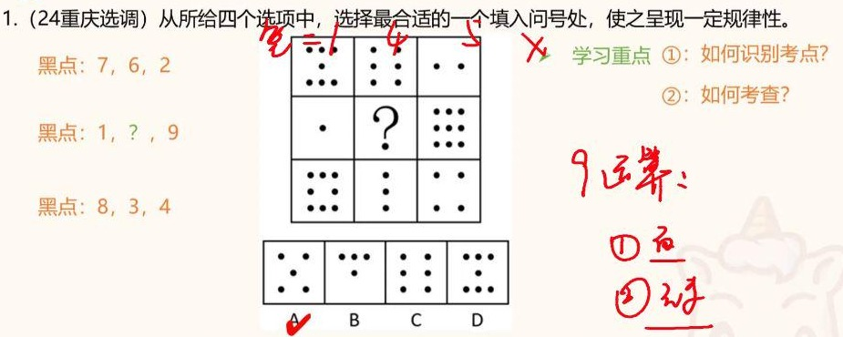

**思路**：
1. 先判断是不是"有一样"的题：个数不一样，考不了位置；没有标记；黑白运算要相同位置叠加，也不像 → "没有一样"的思路。
2. 对称：每幅图都是**轴对称+中心对称（两条轴）**。只有**一条**对称轴时才能细化（看轴和线、面、点的关系）；多条对称轴没法细化，从对称角度顶多排掉一个B，没用 → 直接转数量。
3. 黑点孤零零、独立 → 元素，数个数：第一行 7、6、2，差值（1,4,5）没规律；前两个相加也得不到第三个 → 试"每行和相等"：7+6+2=**15**，第三行 8+3+4=**15** → 第二行 1+?+9=15，**?=5**。
4. A 是5个点。

**答案**：A

> 考情：九宫格求和适合**面和元素**这种好数的考点。

**例2**（24陕西事业）六幅"花"形图分两类。

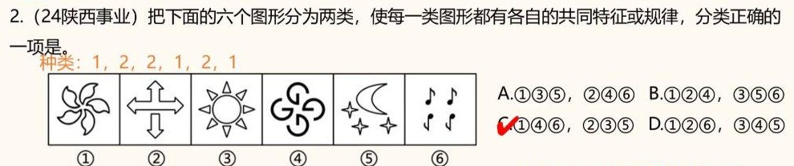

**思路**：
1. 对称：这题图形很规则，很多人跳不出对称。①说不好（画不出对称轴，转180°也不重合）；但**⑤完全不对称**，一眼排掉。
2. 曲直性：只有②是纯直线，其余都有曲线，比例是 5/6，不是 1/2 或 2/3 → 不考曲直性。开闭性要生活化图形，也不对。
3. 为什么元素：这些"花瓣"本来都可以连起来画，出题人偏偏**全部断开** → 独立 → 元素。
4. 个数太多，看**种类**（方向不同先算一种）：①1种、②2种、③2种、④1种、⑤2种、⑥1种。

**答案**：C（①④⑥，②③⑤）

**例3**（23国考）九宫格里放圆和正方形，六图分两类。

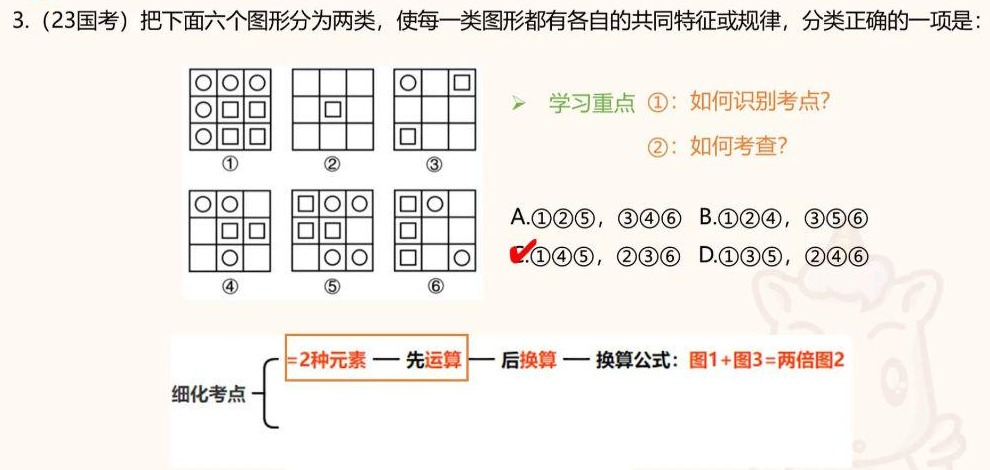

**思路**：
1. 前后有一样的图案，但这是**分组分类题**，考不了位置、样式；标记需要一样的小黑点，也不是 → 走"不一样"的思路。
2. 对称不能跳：用**拆分**的眼光看，圆和正方形分开看各自也可能对称（最新的联考事业单位就这么考过），所以不敢轻易排；真正能排掉对称的是**第④幅**。
3. 数量 → 独立 → 元素；整组只有**圆、正方形两种** → 运算。用"圈"的方法比谁多：①圆多1，②正方形多1，③正方形多1，④圆多1，⑤圆多1，⑥正方形多1。

**答案**：C（①④⑤ 圆比正方形多1；②③⑥ 正方形比圆多1）

**例4**（25河南事业）九宫格，黑白五角星，求问号处。

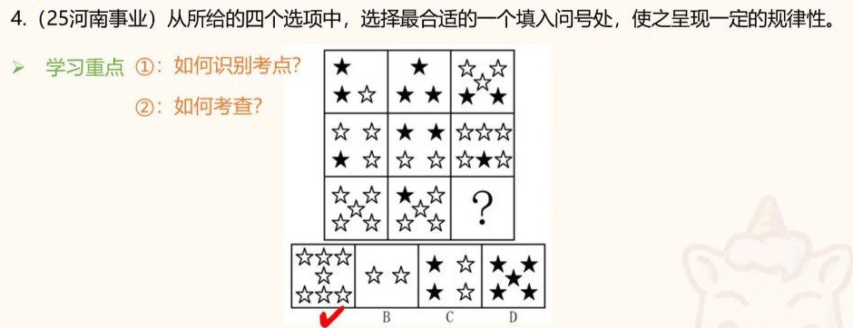

**思路**：
1. 定位：前后有关联，但个数不同，考不了位置；空心图案位置对不上，黑白运算也不行 → 对称：第一幅整体不对称 → 数量 → 独立 → 元素。
2. 黑、白两种 → **先运算**：第一幅黑多1、第二幅黑多3……不行，而且还有全白的图 → 运算概率很低 → **换算**。
3. **猜法**：挑只有一种元素的图——第三行第一幅是**5个白星**，猜它按 5、6、7 递增。第三行第二幅是 1黑+4白，要等于6，就得 **1黑=2白**。回头验证第一行：2黑+1白=5，3黑=6，2黑+3白=7 ✓；第二行：1黑+3白=5，2黑+2白=6，1黑+5白=7 ✓。
4. **公式法**（不想动脑就背）：设黑=H、白=B。图1 = 2H+1B，图3 = 2H+3B，2×图2 = 2×3H = 6H → 4H+4B = 6H → 4B = 2H → **H = 2B**。
5. 问号处要 7 个白星当量：A 7白=7 ✓；B 2白=2；C 2黑+2白=6；D 5黑=10。

**答案**：A

**例5**（22四川）五幅生活化小图，求问号处。

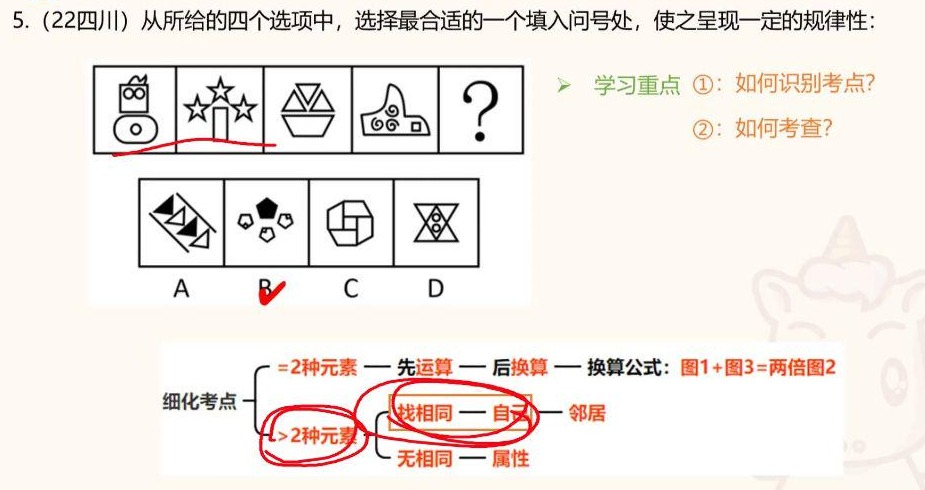

**思路**：
1. 对称不行 → 数量 → 图案独立 → 元素；种类明显**大于2** → 找相同。
2. 先找自己：第一幅有3个一样的圆，第二幅3个五角星，第三幅3个三角形，第四幅3个涡卷 → 每幅图都有**3个相同元素**。
3. 选项：A 只有2个相同；B 有3个相同的五边形 ✓；C 有4个；D 4个和2个，都没有正好3个。

**答案**：B

**例6**（21河南事业）每幅图由平行四边形、三角形、带点的圆组成。

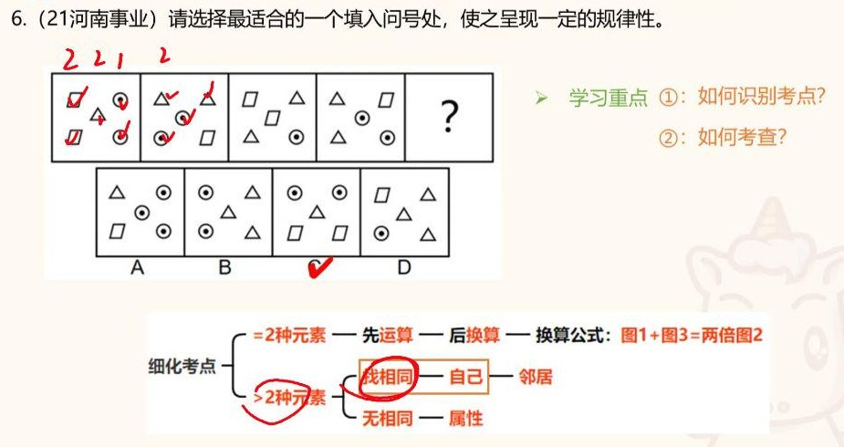

**思路**：独立 → 元素；三种图形，大于2 → 找相同（自己）：第一幅 2个平行四边形、2个圆、1个三角形（2:2:1）；第二幅 2个圆、2个三角形、1个平行四边形；后面也都是 **2:2:1**。选项：A 3:1:1，B 3:2，**C 2:2:1**，D 3:1:1。

**答案**：C

**例7**（24山西）每幅图中间有一个虚线圆，圆内圆外各有几个小图形。

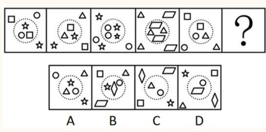

**思路**：
1. 独立 → 先看对称（整体不对称）→ 元素；种类大于2 → 找相同（自己）。
2. 第一幅：外面有正方形、圆、五角星，里面也有正方形、圆、五角星……题干的**虚线圆**引出了"内外"概念 → 规律是**圆内和圆外的元素完全相同**。验证：五角星-五角星、三角形-三角形……都对上。
3. 选项：C、D 内外个数都不一样，先排；B 外面没有五角星，内外不同，排；A 三角形、圆、五角星内外都有 ✓。

**答案**：A

**例8**（26浙江）六个"十字分四格"的图，每格一个小图形，分两类。

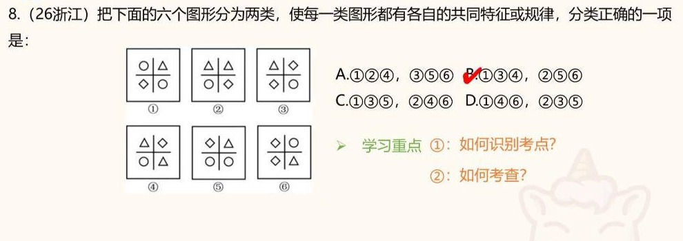

**思路**：独立 → 元素；大于2种 → 找相同（自己）：每幅图都是两个相同+两个不同（2:1:1）→ 比例分不开类 → 看两个相同元素的**位置**：①③④ 在**对角线**上，②⑤⑥ 在**相邻**位置。

**答案**：B（①③④，②⑤⑥）

> 这是最新的浙江题，难度不大——用"找相同"的思路很快就能做。

**例9**（21上海）两组图，每幅图由几个符号组成。

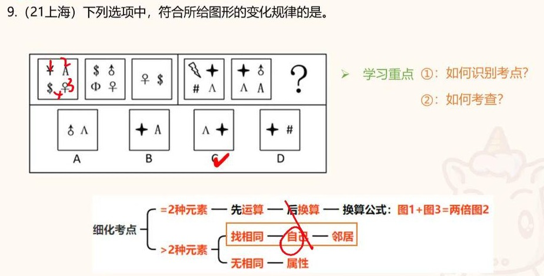

**思路**：
1. 独立 → 元素；每幅图里四个符号都不一样 → **自己没有相同 → 找邻居**。
2. 第一组：图1和图2有两个相同元素（$ 和 ♀），这两个相同元素正好组成了图3。
3. 第二组：图1（⚡ ✦ # Λ）和图2（✦ ♂ Λ A）的相同元素是 **✦ 和 Λ** → 问号处为"Λ ✦"。
4. 坑：B 的"A"和 Λ 长得很像，但不是同一个符号（图2里的 A 和 Λ 也不能算重复）。

**答案**：C

**例10**（25河南事业）每幅图四格，各放一个小图形。

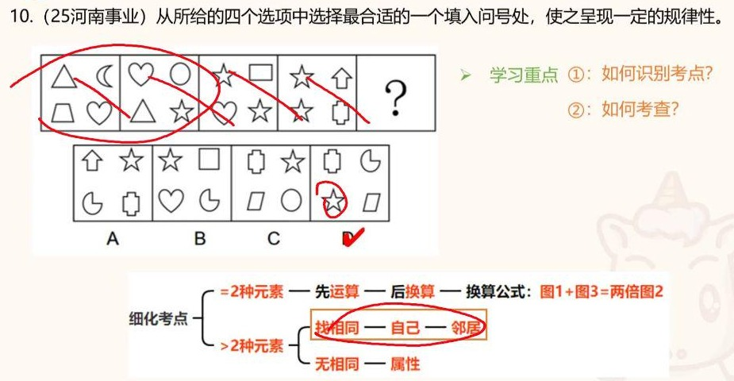

**思路**：
1. 独立 → 先看对称（整体不对称）→ 元素；自己内部四个图形都不一样 → 找邻居。
2. 图1和图2：三角形相同（图1左上 → 图2左下），爱心相同（图1右下 → 图2左上）；图2和图3、图3和图4也是这样**传递**下去，而且**位置一一对应**：前一幅的**左上**到后一幅的**左下**，前一幅的**右下**到后一幅的**左上**。
3. 五角星出现了两次，容易乱，按位置来：图4左上的五角星应出现在问号处的**左下** → 只有 D 满足，秒选。再核对图4右下的图形到问号处左上，也对得上，没有矛盾。

**答案**：D

**例11**（21江苏）五幅图（菱形套圆、圆套正方形、正方形套三角形、立方体、圆里四个小图形），求问号处。

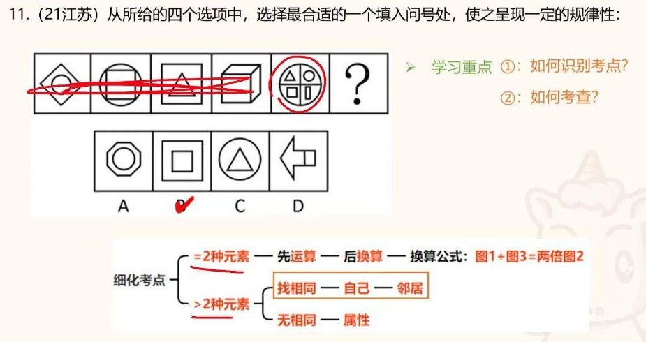

**思路**：
1. 前四幅看着都对称，但**第⑤幅不对称** → 对称好排。难在定位：数量里这么多考点，这题完全也能考笔画（两笔、一笔、两笔……），凭什么想到元素？——**第⑤幅**：三角形、圆、正方形、长方形各自**独立**，像元素题的风格。
2. 元素种类大于2 → 先找自己：除了第⑤幅里的两个圆，前面几幅内部都没有相同 → 找邻居：从第⑤幅往回推，前后相同的是**正方形**，再往前验证，**每幅图都有正方形**（菱形也是正方形转了45°），正方形一路传递。
3. 选项：B 有正方形 ✓；D 看起来个数也对得上，但那是**长方形**不是正方形，不严谨。这题考的是"找相同"，相同的东西（正方形）比个数更重要。

**答案**：B

> 江苏题难度大，还专门在 B、D 之间挖坑。

**例12**（26广东）九宫格，每格由线条和几个小元素组成。

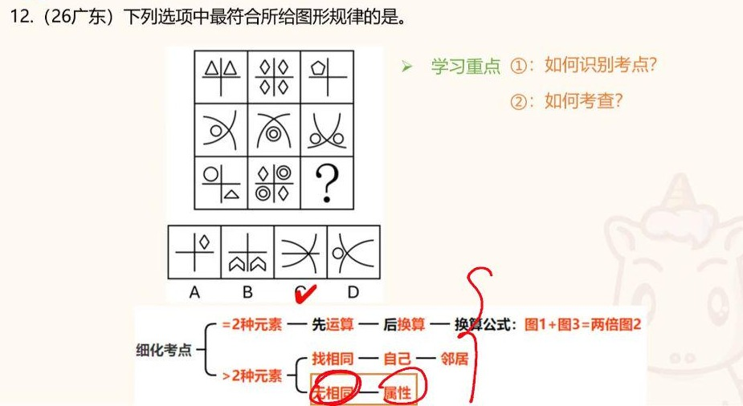

**思路**：
1. 孤零零的小元素 → 想考元素；但先看对称：第④幅整体不对称 → 排。
2. 找相同：第一行三角形、菱形、五边形……各不相同，第三行圆、三角形也不同 → **没有相同** → 考**属性**。
3. 三个属性里哪个最像？第一行**全是直线**，第二行**全是曲线**；第三行前两幅是曲线+直线。有曲线的图：第二行3幅 + 第三行 → 加上问号处，正好 9 幅里 6 幅有曲线 = **2/3** → 曲直性。这里用的是**整体的曲直性**（一整幅图所有元素合起来看是纯直、纯曲还是曲直都有）。
4. 问号处应为"曲线+直线"：A、B 纯直线 ✗；D 纯曲线 ✗；C 两条弧线 + 一条直线 ✓。

**答案**：C

> 这题得分率只有二三十%。有人看到相同的小元素想硬找位置规律，但位置对不上，只能在 A、B 里瞎猜——这就是最大的坑。讲义P128这里写成了"开闭性"，改为"曲直性"。

**例13**（22江苏）生活化图形（信封、运动器材等），求问号处。

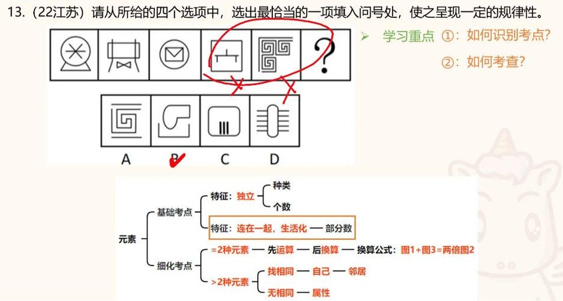

**思路**：
1. 生活化图形 → 可以用生活化的思路（开闭、面、部分数……）。为什么选部分数而不是开闭性？因为这些图**分开、独立的感觉特别强**（每幅图明显是两块分开的东西）→ 部分数。
2. 数部分数（连在一起算一部分）：每幅图都是 **2部分**。第⑤幅最难看，仔细看会发现除了一处以外其余全连在一起，也是2部分。
3. 第④、⑤幅是纯直线，别再去想曲直性。
4. 选项中只有 B 是2部分。

**答案**：B

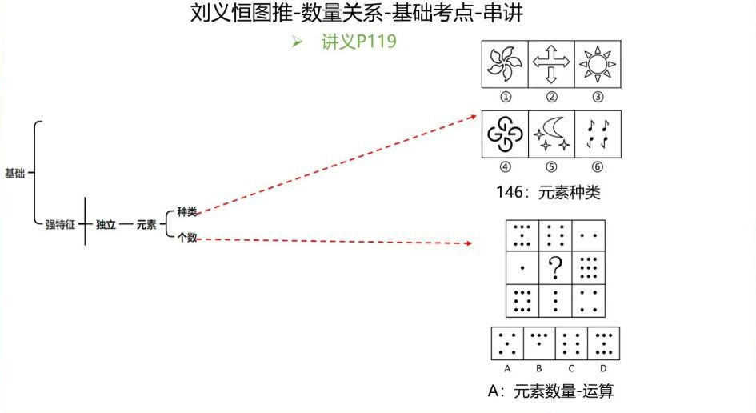

---

## 4. 直角

### 识别信号（看到什么，想到直角）

- **三大作图特征：直角三角形、十字架、矩形（正方形/长方形，尤其是外框）**——必须背。
- 出题人为了凑数会做"**去直角**"的动作：给正方形加一条从角出发的斜线、把一个角斜着切掉、在直角三角形上加线……看到这种刻意破坏直角的动作，就要想到直角。
- 考情：直角是高频考点（近五年还会个别考）；锐角、钝角十来年没怎么考过（除了"标记"类考点可能涉及），**先别学**——图推要做减法。

### 规律讲解

#### 4.1 出题者画直角的"小心思"

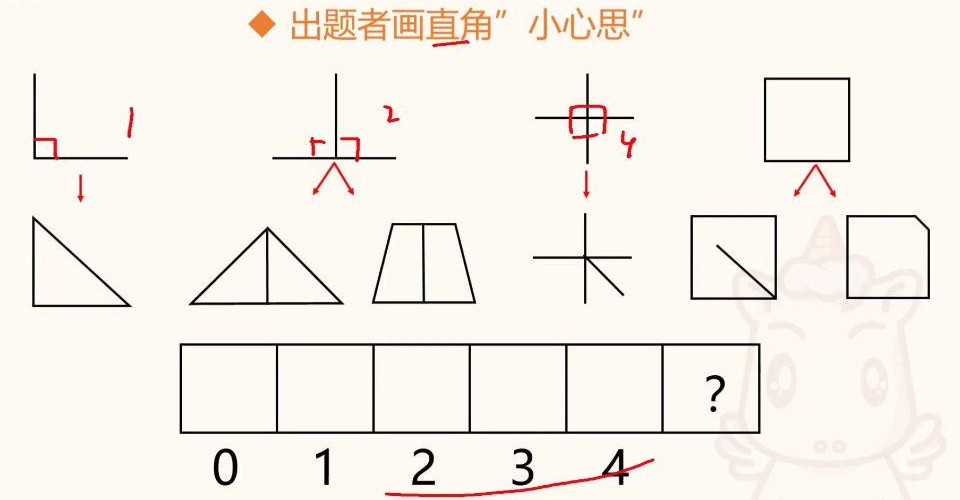

- 1个直角：直接画一个直角送给你太明显，出题人会补一条线变成**直角三角形**；
- 2个直角：一条竖线立在横线上 → 变成**三角形加高**、**梯形中间加竖线**；
- 4个直角：**十字架**；十字架加一条斜线就能破坏一个直角；
- 正方形4个直角：加一条斜线去掉一个角、或者把一个角斜着切掉 → 3个。
- 要出 0,1,2,3,4 的数列，1、2、4 都很好画，**唯独 3 必须有动作**（去掉一个直角），这就是"去直角"的来历。
- 所以直角三角形、十字架、矩形这三样是画直角最基础的元素，别的都是在它们上面加减线拼出来的。

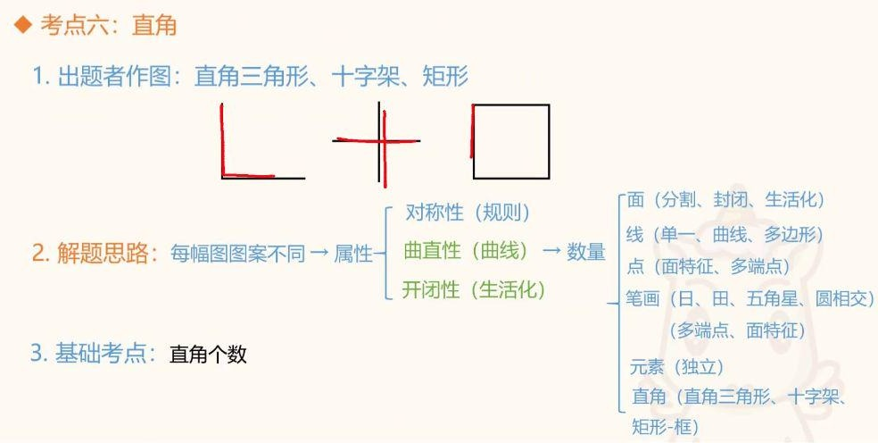

#### 4.2 "十字架"和"田"的混淆

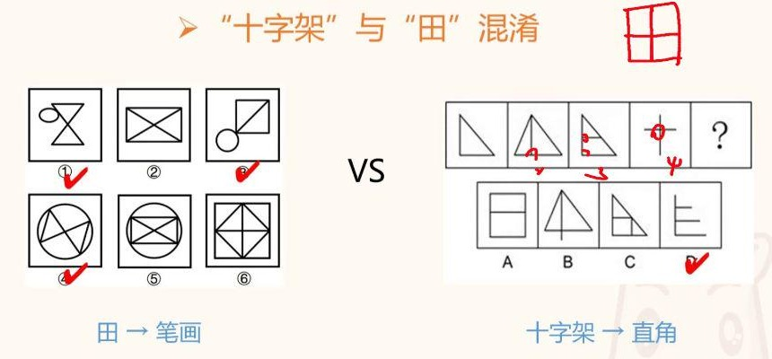

- 正方形里画一个十字就是"**田**"字形，笔画里也讲过田。怎么区分？看**直角多不多**：
  - **田**：每个小方格4个直角，一共 **16个**，太多数不过来 → **考笔画**；
  - **单独的十字架**、或者"圆里画十字"：只有 **4个**直角，好数 → **优先数直角**。
- 右边例子：直角三角形1个、三角形加高2个、再加一条线3个、十字架4个 → 问号处 **5个**：D（竖线上长出三条横线：上2+中2+下1=5）。十字架正好能凑出4，出题人用起来很方便。

> 口诀：**直角少，数直角；直角多，数笔画。**

### 易错点 / 老师提醒：外直角数不数？

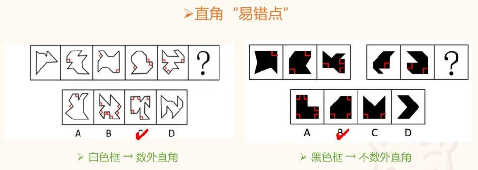

- **白色框（线条画的图）：内、外直角都要数**。凹进去的角，里面是 270°，外面那一侧的 90° 叫**外直角**，也要数。左边的事业单位题：0,1,2,3,4 → 5，按含外直角的数法 C 正好5个。
- **黑色框（实心黑图）：只看黑色面本身的角，不数外直角**。右边是国考题：每组 1,2,3 → 问号处3个。B 只数黑色面，明确有3个；如果你把外直角也数进去，C 看起来也是3个，就选不出来了——说明黑色不数外直角。
- 江苏、事业单位的白色线条题都是**把外直角数进去**的。很多同学会记反，务必记住：**白数黑不数**。

> 💡 解释：黑色实心图形是一个"面"，直角只属于这个面的内角；线条图形是由线组成的，两条线垂直相交，线两侧形成的直角都在图上，所以外侧的也要算。

### 例题

**例1**（25浙江事业）六个图分两类。

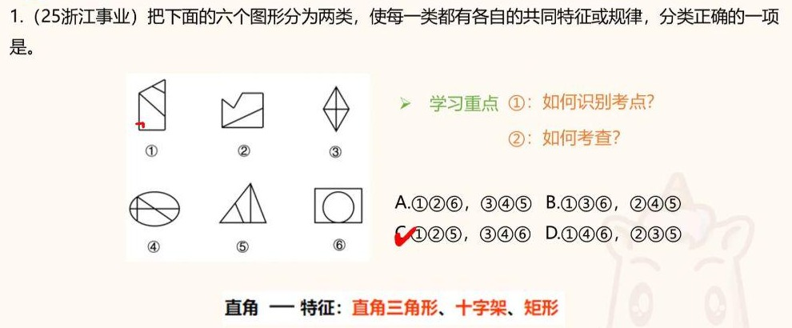

**思路**：
1. 第②幅不对称 → 数量。考点很多不好定位，最吸引人的是第③幅（菱形里一个十字）：
   - 有斜线 → 平行线？前几幅确实有平行线，但**第④幅没有平行关系**，平行线可以排掉；
   - 中间的十字架 → 笔画（田字形）还是直角？这里的十字架直角**正好4个**，太好数了 → 直角优先（如果是田字那种一大堆直角，就毫不犹豫去考笔画）。
2. 数直角：① 2个，② 2个（左下角被斜线破坏了），③ 4个（十字），④ 4个（椭圆里的横竖十字），⑤ 2个（三角形的高），⑥ 4个（矩形）。

**答案**：C（①②⑤ 两个直角；③④⑥ 四个直角）

**例2**（23浙江选调）每幅都是正方形框里画几条线。

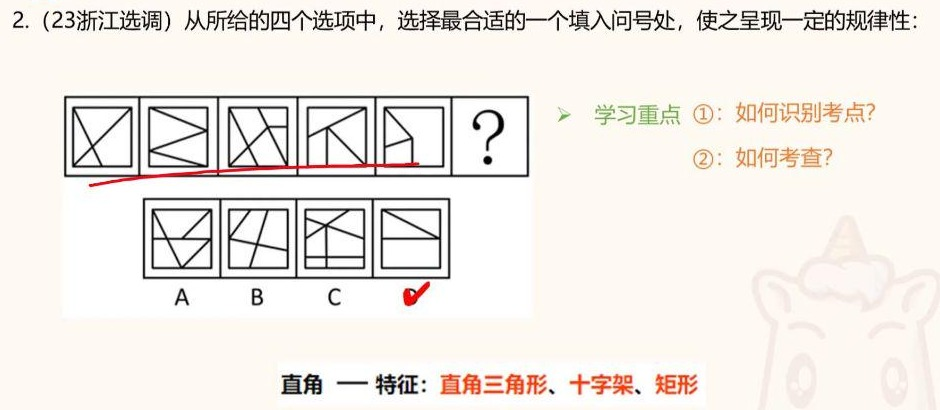

**思路**：
1. 对称不行 → 数量。这题最大的吸引点是**每幅图都有正方形外框**，而正方形能出的考点很多：外框 → 框上点/框内点；正方形里分割出很多三角形 → 三角形个数；去掉外框看笔画；斜线 → 平行线……考场上会有很多试错，算难题。
2. 老师的选择：每幅都画正方形，优先考虑**和正方形有关的考点**（要考三角形没必要每幅都画正方形；外框点又比较麻烦），而正方形的"去直角"功能很明显——线都是从角上拉出来的，把直角一个个破坏掉 → 数直角。（笔画试一下：去掉外框后是两笔、一笔、三笔，不行。）
3. 数直角：1、2、3、4、5 → 问号处 **6个**。D：矩形被横线分开（两个 T 字交点共4个）+ 剩下的角2个 = 6 ✓；B 4个；A 5个；C 太多。

**答案**：D

**例3**（23江苏）五幅图，老师标出每幅的直角个数 1、2、3、4、5。

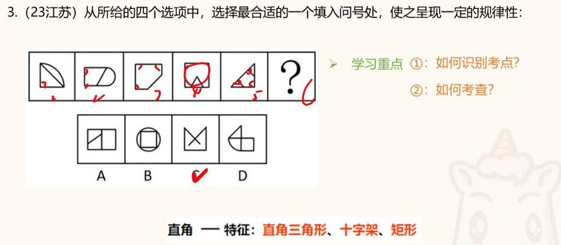

**思路**：
1. 对称能排 → 数量。最吸引人的是第⑤幅（直角三角形）和第③幅（正方形被切掉一个角——**刻意的去直角行为**）→ 数直角。
2. 1、2、3、4、5 → 问号处 **6个**。
3. 易错：D 看起来是正方形4个+另外2个=6，很多人开心地选 D，但**外直角没数进去**，数进去就不止6个了；C 如果漏了外直角只有5个，**把外直角数进去正好6个** ✓。A 8个、B 4个，不会混。
4. 这是白色线条图，**外直角要数**（江苏题就是这么数的）。

**答案**：C

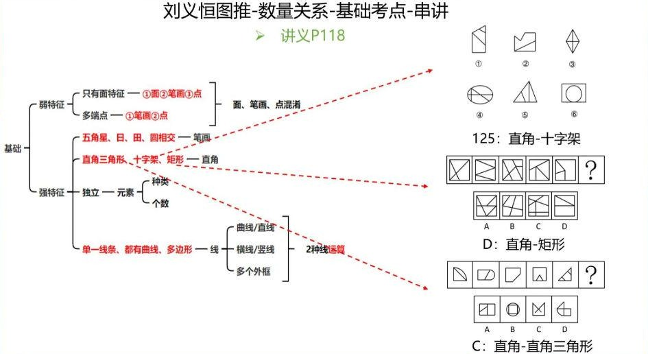

---

## 5. 图形关系（本课未讲）

课件的思维导图里，"没有一样的图案"下面除了属性、数量，还有第三条"**图形间位置**"，也就是图形关系。本课时间只够讲到直角，老师在课上说"**图形关系是放到明天讲的**"，并布置了预习：

- 预习：**讲义 P71–P76（图形关系）、P106–P132（思维导图串讲）**，下节课不做新题，讲图形关系剩下的几道题，再把所有思维导图串一遍——**一定要先自己看一遍**，不然听不懂。

图形关系（相离/相交/相切、公共边/公共点等）的考点、识别信号和例题见下一章。

---

## 本章小结

### 速查表：特征 → 规律 → 做法

| 看到的特征 | 想到的规律 | 做法 |
|---|---|---|
| 孤零零的单独线条 | 线的数量 | 数线（直线不数线段，曲线按拐点断开） |
| 每幅图都有曲线（全部） | 数量：圆 → 切点/框点；非圆 → 曲直交点 → 曲线/直线 | 先数曲直交点，不行再数曲线、直线并运算 |
| 部分图有曲线（1/2、2/3） | 曲直性 | 按曲直分类 |
| 多边形（黑/白、大/小、内/外、左/右） | 两种线的运算 | 分开数，看差值（常见 1,0,-1 递减） |
| 横线竖线刻意地画 | 横竖线运算 | 先横、再竖、再算两者关系 |
| 两条斜线平行地画、相似三角形 | 平行线 | 数组数；一个方向超过2条基本不考 |
| 小图案独立、刻意分开 | 元素 | 数个数 / 种类（颜色不同2种，大小不同1种） |
| 九宫格 + 好数的面或元素 | 数量运算 | 前两个相加=第三个；或每行和相等 |
| 整组只有2种元素 | 运算 → 换算 | 圈多出来的；图1+图3=2×图2，或按递增猜 |
| 元素超过2种 | 找相同 | 自己 → 邻居 → 无相同考属性 |
| 生活化 + 连在一起/分开感强 | 部分数 | 连在一起算一部分，只数黑色 |
| 直角三角形、十字架、矩形、去直角的动作 | 直角个数 | 白色线条图数外直角，黑色实心图不数 |
| 田字形（直角很多） | 笔画 | 直角多就数笔画 |

### 口诀汇总
> - 数线三原因：**单一、曲线、多边形**。
> - **两种就运算**：先数A，再数B，再看A与B的关系。
> - 曲线：**部分考曲直，全部考数量；圆考框，非圆先交点后曲直线**。
> - 平行线：**斜线、相似三角形；一个方向多于两条就排**。
> - 元素：**独立**；种类：**颜色不同算两种，大小不同算一种**。
> - 元素细化：**2种先运算后换算（图1+图3=2×图2）；超过2种找相同——先找自己，再找邻居（先看自己兜里有没有钱，没钱再找邻居借）；无相同考属性**。
> - 部分数：**连在一起算一部分；部分数数黑色，面数数白色**。
> - 九宫格运算：**面和元素**。
> - 直角三特征：**直角三角形、十字架、矩形**；**直角少数直角，直角多数笔画**；外直角**白数黑不数**。

### 易错坑汇总
1. 数直线数成了线段；数曲线看"能不能一笔画"而不是看拐点。
2. 多边形共用边时，拆分（4+4）和整体（7）两种数法混用。
3. 看到思维导图就一个个代入试，不看图形特征直接定位。
4. 非圆曲线题上来就数曲线直线（慢），应先数曲直交点。
5. 平行线把"条数"当"组数"；一个方向画了三条以上还硬考平行线。
6. 元素种类和相同面记反（大小不同：元素算同种，相同面不算）。
7. 数元素用了"面"的眼光，把两个正方形之间的环当成一个图形。
8. 换算题只会运算不会换算，或者猜的时候没选"只有一种元素"的图做起点。
9. 找相同时被长得很像的元素骗（Λ 和 A、正方形和长方形）。
10. 部分数把白色区域也算进去；"China"漏了 i 上的点。
11. 直角：白色线条图漏数外直角（23江苏选成D）；黑色实心图多数了外直角。
12. 田字形硬数直角（16个），应数笔画；单独十字架反而去数笔画。
13. 定位时跳过对称性（24陕西、23国考都有对称陷阱），要找到"明显不对称"的那一幅再排除。
