# 第6章 平面图推串讲：思维导图与考点识别

> **本章要点速览**
> - **"3+3"总框架**：先看每幅图有没有"一样的图案"。有一样的走 3 类（位置、样式、标记）；没有一样的也走 3 类（属性、数量、图形间关系）。考试不会在这 6 个大方向上创新，只在细节上创新。
> - **没有一样时的主线**：先看属性，**对称是"大哥"**（第一步）；对称不行时二选一：**正常情况走数量**，**极端情况（过于简单、过于复杂）走图形关系**。
> - **图形间关系（本课新考点）**：
>   - 简单型：每幅图只有 2~4 个图案，实际多为 2 个。分相离（之间的距离）、包含、相交；相交再分点（交点/切点、曲直、**首尾/中间**）、线（数量、长短、整体/局部、曲/直）、面（**形状、属性**、面积）。
>   - 复杂型：共同图案 + 复杂背景，考两者之间的位置关系。
>   - **新趋势**：与外框的关系，分看得见的外框和看不见的外框。
> - **数量·基础考点**：先分强特征、弱特征。
>   - 强特征直接定位：五角星/日/田/圆相交 → 笔画；直角三角形/十字架/矩形 → 直角；独立小图 → 元素；单一线条/都有曲线/两个多边形外框 → 线的运算。
>   - 弱特征按顺序套：只有面特征 → 面→笔画→点；多端点 → 笔画→点。
> - **数量·细化考点**：比基础考点更好定位，背下特征就能直接定位。
>   - 曲线思路：部分曲线 → 曲直性。都有曲线时，一个圆 → 切点→框点→框内面/线；两圆相交 → 笔画→点；非圆 → 曲直交点→曲线/直线运算。
>   - 元素：只有 2 种元素时先运算后换算（图1+图3=2×图2）；超过 2 种时找相同（先自己、后邻居），无相同则看属性。
> - **优先级原则**：强特征先，弱特征后，面是最弱的特征；曲线是"二哥"；端点是弱特征。两条路都说得通时，先试更好看的图形关系，越复杂的越往后放。
> - **对称轴快速排除**：只有"全是一条对称轴"时才需要多想（方向 → 线/面/点 → 笔画）。其他情况（识别分不了类、中心对称、多条轴、多个规则图形没答案）都应快速排除。

---

## 0. 本章定位与用法

- 这节课分成两半。前半讲平面图推的**最后一个考点"图形间关系"**，这是新内容，本章第 3 节完整保留。后半是 **"3+3"思维导图串讲**，把前 5 章的位置、样式、标记、属性、数量按"看到什么 → 想到什么"串起来，老师也补了不少新的判断方法、混淆点和优先级。
- 串讲里的老例题只配图、标答案，并提示识别信号；细则回看前面各章。**新例题、新判断方法、新口诀完整写出。**
- 思维导图的读法：**老师标红的是"讲过一遍考试时还容易忘"的，必须记；黑色部分做过一次就会，不用背。**
- 老师建议的复盘方法：讲义结尾的串讲就是复盘；思维导图靠理解，不要死记硬背；后期刷题的错题**标在思维导图对应分支上**，同时每个分支专项刷 10 题左右。

---

## 1. 总框架："3+3"思维导图

### 1.1 全图

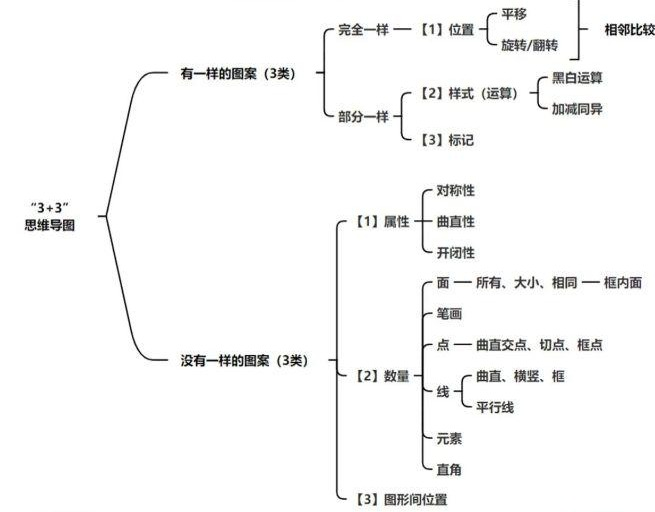

| 第一刀 | 第二刀 | 考点 | 细分 |
|---|---|---|---|
| **有一样的图案（3类）** | 完全一样 | 【1】位置 | 平移、旋转/翻转；与之相近的**相邻比较** |
| | 部分一样 | 【2】样式（运算） | 黑白运算、加减同异 |
| | 部分一样 | 【3】标记 | 位置、点、线、角、面、多个标记 |
| **没有一样的图案（3类）** | — | 【1】属性 | 对称性、曲直性、开闭性 |
| | — | 【2】数量 | 面（所有、大小、相同、框内面）、笔画、点（曲直交点、切点、框点）、线（曲直、横竖、框；平行线）、元素、直角 |
| | — | 【3】图形间位置 | 相离、包含、相交；复杂型；与外框的关系 |

> 老师强调：考试会在知识点细节上创新，但**不会在这 6 个宏观方向上创新**（位置、样式、标记、属性、数量、图形关系）。所以至少要把宏观方向抓牢，拿到题先想清楚是哪一类。

### 1.2 第一刀：有没有"一样的图案"

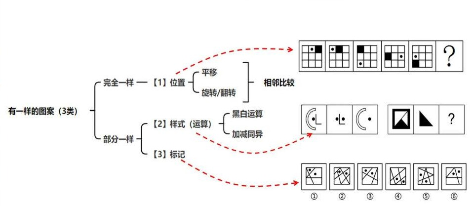

- **完全一样 → 位置**：每幅图的元素相同（上图每格都是一个黑块加一个小黑点），只是位置在变。
- **部分一样 → 样式**：图中的 C 形、L 形画成线并不奇怪，**奇怪的是线条的位置对上了**（出现相同位置的线条），这是在考线条保留还是抵消，即加减同异。外轮廓一样、内部黑白个数不一样，则考黑白运算。
- **部分一样 → 标记**：每幅图都有一个**小图案**（小黑点、小球、小方块）。
- **例外：黑白块题**。黑白块题几乎都能被理解成"有一样"，所以容易混，老师说后续会有单独的黑白块思维导图和模型。
- 有一样的三类熟悉后定位很轻松。**考试的难点在"没有一样"**，要做大量区分工作。

### 1.3 第二刀：没有一样 → 属性、数量、图形关系

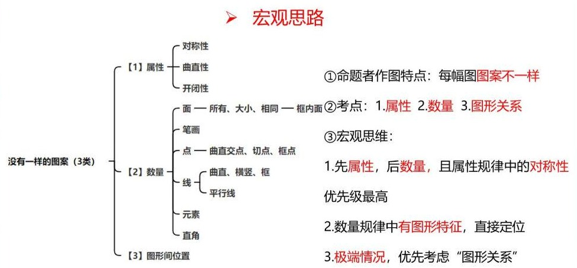

**宏观思维三条（课件原文）：**
1. 先属性，后数量，且属性规律中**对称性优先级最高**。
2. 数量规律中**有图形特征的，直接定位**（特征得背，知识点可以不背）。
3. **极端情况，优先考虑"图形关系"**。

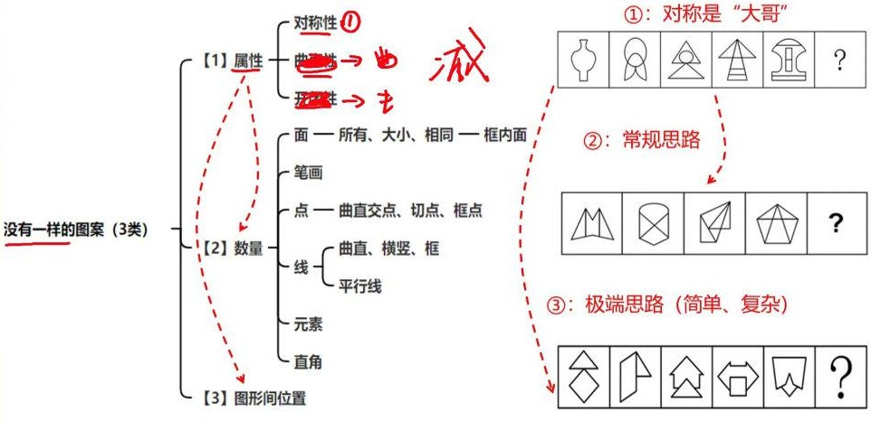

**做减法，把常规思路压缩成两条线：**
- 属性里的**曲直性**有明显信号（曲线占一定比例），**开闭性**也有明显信号（生活化图形），信号出现再去想就行。所以常规思路里把这两条划掉，只留对称性。
- 剩下的就是两条线：
  - **线①：对称轴不行 → 数量规律**（常规思路，大多数题走这条）。
  - **线②：对称轴不行 → 图形关系**（极端思路）。
- **什么时候走线②？** 只要满足下面任意一条：
  1. **过于简单**：每幅图只有 2~4 个图案，比如两个面、两条线、两个黑块。这时考数量等于送分，出题人不会这么出。
  2. **过于复杂**：线、点、直角多到根本不想数，出题人大概率也不会考数量。
- 老师强调这一步必须听懂，否则数量和图形关系会彻底混淆。

**考情变化：**
- 五到十年前，难题基本都出在数量规律，图形关系是送分题。
- 近一两年，**做不出来的难题基本都是图形关系**。它的图形非常新，特征背不下来，只能靠宏观思路定位。例如老师讲过一道四川的近似原题，第二天考试只换了颜色，很多同学就没认出来。
- 失分的两大来源：**数量规律不会做，以及图形关系定位不出来**。在属性上出错的反而很少。所以备考重心放在图形关系（★），它比例高、难度大。

---

## 2. 识别体系：看到什么图 → 先想什么规律（本章核心）

### 2.1 做题总流程（决策树）

```
拿到一道平面图推
│
├─ 0) 黑白块题？——几乎都能看成“有一样”，最容易混；先按下面流程试，注意黑白块有专属思路
│
├─ 1) 每幅图有没有“一样的图案”？
│    ├─ 完全一样（元素相同，只是位置/方向变）→【位置】
│    │     ├─ 宫格类（9/16/25宫格、蜂窝）
│    │     │     ├─ 内部有规律（内部都有同样的东西/同样个数）→ 内外分开看
│    │     │     └─ 内部无规律 → 常规平移（上下左右、斜着；方向可变）
│    │     │                    技巧：①大图案 ②数个数；不行 → 非常规：16宫格拆成2部分
│    │     ├─ 非宫格、线条类 → 隐藏外框（内部/外部）：①找特殊 ②就近原则
│    │     ├─ 整体转向/镜像 → 旋转/翻转：时针法、箭头法
│    │     └─ 大部分图案“不动”，只有局部变 → 相邻比较（动：颜色 / 移动）
│    └─ 部分一样
│          ├─ 相同位置的线条（线“对上了”）→【加减同异】①位置（与图3对比）②纵向 ③拆分
│          ├─ 外轮廓一样、内部黑白个数不一样 →【黑白运算】相同区域、对比选项
│          ├─ 相同元素重复出现 →【遍历】缺啥补啥（选修）
│          └─ 每幅图都有小图案（小黑点/小球/小方块）→【标记】标什么考什么
│
└─ 2) 没有一样的图案
      ├─ 先看属性
      │    ├─ 1/2（6图中3图）或 2/3（9图中6图）有曲线 →【曲直性】直接定位
      │    ├─ 生活化图形 → 生活化思路：面、部分数、开闭性、笔画
      │    └─ 规则、美观 →【对称性】（大哥）先识别、后细化；不行就快速排除
      │
      └─ 对称不行 → 二选一
           ├─ 极端：过于简单（2~4个图案，多为“两个”）/ 过于复杂（不想数）→【图形关系】
           ├─ 两个多边形外框同时出现：对称 → 图形关系 → 数量（直角、线）
           └─ 正常情况 →【数量】
                 ├─ 强特征 / 细化特征 → 直接定位（见 2.2 表）
                 └─ 只有弱特征 → 只有面特征：面→笔画→点；多端点：笔画→点
```

### 2.2 "图形特征 → 优先规律"速查表

**A. 有一样的图案**

| 看到的题干特征 | 优先想 | 接着排查 / 做法 |
|---|---|---|
| 每幅图元素组成**完全相同**，只是位置、方向在变 | 位置规律 | 宫格类先看内部；线条类看隐藏外框；整体转向看旋转/翻转 |
| 宫格（9/16/25宫格、蜂窝），且**内部都有同样的东西**（五角星、端点、交点、5个球、三角形……） | **内外分开看** | 不管背景换成什么宫格，都先看内部有没有规律 |
| 宫格里黑块/小球**个数不等**，在移动 | 常规平移 | 上下左右、斜着走，注意**方向可变**；技巧是先锁定**大图案**、再**数个数**；都不行就考虑 16 宫格**拆成上下两部分**各自运动 |
| 只有线条、没有宫格外框 | 隐藏外框（外框被删掉，因为外框会遮住线） | ①找特殊（比如画得少的斜线先看）②就近原则（步数越少越好） |
| 整体图形换朝向，可能镜像 | 旋转/翻转 | 箭头法：找**唯一参照物**，垂直参照物画箭头，看另一部分在箭头左边还是右边 |
| **大部分图案不动**，只有局部变 | 相邻比较 | 动的部分看两种：颜色互换，或位置移动 |
| 画成线条不奇怪，但**线条位置对上了** | 加减同异 | ①位置：图1、图2分别跟图3比 ②横向不行看纵向 ③有两种东西（球+线、曲+直）时拆分，分别找规律 |
| **外轮廓一样，内部黑白个数不一样**（金字塔形排布、挖空、颜色多等图形位置规律考不了的） | 黑白运算 | 相同区域、对比选项 |
| 同几样元素**重复出现** | 遍历（选修） | 缺啥补啥 |
| 每幅图都有**小图案**标记 | 标记 | 标点 → 引发的线条数；标线 → 线的位置；标面 → 单独面/相交面、相同/不同区域、大中小；多个标记 → 标记物之间的关系，或连线后与原图的关系 |

**B. 没有一样的图案：属性与图形关系**

| 看到的题干特征 | 优先想 | 接着排查 / 做法 |
|---|---|---|
| 图形**规则、美观** | 对称性（第一步） | 先识别，后细化：1 条轴 → 方向 → 与原图 线/面/点 的关系 → 结合笔画；多条轴 → 数量；多个规则图形 → 1+1 看平行/垂直/相交，N+N 看识别/运算 |
| 曲线占 **1/2**（6 图中 3 图，间隔分布或分组分类题任意分布）或 **2/3**（九宫格 9 图中 6 图） | 曲直性 | 直接定位，不受"生活化"干扰 |
| **生活化图形** | 生活化思路 | 面（数空白）、部分数、开闭性、笔画（新趋势） |
| 每幅图只有 **2~4 个图案**（两个面、两条线、两个黑块……） | **图形关系（简单型）** | 相离 → 之间的距离；包含；相交 → 看**接触处**是点、边还是面 |
| **乱线/乱黑块背景**，加上每图都有一个**共同图案**（面、圆、月亮、菱形） | **图形关系（复杂型）** | 共同图案与复杂背景之间的位置关系 |
| 某个面/图案**碰不碰外框、在框内还是露在框外**（外框可能是直接画出来的，也可能由乱线或黑块围成） | **与外框的关系（新趋势）** | 看得见的外框 / 看不见的外框 |
| **两个多边形外框**同时出现 | 多种考点都可能 | 顺序：对称轴 → 图形关系（相交面/线好看）→ 数量（直角、线的运算） |

**C. 没有一样的图案：数量规律**

| 看到的题干特征 | 优先想 | 接着排查 / 做法 |
|---|---|---|
| 五角星、日字、田字、圆相交 | 笔画 | 数奇点 |
| 直角三角形、十字架、矩形 | 直角 | 若直角**非常多**（如田字形），改考笔画 |
| **孤立**的小图案，彼此不连 | 元素 | 种类、个数；只有 2 种时先运算后换算；超过 2 种时找相同（自己 → 邻居），无相同则看属性 |
| 连在一起的**生活化**图形 | 部分数 | 连在一起就是一部分，**数黑色**（面数白色） |
| 单一线条（孤零零的横线、竖线）、都有曲线、两个多边形外框（黑框/白框、大框/小框） | 线 | 两种线的**运算**：曲线/直线、横线/竖线、多个外框 |
| **只有面特征**（封闭区域明显，但没有其他特征） | 弱特征 | 面 → 笔画 → 点（面是最弱的特征，别一上来就数面） |
| **多端点**（线头多、线条交叉多） | 弱特征 | 笔画 → 点；**若同时有曲线，先走曲线思路** |
| 每个面形状一样 / 都有三角形 / 只有两种形状的面 | 所有面 | 形状 / 三角形个数 / 运算 |
| **明显**的大面、小面 | 大小面 | 形状（自身、跟外框比、传递）、属性（以对称为主）、面积 |
| 出现一模一样的面 | 相同面 | — |
| 画了斜线、两个相似三角形 | 平行线 | 同一方向超过两条时，考的概率极低 |
| 一个圆 | 切点 | → 框点（先看更可能的框上点或框内点；多边形外框也可能考框内点）→ 框内面/框内线（低频） |
| 两个圆相交 | 笔画 → 点 | — |
| 非圆曲线 | 曲直交点 | → 曲线与直线的运算 |

### 2.3 优先级与排除原则（老师的"新判断方法"）

1. **对称是"大哥"，曲线是"二哥"**：对称永远是没有一样时的第一步；曲线是强特征，优先级靠前。
2. **强特征先，弱特征后**：一幅图常常同时带多个特征。面的特征人人都有，是最弱的；端点常是画曲线时顺带露出来的，也弱。先问自己"除了面，还有没有更强的特征"。
3. **二选一时的性价比**：图形关系和数量都说得通时，**先试图形关系**。相交面、相交线一眼就能看出来；数量要逐条数，还可能涉及运算。**越复杂的事情越往后放**。
4. **没有强特征就直接套**：出题人故意用面、笔画、点混淆你时，不必区分，按**面 → 笔画 → 点**直接试（多端点时试笔画 → 点）。
5. **对称轴快速排除**（见 5.3 节）：只有"全是一条对称轴"时要多想，其他情况快速排。
6. **分组分类题一般不考位置和运算**：六图分两类的题，背景又各不相同时，考不了位置；样式运算一般出在两组图或九宫格里。
7. **国考命题严谨**：平行线在同一方向上一般只画两条；超过两条，考平行线的概率就极低。

---

## 3. 新考点：图形间关系（第六节，完整讲解）

### 识别信号（看到什么，想到它）

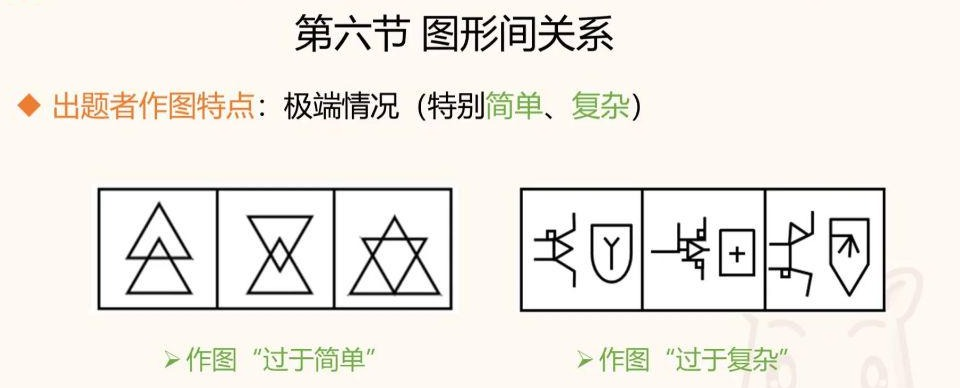

- **过于简单**：左图每格就是两个三角形。让你数面，1 个、2 个、3 个，等于送分，这不是数量规律的作图风格，而是图形关系的风格。
- **过于复杂**：右图每格都是"左边一团乱线 + 右边一个图案"。数直角、数点、数线都太多，左右也对不上。复杂图形在这里只起一个作用：给出**左、右两个位置**。
- 所以"图形间关系"更准确的说法是**图形间的位置关系**，左右、内外、上下都算位置关系。
- 总结：**对称轴不行时，正常走数量；一旦过于简单或过于复杂，直接跳到图形关系**。

### 规律讲解

#### 分类总览（思维导图）

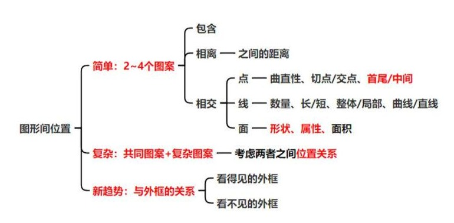

| 类型 | 识别 | 考查方向（**加粗**的是标红必记项） |
|---|---|---|
| 简单型 | 2~4 个图案，**实际绝大多数是两个** | 包含；相离 → 之间的距离；相交于点 → 曲直性、切点/交点、**首尾/中间**；相交于线 → 数量、长/短、整体/局部、曲线/直线；相交于面 → **形状、属性**、面积 |
| 复杂型 | 共同图案 + 复杂图案 | 考两者之间的**位置关系** |
| 新趋势 | 与外框的关系 | 看得见的外框 / 看不见的外框 |

> 老师说：课件写"2~4 个图案"是留了余地，实际基本都在考**两个图案**之间的位置关系。"两个"太重要了。

#### ① 相离、包含、相交（点/边/面）

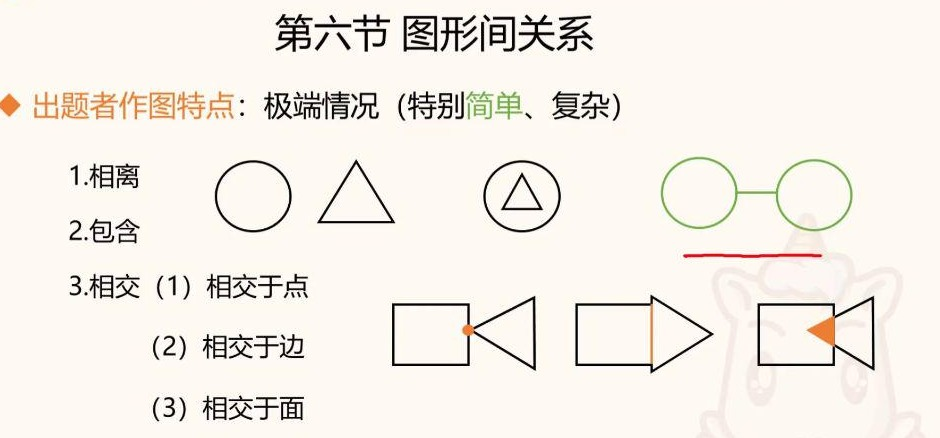

- **相离**：分开、没连在一起。考**之间的距离**，比如中间隔的是一条线还是一个面。
- **包含**：一个把另一个整个包在里面。
- **相交**：看两个图案**实际接触的地方**：
  - 接触于一个点 → 相交于点；
  - 接触于一条边 → 相交于边（线）；
  - 重叠出一块区域 → 相交于面（把三角形还原回去，重叠部分就是那块面）。
- **易错**（图中绿色部分）：两个圆由一条线段相连，属于**相交于点**。因为两个图案真正接触的地方是点，**不要被中间那条线干扰**。

#### ② 相交于点：交点/切点、曲直性、首尾/中间

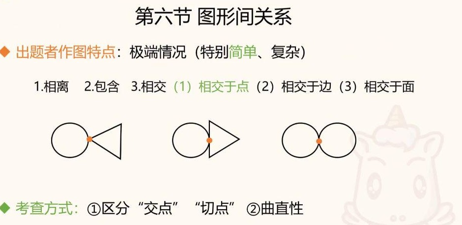

三种考法：
1. **区分交点、切点**：两个图案相交的点是交点；两者之间有相切关系的是切点，这个比较直观。
2. **曲直性**：接触点两侧是曲线加直线（圆和三角形），还是曲线加曲线（两个圆）。
3. **首尾 / 中间**（标红，难点，也是课件补上的内容）：看**相交处在线条的哪个位置**。
   - 例：一条曲线和一条直线相交。交在曲线的**端点处**，叫首尾；交在曲线的**正中间**和直线的中间，叫中间。
   - 这类题如果从曲直性看，全都是曲直交点，分不了类，**唯一能区分的就是相交处的位置**。
   - 有同学提到"引发的线条数量"，那是另一个考点（标记里的点）。

#### ③ 相交于边（线）：数量、长短、整体/局部、曲/直

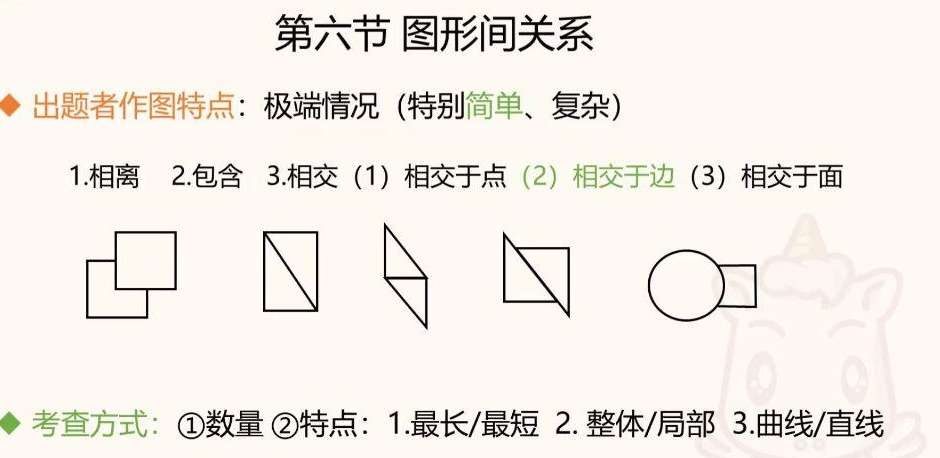

- **边还是面，不要脑补**：第一幅两个正方形，有同学觉得是"一个压在另一个上面"，所以是相交于面。这是自己脑补了被遮住的部分。**如果考相交于面，出题人一定会把重叠区域画出来**。这里连接处只是一条线，就是相交于边。点和边也一样，**看接触的地方是什么就考什么**。
- 四种考法：
  1. **数量**：接触的地方有几条线（1 条、2 条……）。
  2. **长短**：**跟自身比，不跟别人比**。比如三角形有三条边，与别人相交的是它自己最长的边还是最短的边。这是刚起步最容易混的点。
  3. **整体 / 局部**：最长边**完全**和对方重叠，还是有一部分没重叠。
  4. **曲线 / 直线**：相交处是直线，还是曲线。

#### ④ 相交于面：形状、属性、面积

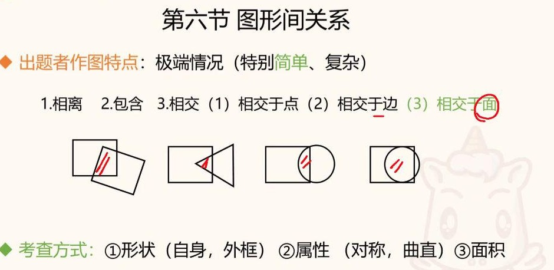

- "**形状、属性、面积**"是一切"面"考点的万金油，大小面也是这么考的。只要跟面有关，想出得细一点、难一点，都从这三个角度出。
  1. **形状**：
     - **自身**：相交面有几条边，比如 4 条、3 条。
     - **外框**（更难，别忘了）：相交面和外框，或者和其中一个图形长得像，比如相交面是三角形，外框也是三角形。
  2. **属性**：开闭性考不了，主要考**对称性**（相交面是不是对称图形）和**曲直性**（相交面全直线，还是曲直都有）。
  3. **面积**：一定是非常直观、明显的大面和小面，不会很难，考得也少。
- 考试主要考**对称性和形状**（标红），面积次要。

#### ⑤ 复杂型：共同图案 + 复杂图案

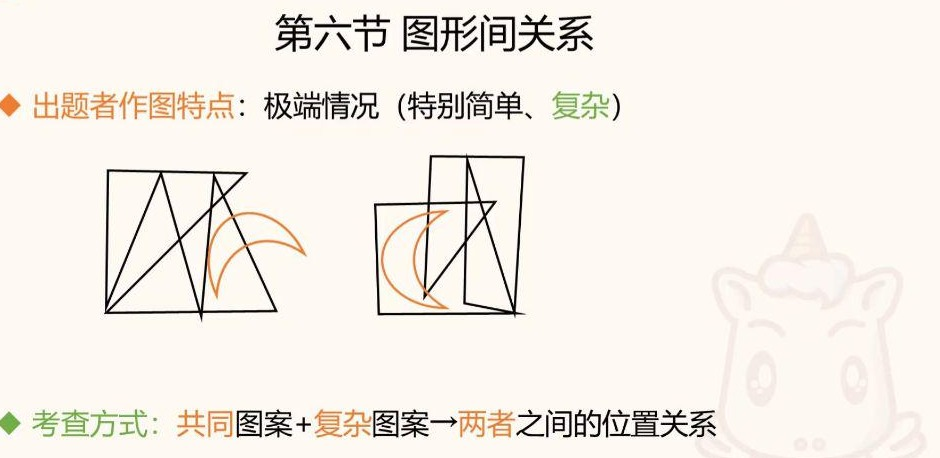

- **复杂**：背景是一堆乱七八糟的直线，数线（1、2、3……8 条）、数面、数点都让人崩溃，所以不想数。
- **共同**：每幅图都有一个月亮。每幅图都有的东西，出题人一定想考。
- 于是考**共同图案与复杂背景之间的位置关系**：月亮是一部分露在乱线外面，还是全部在里面，本质是一种"包围"。
- **为什么考场上还能认出月亮？** 考卷不是彩印，月亮也是黑色的。出题人让月亮是**曲线**、背景是**直线**，靠曲直把两者区分开。要是画个正方形，就和背景混在一起分不出来了。所以**共同图案往往是曲线**（圆、月亮）。

#### ⑥ 新趋势：与外框的关系（看得见 / 看不见）

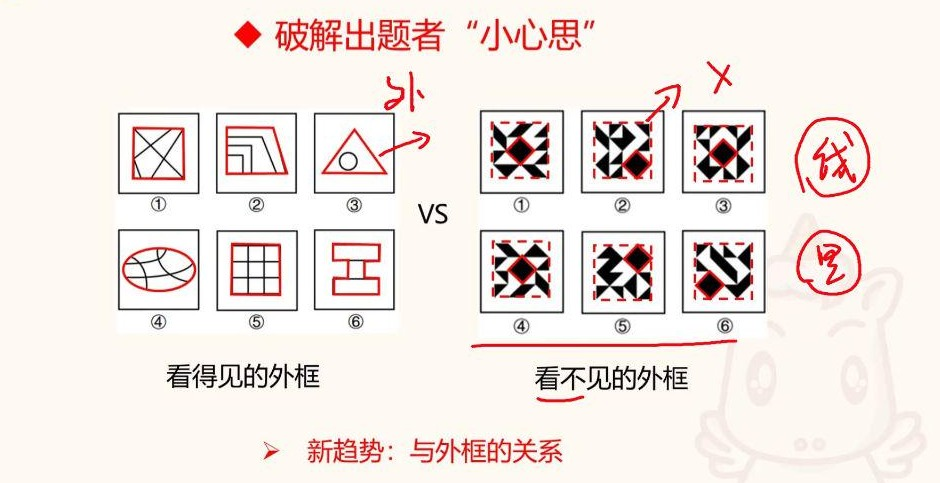

- 出题本意很简单：图案**在外框里面还是外面**，或者**有没有碰到外框**。但直接画一个正方形框加一个小图，那是"送分"（老师原话："我是你亲戚吗？"）。
- 所以出题人要**淡化外框**，用复杂的线条或黑块把外框"构造"出来，这就是**看不见的外框**。老师的比喻是"刀子嘴豆腐心"：本意是好的，画出来却很难看。
- **看得见的外框**：外框直接画出来了，难点在于定位。
- 近几年连续的新题都在考与外框的关系。当下 **90% 以上的图形关系难题都会结合外框**，25、26 年考得非常多，这个趋势预计还会延续两三年，所以在思维导图里单独列为"新趋势"（★）。

### 易错点 / 老师提醒

- **定位比做题重要**：每道图形关系题都要能说出"为什么不走数量"，要么太简单，要么太复杂。
- 看相交类型时**只看接触的地方**，不要脑补被遮住的部分。
- 相交线数量可能**从 0 开始**（相交于点就是 0 条线），这是难点。
- 长短**跟自己比**；首尾分不清没关系，**中间一定认得出**。
- 复杂型容易跟数量里的切点、框点、平行线混（见例 7、例 8）。
- **考情**：去年国考 20 道图推中有 4 道在考图形关系，四川 8 道中 3 道，浙江 10 道中 2 道，天津 5 道中 2 道。讲稿原话是"图形分析"，结合上下文指图形关系；各省的难题都集中在图形关系上。简单型越考越少，与外框的关系越考越多。
- **必记（标红）**：相交点的首尾/中间，相交面的形状/属性；复杂型和与外框的关系是难题方向（★）。其他内容理解即可，考试时一定会做。

### 例题

#### 例1（22福建）包含 / 相交

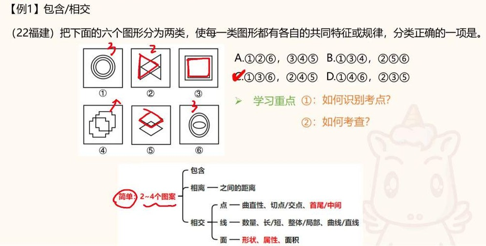

**思路**：
1. 前两幅图不一样，走"没有一样"的思路，先看对称：①②③⑤⑥都是轴对称加中心对称，④也接近。**只要是两条以上对称轴（轴+中心），就没法细化**，因为只有一条对称轴时才去考虑线、面、点；识别又分不了类，所以不管④对不对称，都应该跳过对称。
2. 二选一：数量还是图形关系？**太简单了**。①是三个圆，②是两个三角形，③是两个长方形，④是两个十字形，⑤是两个菱形，⑥是三个椭圆，每幅都只由两三个外框构成，所以直接定位图形关系。
3. 看位置关系：①③⑥像俄罗斯套娃，一层套一层，是**包含**；②④⑤是两个图形**相交于面**。

**答案**：C（①③⑥，②④⑤）

#### 例2（26国考）相离：之间的距离

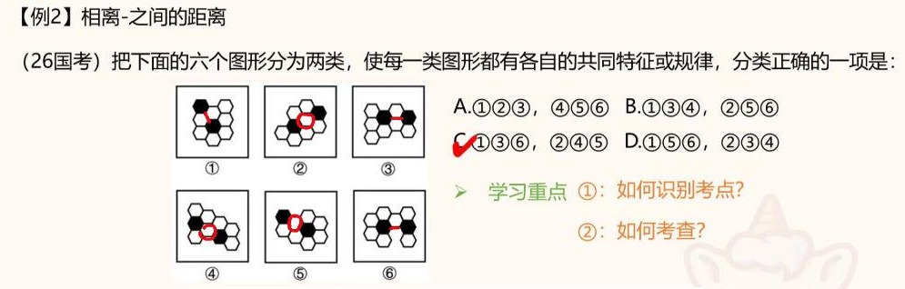

**思路**：
1. 这是黑白块题，几乎都会被看成"有一样"：背景白块不同，但每幅图都有两个黑块，很想往位置上想。可是这是**分组分类题且背景不一样，考不了位置**；样式运算一般出在两组图或九宫格里，也考不了；理解成标记勉强可以，但老师更希望理解成图形关系。
2. 按"没有一样"思路：对称不行后二选一。数两个黑块谁都会，**太简单**，所以走图形关系。
3. 两个黑块是分开的，属于相离，考**之间的距离**：①③⑥两黑块之间只隔**一条线**；②④⑤之间隔着**一个白色六边形（一个面）**。
4. 另一种理解：把两个黑块当成两个**标记**，要么直接看它们的位置关系，要么**连线**，看连线是穿过一个面，还是与线重合，本质一样。**不要被知识点框死**：有些图同时满足多个特征，走哪条线都合理。

**答案**：C（①③⑥，②④⑤）

#### 例3（25国考）相交点：首尾 / 中间

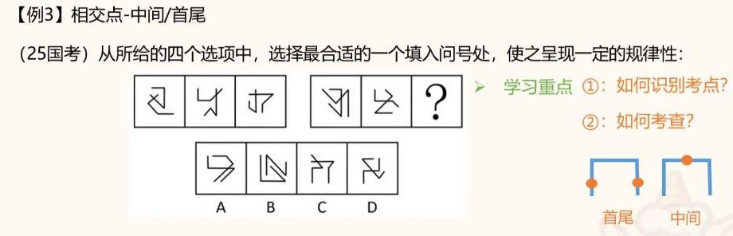

**思路**（当年国考难题，**难在定位**）：
1. 两条线画的形状各不相同，走"没有一样"。为什么不走数量？每幅图给人的感觉是**两条线**：一条红的、一条蓝的，两个东西。拿两条这么短的线去考数量太简单了，所以倾向图形关系。
2. 走数量的话，唯一可能的试错方向是**平行线**，因为图里确实有斜线。但第 3 幅图同一方向上超过两条，国考一般一组一个方向只画两条，超过两条就不严谨，**考的概率极低**，所以把它往后放。
3. 定位到相交于点，考**首尾 / 中间**：每条线都像三段式的订书钉（1、2、3 段）。1 和 3 长得太像，分不清谁是首谁是尾，但**第 2 段（中间）一定认得出**。
4. 左组前三幅：两条线都是用首或尾的那段相交，没有一条用中间段。右组两幅：两条线**都用中间段**相交。
5. 看选项：
   - A：一条线是中间段相交，另一条是首尾段相交，排除；
   - B：两条线根本没相交，排除；
   - C：两条都是首尾段，排除；
   - D：两条线都是中间段相交，符合。

**答案**：D

#### 例4（26四川）相交线：数量

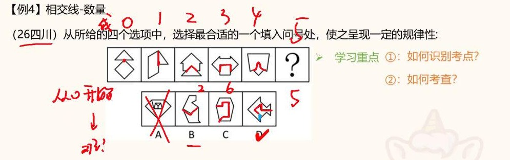

**思路**：
1. 前两幅图（菱形+三角形，平行四边形+三角形）不一样，走"没有一样"。后面几幅图其实都挺对称，挺容易考对称；但**第 2 幅里一出现直角三角形，就没有对称性了**，用这一点快速排掉对称。
2. 二选一：又是"两个"（前面是两条线、两个黑块，这里是两个面相交），**太简单**，所以优先图形关系。
3. 第 1 幅是相交于点，可以理解成**相交线为 0 条**，**"从 0 开始"是难点**。之后依次相交于 1、2、3、4 条线，所以问号处应是 **5 条**。
4. 选项：
   - A：题干都是两个面，A 的面太多，相交情况复杂，直接跳过；
   - B：2 条；
   - C：数仔细是 6 条，多一条；
   - D：注意有一条**极短的相交线**（课件蓝色标出），出题人很"坏"，考场上不好看，漏数了就会错选。数全是 5 条。
5. **复盘两条线的性价比**：这题走数量也说得通，可以数两个外框的线条数（比如四边形 4 条、三角形 3 条），做 1、0、-1 这样的运算，上节课做过好几道。但走数量要数两个外框的线，还要运算（数到 10 条都有），比看相交线慢得多。**两种可能并存时，优先图形关系，越复杂的越往后放**。

**答案**：D

#### 例5（25山东）相交线：长短

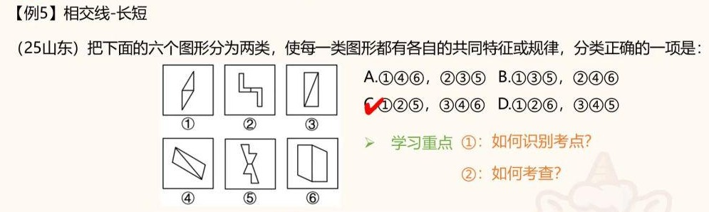

**思路**：
1. 前两幅（直角三角形、L 形）不一样，走"没有一样"。看对称：单个图形⑤不对称，但**整体看**，①两个三角形绕中点旋转 180° 能重合，是中心对称；②两个 L 形也是中心对称……四个都是中心对称，**只能考识别，识别又分不了类，中心对称也没法细化**，直接排除。考场上容易在这里卡住。
2. 二选一：两个图形，**太简单**，走图形关系。
3. 都是相交于线。四种考法不用逐个试：看图时"线明显有长有短"的感觉一下就出来了，直接定位**长短**。
4. **跟自身比**：①②⑤共用的是各自**最短**的边，③④⑥共用的是各自**最长**的边（③④是矩形和平行四边形被对角线分开，⑥是两个四边形共用长边）。

**答案**：C（①②⑤，③④⑥）

> 老师提醒：思维导图里黑色部分（数量、长短、整体局部、曲直）讲过一次、做过一次就不会忘；**红色部分（首尾/中间、形状/属性）真的会忘**，重点记红色。

#### 例6（20安徽）相交面：形状

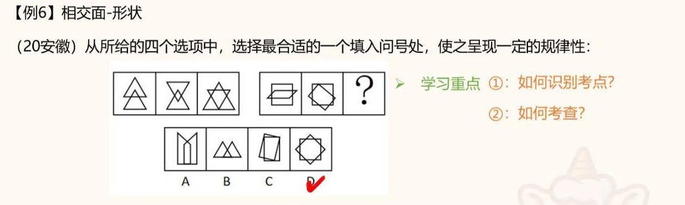

**思路**：
1. 左边的图还算规则，可能考对称；但右边的图不对称，排除对称。
2. 二选一：两个三角形、两个四边形，**两个面相交，太简单**，走图形关系。
3. 相交于面，从形状、属性、面积入手；形状和属性更重要。数**相交面的边数**：第一组 3、4、5，第二组 6、7，问号处应为 8。
4. A、B、C 的相交面边数都太少，只需验证 D：两个正方形错开 45°，相交出正八边形，8 条边。

**答案**：D

> 小结：为什么不考虑数量？图案太简单（两个）。考试中图形关系**多数情况都是"两个"**，这就是它和数量的区分标志。

#### 例7（23联考事业）复杂型：面与线的关系（拆分思维）

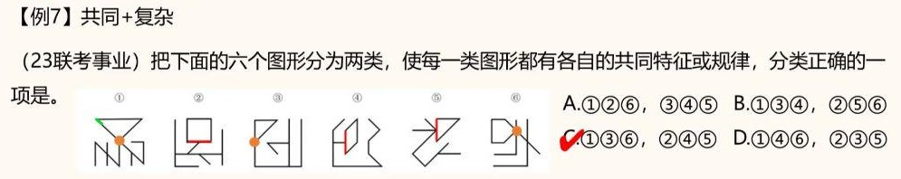

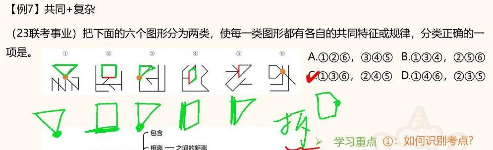

**思路**（考场定位非常难）：
1. 正方形、三角形不一样，走"没有一样"；线画成这样肯定不对称，排除对称。
2. 二选一：上面的面很清晰，但下面乱七八糟的线，让你数线、数点都不乐意。数平行线？同方向有三条，考的概率也不高。所以是**太复杂**，走图形关系。
3. **共同**：每幅图都有一个面（封闭区域）；**复杂**：下面画得各不相同的乱线。于是考**面和线的位置关系**。
4. 难点：**整体看，所有图都是"线碰到面"，都相交于点，分不了类**。这道题在"面"上做文章，要用**拆分思维**：把线全遮住，**只站在面的角度**，看面是用什么和线接触的。
   - ①三角形用**顶点**碰到线；②正方形用**一条边**贴着线；③三角形又是**顶点**；④菱形是**边**；⑤也是**边**；⑥五边形是**顶点**。
5. 有同学问③为什么不是线：只看接触处，③接触线的是三角形的顶点。如果考相交于线，这个三角形得转个方向，让一条边贴上去。

**答案**：C（①③⑥，②④⑤）

> ★ 老师提醒：联考事业单位的图形关系题是国考抄题的重点方向。去年国考前老师把联考事业单位的题都读了一遍，这道题国考没抄，所以今年更要重视，各省都值得关注。

#### 例8（22联考事业）复杂型：圆与外框的关系（看不见的外框）

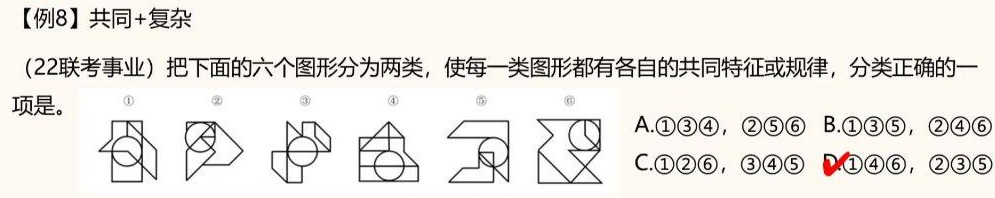

**思路**：
1. 背景各不相同，每幅图都有**圆**。第一反应往往是数量里和圆有关的考点：**切点、框点**。
   - 切点：各图相切个数不一，③⑤的相切关系很怪，很难考，排除；
   - 框内点：中间大多没点，不考；
   - 框上点：个别图数量太多，和其他图差距大，不考。
2. **这道题难就难在一定会跟数量（切点、框点）混**，这不怪你。
3. 换个角度：**共同**的是圆，和前面的月亮一个道理；**复杂**的是背景乱线，不想数。所以考**圆和乱线的关系**：
   - ①圆全在乱线围成的区域内；
   - ②大部分在内，**露出一点**在外；
   - ③露出一点；
   - ④全在内；
   - ⑤露出一点；
   - ⑥全在内。
4. 出题本意：用一个正方形外框，圆全在里面，或稍微露出一点。那样太简单，所以用复杂线条把外框"藏"起来。把乱线删掉，只描出外框（蓝色），一眼就能看出来。
5. 共同图案不一定是圆，画成月亮也一样，但**一定得是曲线**，否则跟直线背景混在一起，看不出来。

**答案**：D（①④⑥，②③⑤）

#### 例9（25国考）与外框的关系：看不见的外框

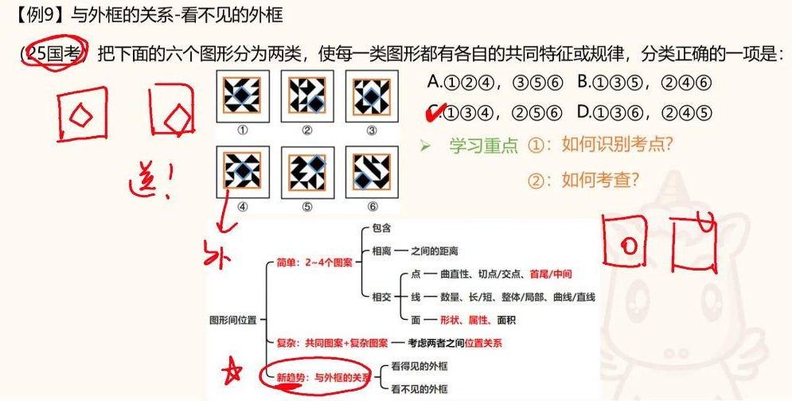

**思路**：
1. 每幅图都有一个**菱形**，每幅图都有的东西，出题人一定想考。
2. 为什么不走数量？要数的话是 8~9 个方块，从元素角度数太多，所以不从数量入手。
3. **共同**的是菱形，**复杂**的是背景黑块，考菱形和黑块的关系。这里的黑块其实起到**外框**的作用，和前面乱线围成外框是同一个概念。
4. 如果直接画成"正方形外框加中间一个菱形，碰或不碰"，那就是送分（老师在旁边画了这个简化版，写了"送！"），所以出题人要把外框淡化。
5. 分类：菱形是否碰到外框。①不碰，②碰，③不碰，④不碰，⑤碰，⑥碰。

**答案**：C（①③④，②⑤⑥）

#### 例10（26四川）与外框的关系：看得见的外框

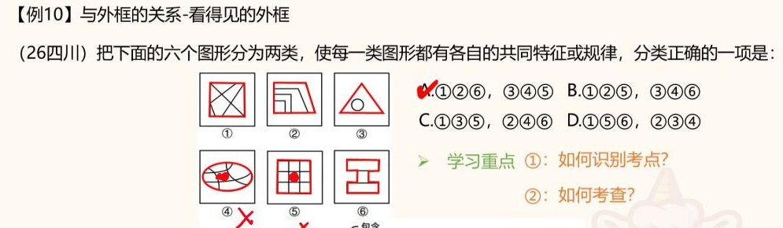

**思路**（绝对的定位难点）：
1. 图各不相同，对称排掉，在数量和图形关系之间二选一。
2. **找极端**：看图时要有极端的思想，要么找最简单的，要么找最复杂的。这题最特殊的是**③：太少**，只有一个圆和一个三角形。
3. 如果走数量：面差距太大；线、点数量差距也大，③只有 3 个点，没法比。唯一可能试错的是**笔画**，但各图笔画是 2 笔、3 笔、4 笔，用 4 笔和 2 笔去分类太夸张，所以不考笔画，也就一定不考数量。
4. 只能是图形关系。从③入手：出题人在提醒你**这里只有两个图形，圆和三角形，而且圆没碰到三角形**。找有同样关系的图：把各图外框描出来，④中间有一个面没碰外框，⑤中间的格子也没碰外框；①②⑥的所有面都和外框碰在一起。
5. 规律：**③④⑤内部有一个面跟外框没碰**。

**答案**：A（①②⑥，③④⑤）

> ★ 老师总结：这道题的外框直接画出来了，这是"好心"的地方，难只难在定位。例 8、9 的外框没画，是用复杂线条或黑块构造出来的**看不见的外框**。例 8、9、10 连着考与外框的关系，这是最新趋势。

---

## 4. 串讲①：有一样的图案（位置、相邻比较、样式、遍历、标记）

> 这一部分是前面各章的复盘，老题只配图、写识别要点，答案以课件标注为准。

### 4.1 位置规律

**识别信号**：每幅图元素完全一样，所有东西都在动。

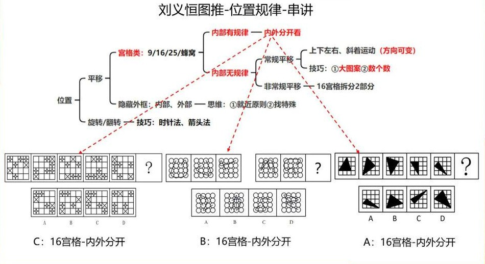

- **宫格类（9/16/25 宫格、蜂窝）**：拿到手**先看内部有没有规律**。
  - 内部有规律 → **内外分开看**。例：三道 16 宫格题的内部分别都有四角星、都是端点、都有三角形的交点。16 宫格最常见。
  - 内外分开是**高频考点**，图案一直在创新，但不管背景换成什么，都只看内部有没有规律。

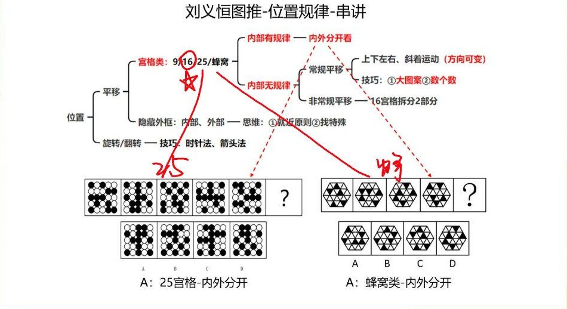

- 背景换成 25 宫格（内部都是 5 个球）、蜂窝（内部都有一个三角形），底层逻辑不变。

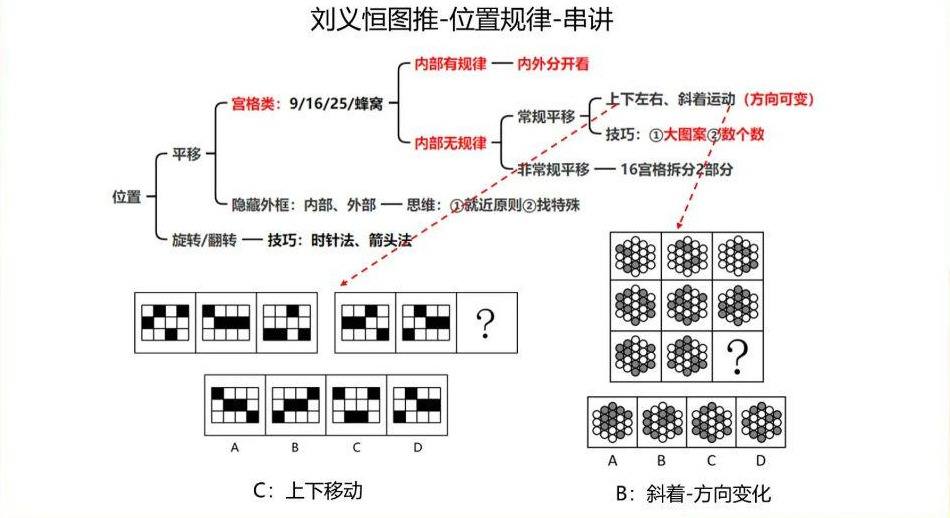

- **内部无规律**（内部个数不相等）→ **常规平移**：上下左右、斜着运动。
  - **方向可变**（标红，极易忘）：右题小球先沿右上方向走一步，按常规还应继续往右上，结果却往右下走了。
  - 技巧：①**大图案**：先看最大的那块图案怎么动，比如由小球组成的平行四边形，常能直接锁定答案；②**数个数**。

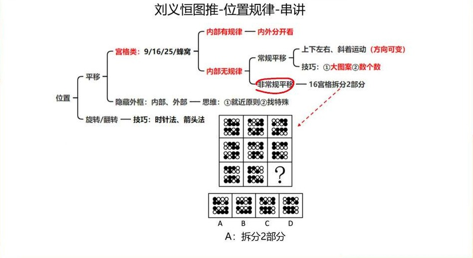

- **非常规平移**：把 16 宫格**拆成上下两部分**分开看。上半部分小球沿逆时针转，下半部分两个小球整体向左移；一个是左右移动，一个是打圈旋转，所以才分成两部分考。

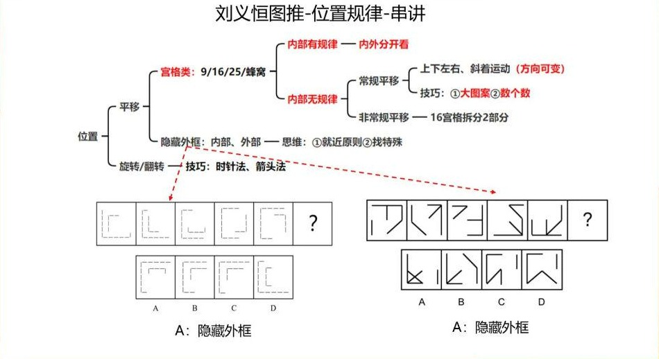

- **非宫格（隐藏外框）**：主要考**线**的运动。外框会和线重叠、把线遮住，所以删掉外框，可能删内部，也可能删外部。
  - ①**找特殊**：比如题干里斜线画得少，先追斜线，思路更清晰；
  - ②**就近原则**：步数越少越好，比如能判断出"逆时针、每次两步"。

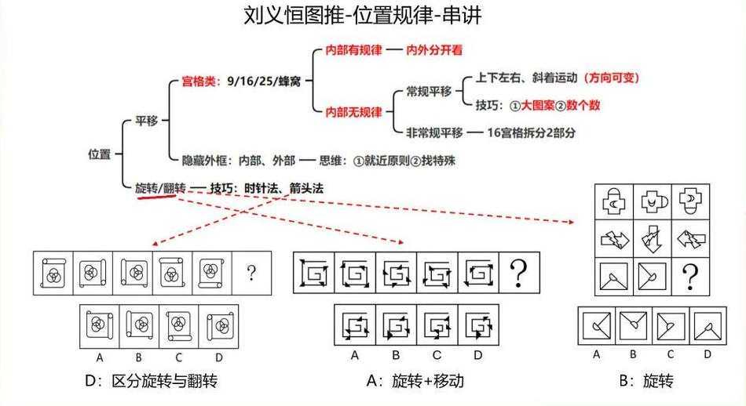

- **旋转 / 翻转**：旋转翻转相对简单，最难的是**区分旋转还是翻转**，用**箭头法**。关键是找到**唯一的参照物**：左题以卷轴那根长杆（讲稿里叫"粉笔"）为参照，垂直长杆画箭头，看卷角那个半圆在箭头左边还是右边，左右一变就是翻转。

### 4.2 相邻比较

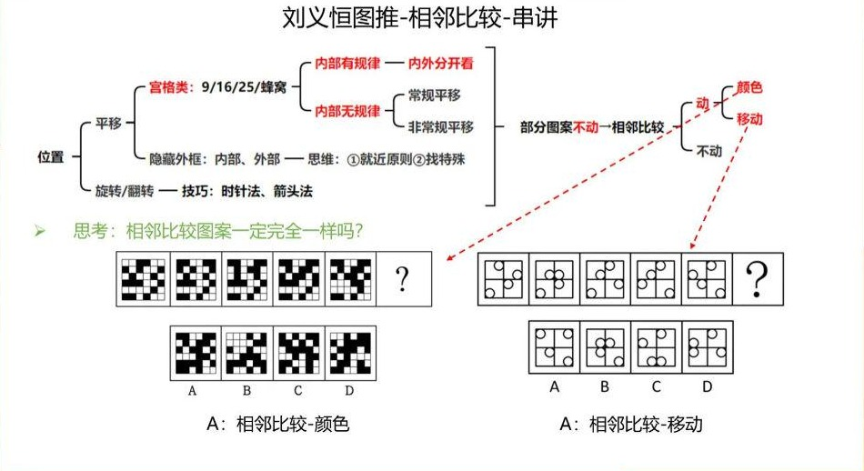

- **区分位置规律**：位置规律是**所有东西都在动**；相邻比较的关键词是**"不动"**。发现有的球、有的部分一直不动，直接定位相邻比较。
- 动的部分有两种：
  - **颜色**：左题下面几排都一样，只有第一排黑变白、白变黑，颜色互换；
  - **移动**：右题下面部分不动，上面的小球移到下面、左边，整体顺时针走。
- **思考：相邻比较的图案一定完全一样吗？** 不一定。考移动时图案不变，和位置规律长得一模一样；考颜色时黑块个数会变，只是很像。把它放在位置规律后面，是因为考试**多数在考移动**，图案和位置规律非常接近。

### 4.3 样式：加减同异

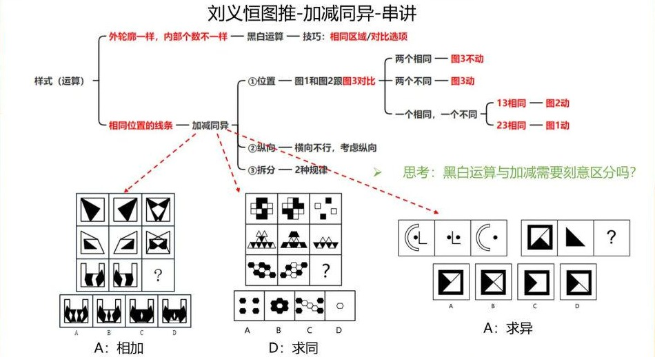

- **定位**：**相同位置的线条**。画线本身不奇怪，但线的位置对上了，就是想让你判断线条保留还是抵消。
- 基础的加、减、同、异不再讲，考试的难点有三个方向：

**① 跟位置结合（"谁动"）：图 1、图 2 分别跟图 3 比**

| 对比结果 | 结论 |
|---|---|
| 两个都相同（两个勾） | 图 3 不动 |
| 两个都不同（两个叉） | 图 3 动 |
| 一个相同一个不同（一勾一叉） | 1、3 相同 → 图 2 动；2、3 相同 → 图 1 动 |

- 上图三道题都是**两个勾，图 3 不动**：跟图 3 比，左边的三角形和图 1 一样，另一个三角形和图 2 一样；方块也都对得上；小黑球和 C 字形分别出现在图 2、图 1 中。

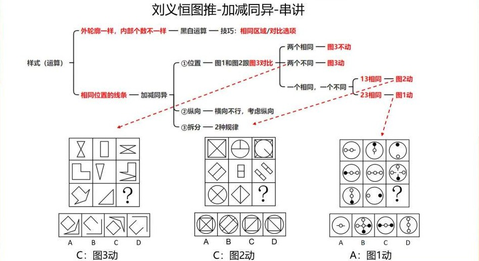

- **图 3 动**（左）：图 3 的长方形轮廓是横着的，图 2、图 1 的是竖着的，位置都对不上，出现两个叉。
- **图 2 动**（中）：看第二排，正方形外轮廓和图 1 对得上（1、3 勾），日字形和图 2 位置对不上（2、3 叉）。
- **图 1 动**（右）：跟图 3 比，黑球对得上（2、3 勾），白球对不上，所以图 1 动。
- 做多少题都一样，唯一要分清的是**一勾一叉**的情况。

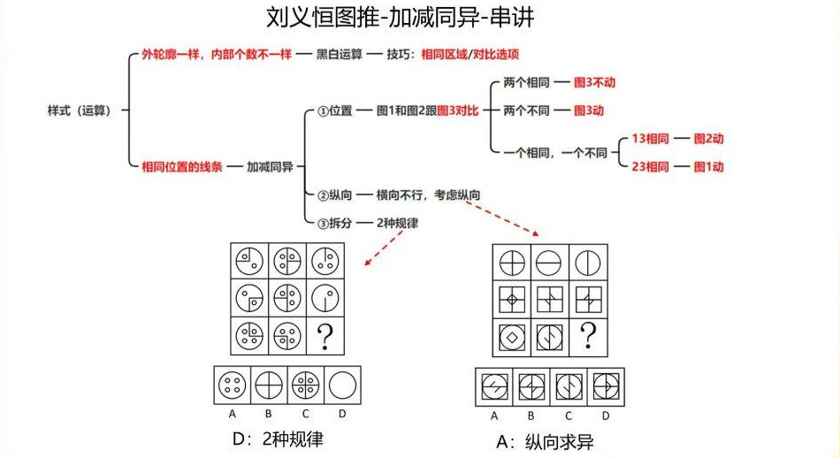

- **② 纵向**：横向不行就看纵向（右题：纵向求异）。
- **③ 拆分**：图中有**两种东西**（小球和线条，或者理解成曲线和直线）时，可能各走各的规律。左题中，线条是一样的保留（求同），小球是不同的保留（求异）。
- **考情**：
  - 纵向主要是**联考**（"315 联考"省份）考得多；拆分主要是**上海**考得多；
  - 其他省份（包括国考、广东、山东）主要考**位置**，也就是"谁动"（★，每个省份的重点）；
  - 掌握范围：联考考生要掌握①②，上海考生要掌握①②③，其他考生掌握①。
- 现在的主流更倾向于**加减同异考"动"的问题**，这两年非常重要，要作为核心准备。
- 课件思考题"黑白运算与加减需要刻意区分吗？"讲稿没有展开。💡 补充（据课件例子推断）：上图的相加、求异题本身就是黑色图形，可见黑色图形也常考加减同异；两者都属于"部分一样 → 样式（运算）"，定位到这一类后都可以试，不必强行区分。

### 4.4 样式：黑白运算

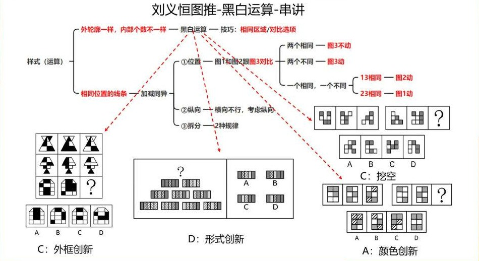

- **定位**：外轮廓一样，内部黑白个数不一样。考试比较好定位：
  - 外轮廓画成这样（外框创新、**金字塔形**排布），还能考位置吗？考不了；
  - **挖空**了，还能考移动吗？也考不了；
  - 颜色这么多，也不是位置。

  这些都是黑白运算。
- 两个解题技巧：
  1. **相同区域**：找两个一样的区域（比如都是黑+黑、白+白），它们的运算结果一定一样，拿去对选项，往往一步就能选出答案；
  2. **对比选项**：看选项哪里不同，比如左上角不同，就回去推左上角的白+黑等于什么。

### 4.5 遍历（选修）

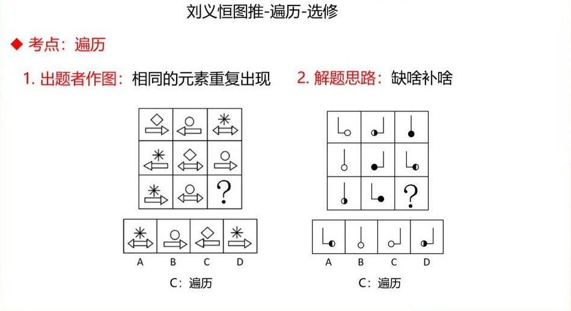

- **出题者作图**：相同的元素重复出现。**解题思路**：缺啥补啥。
  - 左题：箭头有朝左、朝右两个方向，这一行缺朝左的；元素有米字、圆、菱形，缺菱形，所以选 C。
  - 右题：L 形的朝向缺朝左的，排除 A、B；圆有空白、半实心、实心，缺空白，所以选 C。
- **考情**：只有 315 联考和上海偶尔考，国考从没考过；十年前各省常考，现在嫌太简单。准备不准备都不影响得分，所以老师把它删成选修，**了解即可**。

### 4.6 标记

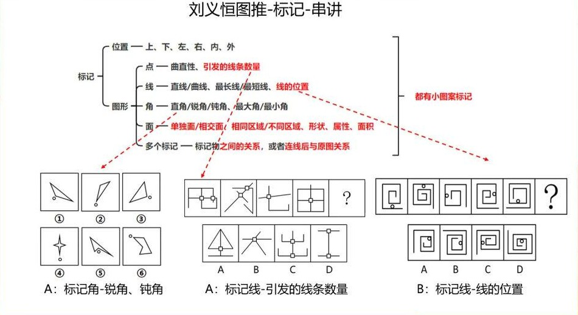

- **定位**：题干中每幅图都有小图案（小球、小正方形、小黑点），定位很轻松。
- **标什么考什么**：标记的都是点，有的图一个、有的图两个，也没关系。
- 标红的难点：
  - **点 → 引发的线条数量**：中题每个标记点都引出 4 条线。
  - **线 → 线的位置**：以端点为参照，标记的是离端点第几条线，右题是第 2、3、4 条递增。
  - **面**：
    - **单独面 / 相交面**：标在两图重叠处的是相交面，标在只属于一个图形的部分是单独面；
    - **相同区域 / 不同区域**：两个标记在不在同一个面里；
    - 形状、属性、面积已经很熟了；
    - 面积的新考点是 **"大、中、小"**：比如三角形标每幅图最小的面，正方形标**第二大**的面，圆标最大的面。"中"考得越来越多。
  - **多个标记**：两种想法。
    1. 考**标记物之间的关系**，比如标记的两个面是相交于线还是相交于点；
    2. 标记点都在图外面、不好看时，才**连线**，看连线和原图的线是垂直还是平行。

    **不要每道题一上来就连线**。
- 直角、锐角、钝角这类标记不用讲。
- **考情**：多数省份目前考得都比较少，属于"可能性考点"，别放太多精力。有一样的三类里，**位置和样式考得非常多，是重心**。

---

## 5. 串讲②：属性（曲直性、开闭性、对称性）

### 5.1 曲直性与开闭性

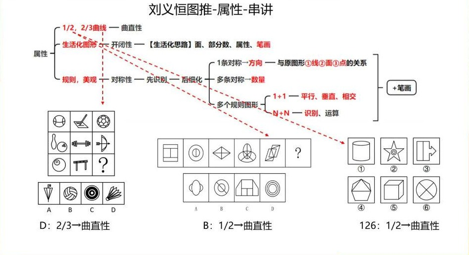

- **曲直性**：用曲线定位，而且曲线要占一定比例。
  - **1/2**：一组 6 幅图里有 3 幅曲线，可以间隔分布；分组分类题里位置可以随意；
  - **2/3**：多见于九宫格，9 幅里画了 6 幅曲线；

  看到这个比例就直接定位。
- 为什么把开闭性单独和生活化挂钩，而不把曲直性挂上去？就算用生活化图形考曲直性，**"1/2、2/3"的比例特征也丢不掉**，所以不管有没有生活化，只看比例。
- **生活化图形 → 生活化思路**，四大方向：
  1. **面**：通过空白数面；
  2. **部分数**：分开得很明显；
  3. **属性（开闭性）**：有完全开放、一个面都没有的，也有完全封闭的；
  4. **笔画**：用生活化图形考笔画，是新趋势。广东、深圳、浙江、联考都明确出过，老师建议**所有省份都准备**。
- 生活化考对称性十年前常见，现在一考得分率就在 90% 以上，出题人不愿意再出。生活化的属性题现在主要是**开闭性**，而开闭性主要是 **315 联考**考。

### 5.2 对称性：先识别，后细化

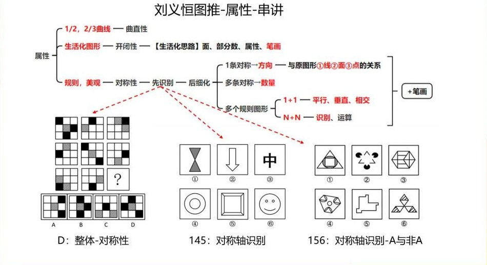

- **识别**：不用把对称轴全画出来。先分能画和不能画；能画的再分两种：能画出互相垂直的两条轴（轴+中心），还是只能画一条。
- 要留意的两种考法：
  - **整体对称**（九宫格斜着看），**上海、四川、联考**（以及事业单位）有可能出；
  - **A 与非 A**（不严谨的考法），**上海、四川、联考**也可能出，**国考绝对不会这么出**，因为国考是最标准的试卷。

  多数省份考的还是简单识别。

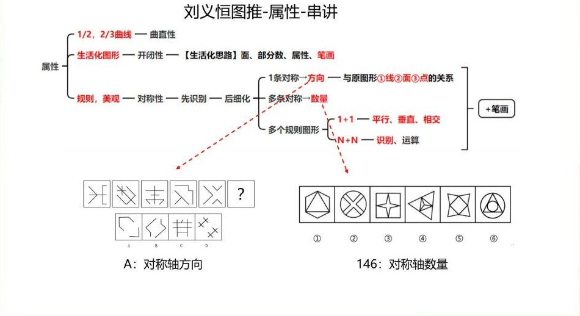

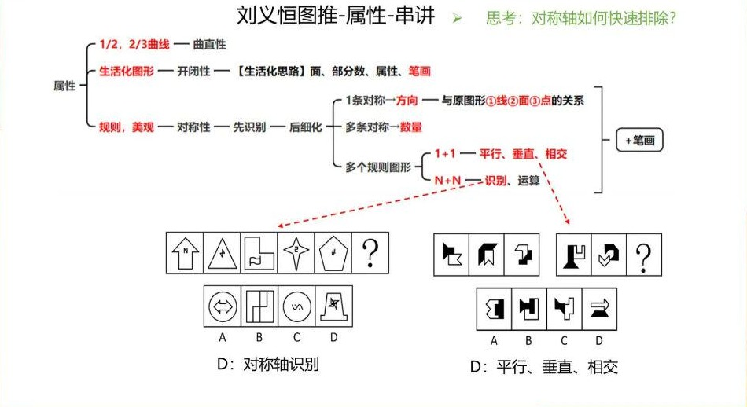

**细化**：

| 情况 | 考什么 | 说明 |
|---|---|---|
| **一条对称轴** | **方向** → 与原图形 ①线 ②面 ③点 的关系 → **+笔画** | 有**明显的线**时才考虑对称轴与线的关系；没有就看对称轴**穿过几个面**；面都一样，再看经过的点。这个顺序不用死背：线的特征明显就先想线，没感受到线，基本就是面和点。 |
| **多条对称轴** | **数量** | 多条轴的数量不行，就可以把对称排掉了 |
| **多个规则图形** | 每个都只有一条轴、且是两个（1+1）→ **平行、垂直、相交**；否则（N+N）→ **识别**、运算 | 核心看是不是"单独的一条轴 + 两个图形" |

- **一条对称轴没答案，不能排！** 后面还可能和数量（线、面、点、笔画）结合。
- **对称 + 笔画**（★）：前两三年广东、江苏就已经明确考过，浙江选调这两年也考了，**国考 26 年也考了**。国考一出，各省各试卷抄的概率极大，所以对称轴没答案时，**今年和笔画复合的概率很高**。

### 5.3 对称轴如何快速排除（新方法）

对称轴是"没有一样"的**答题起点**，后面接着的是"对称 → 数量"和"对称 → 图形关系"。出题人又很"坏"，常用规则图形去考数量。不会快速排对称，就会卡在对称这一步推不下去。

- **只有一种情况需要慢下来多想**：题干和选项**全是只有一条对称轴的轴对称图形**。这时先考方向；方向不行，还可能和线、面、点、笔画结合，能考的东西很多。
- **其他情况都应快速排掉**：
  - 全是"轴+中心"，题干、选项都一样 → 识别分不了类，也没法细化，排；
  - "轴+中心、轴对称、中心对称"混在一起，但出现了中心对称图形，它没法细化，分不了类，排；
  - 识别不出规律、多条轴的数量不行、多个规则图形没答案 → 排。
- 例 1（都是轴+中心）、例 5（整体都是中心对称）都是这样快速排掉的。

### 5.4 属性考情

| 省份 | 偏好 |
|---|---|
| 国考、四川、北京、浙江 | 十来年都比较专一，**以对称性为主** |
| 江苏 | 对称为主，还会带一下曲直性 |
| 上海 | 对称、曲直、开闭三个都有可能 |
| 联考（山东、江西等） | 什么都考，范围大 |

> 对称轴不管对哪个省份都是重点，只是有的省份多考曲直，有的省份多考开闭。

---

## 6. 串讲③：数量规律·基础考点（强弱特征与六大混淆点）

### 6.1 先做减法：真正要区分的是面、笔画、点

- **基础考点和细化考点，哪个更简单？细化更简单。** 细化考点特征明显、区分度大：
  - 所有面结合三角形考；大小面有明显的大、明显的小；相同面有一样的面；
  - 曲直交点要有曲线，切点、框点要有圆；
  - 横竖线图案很明显；两个外框（一个正方形、一个三角形）一看就知道；
  - 平行线要有斜线和两个相似三角形。

  背了特征就能直接定位。反而是基础考点，出题人**故意把面、笔画、点的特征画得一模一样**，才真的难。
- 基础考点里哪些不会混？
  - **元素**：图形孤立，一定能区分；
  - **直角**：低频考点，很多省份考得不多；
  - **线**：也是低频。线和笔画都属于"线"的角度，笔画只是更细的考法；现在 90% 以上省份在考笔画，一套图推才 5 道或 10 道，知识点要考得全面，**出题人选了笔画就很少再考线**，两者很少同时出现。
- 所以考得最多、最容易混的只剩 **面、笔画、点**。出题人故意混淆时，**不用区分，直接按面 → 笔画 → 点去试，一定会出答案**，除非今年考了直角、线这类低频考点。要有"敢赌"的心态。

### 6.2 强特征与弱特征

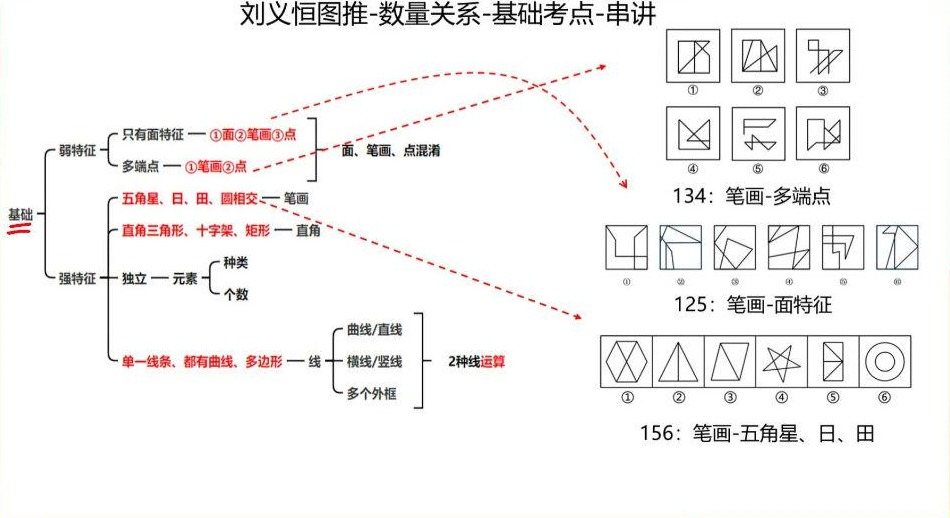

| 类别 | 特征 | 考点 |
|---|---|---|
| 弱特征 | **只有面特征** | ①面 ②笔画 ③点 |
| 弱特征 | **多端点** | ①笔画 ②点 |
| 强特征 | **五角星、日、田、圆相交** | 笔画 |
| 强特征 | **直角三角形、十字架、矩形** | 直角 |
| 强特征 | **独立**（孤立的小图案） | 元素：种类、个数 |
| 强特征 | **单一线条、都有曲线、多边形** | 线：曲线/直线、横线/竖线、多个外框 → **2 种线的运算** |

- **笔画**：高频考点。现在最难的是**没有强特征、只有面特征**的题：看起来像在数面，实际考笔画（上图 125）。另一条主线是用**多端点**考笔画（134）。五年前单独数面考得多，现在越来越少，**90% 以上的题在考笔画**，基础部分可以说都在为笔画服务。

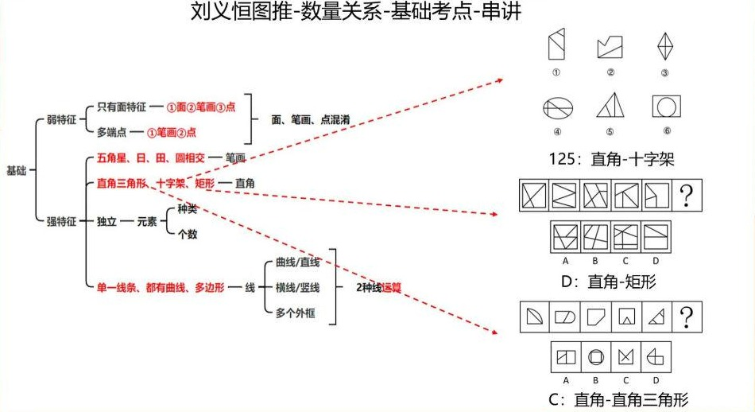

- **直角**的三大特征：直角三角形、十字架、矩形（正方形/矩形外框把直角凑出来）。

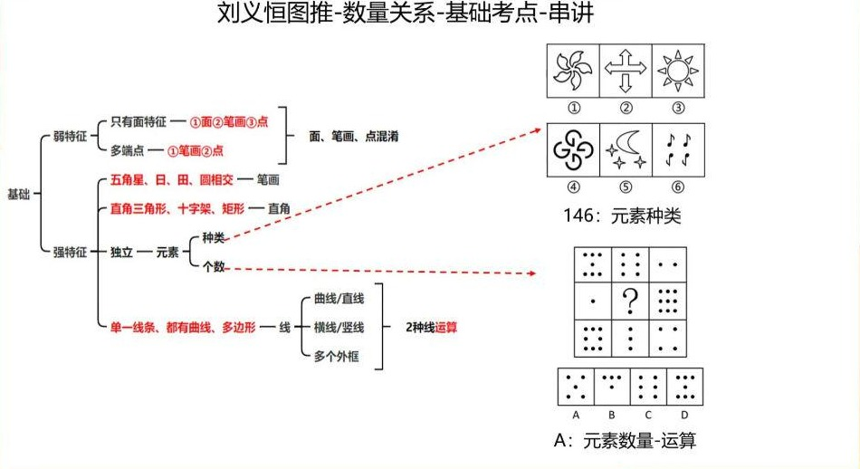

- **元素**是基础考点里唯一没标红的，不是因为不重要，而是**太简单**：图形孤零零的，学过一次一定不会混。

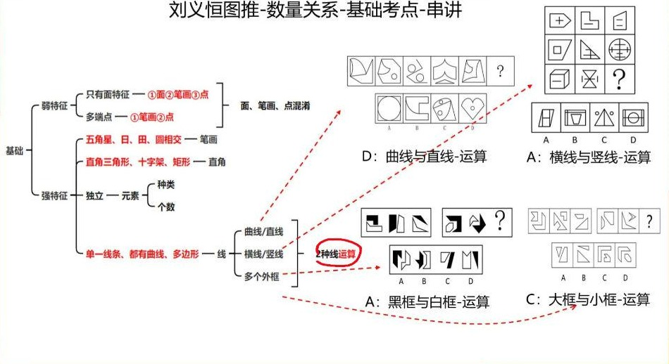

- **线**：所有基础考点里**最大的难点是线的运算**。线的种类不用背，要背的是这三个特征：
  1. **单一线条**：孤零零的横线、竖线；
  2. **都有曲线**：考曲线和直线的运算；
  3. **多边形**：两个外框，有黑有白，或者有大有小，一出现就让你做运算。

### 6.3 六大混淆点

#### 混淆点① 面、笔画、点

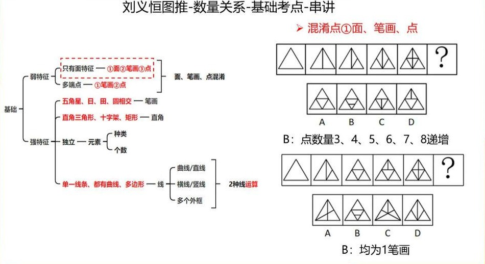

- 两道江苏题，把答案删掉后几乎一模一样，考场上根本区分不了。
  - 上题考**点数**：第一幅 3 个点，在这 3 个之外依次多 1、2、3、4 个，形成 3、4、5、6、7 递增，问号处是 8；
  - 下题考**笔画**：每幅图（去掉中间三角形看）都是一笔画。
- 两题画的都是**面的特征**，却一个考笔画、一个考点。所以别区分，**直接按面 → 笔画 → 点去试**。这不是江苏独有的，所有省份现在最大的难点都在这里，是出题人故意为难你，不是你没学好。

#### 混淆点② 多端点：笔画、点

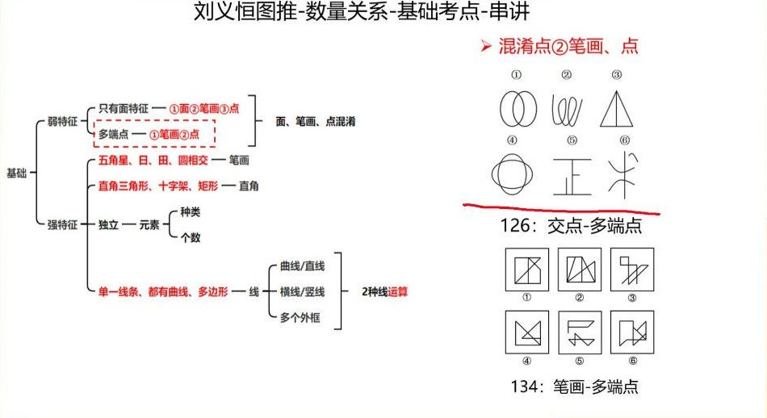

- 上题按**交点**数（2 个或 4 个）分类，下题按**笔画**分类，两题图案都是**多端点**，长得很像。
- 多端点主要两个方向：**笔画、点**。笔画永远放在点前面，是因为笔画**频率更高**，这样试错少；其实没有严格的优先级，先试点也无妨。

#### 混淆点③ 田、十字架

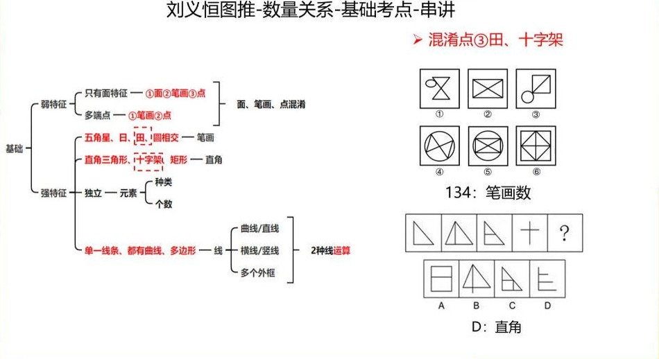

- 思维导图里"田"归笔画，"十字架"归直角，这有矛盾：田字中间两条线本身就是十字架。
- 区分办法：**看直角数量**。
  - 直角很少（下题）→ 考直角；
  - 直角非常多（上题田字形，加个圆也不影响）→ 没法考直角，考**笔画**。

#### 混淆点④ 多端点、曲线

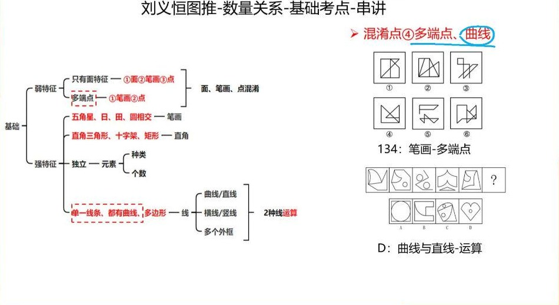

- 下题也露着端点，但每幅图都有**曲线**，考的是曲线和直线的运算。
- 为什么会这样？画曲线只有两种方式：画圆，或者画非圆曲线。**画非圆曲线时，只要不刻意用线把端点连起来，多少都会露出端点**。所以考曲直交点、曲线直线时，图上很容易出现端点。这不是出题人坑你，而是作图的副产品。
- 结论：**端点是弱特征，频率往后放；曲线是强特征（"二哥"）**。都是多端点时，只要出现了曲线，**优先级往前提**，先走曲线思路。

#### 混淆点⑤ 多边形外框

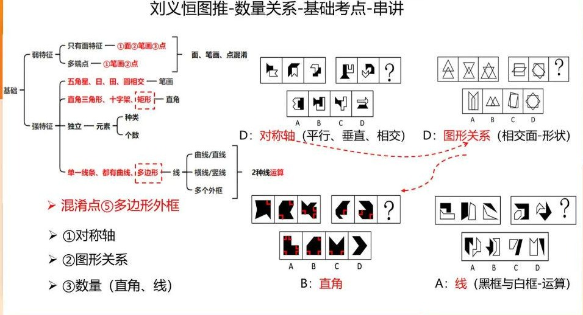

- 同样是两个多边形外框：
  - 左上考**对称轴**（平行、垂直、相交）；
  - 右上考**图形关系**（相交面形状，三边形、四边形……）；
  - 左下考**直角**；
  - 右下考**线**（黑框、白框的线条数：4、4、4、3……递减运算）。
- 老师给的思考顺序：**对称轴（大哥，第一步）→ 图形关系 → 数量（直角、线）**。
- 为什么图形关系放在数量前面？相交于面、相交于线很好看，放第二步更简单；图形关系没答案，再去数直角、数线。**如果先一头扎进去数数量，结果考的是图形关系，就崩了**。

#### 混淆点⑥ 面与其他混淆

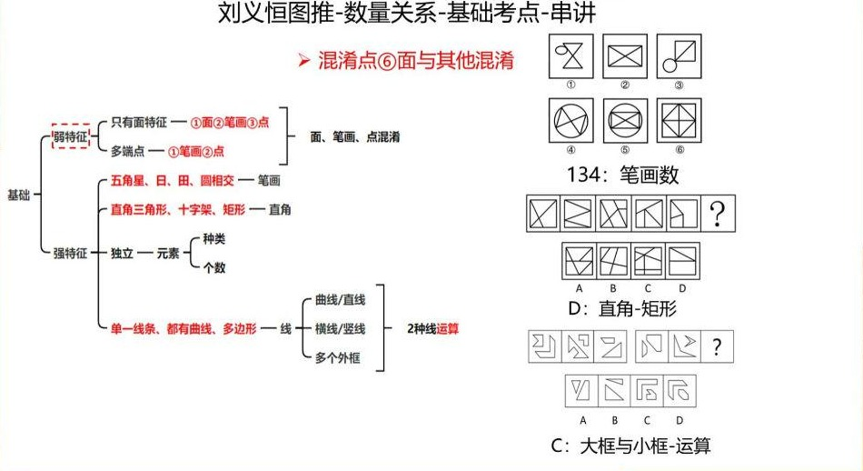

- **面什么都能考**：考笔画的题能数出 3 个面，考直角的题能数出 4 个面，考线的题也能数出 2 个面。只要是图形题就有面的特征，所以**面是最弱的特征**。
- 正确做法：**先问自己，除了面还有没有别的特征？**
  - 有田字形 → 先考虑笔画；
  - 有矩形外框 → 先考虑直角；
  - 有两个多边形外框 → 先考虑线的运算。
- 反面教材：一上来就数面，1、2、3、4……"面没规律，那再看直角"。顺序反了，每道题都先数面，而考试偏偏又不考面，白白浪费时间。

### 6.4 强弱特征的用法（总结）

- 这些特征**经常同时出现**。
  - 弱特征：只要出现了，就**往后放一放**。几乎每道题都有面的特征，一上来就数面会大量试错。
  - 强特征：可以先考虑。可能同时出现两三个强特征也无所谓，逐个想一下就出答案了。
- **只需背这几条**：笔画（五角星、日、田、圆相交）、直角（直角三角形、十字架、矩形）、线（单一线条、都有曲线、多边形）；元素看"独立"。**只要不是这几个强特征，就说明出题人在用面、笔画、点混淆你，不记特征，直接代入：面 → 笔画 → 点**。

### 6.5 课前答疑：两道题的易错细节

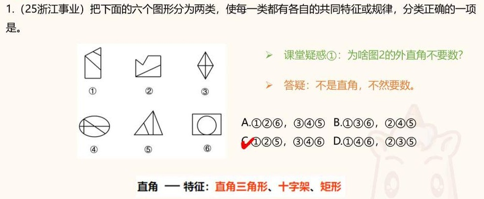

**例（25浙江事业）直角**：按直角分类（特征：十字架，串讲页标注为"125：直角-十字架"）。
- **疑问**：图②外面那个"直角"为什么不数？
- **答疑**：它其实**不是直角**，画得很像，但有点倾斜，是出题人故意的。真是直角的话就要数。

**答案**：C（①②⑤，③④⑥）

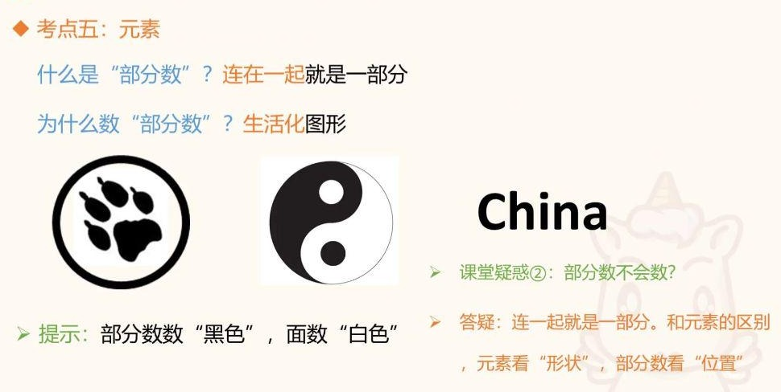

- **部分数**：**连在一起就是一部分**，判定标准是**位置**，跟形状无关。
- **元素**：看**形状**。两个大小不同的正方形算一种元素，但从部分数看是两部分。
- 部分数数的是**黑色**，面数的是**白色**。比如数左边那只爪印时数出 6 部分，中间的白色没数进去。

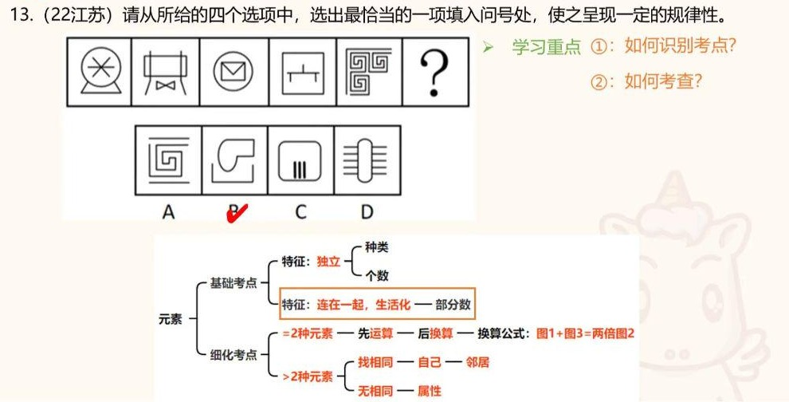

**例（22江苏）部分数**：
- 题干每幅都是 **2 部分**：
  - ①雪花没和外圈连在一起，雪花一部分、带底座的圆一部分；
  - ②运动器材框架连在一起算一部分，蝴蝶结一部分；
  - ③信封一部分，外面的圆一部分；
  - ④中间的 T 一部分，外面的方框一部分；
  - ⑤外围的 L 形一部分，内部线条又是一部分（没画完，但确实连在一起）。
- 选项：
  - A：中间线条、另外两处各一部分，共 3 部分；
  - **B：2 部分**；
  - C：三段线断开，再加外框，共 4 部分；
  - D 也不符合。

**答案**：B

---

## 7. 串讲④：数量规律·细化考点（面、线、点、元素）

> 思考：细化考点一定要先考虑基础考点吗？**不用**。细化考点**特征明显**，背了特征就直接定位，比基础考点还好定位。细化部分的特征（标红）**一定要背**，背了就快，而且不会混。

### 7.1 面细化

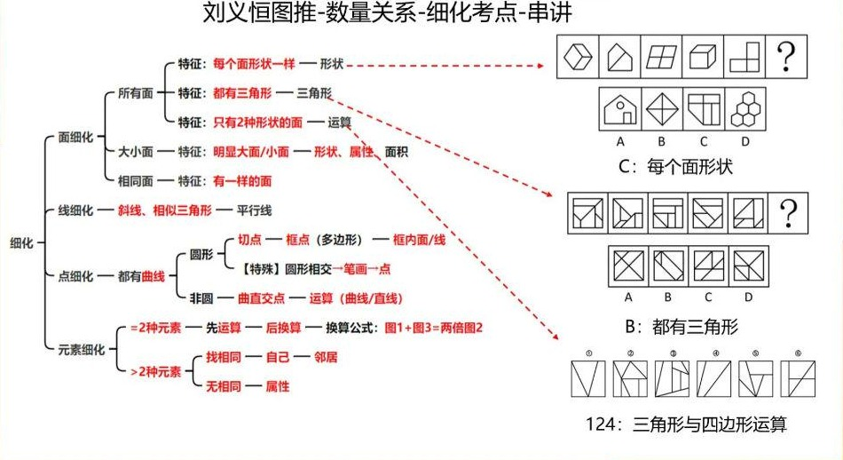

- **所有面**：
  - 特征"**每个面形状一样**"→ 考形状，比如都是四边形；
  - 特征"**都有三角形**"→ 考三角形个数递增；
  - 特征"**只有两种形状的面**"→ 考运算。例如 124 题作图时只有三角形和四边形，连五边形都没有，这很奇怪，所以考运算。
  - 考情：所有面考四边形的只有浙江、北京考过，其他省份主要考**三角形**。非要背特征，就背**三角形**，顶多加个四边形。

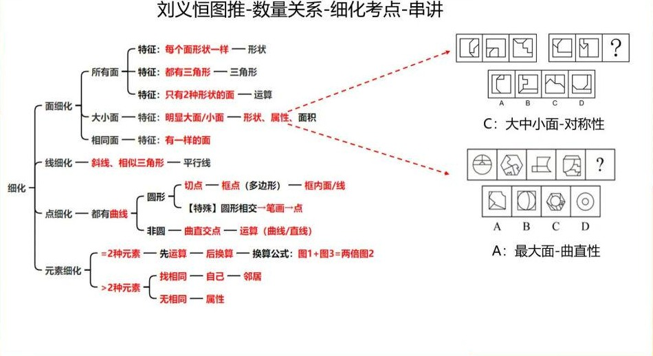

- **大小面**：特征是**明显的大、明显的小**，一眼就有感觉，应当**直接定位**。不可能先试所有面、再试相同面、最后才想到大小面；两分钟后才有的感觉，就已经来不及了。
  - **形状**：最大面自身是几边形，一眼能看出来；最容易忘的是**跟外框对比**（如最小面和外框形状一样），以及**跟下一幅图的传递**。这是难点。
  - **属性**：只有 25 年深圳考过曲直性（右题），其他省份都在考**对称性**（左题：大中小面的对称性）。
  - **面积**。
  - 减法：大小面**99% 以上考形状和对称性**，压力大就只记这两个。
- **相同面**：出现一样的面就考它，非常简单。

### 7.2 线细化

- 线的细化只有一个：**平行线**。特征是**斜线、相似三角形**。画一条斜线不奇怪，画两条就是在凑平行线；想考三组平行线，就一定得画斜线。两个相似三角形也一样。
- 反向排除：**同一方向超过两条，考平行线的概率极低**（见例 3、例 7）。

### 7.3 点细化：曲线思路（本课重点新梳理）

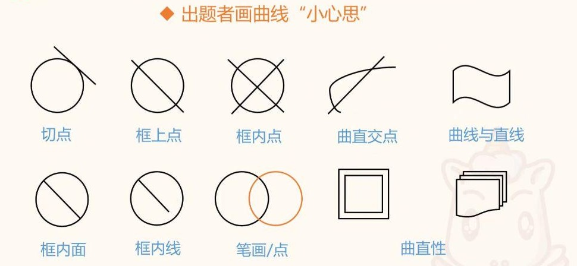

以前曲线相关的考点是分散讲的，现在高频的就有 9 种，考场上从中挑一个会崩溃，所以必须串起来：

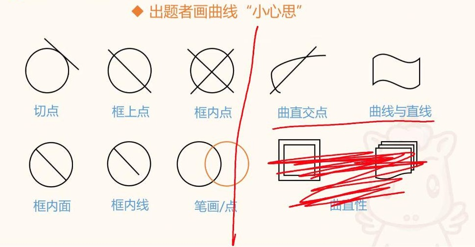

1. **先划掉曲直性**：其余考点都跟数量有关，作图时**每幅图都画曲线**；只有曲直性是**部分曲线**（1/2、2/3），不会混。
2. **再竖着划一刀**：左边的都是**用圆作图**，右边的不用圆，而且曲线是断开的。
3. **右边（非圆）排个序**：先数**曲直交点**，好数；再考虑**曲线和直线的运算**，要先数曲线、再数直线、再运算，最麻烦，放最后。
4. **左边（圆）**：高频是**切点、框点**，其余低频。
   - 一出现圆，先看**相切**，一眼就能看出来；
   - 不行再看**框点**：框上点、框内点，哪个更可能就先数哪个。比如框内是 0 个、框上是 2 个，就先看框上；
   - **框内面、框内线**非常低频（5% 不到），了解即可；
   - **两个圆相交** → 考**笔画、点**。这条线不是主流，而且圆相交考笔画在强特征里单独背过，有个印象就行。

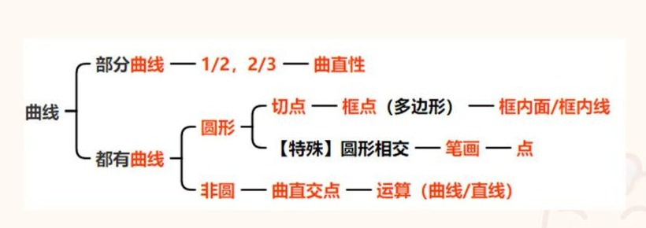

**曲线思路口诀：**
- **部分曲线**（1/2、2/3）→ 曲直性（属性）
- **都有曲线**（数量）：
  - **一个圆** → 切点 → 框点（框上/框内；可能用多边形外框）→ 框内面/框内线
  - **两个圆相交**（特殊）→ 笔画 → 点
  - **非圆** → 曲直交点 → 曲线/直线运算

> 老师示范：画一条非圆曲线加直线 → 先曲直交点，再曲线直线运算；画一个圆，没有相切关系 → 框点 → 框内面/线；画两个相交的圆 → 笔画、点；画一个圆加一条线 → 直接看切点。**作图只有这三种可能，你按图选路，就不会混了。**
>
> 思维导图里把"都有曲线"整条放在"点"下面，但它考的不止点，框内面、笔画、曲线直线也都在这里。只有"部分曲线"放到了属性里。想要一份完整的曲线导图，可以自己在这里补上"部分曲线 → 1/2、2/3 → 曲直性"。

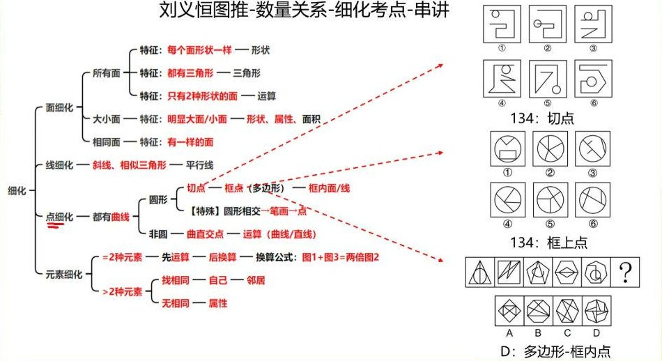

- 切点、框上点都一下就能看出来。
- **多边形外框**（特例）：想出难一点，可以不用圆作外框，改用正方形等多边形。上图 D 题的框内点数 3、4、5、6 递增，第三幅图的框内点画得非常刻意。所以框点不一定全是曲线，思维导图在曲线里专门标了个"多边形"。

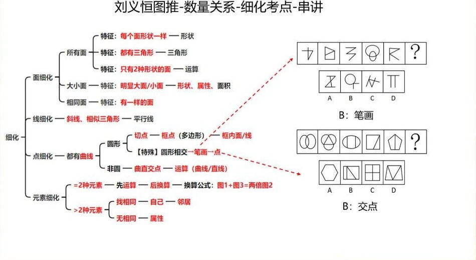

- 圆相交的题并不是所有图都画曲线，它有特征（圆相交）。上题考**笔画**（全是一笔画），下题考**交点数**（2、3、4、5、6 递增）。

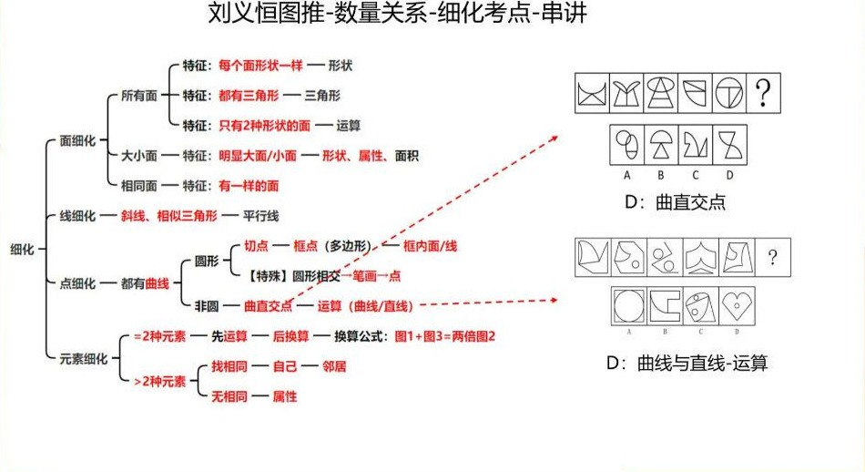

- 不是圆，直接走非圆思路：先数曲直交点，不行再数曲线、直线做运算。

### 7.4 元素细化

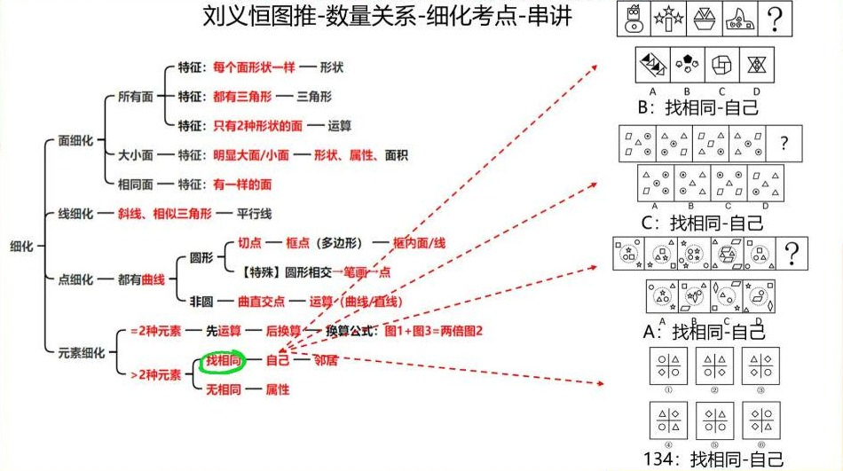

- **只有 2 种元素**：
  - **运算**：比如比你多一个圆、多一个正方形，谁多一个、谁少一个；
  - **换算**：比如黑五角星和白五角星之间的换算。

  不想动脑就**死记公式：图1 + 图3 = 2 × 图2**。元素细化里最重要的就是"2 种元素"这条线。
- **超过 2 种元素 → 找相同**（90% 都在考这个）：
  - 三个圆一样、三个五角星一样；两个平行四边形、两个圆；三角形 2:2:1 的比例；内外；对角线、相邻……
  - 核心就三个字："**找相同**"。**先问自己有没有"钱"（自身有没有相同的），自己没有，再问邻居（隔壁图有没有相同的）**。比如隔壁图都有正方形，就"借到钱"了。
- **无相同 → 属性**：

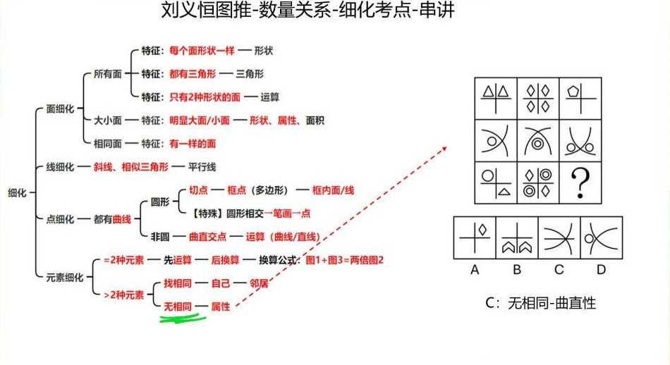

- 上题元素三角形、菱形……之间找不到相同。把每格的元素整体一起看：第一排（十字架、三角形）**全是直线**，第二排**全是曲线**，第三排**既有直线又有曲线**，所以考曲直性。无相同时也可能考开闭性、对称性，关键是**整体看、考属性**。老师提醒课件这里原先写错了，应为"曲直性"。考得不多，留个印象即可。

---

## 8. 串讲⑤：图形关系回顾

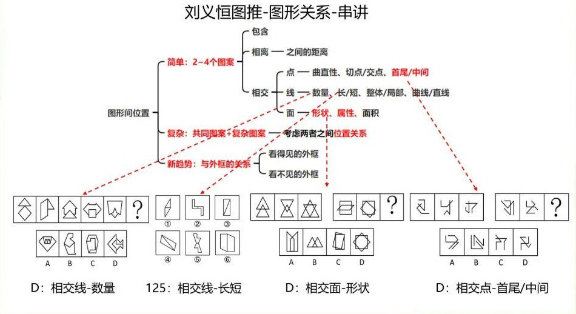

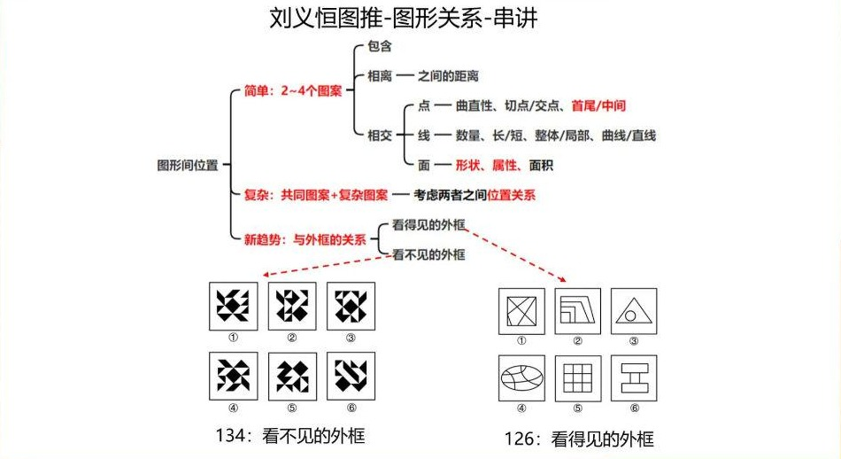

- 什么时候考虑图形关系：**属性不行时，过于简单（2~4 个图案，实际基本是两个）或过于复杂**。
  - 前面的题：两个面、两个面、两个三角形、两条线……**多数都是两个**；
  - 包含（例 1）；
  - 相离：之间隔一条线还是一个面（例 2）。
- **相交**：
  - **线的相交是最大难点**，因为涉及首尾和中间；
  - 面的相交都简单，看相交面的形状、属性即可；
  - 相交线的数量、长短不用背。
- **要背的只有**：相交面的形状、属性；相交点的首尾/中间。其他理解就行，做题时一定会。
- **复杂型**：乱线、乱方块构成背景，每幅图有一个共同的面、圆或菱形，考**共同图案和背景的关系**，比如面和背景、圆和背景、菱形和背景。创新度很大，图案记不住，只能理解宏观思路：**大家都有，就是想考它**。
- **与外框的关系**：简单时直接把外框画出来，难时要你自己理解**看不见的外框**。例 7 里乱线构成的外框、例 8、例 9 都属于看不见的外框，例 10 是看得见的。
- 上面的简单型基本是送分题，**下面的复杂型和外框关系是难题的出题方向（★）**。

---

## 本章小结

### 速查表：特征 → 规律 → 做法

| 看到的特征 | 规律 | 做法要点 |
|---|---|---|
| 元素完全一样，只是位置变 | 位置 | 宫格先看内部（内外分开）；内部无规律就常规平移（方向可变，用大图案、数个数）；再不行拆两部分；线条类看隐藏外框（找特殊、就近）；转向镜像用箭头法 |
| 大部分图案不动 | 相邻比较 | 看颜色或移动 |
| 线条位置对上了 | 加减同异 | 跟图 3 比：两勾图 3 不动，两叉图 3 动，1、3 勾图 2 动，2、3 勾图 1 动；再看纵向、拆分 |
| 外轮廓同、内部黑白数不同 | 黑白运算 | 相同区域、对比选项 |
| 相同元素重复出现 | 遍历 | 缺啥补啥 |
| 每图都有小图案 | 标记 | 标什么考什么；多个标记先看关系，必要时才连线 |
| 规则美观 | 对称 | 先识别后细化；只有"全是一条轴"才多想，其他快速排 |
| 1/2、2/3 有曲线 | 曲直性 | 直接定位 |
| 生活化图形 | 生活化思路 | 面、部分数、开闭、笔画 |
| 2~4 个图案（多为两个） | 图形关系·简单 | 相离看距离；包含；相交看接触处（点/线/面） |
| 乱背景 + 共同图案 | 图形关系·复杂 | 共同图案与背景的位置关系 |
| 碰不碰外框、在框内还是框外 | 与外框的关系 | 看得见 / 看不见的外框 |
| 两个多边形外框 | 多种可能 | 对称 → 图形关系 → 数量（直角、线） |
| 五角星、日、田、圆相交 | 笔画 | — |
| 直角三角形、十字架、矩形 | 直角 | 直角太多则改考笔画 |
| 孤立小图 | 元素 | =2 种：运算/换算；>2 种：找相同（自己 → 邻居），无相同则看属性 |
| 单一线条、都有曲线、两个外框 | 线 | 两种线的运算 |
| 只有面特征 | 弱特征 | 面 → 笔画 → 点 |
| 多端点 | 弱特征 | 笔画 → 点；有曲线先走曲线思路 |
| 曲线（全部图都有） | 曲线思路 | 一个圆：切点 → 框点 → 框内面/线；两圆相交：笔画 → 点；非圆：曲直交点 → 曲线直线运算 |
| 明显大/小面、三角形、一样的面 | 面细化 | 大小面主考形状和对称 |
| 斜线、相似三角形 | 平行线 | 同方向超过两条就不考 |

### 口诀汇总

- **"3+3"**：有一样 → 位置、样式、标记；没一样 → 属性、数量、图形关系。
- **对称是大哥，曲线是二哥。**
- **极端情况（过简单/过复杂）→ 图形关系**；两条路都行，先图形关系，**越复杂越往后放**。
- **特征得背，知识点可以不背。**
- **强特征先，弱特征后；面是最弱的特征，端点也弱。**
- **面、笔画、点，面、笔画、点**：没有强特征就直接代入。
- **接触的地方是什么就考什么，不要脑补。**
- **长短跟自己比，不跟别人比；首尾分不清没关系，中间一定认得出。**
- **共同的一定想考，复杂的不想数**：考两者之间的位置关系。
- **"我是你亲戚吗？"**：太简单的外框出题人不会直接画，淡化外框是"刀子嘴豆腐心"。
- **加减同异跟图 3 比**：两勾不动，两叉图 3 动；13 勾图 2 动，23 勾图 1 动。
- **黑白运算**：相同区域、对比选项。**遍历**：缺啥补啥。**标记**：标什么考什么。
- **找相同**：先问自己有没有钱，没有再问邻居。**图1 + 图3 = 2 × 图2。**
- **曲线**：部分曲线看曲直；一个圆看切点、框点；两圆相交看笔画、点；非圆看曲直交点，再看运算。
- **思维导图红字必须记，黑字做过就会。**

### 易错坑汇总

1. 画得像直角、其实倾斜的角**不是直角**，不数（25 浙江事业图②）。
2. 部分数看**位置**（连在一起、数黑色），元素看**形状**。
3. 两个圆由一条线段相连属于**相交于点**；相交于边和相交于面不要靠脑补区分。
4. 相交线数量可能**从 0 开始**；极短的相交线容易漏数（例 4）。
5. 例 7 整体看全是相交于点、分不了类，要**拆开只看面**是顶点还是边接触。
6. 复杂型、外框类题最容易被当成数量题去数切点、框点、笔画、平行线（例 8、例 10）；先想"为什么不走数量"。
7. 黑白块题容易被当成"有一样"；分组分类题背景不同时，考不了位置和运算。
8. 相邻比较的图案不一定完全一样：考颜色时黑块数会变。
9. 对称：**一条轴没答案不能排**（后面可能和线、面、点、笔画结合）；多条轴、中心对称、识别分不了类时要果断排。
10. 多个标记**不是每题都连线**，先看标记物之间的关系。
11. 一上来就数面会浪费时间，**先找有没有更强的特征**。
12. 田字形里也有十字架：**直角很多时改考笔画**。
13. 端点是画曲线的副产品，**有曲线时先走曲线思路**。
14. 平行线同一方向超过两条时，考的概率极低，国考尤其如此。
15. 大小面**必须一眼定位**；靠试错试出来的，考场上来不及。
