# 第7章 空间·六面体 + 四面体（折纸盒）

> **本章要点速览**
> - **空间题别全放**：六面体（折纸盒）考得很频繁，比如河南去年 10 道图推里就考了 2 道六面体，起码六面体一定要掌握。义恒老师的主推方法：**箭头法（主）+ 公共边（辅）**，一个方法练熟，比会十种方法强。
> - **折叠方向**：图案一律留在**外表面**，所以每个面只有一种折法。所有技巧都是**排除错误选项**的方法，单一技巧都有缺点，要搭配用。
> - **六面体解题步骤**：① 先找**相对面**，能排就直接排 → ② 有“唯一边/唯一点”就用**箭头法** → ③ 没有唯一：2 个面近、1 个面远用**公共边**；3 个面都近用**公共点**。
> - **相对面**：同行或同列**隔一个面**；**Z 字形两端**（两端都紧挨 Z 的中线）。口诀：**中间隔 1 个或隔 1 列 → 相对面**。优点是快、不用动脑；缺点是真题里一般只能排掉个别选项。
> - **箭头法**：口诀“**找唯一，定方向**”。在**唯一面**上找**唯一点/唯一边**当参照物，朝它画箭头，然后比较箭头的**上、下（尾巴）、左、右**是什么面；**题干和选项的画法要保持一致**。找不到唯一，就把两个面连起来**构造唯一**。它有两个作用：**看周边**、**看自身左右**。
> - **公共边**：①**构成直角的两条边**；②**一行/一列连着 4 个面的两端**；③**L 型随便“滚”**（向右滚 3 次 = 向左滚 1 次）。
> - **公共点**：相邻三个面共有的那个点，而且是唯一的；折叠后从这个点引出的线或图形保持不变。只适合三个面挨得近的时候用，而且容易被“换了位置的图案”骗到。
> - **高频模型**：两个六面体拼成长方体、找不同、**分割面（数“指向内部/外部”）**、**小正方体粘成长方体（公共边两侧颜色一致）**。
> - **四面体**：有唯一边/点就用箭头法，没有就用公共边；公共边看**展开图里连成一条直线的两条边**和**平行四边形两端的两条边**。四面体没有相对面。
> - **多面体**：图案很少，箭头法用不上。**对比选项找差异，用公共边长度相等做排除**。

---

## 1. 六面体总览：折叠方向、技巧观、解题步骤

### 1.1 折叠方向：图案朝外

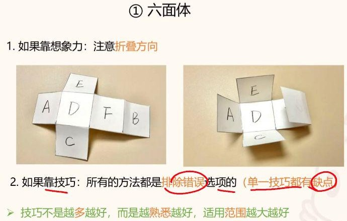

- 纸盒的正面有图案，背面是空白。折的时候**有图案的一面留在外面**，空白的一面朝里。如果往反方向折，外表面就成了一片空白。所以每个面的折叠方向是**唯一**的。
- 靠想象力做题时，一定要按“图案在外”的方向去折。

### 1.2 技巧观（老师强调）
- 靠技巧做题时，**所有方法都是用来排除错误选项的**，而且**单一技巧都有缺点**，包括箭头法和别的老师讲的“马走日”，所以一定要**搭配使用**。
- **技巧不是越多越好，而是越熟悉越好，适用范围越大越好。** 义恒老师从头到尾主推**箭头法**，用**公共边**辅助。两者结合，几乎所有题都能解决。考试里 90% 以上的题，靠箭头法加公共边就够了。
- 老师特别提醒：已经学过公共点、马走日的同学，也请“给箭头法一个机会”，拿本章的题用箭头法重做一遍。现在已经出现“两个六面体拼在一起”的题，只会用点去做就太慢了。

### 1.3 解题步骤（优先级）

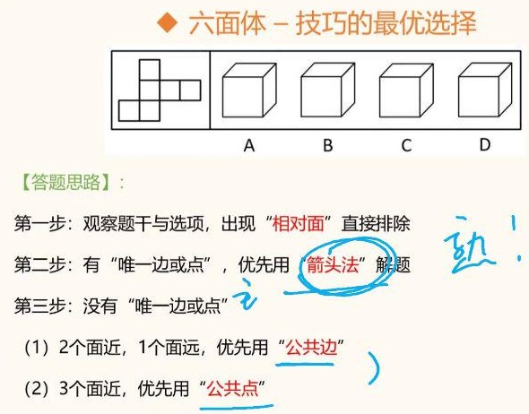

| 步骤 | 条件 | 用什么 |
|---|---|---|
| 第一步 | 观察题干与选项，出现**相对面** | 直接排除 |
| 第二步 | 有“**唯一边或唯一点**” | 优先用**箭头法**（老师圈出，重点练熟） |
| 第三步(1) | 没有唯一；**2 个面近、1 个面远** | 优先用**公共边** |
| 第三步(2) | 没有唯一；**3 个面都近** | 优先用**公共点** |

---

## 2. 相对面

### 识别信号
选项里**同时出现了**展开图中隔着一个面（或隔着一列）的两个面，就直接排除这个选项。

### 规律讲解

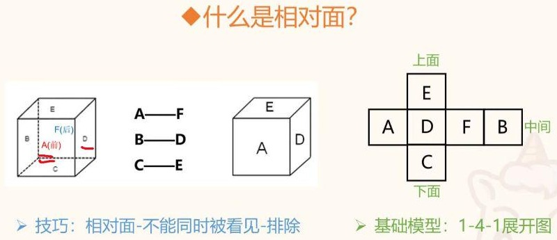

- **相对面就是不能被同时看见的两个面。** 正方体上有三组相对面，比如 A 前 F 后、B 左 D 右、C 下 E 上。从前往后看，只能看到 A，后面的 F 看不见。
- 基础模型是 **1-4-1 展开图**：中间一行 A D F B，上面 E，下面 C。A 和 F、D 和 B、E 和 C 是三组相对面，每组中间都**隔着一个面**。

> 💡 解释：站在正方体外面，任何角度最多只能看到 3 个面，而且这 3 个面两两相邻，交于同一个顶点。一组相对面互相平行、朝向相反，一个朝着你，另一个就一定背对着你，所以不可能同时出现在立体图里。

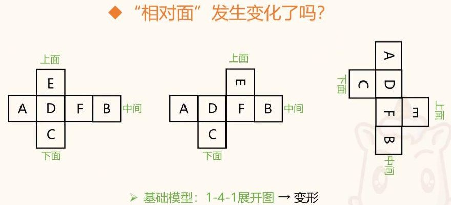

- **展开图怎么变形，相对面都不变。** 把 E 沿边挪到别的位置（例如挪到 F 上方），E 和 C 仍然是一上一下，还是相对面。所以只要“中间隔一个”或者“隔一列”，就是相对面。

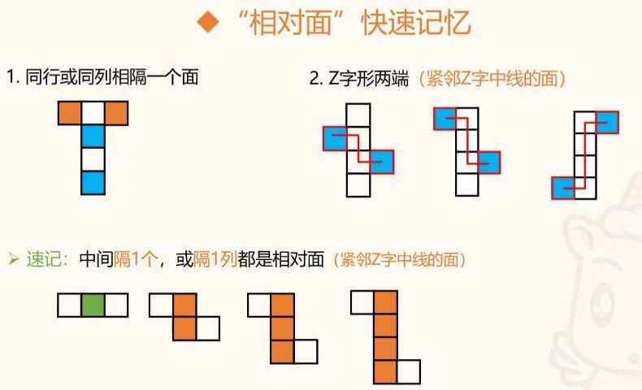

**快速记忆**：
1. **同行或同列相隔一个面**（上图 T 形里的两个橙色面、两个蓝色面）。
2. **Z 字形两端**：两个端面**都紧挨 Z 字的中线**（中间那一列），分别挂在中线的两侧。中线可以是 2 个面，也可以是 3、4 个面。
3. **速记**：**中间隔 1 个，或者隔 1 列，都是相对面**（紧挨 Z 字中线的面）。

> 💡 解释：
> - **隔一个**：三个面排成一条直线，1 号面和 3 号面都向 2 号面的同一侧折 90°，折完就是一对平行的面，分别在 2 号面的两边，所以相对。
> - **Z 字形**：把中间那一列看作一个“环”的一段，挂在这一列**左侧**的面折起来都落在同一个“左端盖”上，挂在**右侧**的面都落在“右端盖”上。左端盖和右端盖是相对面。所以两个面必须**都直接挂在同一列（中线）上、分居两侧**，才能用 Z 字判断。

### 真实测评

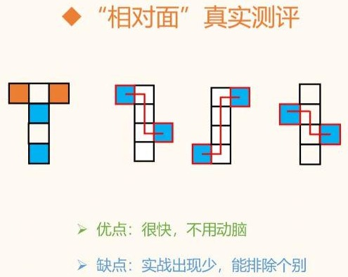

- **优点**：很快，不用动脑，完全不需要想象。
- **缺点**：真题里出现得少，一般只能排掉 A、B、C、D 中的一个。所以它只是第一步的基本功，必须再掌握其他方法。

### 例题

**例1**（25 内蒙古）给出正方体的外表面展开图，问哪个立方体可以由它折成。

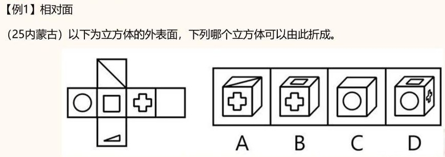

**思路**：
1. 先把选项里的面和题干一一对应。展开图中间一行依次是：圆、正方形、十字、空白。圆和十字中间隔着正方形，是相对面；正方形和空白中间隔着十字，也是相对面。
2. B：同时出现了**正方形和空白**，是相对面，排除。
3. C：题干里空白面只有 1 个，C 却出现了 2 个空白面，属于无中生有，排除。
4. D：同时出现了**圆和十字**，是相对面，排除。
5. 只剩 A。A 里的斜线看起来“没有挨着”，其实用后面讲的公共边把那个面转一下，两条边就靠在一起了。

**答案**：A

---

## 3. 箭头法（主推）

### 识别信号
题干或选项里有**只出现一次的面（唯一面）**，而且这个面上的图案**有方向性**（有唯一点或唯一边）。绝大多数六面体题都满足这个条件。

### 3.1 口诀与步骤

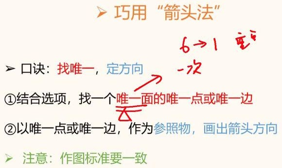

> **口诀：找唯一，定方向。**
> ① 结合选项，找一个**唯一面**上的**唯一点或唯一边**；
> ② 以唯一点或唯一边作为**参照物**，画出箭头方向。
> 注意：**作图标准要一致**。

- **唯一面**：在六个面里只出现一次，没有重复。老师在课件上写的是“6→1，一次”：六个面里挑出只出现一次的那个。
- **唯一点/唯一边**：这个面的图案里，与众不同的那个点或那条边。

### 3.2 怎么找“唯一”

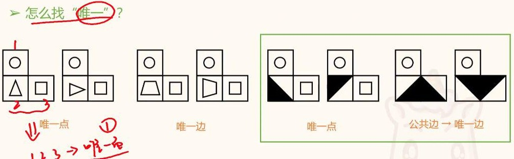

| 图案 | 有没有唯一 | 说明 |
|---|---|---|
| 圆 | 没有 | 上下左右完全一样，是唯一面，但找不到唯一点 |
| 正方形 | 没有 | 四个点、四条边都一样 |
| 等腰三角形 | **有唯一点** | 左右两个底角一样，只有**顶点**与众不同 |
| 梯形 | **有唯一边** | 两个上角一样、两个下角也一样，找不到唯一点，但**上底短、下底长**，短边和长边都是唯一边 |
| 直角三角形（黑块） | **有唯一点** | **直角顶点**一定唯一，只是画起来不太好看 |
| 两个相同的小三角形拼在一起 | 单看每个都不是唯一面 | **构造唯一**：把两个面连起来看成一个大三角形，大三角形的顶点就是唯一点（“公共边 → 唯一边”） |

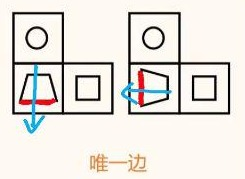

- 找到唯一点后，其实**不画箭头也已经能看出来**。比如等腰三角形的顶点，一个离圆近，一个离正方形近，两个图明显不同。画箭头只是让判断**更直观**：箭头上方是圆，另一个箭头上方是正方形，所以不一样。
- **箭头朝哪儿都可以**。可以朝短边画，也可以朝长边画，还可以说“圆在箭头尾巴处”。关键是**每幅图的作图标准保持一致**。

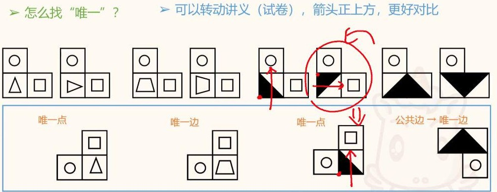

- **直角三角形这类不好画的**：把正方形分成四个区域，选一个区域当参照，比如“直角顶点固定在左下角”。然后每幅图都按“顶点在左下角”的方式画箭头，箭头的朝向就一致了。尽量挑自己好画的角度，**不要为难自己**。
- **箭头朝右不好看的时候，就转动讲义或试卷**，让箭头朝向正上方，这样就不需要想象力了。

### 3.3 选面的优先级（考场怎么选唯一面）
- **居中优先**：选展开图中间的面，它的上、下、左、右都看得见，好对比。选边缘的面，好几个方向都看不到，等于给自己加难度。
- **角落的面、选项里倒着放的面，尽量不选**，倒着画容易看错。
- **周围全是空白的面不选**，比如一个面的上方和右边都是空白，对比不出任何东西，即使它有唯一点也没用。
- **先比较“直接挨着”的面**：箭头左右或上方直接相邻的面先比；需要拐弯（要借公共边移过去）的面放在后面比，或者直接跳过。
- **一个面分析不出来就换一个面**，不要死盯着同一个。四个选项排掉三个，答案就出来了。
- **学会跳**：正确选项往往是最难分析的，这是出题人的心思。所以难分析的选项先跳过，去排别的。**否定一个选项很简单，证明它正确很难**，所以只找错的原因就行。

### 3.4 箭头法的两个作用
1. **看周边**：箭头的上方、尾巴、左边、右边分别是哪个面，和题干比较。
2. **看自身左右**：图案本身在箭头的左边还是右边。当六个面**全都一样**（没有唯一面）时，看周边行不通，只能看自身（见例9）。

> 💡 解释（箭头法为什么成立）：折叠时每个面都是**整块刚性翻转**，而且图案始终朝外，所以面上的图案**不会被镜像翻转**，面与面之间“哪个面贴在哪条边上”也不会改变。唯一点或唯一边把这个面的朝向锁定了，于是“箭头上方、左边、右边、尾巴各是哪个面”，以及“图案在箭头的哪一侧”，从展开图到立体图都保持不变。要求“唯一面”，是因为同样的图案出现两次，就分不清选项里是哪一个；要求“唯一点/边”，是因为圆、正方形这类对称图案转任何角度都一样，锁不住方向。

### 3.5 真实测评（优缺点与双箭头）

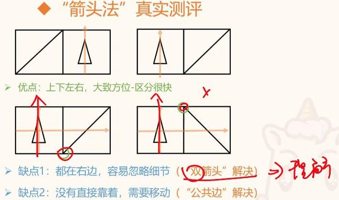

- **优点**：上下左右等大致方位区分得很快。比如斜线在箭头左边还是右边，一眼就能看出来。
- **缺点 1**：两个选项的图案**都在箭头右边**时，细节容易忽略。比如斜线端点碰到公共边的位置，一个在下，一个在上。解决办法是加一个“**双箭头**”：在原箭头的基础上**再横着加一个箭头**，把平面分成四个象限，这样就能看出一个在“右下方”、一个在“右上方”。双箭头**只是帮助理解，不加也行**：只要感觉两个位置不一样，就可以直接排除。
- **缺点 2**：要比较的面**没有直接挨着**时，需要移动。移动靠**公共边**来解决（第 4 节）。

### 例题

**讲义示例** 找唯一：选居中的面

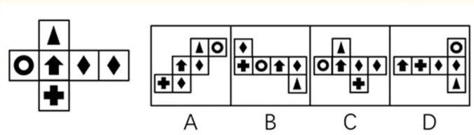

**思路**：
1. 找唯一面：第 4、5 个面（两个菱形）完全相同，不用；圆、十字虽然只出现一次，但没有唯一点；三角形和箭头有唯一点。所以在三角形和中间的箭头面里选。
2. **选居中的箭头面**：它的上下左右都能看见，好对比。朝箭头的尖画箭头，题干中箭头上方是三角形，右边是菱形，下边是十字，左边是圆。
3. A：右边对上，下边是菱形（题干是十字），排除。上方、左边需要拐弯，先不看。
4. B：左右都对上，很想选，但先保留。
5. C：左、右、上都对上，保留。
6. D：右边是十字，题干是菱形，排除。
7. 在 B、C 中验证看不见的面：C 的下方，借公共边转一下，十字仍然在箭头下方，对；B 借公共边转过来，三角形应该在箭头上方，B 却在下方，错。

**答案**：C

**例2**（26 联考）左图是一个带把手的立方体纸盒，问右边哪项可能是它的外表面展开图。

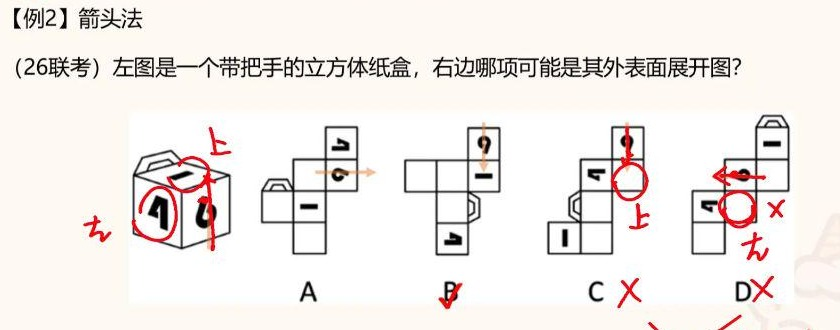

**思路**：
1. 找唯一：“1”那个面找不到好用的唯一点，不好画。能用的是 4 和 6，老师选 **6**，朝 6 的唯一点画箭头。题干中箭头上方是 1，左边是 4。
2. A：左边直接挨着，对上。但借公共边把 1 转过来后，1 在箭头的**右边**，题干中 1 在**上方**，排除。也可以用相对面判断：4 和 1 在题干中相邻，在 A 中却是“隔一列”的 Z 字两端，也就是相对面，错。
3. B：上方对上；左边看不见，分析很难，**先跳过**，不要陷进去。
4. C：箭头上方是空白，题干是 1，排除。
5. D：箭头左边是空白，题干是 4，排除。
6. 所以选 B。**把手**问题：把手所在的边是两个面的公共边，这两个面靠在一起后，把手正好位于公共边上，和题干一致，并没有错。

**答案**：B

**例3**（23 福建事业）给出纸盒的外表面，问哪个展开图能由它展开。

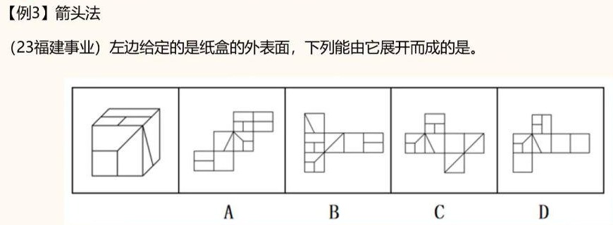

**思路**：
1. 题干三个面都只出现一次，都是唯一面。1 面有唯一点，好画；2 面的唯一点是直角点，每次都得找一个“左下角”当参照，比较麻烦；3 面选中间点或直角点都可以。老师选**最好看的 1 面（顶面）**。
2. A：朝唯一点画箭头，**箭头画长一点**就能看出正方形在题干中位于箭头右边，在 A 中位于左边，左右反了，排除。换 3 面看也能排除：它的三角形自身左右反了，这是“看自身”的角度。
3. B：箭头上方对上，但箭头左边的面不一样，排除。
4. C：箭头上方的图案完全不一样，排除。
5. 选 D。考场上画三个箭头就排完了，一点都不慢。

**答案**：D

**例4**（26 河南事业）给出纸盒外表面的展开图，问哪项能由它折叠而成。

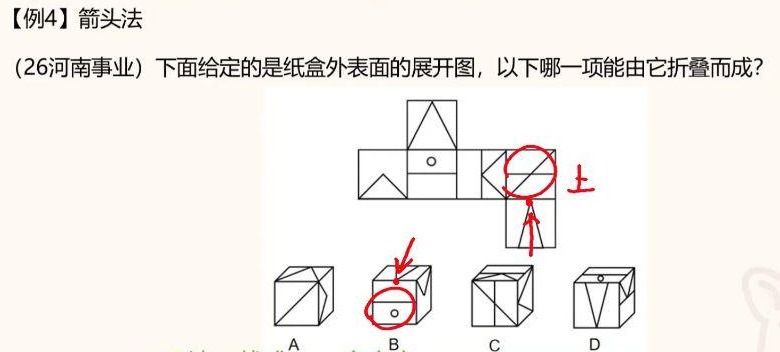

**思路**：
1. 除了第 5 个面（两个一样的三角形，中心对称，不好画），其他面都能找到唯一。
2. 注意展开图里有**三个不同的三角形**：顶上那个胖的、左边那个扁的、底下那个瘦高的，比较时要分清。
3. A：出现了一条贯穿的斜线，展开图里没有这样的面，排除。用箭头法看，箭头尾巴处的图案也对不上。
4. B：B 中的三角形又瘦又高，对应展开图底部的第 3 个三角形。朝它的顶点画箭头，题干中箭头上方是“两条斜线”面（老师圈为“上”），B 中箭头指向的是**小圆面**，排除。
5. C：用顶部面三角形的唯一边画箭头，上方对上；左边要借公共边转过来，转过来也是三角形，对上。转不过来就**跳过**。
6. D：以小球为唯一点画箭头，箭头上方虽然也是三角形，但**胖瘦不对**，排除。排掉 A、B、D，选 C。

**答案**：C

**例5**（24 江苏）给出六面体的外表面展开图（E F T / Y L V），问哪项能由它折叠而成。

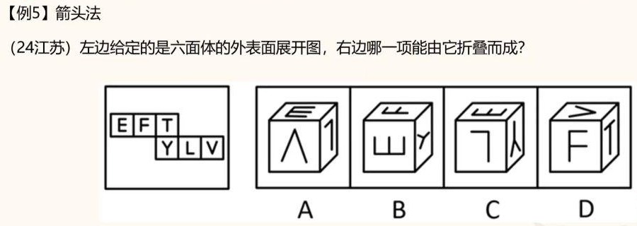

**思路**：
1. 六个字母都只出现一次，也都有唯一点或唯一边，**能选的太多**，反而让人觉得难。**先挑好画的**，倒着放的字母不选。
2. A：选 E，朝 E 的唯一点画箭头（朝右画也可以，对箭头来说就是“上方”）。题干中 E 的这一侧是 F，A 中不是，排除。
3. B：还用 E 的话，要对比的 F 离得太远，卡住了。**换一个面**：用 Y。题干中 Y 箭头上方是 T，B 中是 E，排除。
4. C：两个倒着的面分析不清，E 旁边能看的又是空白，这个选项最难，**跳过**。
5. D：用 F 的话，要对比的面离得远，也要移动，太慢。**换 V**：题干中 V 箭头的左边是 L，D 中是 F，排除。
6. 选 C。

**答案**：C

> 老师提醒：考场不能死板。一个面出不了答案就换一个面。箭头法只处理**一个面**的关系，而公共点或马走日要同时处理三个面的关系，所以箭头法更快。

---

## 4. 公共边（辅助）

### 识别信号
箭头法要比较的面**没有直接挨着**，或者两个面在展开图里离得远（“2 个面近、1 个面远”）。这时要用公共边把面“移”到一起。

### 4.1 定义与三种快速找法

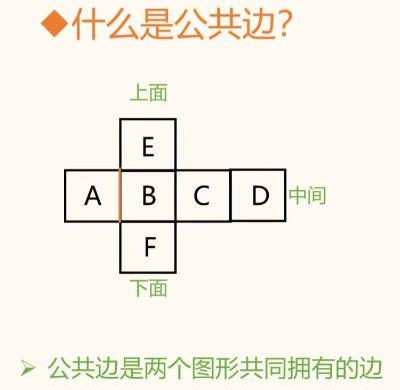

- **公共边**：两个图形共同拥有的边。直接挨着的两个面，它们的公共边就是贴在一起的那条边。**公共边具有唯一性**：A 和 B 的公共边只有这一条。

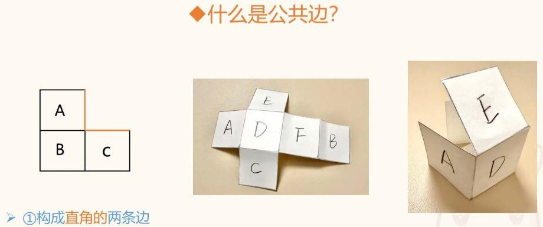

**① 构成直角的两条边**：展开图中围成一个直角缺口的两条边，折起来会重合，所以是同一条边。

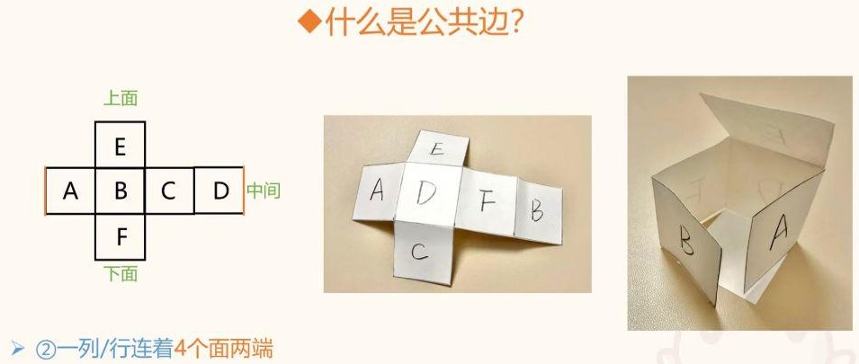

**② 一行或一列连着 4 个面时，两端的两条边**：A B C D 连成一行，A 的外侧边和 D 的外侧边折起来会碰到一起，是公共边。

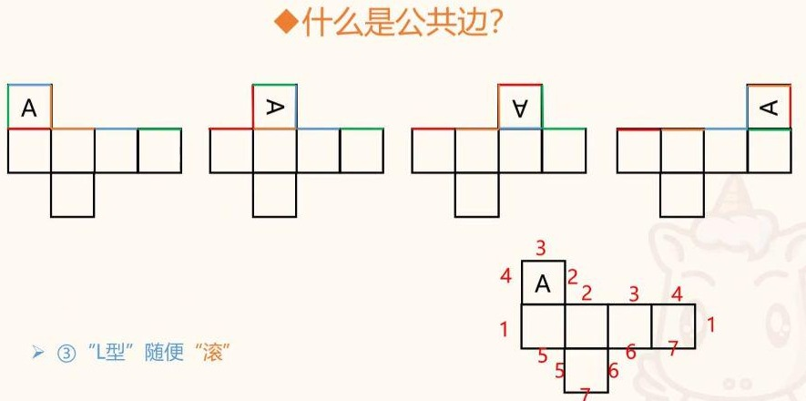

**③ L 型随便“滚”**：A 与下面一行构成 L 型时，A 可以沿着直角边一格一格地往右“翻滚”。老师把它比作一个宝宝在 2 米大床上打滚：每滚一次，A 转 90°。只能沿这一行滚，滚出去就“掉下床”了。
- 右下角那张图把这个展开图的**全部 7 对公共边**都标了出来，编号相同的两条边就是同一条边。从 A 的顶点出发，第 1、2、3 条边依次和右边各面的上边配对。一次记住，所有公共边就都会了。
- **小技巧：向右滚 3 次 = 向左滚 1 次**。要看 A 滚到很远处（比如第 4 格）时的朝向，不用真的滚三次，往反方向滚一次，图案朝向是一样的。
- L 型不管大小，哪怕只有三个方块，都能滚。

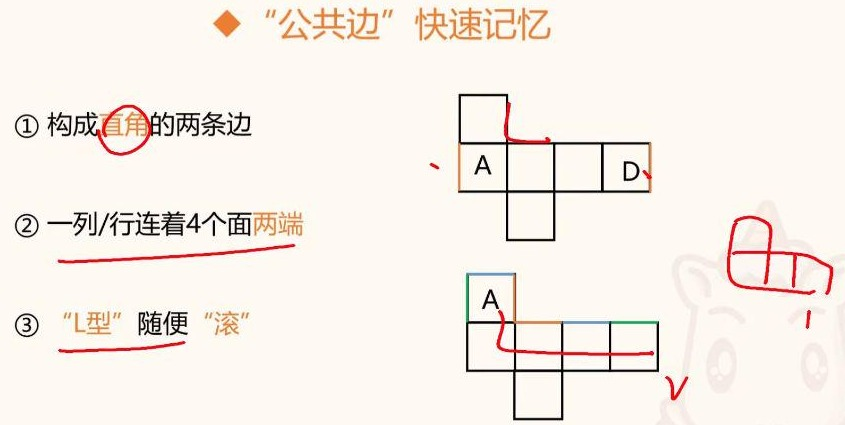

> **公共边口诀：直角两边是一条；四个一排两端连；L 型随便滚。**

> 💡 解释：
> - **直角**：正方体每个顶点处有 3 个面，3 × 90° = 270°。展开图中某个顶点周围如果是 3 个正方形加一个 90° 的缺口，折叠时缺口会合上，缺口两边的边就重合成同一条棱。
> - **四个一排**：4 个面依次折 90°，正好绕一圈（4 × 90° = 360°）围成一个环，首尾两条边接上。
> - **L 型滚**：通过直角把一个面“搬”到相邻位置时，它要跟着转 90°。一直搬下去就是“滚”。滚 4 次正好转一整圈，所以向右 3 次和向左 1 次是一回事。

### 4.2 真实测评

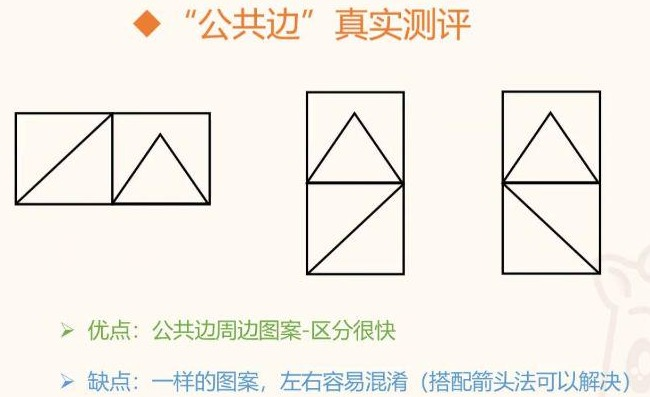

- **优点**：公共边周边的图案区分得很快。比如左图中，三角形是用一个**点**碰到公共边，而中图中三角形是用一条**边**贴着公共边，一眼就能看出不同。
- **缺点**：碰到公共边的方式一样时（中图和右图都是三角形底边贴着、斜线端点碰着），只看公共边会觉得两者“一样”，其实**左右反了**。这时搭配箭头法，朝唯一点画箭头，立刻能看出接触点左右颠倒。

> **五星推荐：箭头法（主）+ 公共边（辅）。** 两者的缺点可以互相弥补。单一技巧都有缺陷，也不存在“100% 能解所有题”的方法，网上那样宣传是骗人的。

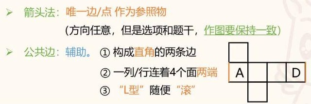

### 例题

**例6**（24 四川事业）给出纸盒，问能由下列哪个展开图折成。

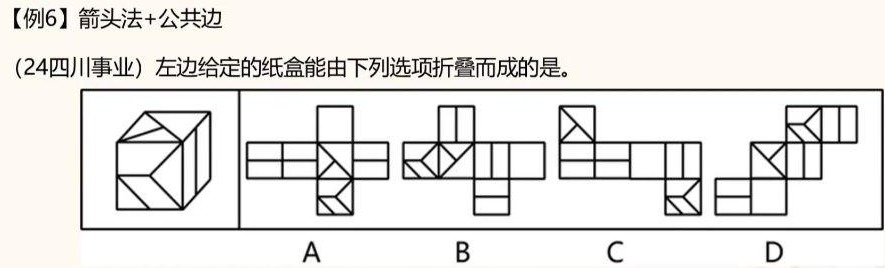

**思路**：
1. 找唯一：第 3 个面（平行竖线）是对称的，不能画，其他面都能画。
2. 老师选正面的“Y 形”面，朝唯一点画箭头。题干中，箭头上方是平行线面，箭头左边是三角形面。
3. A：左边直接挨着，对上。上方是空白，借**直角公共边**转过来，就是题干那个面，对上。实在不会转，也可以跳过。
4. B：箭头上方的面和题干完全不同，排除。
5. C：箭头左边是斜线面，题干是三角形面，排除。
6. D：上方对上，但三角形面借直角公共边转过来后，落在箭头的**尾巴**处，而题干中它在**左边**。只要确定它不在左边，不用画出图案就能排除。
7. 选 A。这题的相对面要分类讨论三次，比箭头法慢，没必要用。

**答案**：A

**例7**（23 江苏）给出六面体的外表面展开图，问哪项能由它折叠而成。

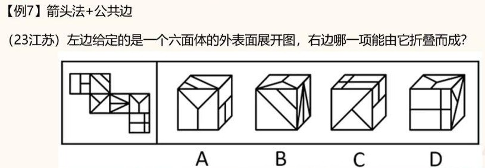

**思路**：
1. 六个面都能画箭头，但位于角落的两个面不好画。**优先用第 1、4、5、6 面**。
2. A：第一想法是用 Y 形面，但 A 中它的上方和右边都是空白，没法比较，所以**不选它**，改用旁边的 T 形面。朝唯一点画箭头。题干中箭头左边的面，借公共边转过来就能确定，不是 Y（Y 在展开图里离 T 很远）；A 中箭头左边却是 Y，排除。
3. B：选三角形面画箭头，左边借直角公共边转过来是倒着的三角形，对上；上方是 Y 字形，也对上，很想选。
4. C：题干中箭头左边是 Y，C 中是两个三角形，排除。
5. D：这两个面在展开图里**中间隔了一个面**，是相对面，D 中却相邻，排除。
6. 选 B。

**答案**：B

**例8**（25 北京事业）左边是正方体纸盒，问右边哪一个可能是它的外表面展开图。

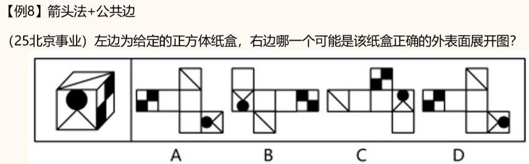

**思路**：
1. 三个面中，斜线面和黑白格面都找不到唯一，**只有黑球面能画**，目标很明确。每幅图都朝黑球画箭头，题干中箭头上方是斜线面。
2. A：箭头上方是空白，是送分的，排除。
3. C：箭头上方借**直角公共边**把方块面拐过来，是黑白方块，题干是斜线，排除。
4. B 和 D 二选一。D 的上方和右边都看不见，要分析两步；B 只要分析右边一步，所以**先分析 B**。
5. B 的右边：那一排是 **4 个面连成一行，两端是公共边**，可以直接把黑白方块面平移过来。然后用**双箭头**：横着加一条线看紧挨公共边的小方块，题干里是黑色，B 里是白色，所以 B 错。这是本课少见的必须用双箭头的题。
6. 选 D。直接验证 D 要连拐两次弯（直角加上四面两端），太慢，实战中排掉 A、B、C 即可。

**答案**：D

**例9**（箭头法看自身）左图是纸盒的外表面展开图，问哪一项能由它折叠而成。

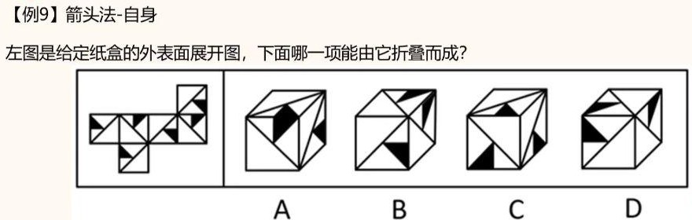

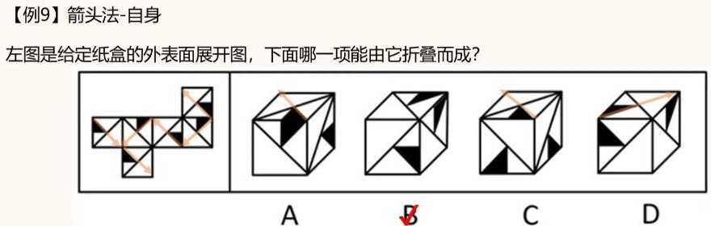

**思路**：
1. 六个面完全相同，**没有唯一面**，找点、找边都用不上，看周边也行不通。
2. 但每个面自身有**唯一点**，所以箭头法还剩一个作用：**看自身左右**。箭头可以斜着画。在题干中，每个面都朝那个点画箭头，黑色三角形都在箭头**右边**，六个面完全一致。
3. A：其中有一个面画箭头后，黑三角在箭头左边，左右反了，排除。
4. B：三个可见面的黑三角都在右边，保留。
5. C、D：都有面的黑三角在左边，排除。
6. 选 B。

**答案**：B

> 考场上怎么想到的：**没有唯一面 → 看不了周边 → 只能看自身左右**。

**例10**（26 天津事业）图 1 沿边线剪开折成方盒子，得到图 2 和图 3，两个盒子各有一面空白，问两个空白面依次应是什么图案。

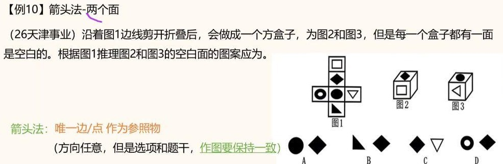

**思路**：
1. 能画箭头的只有三角形面和直角三角形面，其余面（正方形、菱形、圆、圆环）都找不到唯一点。
2. **图 3**：朝三角形画箭头（三角形的一条边与外框平行），看箭头尾巴一侧，借公共边（两条边互相垂直）转过去，一定是**菱形**。所以图 3 的空白是菱形，只能排除 C。
3. **图 2**：正方形和菱形单独看都没有唯一，就**构造唯一**：把正方形和菱形两个面连在一起看，从正方形指向菱形画一个箭头。图 2 的空白在这个箭头的右边，借公共边不管怎么滚，滚过去的都是**圆环**。
4. 所以答案依次是圆环、菱形，选 D。用相对面也能排掉 A、B、C，但这题的重点是方法。

**答案**：D

> 这两题的用意：例9 说明箭头法可以**看自身**；例10 说明**没有唯一时可以把两个面连起来构造唯一**。只要找到唯一，作图标准一致，箭头法怎么用都可以。

---

## 5. 公共点

### 识别信号
没有唯一点或唯一边（箭头法用不了），而且要比较的**三个面在展开图中挨得很近**。

### 规律讲解

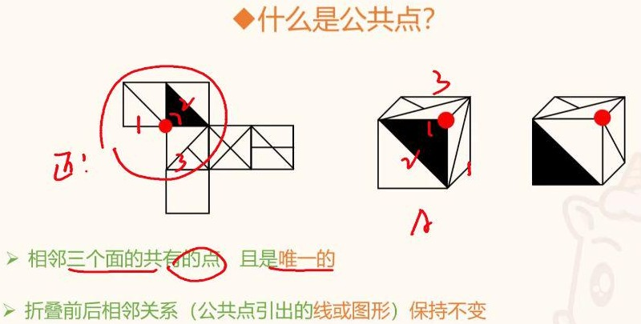

- **公共点**：**相邻三个面共有的点，而且是唯一的**。
- **折叠前后的相邻关系保持不变**：从公共点引出的线条或图形，在展开图里怎样，在立体图里就得怎样。
- 用法：比较选项中这三个面在公共点处的图案。上图左边立体图中，1 面的斜线原本是从公共点引出的，这里却没有，所以错。右边立体图中，斜线对上了，但黑三角形的**直角**不在公共点上，所以也错。

> 💡 解释：正方体每个顶点恰好属于 3 个面。折叠后，这 3 个面在该点会合，碰到这个点的线条或图形不会离开它，因此可以用来对照。

### 真实测评

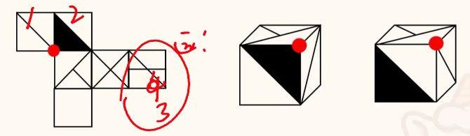

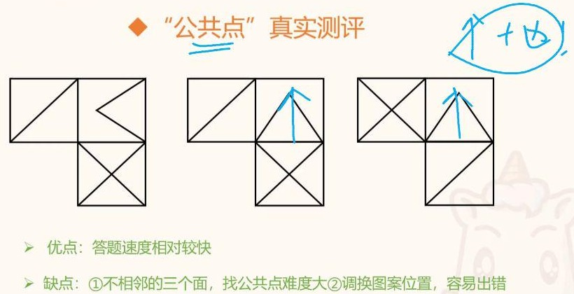

- **优点**：答题速度相对较快。
- **缺点 ①**：三个面**不相邻、离得远**时，公共点很难找，找起来慢。
- **缺点 ②**：出题人**调换图案位置**时容易出错。上图中，从公共点看，斜线、三角形、交叉线都从那一点引出，“完全对得上”。但用箭头法一画，左边对不上，上下也换了位置，所以其实是错的。公共点不稳定，**只能配合箭头法做排除**。

### 例题

**例11**（25 山东事业）给出立体图形，问其外表面展开图可能是哪个。

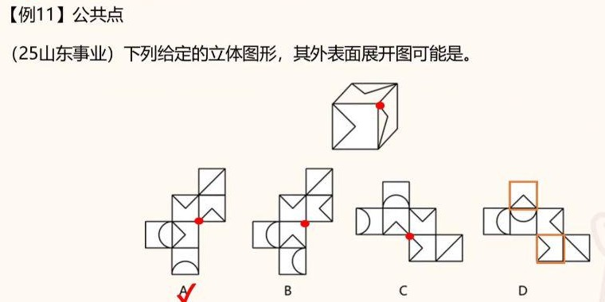

**思路**：
1. 题干三个面**长得一样**，只能看自身左右，但这题连自身左右都区分不了，箭头法用不上，只能**换方法**。
2. 选项中这三个面都挨得很近，**三个面近时，公共点最好用**。
3. D 先排除：两个“∧”面分居中线两侧，隔了一列，是**相对面**（上图橙框），不可能同时出现。
4. 数公共点处引出的线条条数（这题没有图案，只能看线）：题干 1 条，A 1 条，B 0 条，C 2 条，所以排除 B、C。
5. 选 A。

**答案**：A

---

## 6. 六面体高频模型

### 例12 两个六面体（26 国考）
下图是由 2 个正方体组合成的长方体，问这 2 个正方体的外表面展开图可能分别是哪两个。

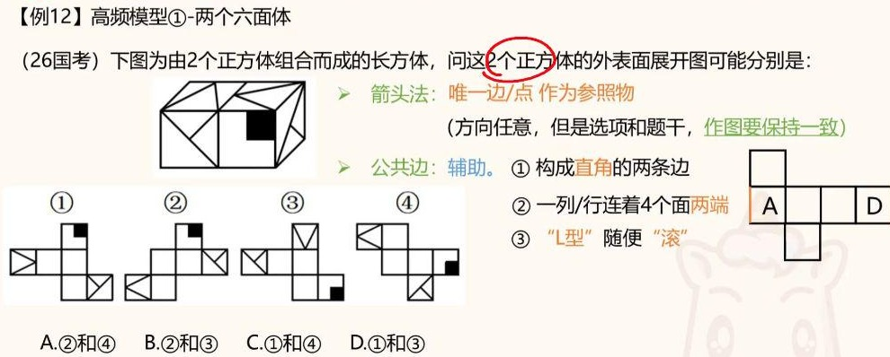

**思路**：
1. 其实就是**做两次六面体**，用箭头法加公共边。
2. 四个展开图里，好画的是那个**大等腰三角形面**：顶点是唯一点，而且在中间，比角落里的点好画。每幅图都朝它的顶点画箭头。
3. 看题干：两个正方体的大三角形面，一个的三角形和相邻面直接挨着，一个没挨着，所以心里要有准备，这是**两个不同的正方体**。两者共同点是箭头下方（尾巴一侧）都是带三角形的面。
4. ①：箭头尾巴处看不见，**跳过**。②：能看见的部分**没有三角形**，错。③：看不见，跳过。④：能看见的部分是**空白**，错。
5. ② 和 ④ 都错，只能是 ① 和 ③。

**答案**：D

### 例13 找不同（25 湖北选调）
以下除哪一项外，均为同一正方体纸盒的外表面展开图？

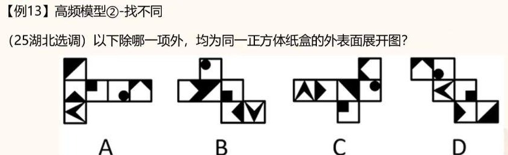

**思路**：
1. 角落里的面不选，剩下第 1、2、3 面差不多，都可以用。**第 3 面本身就像一个箭头**，连箭头都不用画。
2. 每个选项都看这个“箭头”的**右边**是什么：A、B、C 一样，D 不一样。所以 D 就是那个“不同”。
3. 换别的面画箭头（每幅图画法一致）：在 A、B、C 中，要对比的那个面都在箭头右边（C 需要借直角公共边倒回来看）；到了 D，它跑到了**左边**，左右反了。结论一样，**选哪个面都不影响结果**，挑一个好看的面就行。

**答案**：D

### 例14 分割面（24 广东事业）
左边是正方体表面展开图，右边哪项能由它折叠而成？（第六个面被分成 4 小块，分别挂在别的面上）

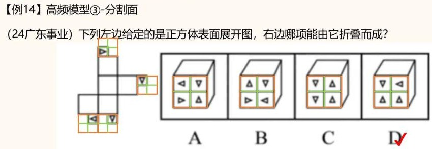

**底层逻辑（为什么必须用箭头法）**：

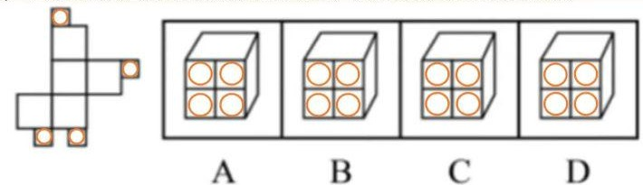

- 把所有小三角形换成圆（或正方形），四个小块就完全一样，**出不了题**。所以出题人只能用**有指向性的图案**：箭头、三角形、大于号等，也就是一定有唯一点或唯一边。**这类题天然就是为箭头法准备的**，公共点在这里用不上。

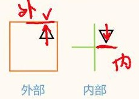

**做法**：四小块拼回去是一个“田”字，包括一个**正方形外框**（外部）和一个**十字架**（内部）。看每个小三角形**指向谁**：指向外框就记“外”，指向十字就记“内”。
1. 题干：四个三角形都指向十字，是 **4 个内**。
2. A：3 个内、1 个外，排除。
3. B：第一个三角形就指向外框，排除，后面不用再看。
4. C：有一个指向外框，排除。
5. D：4 个内，正确。

**答案**：D

> 💡 解释：每个小块都是一整块刚性翻折，块内三角形对准的是“大面的外边框”还是“中间的十字”，折叠前后不会改变，所以“内/外”的个数必须一致。按个数比较是**排除法**：个数不同一定错。

**拓展**（23 国考）同类题：箭头指向的“内/外”。

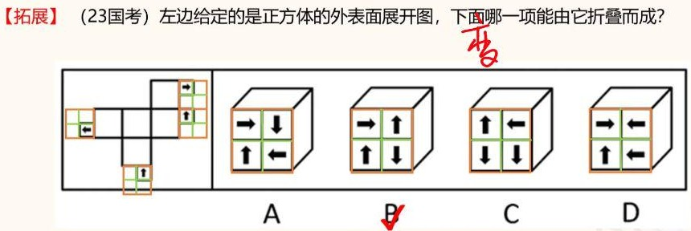

**思路**：题干中四个箭头依次是：指向十字（内）、指向外框（外）、指向外框（外）、指向十字（内），是 **2 内 2 外**。A 是 4 内，排除；B 是 2 内 2 外，保留；C 是 3 外 1 内，排除；D 是 4 内，排除。这个模型国考已经考了三四次，是高频模型。这题算难题，直播间正确率 82% 已经很不错了。

**答案**：B

### 例15 公共边颜色一致（25 国考）
下图为 4 个黑色、8 个白色正方体粘接成的长方体，问哪一项可能是其正确的外表面展开图。

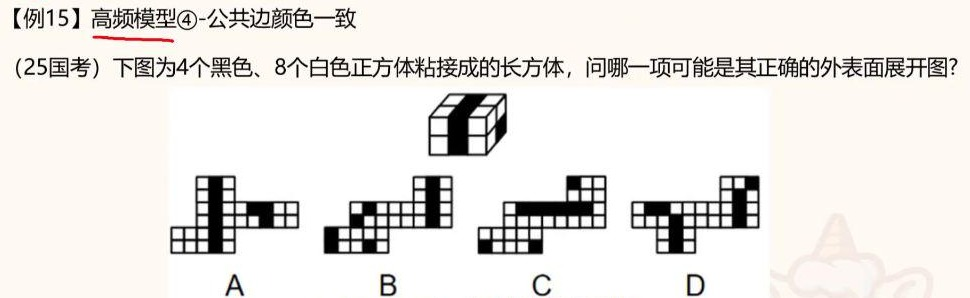

**题干关键**：长方体是由**一个个小正方体**粘成的。同一个小正方体各个面的颜色都一样。所以长方体一条棱两侧的小方格，如果属于同一个小正方体，**颜色必须相同**。

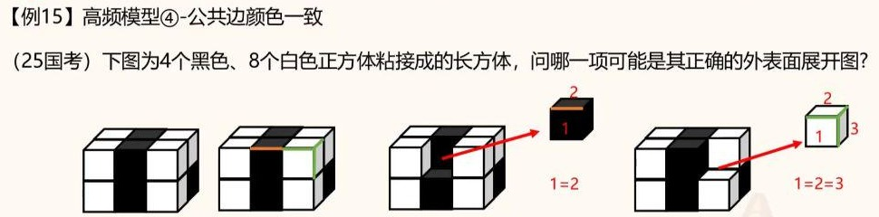

- 把中间的黑块拎出来看：它在两个面上露出的 1 和 2 颜色相同（1=2）。角上的白块露出三个面，1=2=3。
- 平面图中，**构成直角的两条边是同一条边**，最简单。所以只要检查每个直角缺口两边的小方格颜色是否一致。“贴皮家具”那种表面贴不同颜色的情况，这里不存在。

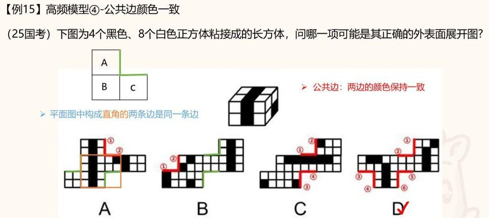

**思路**：
1. A：检查角落，这条边两侧的方块一黑一白，颜色对不上，排除。
2. B：直角处两组方块颜色都对不上，排除。
3. C：有一组对上了，另一组没对上；另外还要注意这条边的长度对应关系，排除。
4. D：所有直角边两侧都对上了，正确。

**答案**：D

> **A 的坑（老师专门讲）**：有同学在 A 中找了三处，全都对上，就选了 A。但**别的地方对不上，照样是错的**。这是出题人专门挖的坑，这类“颜色一致”题要把能看到的直角边都检查一遍。这种题干从 24 年、25 年一直出到 26 年国考和联考，**太高频了，题干一定要记住**。

---

## 7. 四面体

### 识别信号
展开图由 4 个三角形组成（大三角形或平行四边形），问能折成哪个三棱锥，或者反过来问展开图。

### 7.1 解题步骤

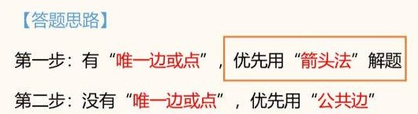

| 步骤 | 条件 | 方法 |
|---|---|---|
| 第一步 | 有“唯一边或唯一点” | 优先用**箭头法**（与六面体完全一样） |
| 第二步 | 没有“唯一边或唯一点” | 优先用**公共边** |

> 💡 解释（四面体为什么没有“相对面”这一步）：四面体的任意两个面都有一条公共棱，任何两个面都相邻，不存在互相看不见的一对面，所以相对面法用不上。

### 7.2 箭头法用于四面体

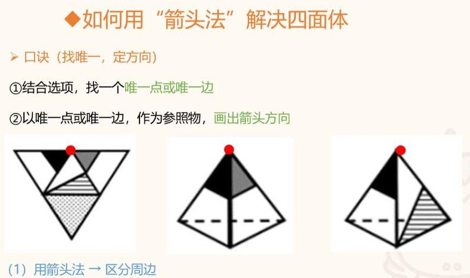

**作用(1)：区分周边**。在黑色面上以红点为唯一点画箭头，比较箭头右边紧挨的面。展开图中，黑色面右边紧挨的是条纹面（中间那个三角形）。第二个立体图中，箭头右边是灰色面，对不上；第三个立体图中，箭头右边是条纹面，对上。

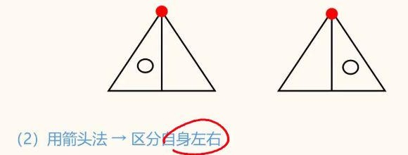

**作用(2)：区分自身左右**。同一个面上，圆在箭头左边还是右边，两个图正好是镜像，不可能是同一个面。六面体例9 用的就是这个作用。

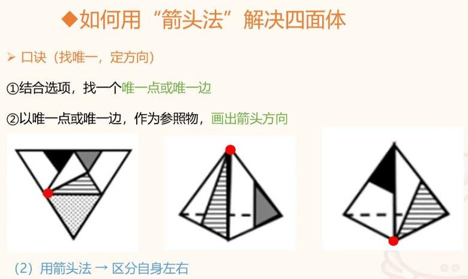

以那个面上的红点为唯一点画箭头，先看这个面**自身**的阴影在箭头左边还是右边：展开图中在左边。第一个立体图中在右边，自身左右反了，周边都不用看，直接错。第二个立体图中在左边，自身对上了，再检验周边：左边、右边的面也都对上，是完美选项。

### 例题

**四面体例1**（24 联考事业）左边是纸盒外表面的展开图，右边哪一项能由它折叠而成？

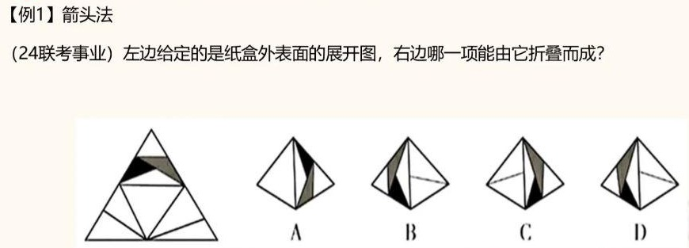

**思路**：
1. 第 2 和第 4 个面图案相同，第 3 个面是空白，**能画的只有第 1 个面**，选它的原因很明确。
2. 朝这个面上三角形的唯一点画箭头。各选项中能对比的只有箭头**尾巴**（下方）那个面。题干中这个面是**空白**：A 是空白，对；B、C、D 都不是空白，错。
3. 看自身左右也可以，但只能排掉 C，选不出唯一答案，所以**看周边更快**。

**答案**：A

**四面体例2**（23 江苏）左边给定的是一个四面体，右边哪一项可能是它的外表面展开图？（与前面的题方向相反：由立体图找展开图）

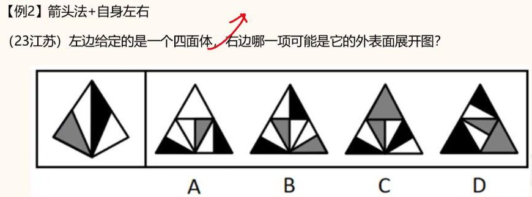

**思路**：
1. 两个面都能画，老师选**有唯一边的那个面**，朝唯一边画箭头，每幅图都这样画。题干中灰色部分在箭头**右边**，箭头左边紧挨的是**黑色面**。
2. A：**看自身**，灰色在左边，和题干相反，排除。
3. B：自身左右对了，但箭头左边紧挨的面不是黑色面，**看周边**，排除。
4. C：自身是右边，对上；左边是黑色面，对上，选 C。
5. D：自身对，但左边紧挨的面和题干对不上，排除。也可以用公共边判断：看这两个面在公共边处，是灰色面远离公共边、黑色面挨着公共边，接触情况和题干相反。

**答案**：C

### 7.3 四面体的公共边

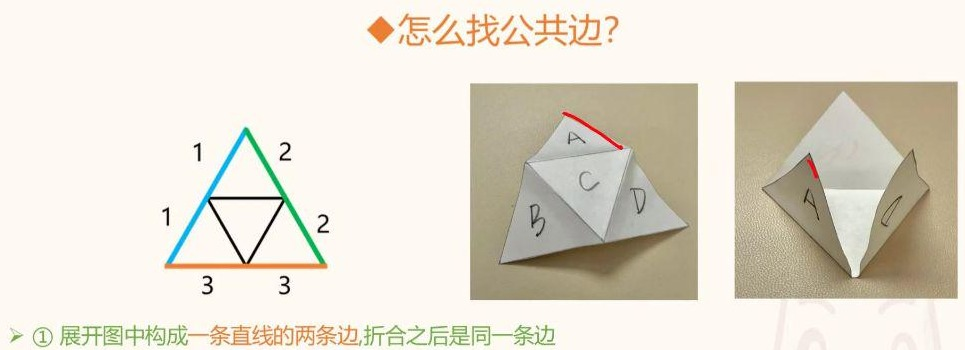

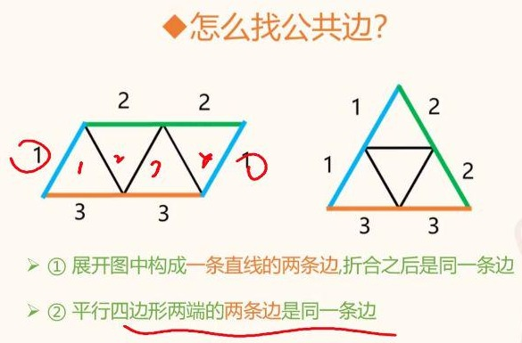

- **① 展开图中构成一条直线的两条边，折合之后是同一条边**。在大三角形展开图中，每条大边被中点分成两段（1-1、2-2、3-3），这两段折起来就是同一条棱。
- **② 平行四边形两端的两条边是同一条边**，就像正方体里“4 个面两端”。4 个三角形排成一个平行四边形，两个斜端（1 和 1）折起来会碰到一起。平行四边形的上下两条长边也按规则 ①，各自两两配对（2-2、3-3）。
- 真记不住，就自己拿纸折一下。

> 💡 解释：四面体每个顶点处有 3 个等边三角形，3 × 60° = 180°。展开图中大三角形一条边的中点处正好有 3 个小三角形，拼成一个平角。折叠时剩下的 180° 缺口要合上，所以这个点两侧“连成一条直线”的两段边会重合。平行四边形则是 4 个面绕一圈，首尾相接。

**四面体例3**（22 江苏）左图给定的是多面体的外表面，右边哪一项能由它折叠而成？

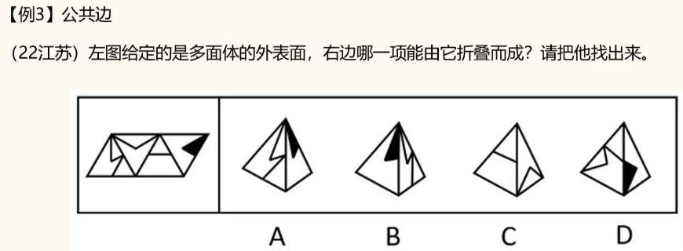

**思路**：
1. 所有面都能用箭头法，但有一个面出现得很多，画完箭头后左右都不好看，所以箭头法**只用在 C 上**：C 中箭头右边是白色三角形，题干中是黑色面，排除。
2. A、B、D 都要考虑“闪电”面（1 号）和黑色面（2 号）的关系。这两个面离得很远，箭头法用不上。它们是**平行四边形的两端**，所以两者之间的那条边是公共边。
3. 看各选项里这条公共边的**接触情况**。题干中，闪电线只有**端点**碰到公共边，黑块沿公共边占了一半。
4. A：闪电从**中间**碰到公共边，排除。
5. B：闪电在首尾碰到公共边，黑块接触一半，都对上。
6. D：闪电的接触点也在中间，和 A 一样，排除。
7. 选 B。

**答案**：B

> **秘密**：箭头法熟悉之后，就等于有了“**想象力**”。到后期可以不画箭头，脑子里一过就能判断。

---

## 8. 多面体（公共边长度）

### 识别信号
立体图形不是正方体，也不是四面体，比如六棱锥、异形拼接体，而且**面上基本没有图案**。

### 规律讲解

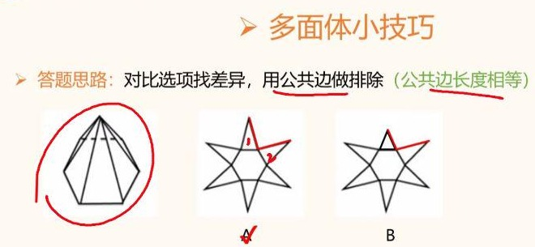

- **为什么不用箭头法**：多面体大多没有图案，找不到唯一，箭头法行不通。
- **答题思路：对比选项找差异，用公共边做排除（公共边长度相等）**。要折成封闭的立体，**相邻两个面的公共边长度必须相等**，否则拼不起来。比如上图六棱锥的展开图，A 中 1、2 两条边长度相等，能拼接；B 中长度不同，拼接不了。
- **不用看题干**：多面体的题干往往很复杂，看也看不明白，直接对比选项，找不同点做排除。选项分析不出来的这类题，考场上可以放弃。

### 例题

**多面体例1**（21 山东）左图是给定的立体图形，下面哪个选项是该立体图形的外表面展开图？

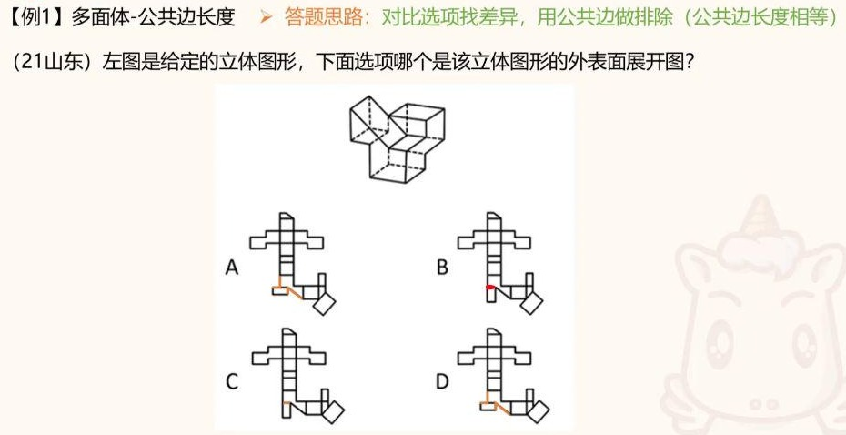

**思路**：
1. 对比选项找不同：各选项的差别在**底部那个小长方形的位置**。
2. 公共边长度要相等，至少要有一条边能和相邻面对上。A、D 中这个长方形放的位置很怪，左右周边**没有一条边长度相等**，排除。
3. B 与 C 只差长方形的位置。B 中这里的两条边长度不相等，靠不起来；C 能靠上，选 C。

**答案**：C

**多面体例2**（22 山东）下面哪一项是给定立体图形的外表面展开图？

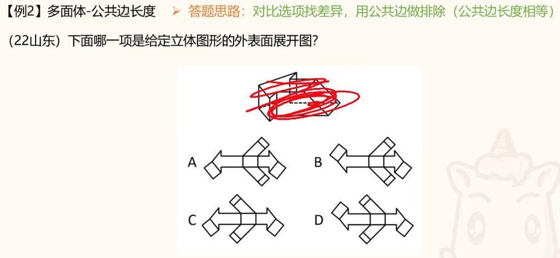

**思路**：
1. 题干不看（老师直接划掉了），只对比选项：差别在左边和右边的结构。
2. **先看长度**：C、D 中，朝左一侧的这两条边长度差距太大，不可能靠在一起，排除。A、B 中的长度接近，保留。
3. **再看小长方形的朝向**：A 中两个小长方形朝**同一方向**，B 中一上一下。老师用张开的大拇指比划：如果两个同向，折起来会**重叠在同一个位置**，抢位置了。只有一上一下才不会重叠。所以排除 A。

**答案**：B

---

## 9. 附：上节课答疑（图形间位置 / 强弱特征）

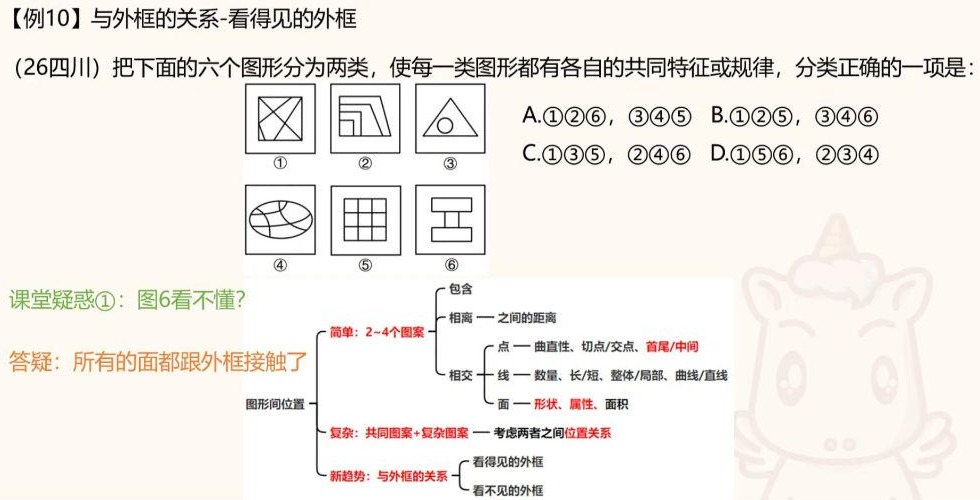

**上节课例10**（26 四川）六个图分两类，考点是“与外框的关系：看得见的外框”（完整讲解见第6章例10）。
- 这里的外框是**图形自己最外面的轮廓**。③ 中的圆没碰到三角形外框；④ 中有一个面（老师涂红的那块）没碰到椭圆外框；⑤ 九宫格中间的小正方形没碰到外框。
- ①、②、⑥ 的所有面都碰到了外框。⑥ 看不懂的同学，先把外面的“工”字形轮廓描出来，就能看出中间那一块的左右两边都贴着外框。
- 所以分类是 ①②⑥ / ③④⑤，选 **A**（第6课课件上老师勾的也是 A）。

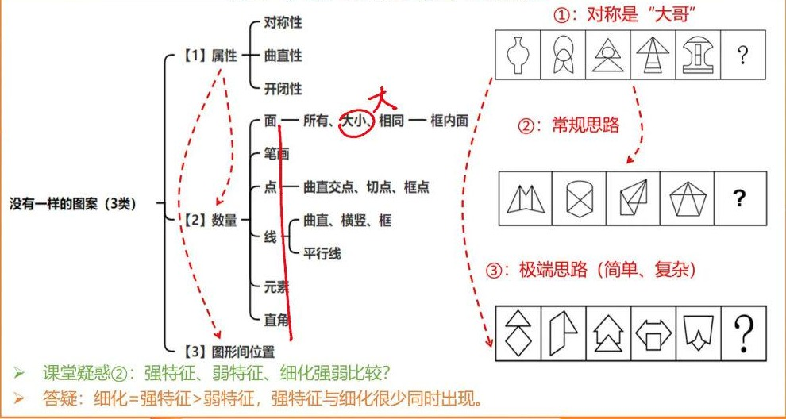

**强特征、弱特征、细化的关系**：**细化 = 强特征 > 弱特征**。
- 细化和强特征没有优先级之分，而且**很少同时出现**。比如出现了明显的大面，就很少再同时出现直角之类的特征。就算重叠，也只是多一个思考方向。
- 只有**弱特征**的优先级要往后放。其他特征只要出现了，就可以作为一个独立的思考方向。

---

## 本章小结

### 速查表：特征 → 规律 → 做法

| 看到什么 | 想到什么 | 怎么做 |
|---|---|---|
| 选项中同时出现展开图里隔一个面或隔一列的两个面 | **相对面**不能同时看见 | 直接排除（第一步） |
| 有只出现一次的面，而且图案有方向（三角形、箭头、字母、梯形） | **箭头法** | 找唯一点或唯一边 → 朝它画箭头 → 比较上方、尾巴、左、右（看周边） |
| 要比较的面没直接挨着 | **公共边** | 直角两边、四个一排的两端、L 型滚，把面移过来再比 |
| 两个选项的图案都在箭头同一侧，分不清 | **双箭头** | 再横着加一个箭头，分成四个象限，分上下 |
| 圆、正方形等对称图案，或两个相同的面 | 没有唯一 | **构造唯一**：两个面连起来看；或者换一个面 |
| 六个面都一样 | 看不了周边 | **看自身左右**（例9） |
| 没唯一，三个面挨得近 | **公共点** | 数公共点引出的线条，对比图形（例11） |
| 两个正方体拼成的长方体 | 做两次六面体 | 箭头法 + 公共边（例12） |
| “除哪项外”找不同 | 同一个参照面 | 看哪个选项与众不同（例13） |
| 一个面被分成 4 小块 | 指向性图案 | 数“指向十字（内）/指向外框（外）”（例14） |
| 小正方体粘成长方体 | 同一个小正方体颜色一样 | 直角两侧的小方格颜色必须一致，全部检查（例15） |
| 四面体 | 箭头法 → 公共边 | 连成一条直线的两段边、平行四边形两端 |
| 没有图案的多面体 | 公共边长度相等 | 对比选项找差异，不看题干 |

### 口诀汇总
> - **图案在外，一种折法。所有方法都是排除，单一技巧必有缺点。**
> - **相对面：中间隔 1 个或隔 1 列（紧挨 Z 字中线）。**
> - **箭头法：找唯一，定方向；作图标准要一致。**
> - **选面：居中优先，角落不选，倒着不选，旁边全是空白不选。**
> - **公共边：直角两边是一条；四个一排两端连；L 型随便滚（右滚 3 次 = 左滚 1 次）。**
> - **公共点：相邻三面共有且唯一，引出的线和图形不变。**
> - **五星推荐：箭头法（主）+ 公共边（辅）。箭头法熟悉后 = 有了想象力。**
> - **四面体：连成一条直线的两段边是一条；平行四边形两端是一条。**
> - **多面体：对比选项找差异，公共边长度相等。**

### 易错坑汇总
1. **箭头画法前后不一致**：题干朝顶点画，选项就必须也朝顶点画。画反了会误判。
2. **分不清三角形胖瘦**：例4 有三个不同的三角形，先对应清楚是哪一个。
3. **死盯一个面**：一个面出不了答案（远处的面要移好几步）就马上换面，比如例5 从 E 换到 Y、从 F 换到 V。
4. **在正确选项上死磕**：正确选项往往最难分析，要敢跳过，排掉三个就行。
5. **只看公共边或只看公共点**：接触方式一样，但左右反了（公共边测评），或者公共点的线全对上了但位置换了（公共点测评），都会被骗。一定要配合箭头法。
6. **例15 类颜色题只查几处**：查到几处都对就选，结果别的地方颜色不一致。这类题要检查全部直角边。
7. **Z 字形误判**：两个端面必须都**紧挨同一条中线**（同一列），分居两侧，才是相对面。
8. **折叠方向搞反**：图案必须在外表面。
