# 第8章 空间·三视图 + 截面

> **本章要点速览**
> - **三视图题型判定**：问法里直接出现“主视图/俯视图/左视图” → 三视图；九宫格里立体图和平面图**关联度高**（如圆柱→长方形→圆）→ 也按三视图想。
> - **三个方向**：主视＝从前往后，俯视＝从上往下，左视＝从左往右；只说“视图”＝**任意角度**（可以歪头、倒着看＝可旋转，但**不能翻转**）。
> - **答题口诀**：**外部轮廓定方向，内部线条定选项**。
> - **四个细节**：看到的都是平面图；内部线条最爱挖坑；被挡住的部分不画线（画虚线也对，但**画成实线一定错**）；曲面会变成直线。
> - **题干画了虚线** = 出题人就想考“看不见的部分”；选项里永远不画虚线。判断遮挡要按真实视线方向想，别被斜着画的立体图骗。
> - **小方块题**：对比题干找相同视角（三视图），数个数/层数放最后。
> - ★**27 块挖空 + 涂色**（给两视图求第三视图）：①挖空数 = 27 − 所用块数；②三个视图里“透光”的位置整排打叉；③在模型上标颜色。
> - ★**魔方拧一次**：先找多数黑块不需要移动的情况，再移动个别黑块；视图可转不可翻。
> - **截面** = 与刀接触的面；**一刀切、刀无限大、不能拐弯**；截面**没有虚线、内部没有线**，挖空处断开留白。
> - **圆柱/圆锥/圆台**：横切出圆，斜切出椭圆，碰到底面出直线；**纯直线图形**只有圆柱竖切（矩形）和圆锥/圆台**竖直过顶点**（等腰三角形/等腰梯形），不过顶点就是曲线。
> - **正方体**：切不出直角三角形；斜切也能切出正方形；**经过几个面就是几边形**，六面体最多六边形。
> - **截面 vs 三视图**：横着一刀只能出一个圆（两个同心圆是俯视图）；视图有线，截面没线。
> - ★**三点截面（方块体）**：过三顶点 = 对角斜切（“下楼梯”）；只数**每排个数 + 每排颜色**。
> - ★**三点截面（常规体）**：连同一平面的两点 → 过第三点画平行线 → 借助视图看形状是否变化 → 牢记**刀无限大**，别漏切。

---

## 1. 三视图：题型判定与三个方向

### 识别信号（看到什么，想到它）
1. **问法直接给出**：“符合左边立体图形的**俯视图**和**左视图**的是”——直接就是三视图，而且方向已告诉你。
2. **问法是常规找规律**（“选择最合适的一个填入问号处”），但题干里**立体图和平面图之间有关联**：比如第一格是棱台，第二格正好是它从前往后看到的梯形，第三格是它从上往下看到的“回”字形——这就是在考三视图。

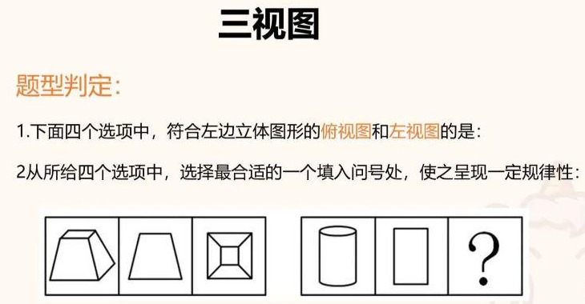

### 规律讲解

#### 三个方向
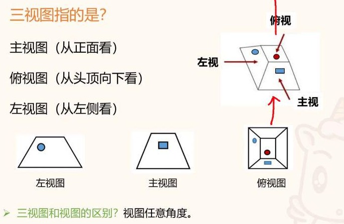

| 视图 | 观察方向 | 记法 |
|---|---|---|
| **主视图**（正视图） | 从正面看，**从前往后** | 最常用 |
| **俯视图** | 从头顶向下看，**从上往下** | “俯”＝低头往下看 |
| **左视图** | 从左侧看，**从左往右** | 把“从”字省了：“左视”＝“从左边看” |

#### 三视图 vs 视图（差一个字差很多）
- **三视图**：只能是上面三个固定方向，限制更多。
- **视图**：**任意角度**——上下左右前后都行，甚至可以歪着头、倒立着看（所以图案可以**旋转**）。
- 做题前一定先看清问的是“三视图”还是“视图”。

### 三视图的四个细节
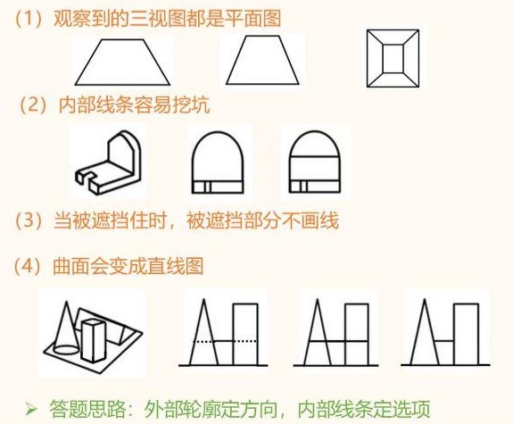

1. **看到的都是平面图**：无论从哪边看，得到的都是平面图形，不是 3D 图。
2. **内部线条最容易挖坑**：例如图中立体从前往后看，两个选项外轮廓一样，区别只是底部多了一条横线——题干上没有这条线，就错。所以**外轮廓只能帮你定方向，选项往往要靠内部线条区分**。
3. **被遮挡的部分不画线**：图（4）中圆锥、长方体后面还有一个被挡住的立体，三种画法：
   - ① 看不见的部分画**虚线**（最严谨，正确，但考试中基本不这么画——画得太严谨就等于送分）；
   - ② 把后面看不见的线画成**实线、画到前面**——**一定错**，这是考试最常见的挖坑方式；
   - ③ 看不见的干脆**不画**——正确，考试中以这种画法为主。
4. **曲面会变成直线**：圆锥从正面看是三角形，圆柱从侧面看是长方形，曲面在视图里变成纯直线图形。

> **答题思路：外部轮廓定方向，内部线条定选项。**

💡 解释：视图其实是“沿某个方向的平行投影”。沿视线方向，前后的东西被压到同一平面上，所以只剩平面图；同一条视线上前面的挡住后面的，所以被挡部分没有线；圆锥侧面沿水平方向投影，轮廓就是两条母线，所以曲面变直线。

### 易错点 / 老师提醒
- **虚线只出现在题干里，不出现在选项里**。题干画虚线，就说明出题人想考“背后/下面看不见的东西”——你要清楚：实线是从这个方向直接能看到的，虚线是看不见的，两者要分开。
- **视图不一定是从前往后看**：某条棱从前往后看是虚线，但从后往前看它就是实线（见例2 的 D）。
- **判断遮挡要按“真实视线方向”想**：题干立体图是斜着画的（为了表现前后深度，把前后方向画成斜线），图上看起来挡住的，正对着看未必挡住；图上看起来露出来的，正对着看也可能被完全挡住。常用办法：找两条**平行的棱**作参照，看它们沿视线方向是否前后对齐（见例3、例4）。
- **左视图是水平地从左往右看**，不能“把头探到下面”去看外表面（见例5）。

---

## 2. 三视图例题

### 例题

**例1**（23湖北事业）大小相同的小正方体堆成的物体，给出正视图、左视图、俯视图，问物体可能是？
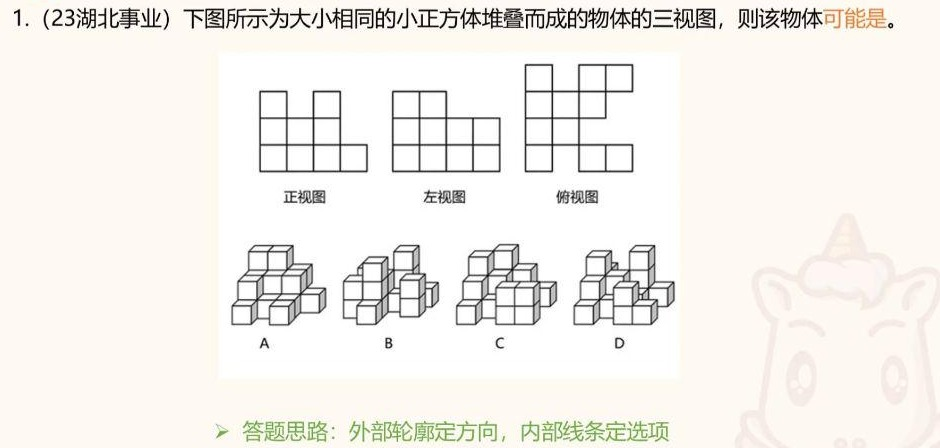
**思路**：
1. 三个视图都标出来了，方向不用找，基本是送分题。
2. 先看正视图（从前往后）：第 2 列顶上是**空的**（各列高度 3、2、3、1），这个空位就是挖坑点。
3. A：从前往后看，第 2 列顶上有方块 → 错；B：第二列这里也有方块 → 错；C：同样有方块 → 错；只有 D 在这里留空。
4. 验证：左视图从左往右各列高 3、3、2、2，俯视图布局也吻合。

**答案**：D

---

**例2**（24江西）从**任一角度**观看，下面哪项**不是**该多面体的视图？
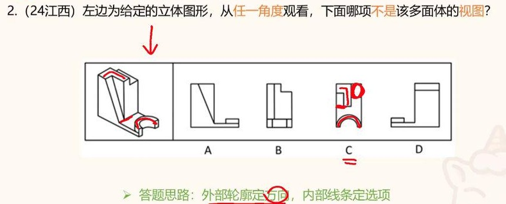
**思路**（“任一角度”→ 方向要自己找；选非题）：
1. **A**：找特殊轮廓——直角三角形，在题干正面就能找到，所以是从前往后看；内部线条：一条长线（两条棱重叠成一条）+ 一小段短线，该画的都画了 → A 正确。
2. **B**：像“大拇指”的轮廓，在题干右侧能找到 → 从右往左看；内部第 1 条线对上、大横线对上、那条**曲面变成的直线**对上、两条小短线也对上 → B 正确。
3. **C**：最直观的是拱形（半圆缺口），对应题干的弧形槽 → 从上往下看；L 型和旁边平行的短线都对；但 C 里的长方形**本应和 L 型等长、底部对齐**，C 画短了（画得太靠上）→ **C 错**。正确画法见下图顶部老师改画的红线位置。
4. **D**：大 L 型，要么从前往后、要么从后往前看；从前往后会看到三角形，所以只能是**从后往前**看：大片空白 + 小长方形都对 → D 正确。

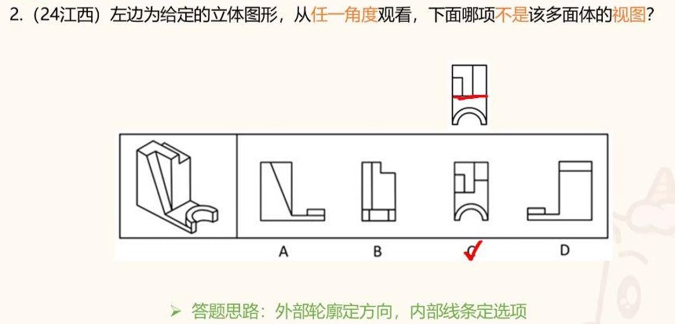
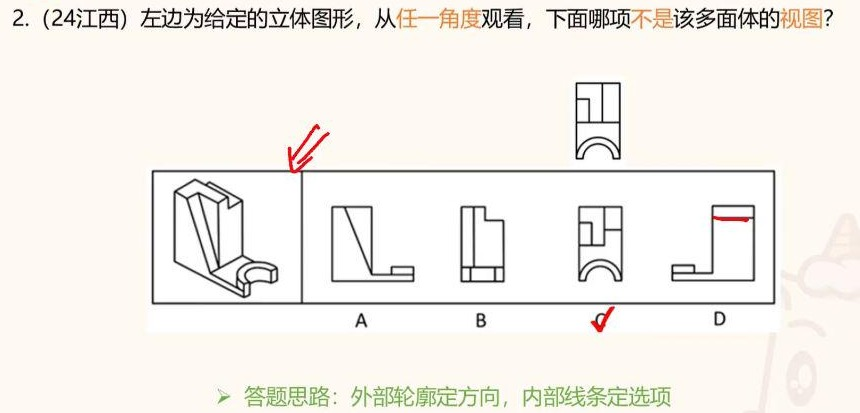
**答案**：C
> 学员疑问：“D 没有虚线？”——从前往后看是虚线，从后往前看它就是实线。视图的角度不是永远朝前的。

---

**例3**（25联考事业）作为给定立体图形的**俯视图和主视图**均正确的是？（每个选项上排为俯视图，下排为主视图）
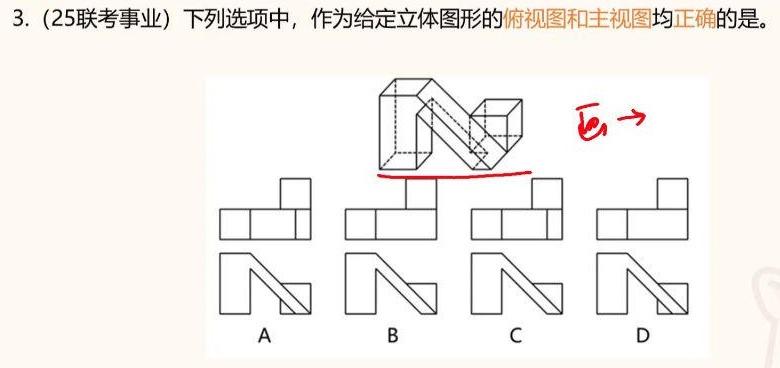
**思路**：
1. 题干**画了虚线** → 出题人就是要考“看不见的部分”。
2. **先看俯视图**（从上往下）能看到的实线面：一个正方形 + 一个大长方形 + 一个正方形，只有 **3 个面**。A、C 画了 4 个面——多出来的那条竖线（红色标注）正是题干里的虚线（下面被挡住的棱），看不见就不该画 → 排除 A、C。
3. **B、D 看主视图**：区别在右下角小正方体的左下角（绿色虚线处）。在斜着画的立体图里，这个角看起来被斜杆挡住了；但真正从正前方水平看过去，这两条线是平行关系，视线方向上**遮挡不住**，是看得见的 → 要画出来，小正方形应当完整。B 缺了这个角 → 错；D 画完整 → 对。

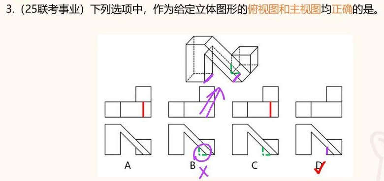
**答案**：D

---

**例4**（24联考事业）下面哪一项是该立体图形正确的**主视图和俯视图**？（每项左为主视图，右为俯视图）
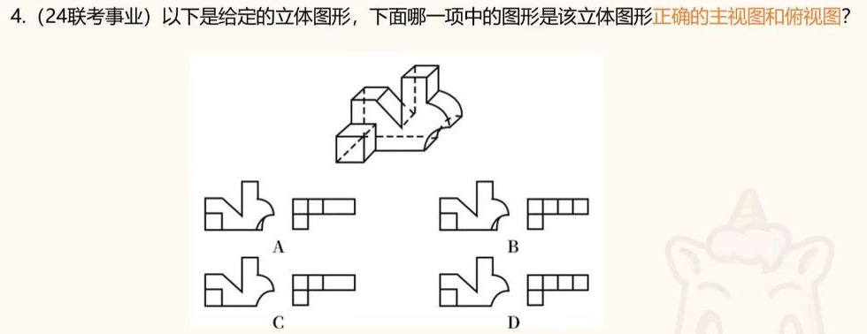
**思路**：
1. 方向已给，直接做。
2. **主视图**：外轮廓（方块、方块）确认是从前往后。A/B 与 C/D 的区别只在右下角那段**曲线**（后方的曲面）能不能被看见。
3. 找参照：题干中两处蓝色标出的顶棱互相**平行**，橙色标出的曲面两条棱也**平行**。平行说明后面的部分和前面的部分沿视线方向**正好前后对齐**——就像把粉笔正对着眼睛看，只看到一个圈，后半截全被挡住。所以曲线看不见、不画 → 排除 A、B。（如果不平行、稍微歪一点，后面才会露出来，那时才在 A、B 里选。）
4. **C、D 看俯视图**：从上往下数内部分隔线——第 1 条、第 2 条（两处其实是同一条）、第 3 条，共 **3 条**。C 只有 2 条（蓝圈处少一条）→ 错；D 有 3 条 → 对。

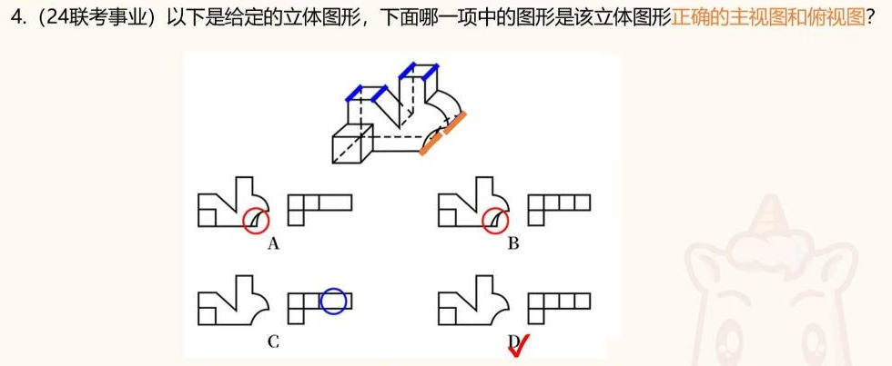
**答案**：D

---

**例5**（24联考事业）下面哪一项是该立体图形正确的**主视图和左视图**？（上排主视图，下排左视图）
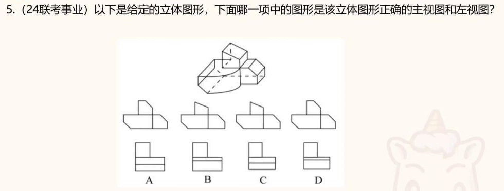
**思路**：
1. 方向已给。**主视图**：选项区别在顶部小块的形状——A、D 是五边形，B、C 是梯形（斜顶）。从前往后看它是**梯形** → 排除 A、D。
2. B、C 的区别在**左视图中间那条横线的高度**：B 的线靠上（下面部分更长），C 的线在中间。
3. 易错：有同学觉得“这块曲面看起来比较长，所以线应该靠上，选 B”——错在你看的是**外表面**。左视图是**水平地从左往右看**，不能把头钻到下面去看（那样确实会看到很长一段）；水平看过去，你看到的是曲面与平面交界处中间位置那条棱 → 线在中间 → 选 C。B 是一个出得很好的干扰项。

**答案**：C

---

**例6**（25联考）下面三组三视图依次与三个几何图形对应，三个几何图形的正确顺序是？
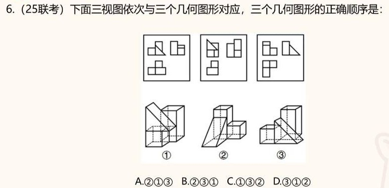
**思路**：
1. 题干没告诉你每组里哪个是主视图——这是本题最大的难点，第一步用外轮廓定方向。
2. 在长方形、正方形、三角形中，**三角形最特殊**，作为突破口：逐组比对三角形的位置，第 1 组左上角的三角形与图③从前往后看的三角形位置对上 → 第 1 组是③的视图，且**左上角是主视图**。
3. 推测每组左上角都是主视图，去验证：第 2 组左上角从前往后看对应①；第 3 组左上角的长方形、上面的长方形、正方形位置都与②吻合。
4. 顺序为 ③①②。

**答案**：D

---

**例7**（25联考）从所给的四个选项中，选择最合适的一个填入问号处。
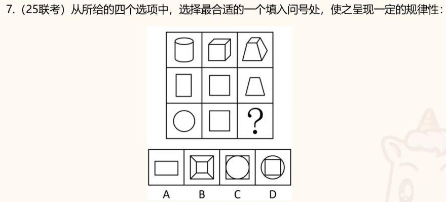
**思路**：
1. 题干没提视图，为什么想到三视图？第一列圆柱：从前往后/从左往右看都是长方形，从上往下看是圆——三图**关联度很高** → 按三视图思考。
2. 第二行：圆柱→长方形、正方体→正方形、棱台→梯形，都是从前（或左）看，角度无所谓；第三行才是关键。
3. 第三行圆柱是圆 → 从上往下或从下往上都行（题目没说三视图，上下都可以）。
4. 问号处：若从下往上看，棱台只能看到一个**干净的正方形**（下底面），选项里没有 → 只能从上往下：外轮廓是大正方形（B、C），里面还能看到上底面的小正方形及四条侧棱 → B。

**答案**：B

---

## 3. 考“空间”还是考“平面”？＆ 小方块考三视图

### 识别信号
- 一组图里有立体图形时，可能考**空间**（三视图等），也可能考**平面**（数面、数线等）。

### 规律讲解
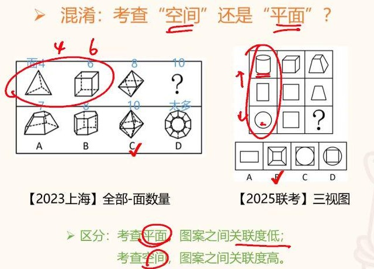

| 考查 | 图案之间的关联度 | 例子 |
|---|---|---|
| **平面**（数量） | **低**：各图之间没有“看”的联系，只让你数面的个数（4、6、8、10…） | 2023上海：面数 4、6、8、10 → 选 C |
| **空间**（三视图） | **高**：同一个物体从前看是长方形、从上看是圆，彼此有联系 | 2025联考：即上面的例7 |

### 小方块考三视图（出题人的“小心思”）
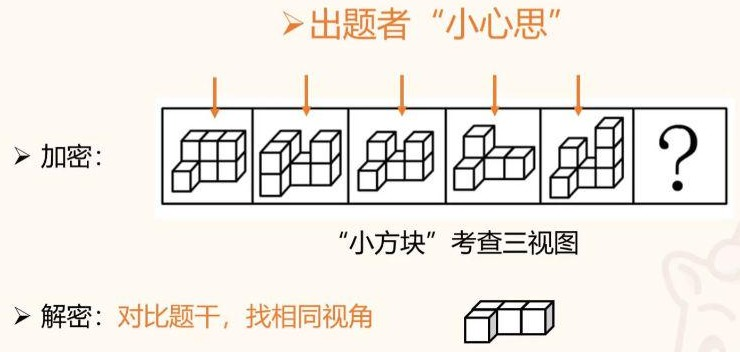
- **加密**：一排由小方块堆成的立体图，看起来像数方块个数，其实在考三视图。联考、江苏都可能出现。
- **解密**：**对比题干，找相同视角**——比如上图每幅图从上往下看都是同一个“手枪”形（L 形），就选从上往下看形状相同的选项。
- **什么时候才数个数/层数？** 当靠视角排除到只剩两项仍区分不开时，再去数层数（都是两层？有没有三层？），最后才数个数。**数个数放到最后**，一上来就数太浪费时间。

### 例题

**例8**（24联考）从所给四个选项中，选择最合适的一个填入问号处。
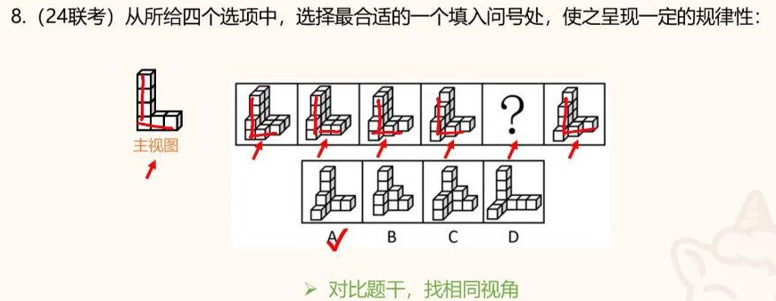
**思路**：
1. 小方块这么多，不可能让你去拼 → 要么找相同视角，要么数个数（能不数就不数，放第二步）。
2. 从上往下看，各图不一样（有的多一个方块）；**从前往后看**都是同一个 L 型：**竖 4 个、横 3 个**（题干每幅都验证是“4、3”）。
3. A：竖 4 横 3 ✓；B：多出一个方块 ✗；C：也多一个 ✗；D：横着有 4 个 ✗。

**答案**：A（根本不用数个数）

---

## 4. ★新模型①：27 块立方体挖空 + 涂色（已知两个视图求第三个）

### 识别信号
“由 x 个白色、y 个灰色、z 个黑色正方体组成的多面体的**左视图和主视图**，问哪一项可能是其俯视图”——三个视图给两个、求第三个，大致轮廓是 3×3 的正方形。

### 规律讲解
老师强调：这是近两年刚出的新模型，考试前已预告“大概率考”，结果真的考了；很多同学放弃空间题非常可惜，**今年还要准备**（打五角星）。

> **思路：①观察挖空（27 − 所用块数）②观察颜色 ③分别在模型上作标记**

1. **还原母题**：左视图、主视图的外轮廓都是正方形 → 原型是 **3×3×3 = 27 块**的立方体，出题人挖掉一些、涂上颜色。这一点理解不了，这类题就做不了。
2. **算挖空数**：27 − 已用块数 = 挖掉的块数。第一个要思考的就是“这几块分别在哪”。
3. **视图里“空着”的格 = 那一整排都被挖穿**（从这个方向看透光，说明这条视线上的 3 块全没了），在模型上沿该方向打叉。
4. **标颜色**：一种颜色直接涂；两种颜色时写“黑/灰”区分。
5. 最后只比较选项有差别的那一排。

💡 解释：为什么“看到空格就挖掉整排”？视图是沿视线方向的投影，某一格是空的，意味着这条视线上**没有任何一块**挡住光线，所以这一排 3 块都不存在。

### 易错点 / 老师提醒
- **同一个位置在两个视图里颜色不同（一个黑一个灰）并不矛盾**：视线可能穿过某个挖空的位置，看到的是后面另一块——“错位”。但要牢记总数：本题只有 2 灰 2 黑。
- **考场提速**：3D 模型在考场上是没有的。学会快速画：一个正方形 + 斜线 + 一个正方形，每个面画 9 格；然后铅笔打叉、涂黑。可以“赌”一下——翻到空间题只要出现这种题，就提前把 3×3×3 模型画好。学会了一定能拉分，不要又放弃三视图、又放弃立体拼合。

### 例题

**例9**（26联考）左下图为 14 个白色、2 个灰色和 2 个黑色正方体组成的多面体的左视图和主视图，问哪一项可能是其正确的俯视图？
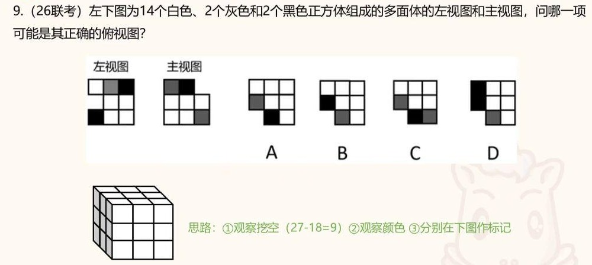
**思路**：
1. 用了 14 + 2 + 2 = 18 块，挖空 27 − 18 = **9 块**。
2. **左视图**（从左往右）：中间左格是空的 → 这一整排 3 块挖掉（记“×3”）。
3. **主视图**（从前往后）：右上角是空的 → 这一排又挖 3 块，共 6 块。
4. **俯视图**：四个选项左下角全是空白 → 从上往下这一列也透了 → 再挖 3 块，**9 块全部找齐**。到这里思路就非常清晰了。
5. **标颜色**：左视图左下黑、右上黑、上中灰；主视图右下灰、左上灰、上中黑，分别标到模型上。
6. **比较选项**：选项差别主要在最下面一排（紫色圈）。左边一格打过叉（空）；**中间一格应为黑色** → A、C 对，B、D（灰）错。
7. A、C 的区别在右格：白还是灰？灰块在下层，而它上面那一块**不能再挖**（9 个叉已经打完）→ 从上往下看到的是上面的**白块** → A。

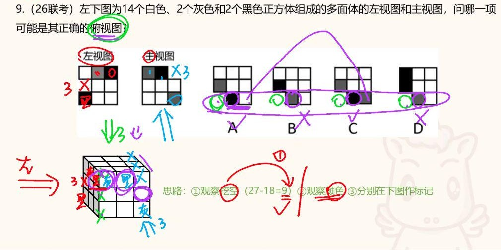
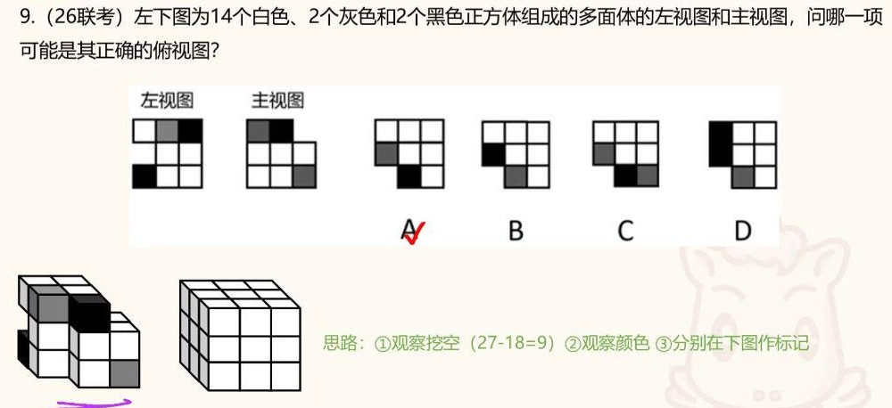
**答案**：A

---

## 5. ★新模型②：魔方拧动一次后的视图

### 识别信号
“以下为 x 个白色、y 个灰色正方体组合成的三阶魔方，问哪一项（不）可能是该魔方拧动 1 次（同一平面上的 9 个小正方体平行于该平面整体转动 90°、180° 或 270°）后某一面的视图？”

### 规律讲解
- **拧一次**：任选一层（横着的一排或竖着的一列所在的 9 块）转 90°/180°/270°，转一次即可。
- **某一面的视图**：前后左右上下任一面都行，而且是“视图”，可以横着看、倒着看——**图案可以旋转**。
- **但不能翻转**：一个面的图案只能从它外面看，转来转去只会得到它的旋转，得不到它的镜像。

> **思路：先找到多数黑块不需要移动的情况，再移动个别黑块。**

💡 解释：拧一次只改变一层，所以目标图案里大部分黑块应该“原地不动”。先锁定不动的那一面（不动的块在哪个面，就先想哪个面），再看剩下的一两个黑块能不能通过转某一层补过来。

### 易错点 / 老师提醒
- 出题人很“坏”：补出来的图案还会**旋转**一下（90°、180°）才给你，旋转没关系；但如果是**左右翻转**，就不可能——这是本题真正的挖坑点，属于视图与位置规律（旋转/翻转）的结合，是难题，要准备到这个难度。
- 解法往往不唯一（同一选项可能有两种拧法），想到一种能实现即可。

### 例题

**例10**（26联考）22 个白色、5 个灰色正方体组合成的三阶魔方，问哪一项**不可能**是该魔方拧动 1 次后某一面的视图？
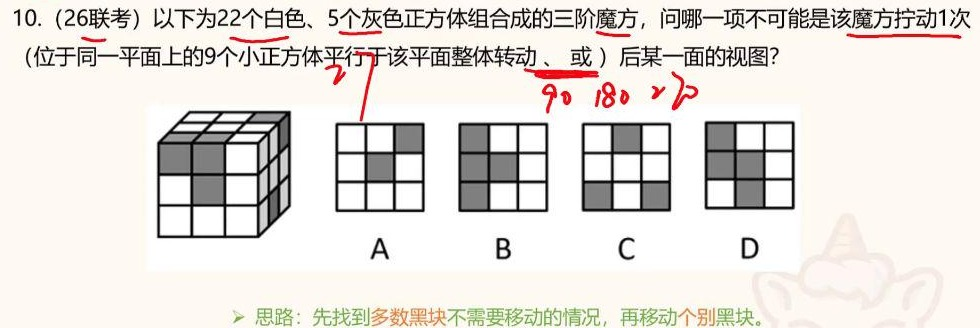
（题干魔方：正面左上、上中、正中心为灰；另有一块灰在顶面后右角（孤零零的顶点块），一块灰在右侧面底排中间。）

**思路**：
1. **A（对角线两块）**：正面中心那块是 5 块里**唯一在面中心**的，太特殊 → 固定不动（站在主视角度想）。再把孤零零的顶点块挪过来：把**最上面一层整体向左转 90°**，右侧面顶排（含后右角那块灰）转到正面顶排，正面变成“右上 + 中心”的对角线 → A 可能。

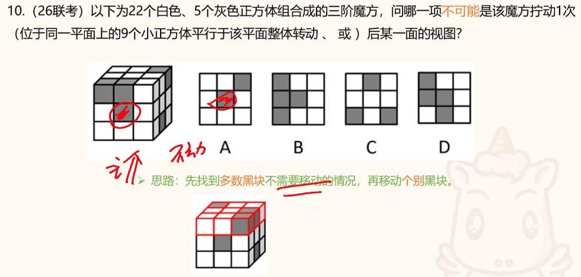

2. **B（T 形）**：正面已有左上、上中、中心 3 块（L 形/T 形已基本完整），只差右上一块：把**右边那一列（层）转一下**，把后上角的灰块转到正面右上 → 顶排 3 灰 + 中心 = T 形；B 是这个 T 形旋转后的样子，视图可以转 → B 可能。
3. **C（三角形）**：注意**对角线关系**。顶面（从上往下看）有前排两块灰和后右角一块灰；保持对角线不动，把左上角孤零零的那块转上去（转左边那一层），顶面就成了三角形，C 是它旋转 180° 的样子 → C 可能。若想从右往左的角度补，会多出一块黑块，行不通。

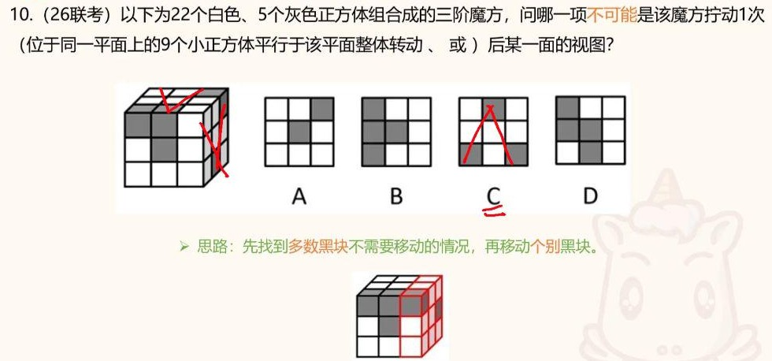

4. **D（闪电/Z 形）**：正面左上角有 L 型，看起来补右侧中间那块就行——右侧面底排中间正好有一块灰，转右边那一层把它转到正面右中 → 正面变成 Z 形（左上、上中、中心、右中）。把这个 Z 形顺时针转 90° 再和 D 比较：**D 是它的左右翻转**！视图不能翻转 → D 不可能。

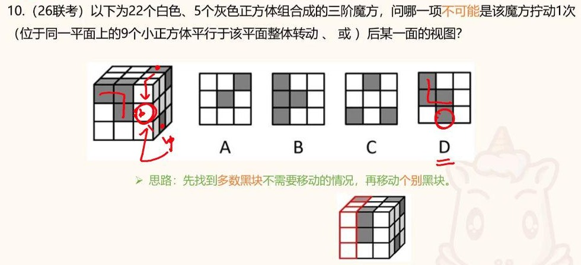
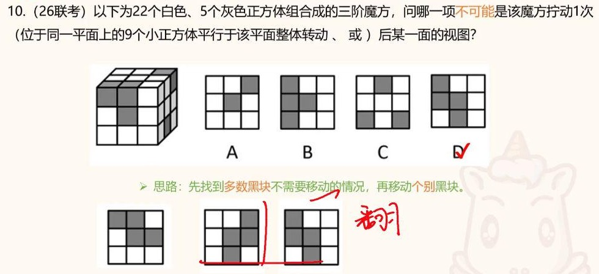
**答案**：D（A、B、C 是旋转能得到，D 要翻转才能得到）

---

## 6. 截面基础：概念与切割原则

### 识别信号
“将其从任一面剖开 / 用经过 A、B、C 三点的平面切割，下面哪项（不）可能是截面/切面？”

### 规律讲解
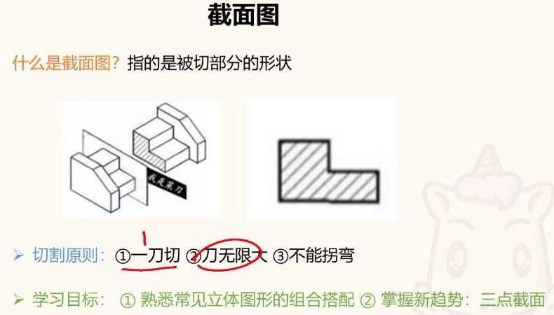
- **截面** = 被切割部分的形状 = **跟刀接触的那个面**（后面没碰到刀的部分都跟截面无关）。
- **切割原则**：
  1. **一刀切**：只能切一次，不能像“水果忍者”那样切好几个方向；
  2. **刀无限大**：刀是一个无限大的平面，碰得到的地方一定会被切到；
  3. **不能拐弯**：一刀下去方向不变。
- **学习目标**：① 熟悉常见立体图形（圆柱、圆锥、圆台、正方体）及其组合搭配——高频，一定要准备；② ★**新趋势：三点截面**——从概率上讲出现得更多（打五颗星），再不准备就要被更新了。

### 截面 vs 三视图（最高频的挖坑点）
| | 三视图/视图 | 截面 |
|---|---|---|
| 本质 | 从某方向**看过去**看到的形状 | 刀**接触**到的面 |
| 内部线条 | 看得到的棱都画线（**视图有线**） | 整个截面是一块平面，内部**没有线**，只看外轮廓 |
| 挖空的部分 | 看过去可能还有线 | **断开、留白**，没有线 |
| 虚线 | 题干可能出现 | **截面不可能有虚线** |
| 圆的个数 | 俯视可看到两个同心圆（上口、下底） | 横着一刀只能得到**一个**圆（大小随高度变） |

> 老师口诀：**视图有线，截面没线。** 先切完再看，别拿三视图的眼光去看截面。

---

## 7. 圆柱、圆锥、圆台的截面

### 规律讲解
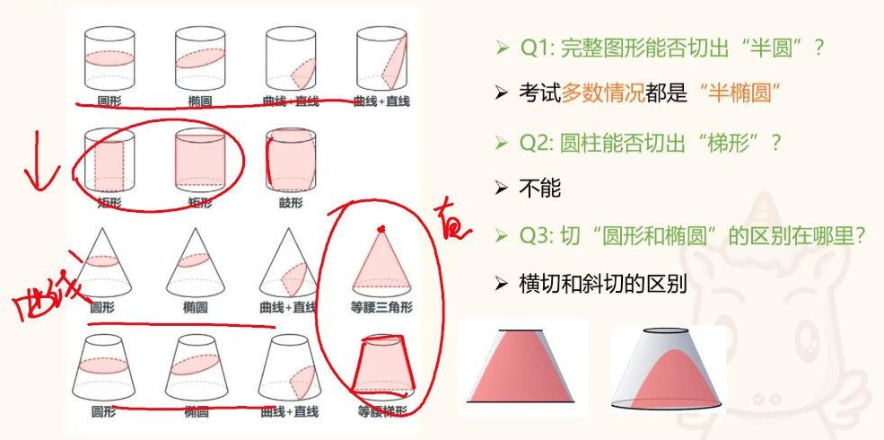

| 截法 | 圆柱 | 圆锥 | 圆台 |
|---|---|---|---|
| **横切**（平行于底面） | 圆 | 圆 | 圆 |
| **斜切**，不碰底面 | 椭圆 | 椭圆 | 椭圆 |
| **斜切**，经过一个底面 | 曲线 + 直线（“半椭圆”） | 曲线 + 直线 | 曲线 + 直线 |
| 斜切，经过上下两个底面 | **鼓形**（上下直线、两侧曲线） | — | — |
| **竖切**（垂直于底面） | **矩形**（任何位置竖切都是矩形） | 过顶点：**等腰三角形**；不过顶点：曲线（像抛物线） | 过（延长后的）顶点：**等腰梯形**；否则两侧是曲线 |

三个课堂问答：
- **Q1：完整图形能切出“半圆”吗？** 考试中多数情况那个“直线 + 曲线”的图形都是**半椭圆**，要**经过底面**才能切出（不经过底面就是完整的椭圆）。
- **Q2：圆柱能切出“梯形”吗？** **不能**。圆柱纯直线的截面只有竖切的矩形。
- **Q3：切“圆形”和“椭圆”的区别？** **横切和斜切**的区别：圆只能横切得到，椭圆只能斜切得到。

> 口诀：**横切出圆，斜切出椭圆，碰到底面出直线。**

💡 解释：
- 圆柱侧面由一条条**竖直的直线**（母线）组成：竖着切，刀面与侧面的交线就是母线 → 两条竖直平行线 + 上下两条等长的弦 → 矩形（不可能是梯形）；只要刀是斜的，与侧面的交线就是椭圆的一段（曲线），直线只能来自底面。
- 鼓形不怎么考：斜着切侧面一定是曲线，经过上下底面就是直线，理解即可。

### 核心难点：纯直线只能“竖直过顶点”（老师打五颗星）
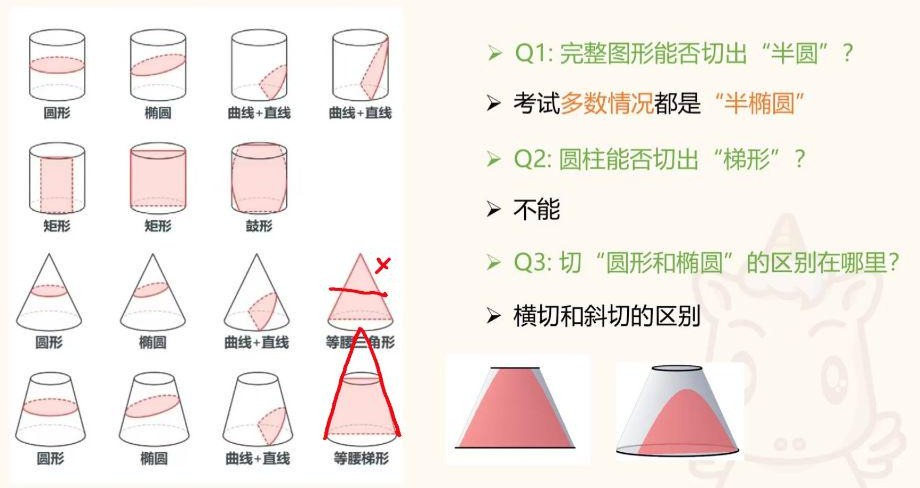
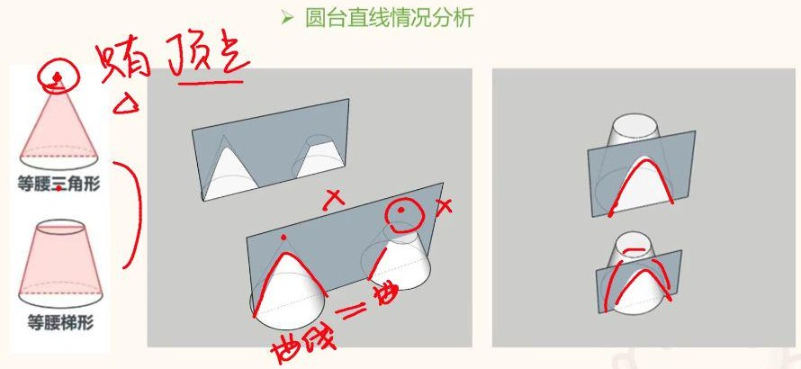

- **圆锥**竖直切并不总是三角形！**必须经过顶点**，切出来才是纯直线的**等腰三角形**；只要往外挪一点点，不过顶点，两侧就变成**曲线**（像抛物线），挪得再多也还是曲线。
- **圆台 = 圆锥把上面横着切掉一截**，条件不变：竖直切时必须经过它**隐藏的顶点**（把两条侧棱延长交出的点，也就是经过中轴），才是纯直线的**等腰梯形**；稍微往前挪一点，两侧虽然看起来很像直线，其实是曲线——和圆锥那一刀是“划等号”的，只是上面被删掉了。
- 纯直线图形很特殊：表中其他截面都带曲线，所以**看到选项是纯直线（三角形/梯形），立刻想“有没有过顶点”**。过顶点切出的三角形左右两腰一定等长，不可能一边长一边短。
- 老师补充：斜着切只要经过顶点也能切出直线，但目前考试还不考斜切这么难，先记住“**竖直过顶点**”这一条。

> 口诀：**只有经过顶点的竖直一刀，才能切出纯直线；不过顶点，一律是曲线。**

💡 解释：圆锥侧面是由从顶点出发的一根根直线（母线）组成的。刀面经过顶点时，与侧面的交线正好是两根母线 → 直线；刀面不经过顶点时，与圆锥面的交线是圆锥曲线（抛物线/双曲线/椭圆的一段）→ 曲线。圆台是圆锥的一部分，母线延长后交于同一个顶点，所以同样要“经过这个隐藏顶点”才是直线。

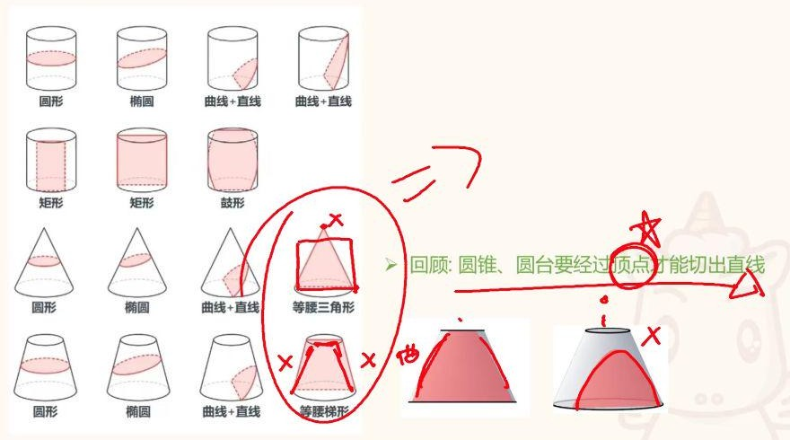

### 例题

**例11**（22国考）左图是给定的空心立体图形（上面圆锥、下面圆台，内部挖空一个小圆锥），将其从任一面剖开，右边哪项**可能**是截面？
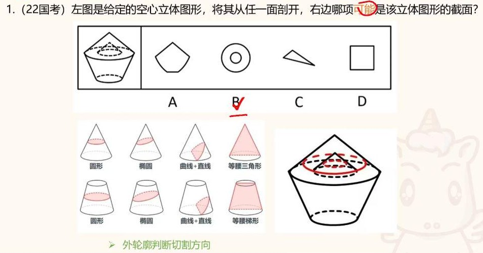
**思路**：
1. 先认模型：外面是圆锥 + 圆台，里面挖了一个小圆锥。
2. **A（五边形）**：上面是纯直线 → 说明刀竖直经过了顶点，那么①中间挖空的部分必须出现（至少要有个三角形空洞），A 没画；②下面圆台的“隐藏顶点”也在同一中轴上，同样被经过，下面也应是直线，A 下面却画成**曲线**——不然刀就拐弯了。两处都错。
3. **B（两个同心圆）**：圆 → 横切；在挖空的高度横切一刀，外面一个圆、里面一个圆 → **可能**。
4. **C（一边长一边短的三角形）**：纯直线必须过顶点，而过顶点的三角形两腰一定等长，切不出这种不等腰三角形 → 错。
5. **D（正方形）**：那是圆柱的模型，圆锥、圆台切不出 → 错。
6. 学员问“截面要不要画虚线”——截面不可能有虚线，截出来的是一个面（中间空的地方是白的），虚线只在三视图题干里出现。

**答案**：B

---

**例12**（20联考）一圆锥台从正中心挖掉一个小圆锥体，然后从任意面剖开，下面哪一项**不可能**是该圆锥台的截面？
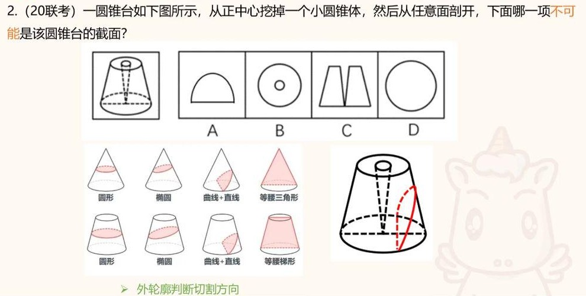
**思路**：
1. 模型：外面圆台 + 里面挖掉的圆锥，截面题 + 选非题。
2. **A（半椭圆）**：圆锥、圆台只要**斜切经过底面**就能切出，随便找个不碰到空洞的角度（图中红色一刀）→ 可能。
3. **B（大圆 + 小圆）**：出现圆只能横切，横切一刀，外面一个圆、里面空洞一个圆 → 可能（外圈是实心面，中间白的是空洞）。
4. **C（两个分开的梯形）**：纯直线 → 竖直经过顶点一刀。有人问“中间为什么没有线？”——截面是跟刀接触的面，中间挖空了没有东西，两块截面自然是**断开**的；觉得该有线，是因为你在做三视图 → 可能。
5. **D（完整的圆）**：空洞从上底中心一直通到底面中心，横着切哪一刀都会碰到空洞，中间要么是一个点、要么是一个圈，不可能是完整的圆。别拿“我只切一点点”这种极端情况抬杠。

**答案**：D

---

**例13**（22联考事业）包含中空立体图形的圆柱体（中空部分：上面一个圆台，下面接一个**歪着的**斜圆台），以下哪个选项**不可能**是截面？
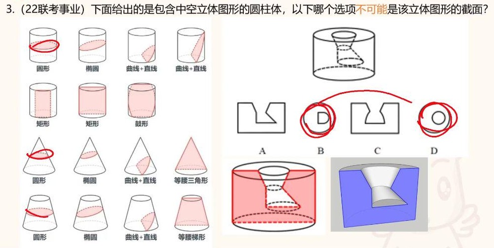
**思路**（这是课上最难的一题，前面“过顶点”的铺垫都是为它准备的）：
1. **A（纯直线）**：竖直一刀。上面圆台要有直线，就要经过它（延长后）的顶点；下面斜圆台也有一个隐藏的顶点。这两个顶点**可以被同一个竖直平面同时经过**（外面圆柱竖切本来就是矩形），于是上下都是直线 → A 可能。**听懂了 A，才能听懂 C。**
2. **B 与 D 很像**（考试中它俩二选一出答案的概率极高）：圆在任何模型里都只能**横切**得到；B 的大圆里是一个带直边的“D”形（半椭圆，而且还画得不像），半椭圆需要斜切经过底面——一个图里要两种切法搭配，违背“一刀切” → B 不可能。
3. **D（圆 + 圆）**：横切经过下面的斜圆台，外面一个圆、里面一个圆 → 可能。
4. **C（上面直线、下面曲线，左右对称）**：上面纯直线没问题（过上面圆台的顶点）。下面：要让左右对称、长度相等，刀只能换成从右往左的方向竖直切，而这个位置**经过不了歪着的斜圆台的顶点**（斜圆台的顶点偏在一边）→ 下面只能是**曲线**。C 下面画的正是曲线 → C 可能。

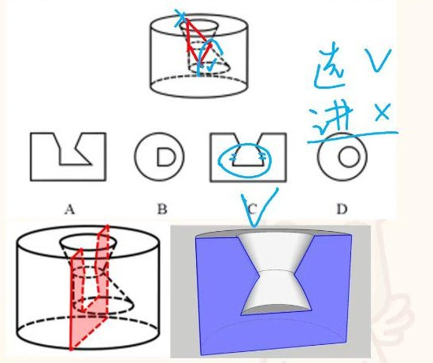
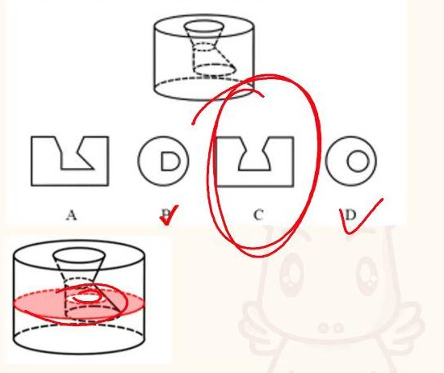
**答案**：B

---

## 8. 正方体（多面体）的截面

### 规律讲解
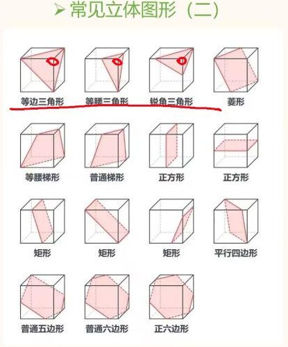

正方体能切出的：**等边三角形、等腰三角形、锐角三角形、菱形、等腰梯形、普通梯形、正方形、矩形、平行四边形、普通五边形、普通六边形、正六边形**。
- 三角形：随便找一个角切下去就是三角形，大小好控制；
- 梯形：上面的线短一点、下面的线长一点；
- 正方形：竖直一刀或横着一刀；矩形：斜着切，长度变一下。

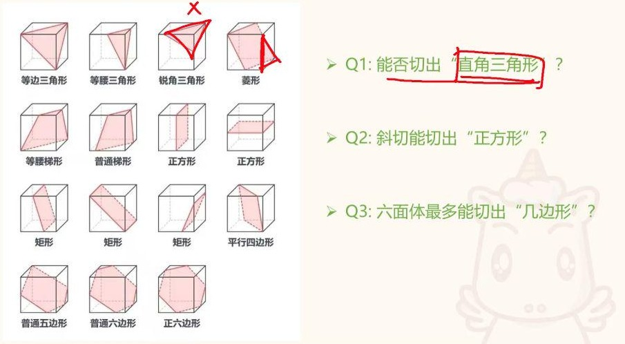

**Q1：能切出直角三角形吗？——不能**，只能切出非直角（锐角）三角形。
💡 解释：正方体切出三角形，一定是切掉一个角，三个顶点落在从同一个角出发、两两垂直的三条棱上，距角点分别为 a、b、c。三边为 √(a²+b²)、√(b²+c²)、√(c²+a²)，任意两边平方和都比第三边平方大（例如 (b²+c²)+(c²+a²) − (a²+b²) = 2c² > 0），所以三个角都是锐角。

**Q2：斜切能切出正方形吗？——能**。别以为只有横平竖直才能切出正方形。
💡 解释（老师的数据举例）：设棱长为 1，面对角线为 √2。刀沿着平行于某条棱的方向斜着切，截面是矩形：一条边恒为棱长 1，另一条边随倾斜程度在 0 到 √2 之间连续变化，总有一个斜切角度让它恰好等于 1，这时就是正方形。空间题难就难在截面常带一点数量计算。

**Q3：六面体最多能切出几边形？——六边形**。
- 截面的一条边来自刀经过的一个面：**一个面最多贡献一条边**，所以**经过几个面就切出几边形**。
- 六个面全经过 → 六边形；有一个面没经过（不一定是上底面，下底面、左面都行）→ 五边形；两个面不经过 → 四边形。

> 老师总结三个重点：**直角三角形切不出来；正方形可以斜切；经过几个面切几边形。**

💡 补充（本课未单独讲，但做题常用）：
- **截面边数 ≤ 面数**：对凸多面体，每个面是凸多边形，刀面与它最多交出一条线段，所以边数不超过面数。
- **平行面截线平行**：两个平行的面被同一刀切，交线互相平行。所以正方体的截面中，落在相对两个面上的边一定平行——五边形有两组平行边，六边形有三组平行边；这也是后面“三点截面”里“过第三点画平行线”的依据。
- **球**：任意方向切都是**圆**（过球心时最大）。

### 例题

**例14**（26联考事业）左边是正方体被截去一部分的立体图形（截去一个角），将其从任一面剖开，以下哪项**不可能**是截面？
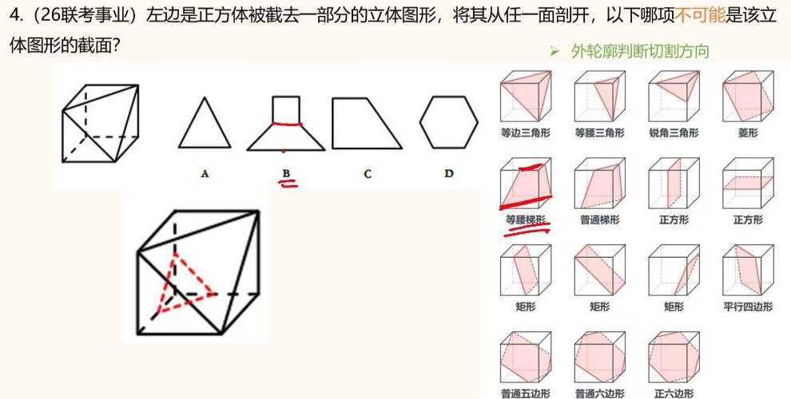
**思路**：
1. **A（三角形）**：截去的部分本身就留下一个三角形面，再随便找一个角切一刀，就能切出三角形 → 送分选项，可能。
2. **C（梯形）**：上面短一点、下面长一点，斜着切 → 可能。（从 B 找线索时 C 顺带就排掉了。）
3. **B（小正方形 + 梯形）**：像构造出来的图形。梯形能切，但**正方形很难切**：截角已经破坏了三个正方形面，只要刀从被破坏的面出来一点点，就会缺一个角（像电话卡那样），切不出完整正方形；除非斜切，而斜切又和这个梯形搭配不上 → B 不可能。
4. **D（六边形）**：不少人觉得“这么怪的六边形肯定切不出来”而误选 D。其实截去一角后，原来六个面**每个面都还在**，只要有六个面就能切出六边形 → 可能。

**答案**：B（本题最大的难点反而是常规的正方形）

---

**例15**（21广东）下列选项中，**不属于**左侧立体图形的截面的是：（正方体中挖了一个倒放的圆台形空洞，未挖穿）
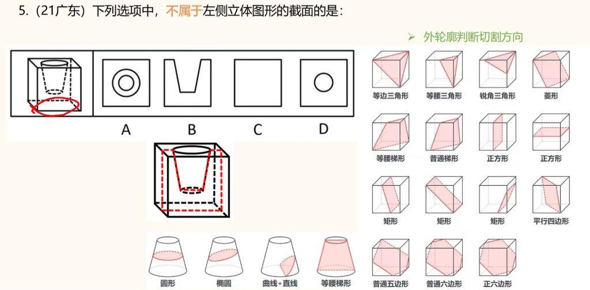
**思路**：
1. 很多同学选 D——审题！这是**截面**不是三视图。
2. **A（正方形里两个同心圆）**：从上往下看，确实能看到上口一个圈、底部一个圈——但那是**俯视图**。横着一刀只能得到**一个圆**（刀往上一点圆变大、往下一点圆变小），不可能两个圆 → A 不属于截面。
3. **B（正方形 + 梯形缺口，纯直线）**：竖直经过圆台（隐藏）顶点的一刀；缺口处为什么没有线？截面没有线，挖空的部分就是空白 → 可能。
4. **C（正方形）**：在空洞下面横切一刀（图中红圈处）→ 可能。
5. **D（正方形 + 一个圆）**：横切穿过空洞，中间空心 → 可能。

**答案**：A（最容易错的就是把截面和三视图混淆）

---

**例16**（26联考）3 个白色正方体和 4 个灰色正方体粘接成的多面体，将其从任一方向剖开，下面哪一项**不可能**是截面？
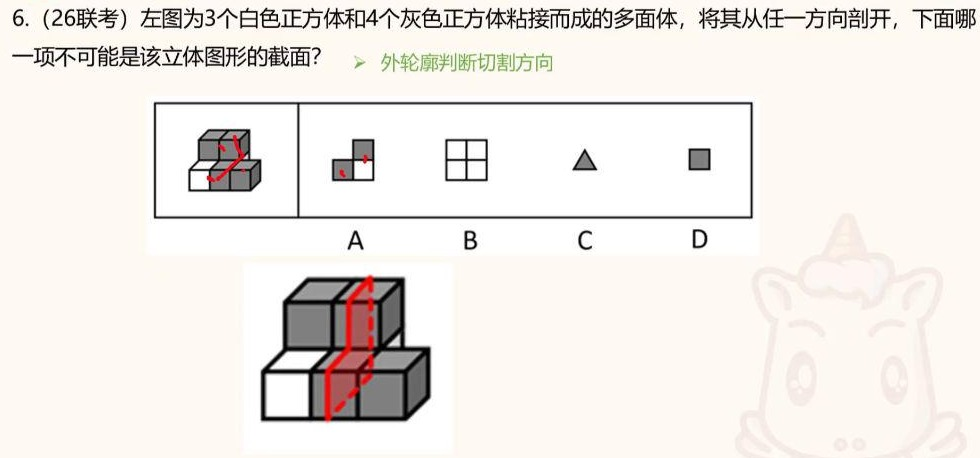
**思路**：
1. 外轮廓判断切割方向：**A**（两灰一白的 L 形）只能竖切 L 形那一段 → 可能。
2. **B**（四个白正方形组成田字形）：题干一共只有 **3 个白块**，画 4 个白正方形等于送分 → 不可能。
3. **C**（灰色三角形）：随便找个灰块的角切下去就行——但注意刀是无限大的，不要找上面的角（容易碰到别的块），要找下面灰块碰不到其他方块的外角 → 可能。
4. **D**（灰色正方形）：在右端灰块处竖切一刀 → 可能。

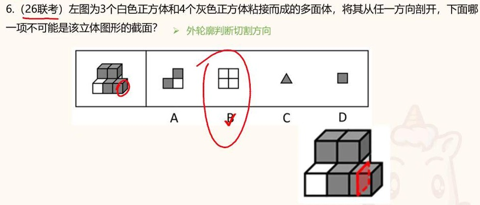
**答案**：B（最新联考题，也有简单题）

---

## 9. ★三点截面（新趋势）

### 识别信号
“现用经 A、B、C 三个顶点的平面对该多面体进行切割，正确的截面是”——题干只给三个点，不直接告诉你怎么切。

### 9.1 方块组合体：出题者的“小心思”

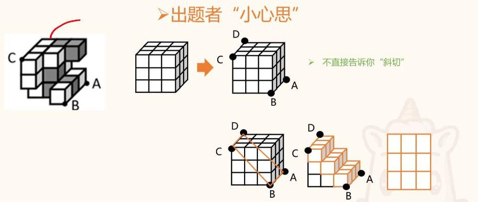

出题人在母题上做了四次“升级”，理解每一步，怎么变形你都会：
1. **不直接告诉你斜切**：母题是 3×3×3 立方体。如果说“经过 A、B、C、D 四点”，你把四点连起来就知道是**沿对角的斜切**；揭开“盖子”看，刀经过的方块排成**下楼梯**的形状，截面是一个 3×3 的九宫格。脑子里一定要有这个“下楼梯”的感觉。
2. **四点改三点**：删掉 D，只说经过 A、B、C——很多人以为是用三角形 ABC 去切。其实不会有任何变化：**刀是无限大的平面**，**三点确定一个平面**（两点只能确定一条线，所以至少三点），3 个点还是 4 个点都是同一个面。
3. **挖掉几个方块**：只要记住刀的位置仍是那条对角斜线、仍是下楼梯，看刀经过哪些方块即可——被挖掉的地方截面上就空着，形状随之变化（下图中编号 1~8 的方块对应截面 1~8 格）。

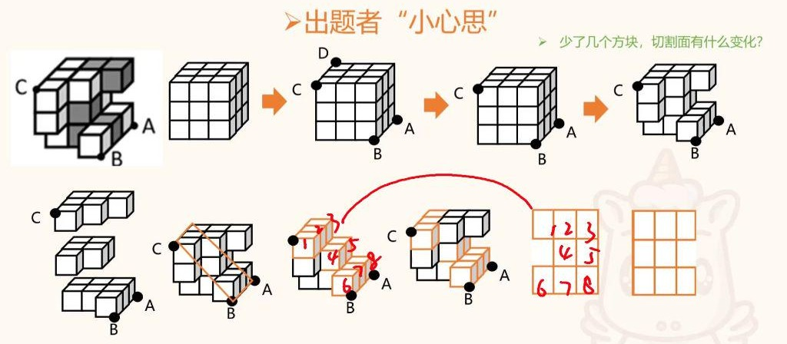

4. **加几个灰/黑块**：题干的灰块不一定都在刀上。沿对角斜切，有的经过、有的不经过，**只看刀经过的方块颜色**，其他不用管。（数量越少的颜色越要关注位置，比如 5 个灰块要逐个看，13 个白的不用管。）
5. **截面其实有两个**：一刀下去（像把合着的两只手掌劈开），左右两块各有一个截面，它们互为**左右翻转**。题目考哪一个都有可能，所以**截面题不用纠结旋转、翻转**——选项旋转了或翻转了，都照样对。

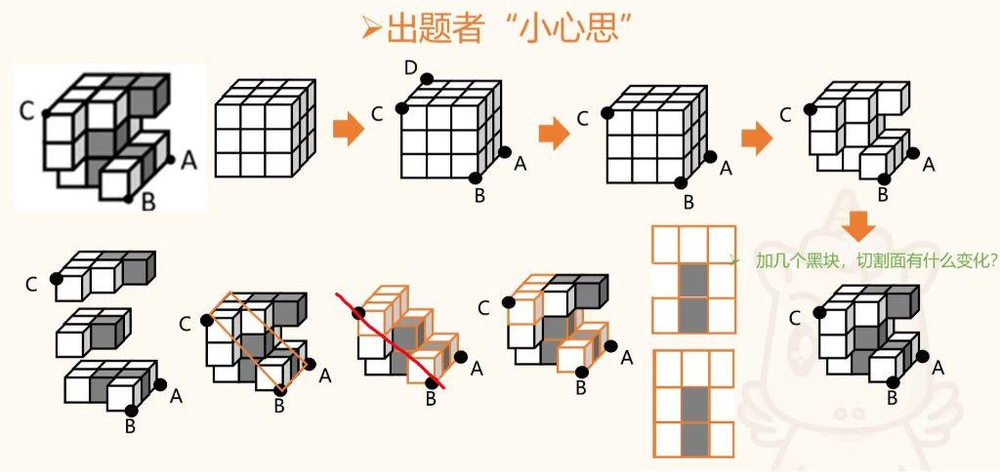

> **实战只做两件事：①数每排个数；②数每排颜色。**（考场上没人帮你画模型，心里知道“是对角斜切、下楼梯”即可。）

#### 例题

**例17**（24国考）13 个白色正方体和 5 个灰色正方体组合而成的多面体，现用经 A、B、C 三个顶点的平面进行切割，正确的截面是？
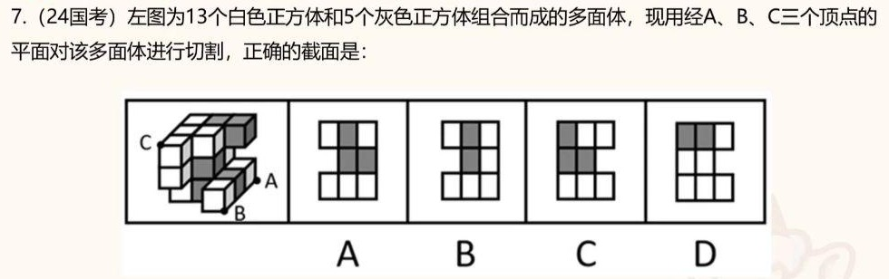
**思路**：
1. 经过 A、B、C = 对角斜切、下楼梯。
2. **每排个数**：3 个、2 个（中间排挖空了一个）、3 个 → 四个选项都是 3-2-3，个数排不掉。
3. **每排颜色**（刀经过的灰块数，自下而上）：第一排 0 个、第二排 1 个、第三排 1 个 → **0-1-1**。
4. 对照：A 为 0-2-1 ✗，B 为 0-1-1 ✓，C 为 0-2-1 ✗，D 为 0-0-2 ✗。

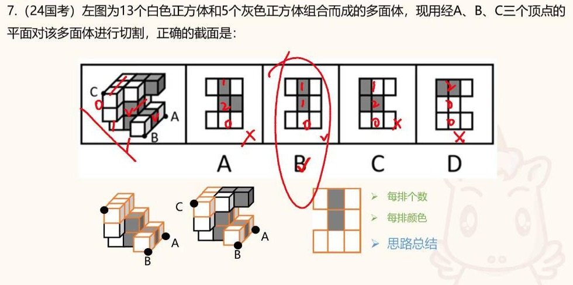
**答案**：B

---

**例18**（24联考）15 个白色和 5 个灰色正方体组合而成的多面体，经 A、B、C 三个顶点切开后，正确的截面是？
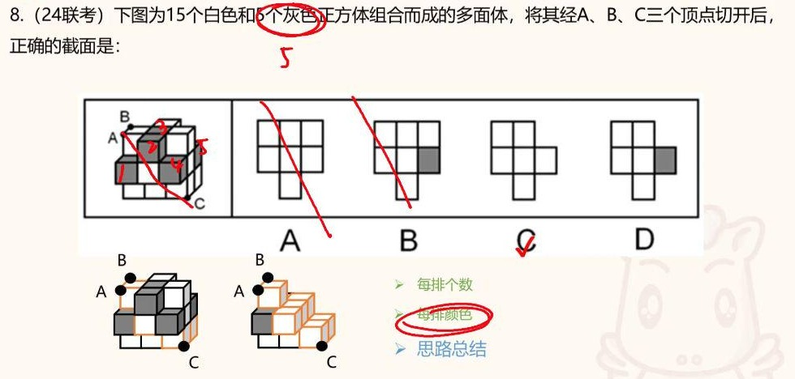
**思路**（得分率 73%，考场上一定是难题）：
1. 经过 A、B、C 还是对角斜切、下楼梯。
2. **每排个数**：沿斜对角看，第一排 1 个，最后一排 2 个，中间一排后面挡住看不见，打个“？”→ **1-?-2**。A、B 首尾是 1 和 3（1-3-3）→ 一定错；C、D 是 1-3-2 → 保留。
   - 出题人也清楚中间排你数不出来，所以四个选项中间都画 3，不在这里做文章——**只看首尾**即可，不用全数。
3. **每排颜色**：5 个灰块逐个看（1~5 号），斜切那一刀**一个都经过不了** → 截面**纯白**。D 带灰块，是想让你以为“背后看不见的可能是灰色”——不可能。
4. 纯白 + 1-3-2 → C。

**答案**：C

---

### 9.2 常规多面体的三点截面

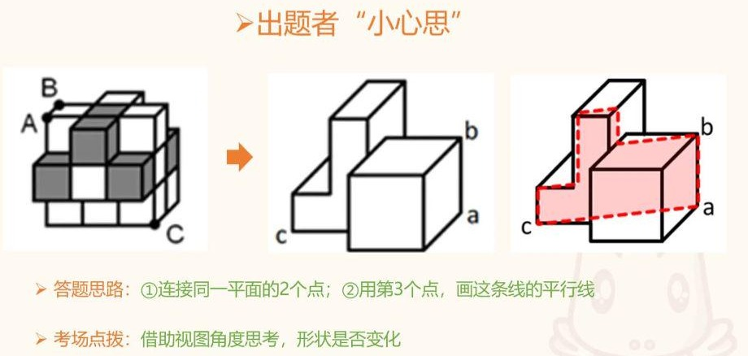

现在更多放到常规立体图形中考（方块体本身就可以看成常规图形，如上图左边的 15 块体可简化成中间的 L 形块 + 方块）。

> **答题思路：①连接同一平面的 2 个点；②用第 3 个点，画这条线的平行线。**
> **考场点拨：借助视图角度思考，形状是否变化。**

1. **先连同一平面上的两点**：选在同一个面上、最直观的两点（上图中 a、b）连线。
2. **过第三点画平行线**：过 c 画 ab 的平行线，**尽量画长、画大**，这样才能感受到截面的方向和大小（往往是斜切）。
3. **借助视图**：先不看选项，想“从前往后看”这部分是什么形状，再想斜着一大刀切过去形状变没变——上图正面是 L 型 + 正方形，斜切后 L 型还是（歪着的）L 型，正方形被拉长成长方形 → 截面是“L 型 + 长方形”的搭配。
4. **刀无限大**：连线后，想清楚这么大的一刀还会碰到哪些部分——碰到就一定会切到。

💡 解释：第②步的依据是“**两个平行面被同一刀切，交线平行**”。ab 在某个面上，c 所在的面与它平行，所以刀在 c 所在面上的交线一定过 c 且平行于 ab。

#### 例题

**例19**（25北京事业）左图为给定的多面体，将其沿过 A、B、C 三个顶点的平面切开后，正确的切面是？
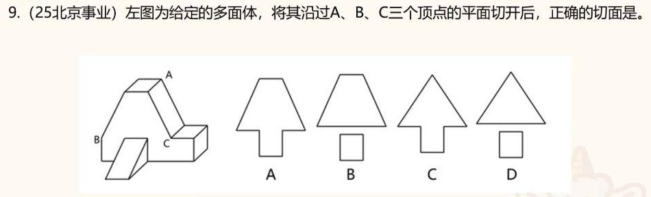
**思路**（得分率 75%）：
1. **连同一平面两点**：B、C 在同一平面上，更直观 → 连 BC。
2. **过第三点 A 画 BC 的平行线**，画长一点 → 能感受到是一个斜切。
3. 选项分两类：A、B 上部是**梯形**，C、D 上部是**三角形**。借助视图：从正面看这部分就是梯形，斜切后形状不变，仍是梯形。只有把 A、B、C 三点连成三角形才会选三角形——截面是无限大的面，不是三角形 → 排除 C、D。
4. A、B 区别：下面的方形部分和上面是**连在一起**（A）还是**断开**（B）？看接触点：BC 这条线正好碰到下面那块斜放的小块（要切出下面的方形，刀就一定得碰到它），刀是一整片、从这里连续延伸下去，不可能中间不接触、下面又莫名其妙“来一刀”（那是第二刀了）→ 连在一起 → A。
5. 有同学问“A 中间那条线为什么没了”：截面是同一个平面上连在一起的一整块，只看外轮廓，内部没有线。

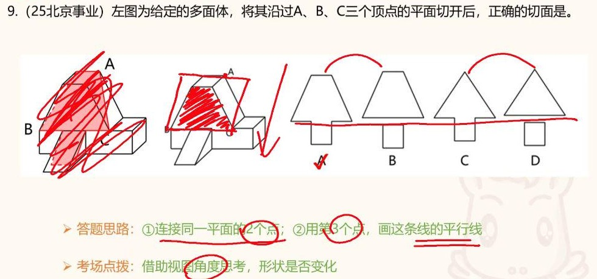
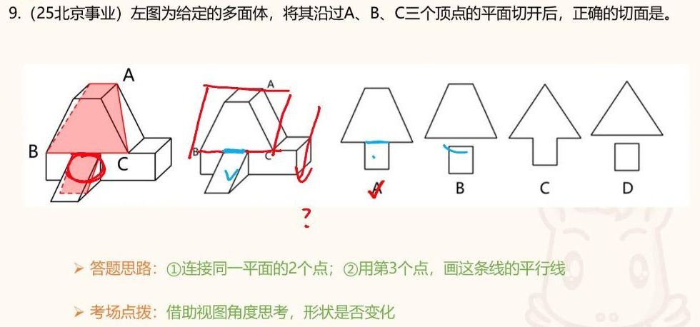
**答案**：A

---

**例20**（26国考）左边为给定的多面体，现用经 P、Q、R 三点的平面对其进行切割，切面为？
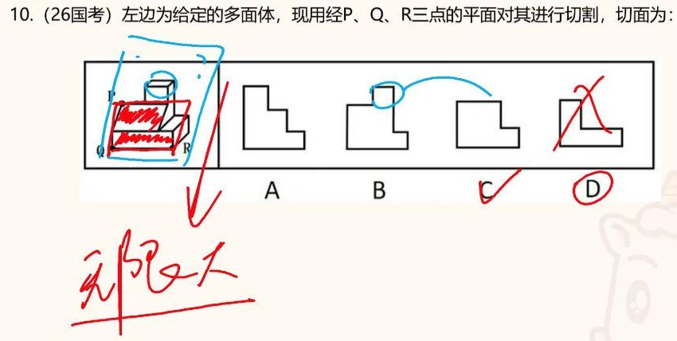
**思路**（得分率 69%，多数人选了 C——易错项出得非常好）：
1. **连同一平面两点**：Q、R 同在底部前棱上，连 QR；**过 P 画 QR 的平行线** → 看出是斜切的角度。
2. **借助视图看轮廓**：正面是一个 L 型台阶，斜切后形状不变 → 很多人立刻选 C（D 的挖坑一眼就能排掉）。
3. **忘了“无限大”**：出题人故意把那个小方块画在**后上方**，就是在考“这里要不要切到”。截面这么大，斜着一刀过去，后上方的小方块**一定会被碰到**，碰到就会被切到 → 截面顶上多出一个小凸起 → B。
4. B 和 C 的区别就在于：连完线能不能想到截面是无限大的——想不到就选 C，想到了就选 B。截面中间的线考试不考，只看外轮廓（中间没有线，它是一个完整的面）。

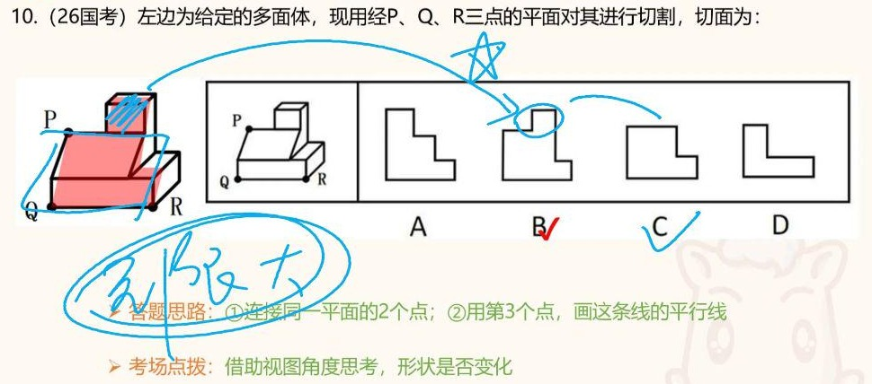
**答案**：B

> 用三个字概括截面的特点：**无限大**。

---

## 本章小结

### 速查表：特征 → 规律 → 做法
| 看到的特征 | 想到的规律 | 做法 |
|---|---|---|
| 问法出现主/俯/左视图 | 三视图，方向固定 | 外轮廓定方向，内部线条定选项 |
| 问“视图”、“任一角度” | 任意角度，可旋转不可翻转 | 找特殊轮廓（直角三角形、拱形、大拇指形）定方向 |
| 九宫格中立体图与平面图有关联 | 考空间（三视图） | 关联度低 → 考平面数量；关联度高 → 考三视图 |
| 选项区别在一两条内部线 | 内部线条挖坑 | 逐条对线：有没有、长短、位置是否对齐 |
| 题干画了虚线 | 出题人要考看不见的部分 | 看不见的线不画；画成实线一定错 |
| 立体图中看似被挡/看似露出 | 立体图是斜着画的 | 用平行棱判断沿视线方向是否前后对齐 |
| 一排小方块堆成的图 | “小方块”考三视图 | 对比题干找相同视角；层数、个数放最后 |
| x 白 y 灰 z 黑，给两视图求第三 | 27 块挖空模型 | 挖空数 = 27 − 用块数；视图空格整排打叉；标颜色 |
| 三阶魔方拧动 1 次 | 视图可旋转不可翻转 | 多数不动、移动个别；最后查是否需要翻转 |
| “剖开/切开/截面” | 与刀接触的面 | 一刀切、刀无限大、不能拐弯；无虚线、无内线 |
| 选项出现圆 | 只能横切 | 横切一刀只有一个圆；两个同心圆是俯视图 |
| 选项出现直线 + 曲线 | 半椭圆 | 斜切且经过底面 |
| 圆锥/圆台选项是纯直线 | 必须竖直过顶点 | 等腰三角形/等腰梯形；不等腰、上直下曲（同轴时）都错 |
| 正方体截面选项 | 常见图形表 | 无直角三角形；斜切可出正方形；边数 = 经过的面数 ≤ 6 |
| 过 A、B、C 三点（方块体） | 对角斜切、下楼梯 | 数每排个数（看首尾）+ 每排颜色 |
| 过三点（常规体） | 三点定面，刀无限大 | 连同面两点 → 第三点画平行线 → 视图看形状 → 检查漏切 |

### 口诀汇总
> - 外部轮廓定方向，内部线条定选项。
> - 看得见画实线，看不见不画（或画虚线），看不见画成实线必错。
> - 对比题干，找相同视角；数个数放最后。
> - 27 − 用块数 = 挖空数；视图空一格，整排打个叉。
> - 先找多数黑块不需要移动的情况，再移动个别黑块；视图能转不能翻。
> - 一刀切、刀无限大、不能拐弯。
> - 横切出圆，斜切出椭圆，碰到底面出直线。
> - 只有竖直经过顶点，才能切出纯直线。
> - 视图有线，截面没线。
> - 经过几个面，就切出几边形。
> - 每排个数 + 每排颜色。
> - 连接同一平面的 2 个点，用第 3 个点画平行线；借助视图，看形状是否变化。
> - 截面三个字：无限大。

### 易错坑汇总
1. 把后面看不见的棱画成实线的选项——必错（例3 的 A、C）。
2. 被斜着画的立体图骗：看似挡住其实没挡（例3），看似露出其实完全被挡（例4）。
3. 左视图“把头探下去看”外表面，选了线偏上的干扰项（例5 的 B）。
4. 以为视图只能从前往后看（例2 的 D 是从后往前看）。
5. 小方块题一上来就数个数，浪费时间（例8）。
6. 27 块题中两视图同一位置颜色不同就以为矛盾——其实是透过挖空处看到后面的块（例9）。
7. 魔方题只查“能不能补出来”，忘了查补出来的图案是否需要**翻转**（例10 的 D）。
8. 截面题用三视图的眼光：看到两个同心圆就选（例15 的 A）、觉得挖空处应该有线（例12 的 C）、给截面画虚线。
9. 以为圆锥、圆台竖着切就一定是三角形/梯形——必须经过顶点（例11 的 A、C，例13 的 C）。
10. 一个截面里要两种切法（圆 + 半椭圆）——违反一刀切（例13 的 B）。
11. 觉得怪六边形切不出来——有六个面就能切出六边形（例14 的 D）；反而是常规正方形切不出来（例14 的 B）。
12. 三点截面把三点连成三角形去切（例19 的 C、D）；忘了刀无限大而漏切后面的方块（例20 的 C）。
13. 三点截面纠结截面旋转/翻转——截面有两个、互为翻转，旋转翻转都算对。

---

## 附：课前答疑（补充上一章“展开图”的三个疑问）

**疑问①：公共边颜色为什么必须一致？**（25国考）4 个黑色、8 个白色正方体粘接成的长方体，问哪一项可能是其正确的外表面展开图？
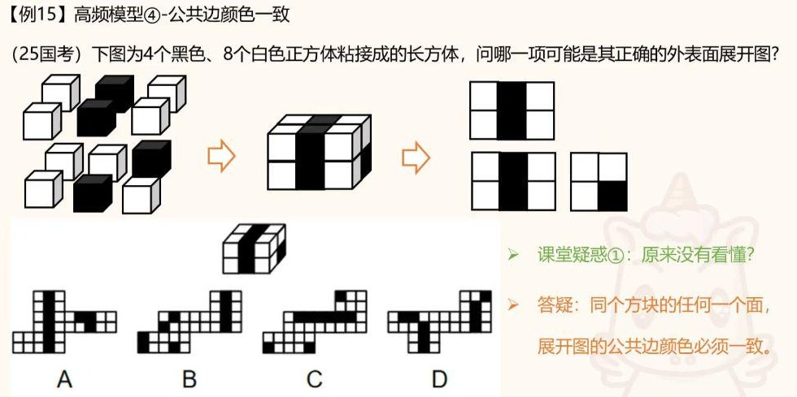
- 每个小方块各面颜色相同。长方体上两个相邻面在同一条棱两侧的小格，**属于同一个小方块** → 在展开图中，这条公共边两侧对应位置的颜色必须相同（1 对 1、2 对 2、3 对 3），只要有一处颜色对不上就错。
- A：黑块和白块在公共边处颜色不一致 → 错；B：这两条公共边两侧的颜色没有一处对上 → 错；C：一黑一白没对上 → 错；D：两边都是白、白对白，全部对上 → **选 D**。

**疑问②：题干是斜线，为什么选项里变成了垂线？**（23江苏，箭头法 + 自身左右）
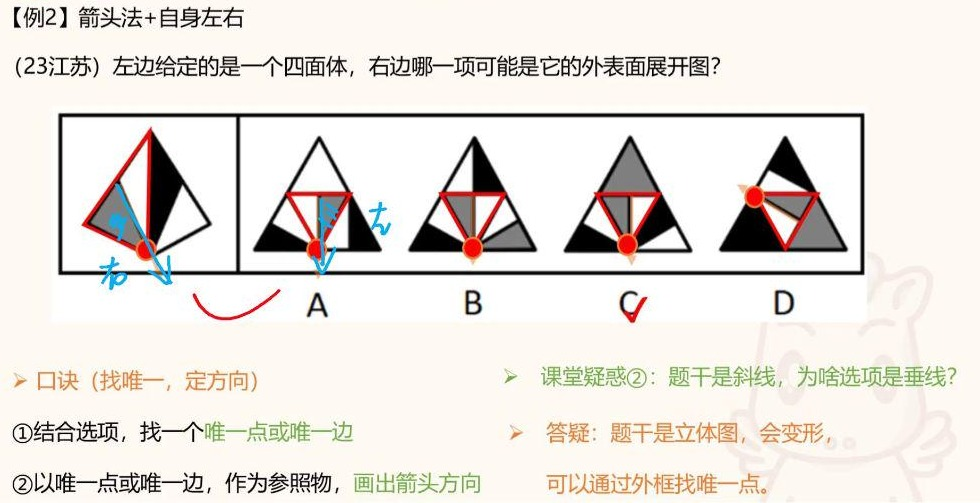
- 题干是立体图，画出来会变形：看起来是斜线，实际与选项中那条垂线是同一条线（垂直关系）。
- 更好识别的办法：把红色三角形外框画出来，外框中黑白相交的那个点是**唯一点**；朝唯一点画箭头，再看灰色面在箭头的左边还是右边，左右就区分清楚了。
> 口诀：**找唯一，定方向**——①结合选项，找一个唯一点或唯一边；②以它为参照物，画出箭头方向。
- **答案**：C

**疑问③：为什么两个长方形不能在同一个方向？**（22山东，多面体公共边长度）
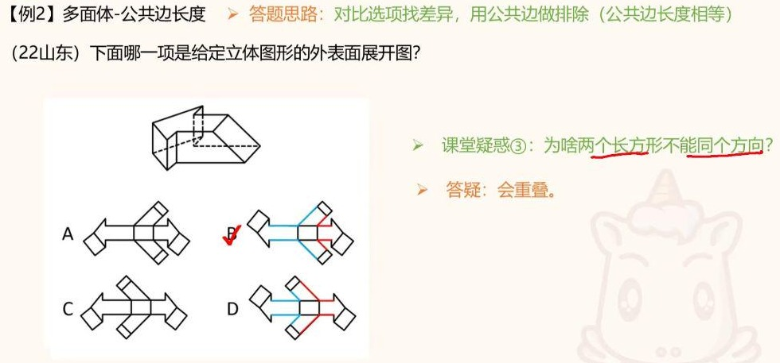
- 先用公共边长度排除：C 中标“2”的两条边长度明显不等，没法拼成封闭图形 → 排除 C。
- 题干两个箭头都朝左，长箭头翻折后要到右边去；它连着的长方形（红）和另一个长方形（蓝）必须一个在左、一个在右。如果两个长方形在同一侧，折回去时会**重叠** → 所以只能一左一右 → **选 B**。
