# 第9章 空间·立体拼合、平面拼合、不规则六面体

> **本章要点速览**
>
> - **考情**：本课大多是选修内容，先看自己省份考不考（见第0节表格）。**立体拼合所有人前期都尽量学**；黑白面几乎只有江苏考；考情会变，觉得轻松就顺手准备。
> - **立体拼合**：看到“左图由①②③组成／可切割为①②③，问③是哪个（或除哪项外）” → 只用一招**找特殊**：先代入题干中**最大或最抽象**的块，**用铅笔涂黑**用过的部分，再看剩余轮廓（形状、层数、凸出部分）对选项，**像蜻蜓点水一样看轮廓，不要真的整块拼**。
> - **平面拼合（常规）**：几块碎片拼成选项，“只能上下左右平移” → 出题人是**复制粘贴后切割**，所以形状、长度、角度、方向必须 **100% 一致**；按顺序用：①**特殊线条**（唯一的长线或横竖线）②**等长的线**（等长的边就是拼接处）③**拆分选项**（最慢，两项纠结时才用）。
> - **平面拼合·黑白面**：每张纸片一面黑一面白，可平移、旋转、翻转 → **旋转颜色不变，翻转颜色改变**；用时针法画箭头，口诀**同方向同颜色，反方向反颜色**。
> - **俄罗斯方块**：形式一“拼成选项” → **先代入大的、贴边拼，优先按不旋转考虑**；形式二“选项代入后题干有规律” → 先挑选项差异最大的那一行，按行找黑白规律；形式三“拼成规则图案”（题干不提示）→ 数量没规律、轮廓却能咬合 → 拼成对称图形。
> - **不规则六面体／多面体展开图**（第7章已讲，这里回顾）：没有图案，用不了箭头法 → **对比选项找差异，用公共边做排除（公共边长度相等）**；两个面不能折到同一个位置。
> - **上节课答疑（截面、魔方）**：魔方拧一次 → 先找多数黑块不用动的情况，再移动个别黑块；截面**经过顶点才能切出纯直线**，只要切到底面就会出现直线（鼓形就是被上下底截断的椭圆）。

---

## 0. 课前：选修考情

| 考点 | 主要考查地区 | 老师建议 |
|---|---|---|
| 不规则（多面体、不规则六面体展开） | 广东、山东、联考、浙江、四川、上海、各地事业单位 | 目前需要关注 |
| 平面拼合（常规） | 广东、江苏、上海、联考、四川、北京、各地事业单位 | 目前需要关注 |
| 平面拼合·黑白面 | 江苏（其他省份几乎没考过） | 目前需要关注 |
| 俄罗斯方块 | 广东、江苏 | 目前需要关注 |
| 立体拼合 | 各地都可能考 | **前期尽量学**（所有人） |

- **联考**：考试时间在 3 月前后的省份基本都参加联考。联考试卷每个省抽到的题不同，某省这次没抽到，下次也可能抽到。
- **考情会变**：浙江事业单位以前从没考过平面拼合，25 年就考了。所以没上榜的省份可以抱着“娱乐心态”听，觉得轻松就准备，吃力就有选择地准备。
- **立体拼合**比较难。平时一道都不练的话，考场上大概率做不出来，所以前期尽量学。

---

## 1. 上节课答疑（已并入第8章）

本课开头补讲了第8章（三视图与截面）的四个疑问。完整图解已经放在第8章对应的例题里，这里只列结论：

| 疑问 | 结论 | 详见 |
|---|---|---|
| 26联考 魔方拧一次，哪项不可能 | 先找**多数黑块不用动**的情况：左边两列不动，只拧右边一层，正面补出 Z 形。Z 形转 90° 后与 D 互为**左右翻转**，视图只能转不能翻，所以选 **D** | 第8章 例10 |
| 圆柱的“鼓形”截面 | 斜切时刀**同时碰到上、下底面**：上下两边是直线，两侧是曲线。**只要切到底面，截面就一定出现直线**。圆柱很长时，同样的斜切碰不到底面，仍是椭圆。鼓形很少考，了解即可 | 第8章 第7节 |
| 圆锥、圆台什么时候是纯直线 | 必须**竖直经过（延长后的）顶点**，偏一点两侧就是曲线 | 第8章 第7节 |
| 22联考事业 中空圆柱，A、C 为什么都可能 | A：从前往后竖切，刀面能同时经过上、下两个圆台的顶点，所以全是直线。C：左右对称只能从右往左切，这时经过不了歪圆台的顶点，所以下半部分是曲线，正好和 C 一致。答案 **B** | 第8章 例13 |
| 24联考 15白5灰 过 A、B、C 切开 | 先数每排个数，再数每排颜色。5 个灰块都不在刀面上，所以截面全白，选 **C** | 第8章 例18 |

---

## 2. 立体拼合

### 识别信号（看到什么，想到它）

- “左边的立体图形由①、②和③组成，下列哪项可以填入问号处”
- “多面体可以切割为①、②和③三个小多面体，问③可能是”
- “由除哪项外的三个多面体组合而成”（相当于四个选项里去掉一个，剩下三个能拼成题干）
- 题干常给**正视图 + 后视图**两张直观图；带颜色的题会说明“×个白色 + ×个灰色正方体”。

### 规律讲解：只用一招“找特殊”

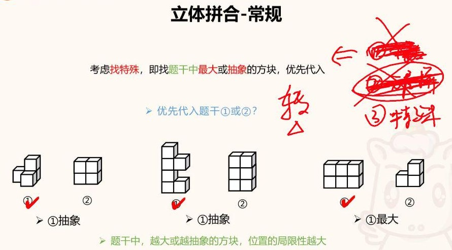

**为什么只留“找特殊”一个方法？**（课件右侧：①数个数、②分层拼被划掉，只留③找特殊）

- **数个数**：刚开始考的那几年能排除个别选项。现在题目越来越难，ABCD 四个选项的方块个数几乎都一样，数了也白数。
- **分层拼**：这几年题干和选项经常**旋转**过（课件上写着“转△”），一层一层去拼根本考虑不到转动的情况。
- 方法多了反而还要在方法之间做选择，所以老师只保留了不管什么难度都能用的**找特殊**。

**找特殊：找题干中最大或最抽象的块，优先代入。**

| 对比 | 更该先代入的 | 原因 |
|---|---|---|
| 同为 4 块：L 形台阶 vs 2×2 正方体 | L 形（①，**抽象**） | 正方体块哪里都放得下，L 形位置很少 |
| 同为 6 块：挖了缺口的“熊猫形” vs 2×3 长方体 | 有缺口的（①，**抽象**） | 长方体横放、立放都可以，缺口形状很好定位 |
| 6 块 vs 3 块 | 6 块（①，**最大**） | 越大越难塞，位置越少 |

> 题干中，**越大或越抽象的方块，位置的局限性越大**：局限性越大，可能的位置越少，位置也就越固定。

> 💡 解释：这和解数独时先填“候选最少”的格子是一个道理。先放可能位置最少的块，后面的搜索范围就小得多。反过来，先放正方体、长方体这种“哪里都能放”的块，每种放法都要继续试，很快就乱了。

**操作步骤（考场顺序）：**

1. **看出题者提示**：题干只给了①②，先判断哪一个更大、更抽象，或者一眼就能看到它的位置。
2. **代入第一个块，用铅笔把它占的位置涂黑**，正面、背面能看到的都涂。一定用铅笔：考试本来就要带铅笔，涂错了还能擦掉重来；用黑笔只能做一次。
3. 再代入第二个块，继续涂黑。第一个块放好后，第二个块往往一下就能找到（常常是正好“卡进去”的位置）。
4. **看剩下没涂的部分**，它就是③。不用把③完整拼出来，只看轮廓：**形状、层数（高度）、凸出的部分、同一平面上的形状**，和选项对比。这就是“**蜻蜓点水**”，点几下看轮廓，不要整块去拼。
5. 选项转了没关系：你要找的是“那个形状”，不是真的去拼。

**考场取舍（老师原话要点）：**

- 题干里**能代进去一个块**，这题就可以做，得分率大约 50%～60%，不做会被对手拉开。
- 题干里**一个都代不进去**，考场上大概率放弃。这类题得分率有时只有 20%～30%，放弃是有性价比的。
- 能练就尽量练，真做不出来也别给自己太大压力。

### 易错点 / 老师提醒

- 不要被旋转带偏。题干中的块、正确选项经常是转过的，你只需要认出“那个轮廓”。
- 看不清的时候可以画平面分层草图来拼，但速度慢，比做不出来强。
- 带颜色的题：每一块的黑白搭配是固定的，可以用“某个白块只和这个黑块接触，就一定归它”来锁定轮廓（见例6）。

### 例题

**例1**（23贵州事业）左图由①②③组成，问哪项可以填入③。

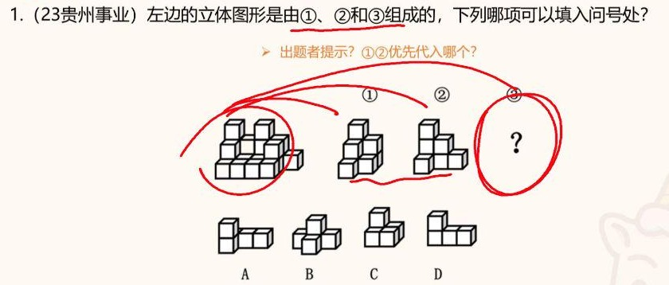

**思路**：

1. 找出题者提示：②像下楼梯，题干里也有一处下楼梯；①同样有下楼梯的感觉，只是朝向不同。这题①②差距不大，先代哪个都可以。
2. 找到楼梯的位置，用铅笔涂黑。再代另一个块，也涂黑，还有一个 L 形的位置一起涂掉。
3. 剩下的部分像一个 L 形，主要在 A、D 里选。D 是同一个平面上的，而剩下的这部分旁边应该是凹进去的、有两层，所以是 A。
4. 这题①②都没动，只有选项前后稍微转了一下，属于简单题。

**答案**：A

**例2**（22重庆选调）左图由①②③组成，问哪项可以填入③。

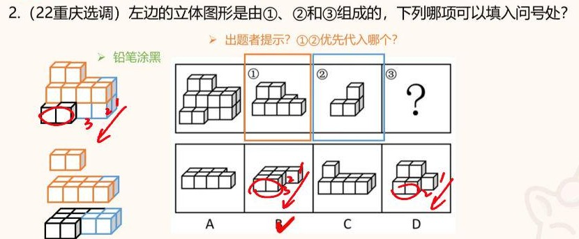

**思路**：

1. 先代①，它更大，位置局限性也更大：要么放在最上面，要么下移一层，只有两种情况。按最简单的情况放上去，铅笔涂黑（左图橙色）。
2. 涂完后视野就清楚了：第二层只剩一个位置和②对得上，代入②再涂黑（蓝色）。
3. 剩下的是黑框部分，只剩几个方块，B、D 都有类似的初步轮廓。
4. **数层数**：剩余部分共有**三层**，D 只有两层，B 有三层，所以选 B。实在不放心，可以画出每层的平面图拼一下，慢但稳。

**答案**：B

**例3**（20国考）给出正视图和后视图，由①②③组成，问③。

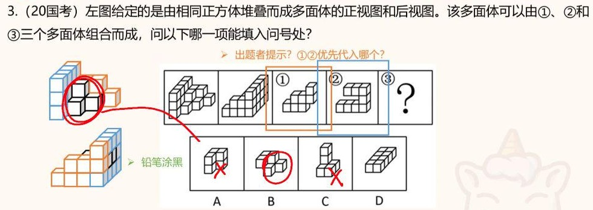

**思路**：

1. ①在正视图左侧一眼就能找到位置，不用转，先代①，铅笔涂黑（左图蓝色）。背面有些区域看不见，涂能看到的就行。
2. 再代②：总高三层，三个、三个、四个方块对得上，涂黑（橙色）。
3. 剩下的黑色部分是**前面凸出来的那一块**，就是③的特征。去选项里找这个形状：A 不像，C 不像，D 不像，**B 前面凸出的部分和它非常像**。剩下的两个方块是 B 后面那两块，可以不管。

**答案**：B

**例4**（21国考）给出正视图和后视图，由①②③组成，问③。

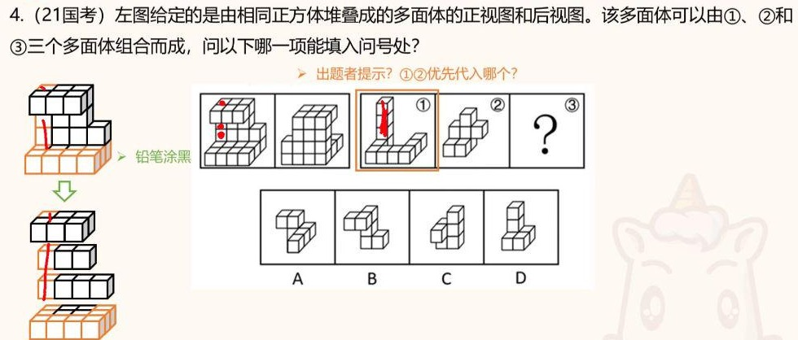

**思路**：

1. ①最大（高四层），先代：最左边四层一路涂黑，再把①下面的“土”字形部分涂掉。
2. ②下面有一个正方形区域，题干里正好留着一个一样的正方形空位，像是专门给它留的，**卡进去**后下面一层就满了。涂黑②。
3. 剩下没动的是**5 个连在一起、在同一平面上的方块**，形状像一辆“小汽车”。去选项里找：
    - A 面积最大的一层是背后的 J 形，不像；
    - B 是 L 形，不像；
    - **C 后面正好有这个 5 块连成的小汽车形**；
    - D 是 L 形，不像。
4. C 其实是转过的，但你找的是“5 块连在一起的形状”，不是真的去拼，所以不受影响。

**答案**：C

**例5**（23国考）3 个灰色 + 15 个白色正方体，切割成①②③，问③。

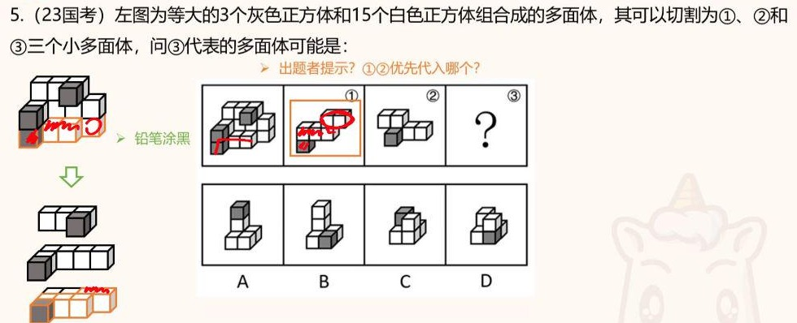

**思路**（难题：题干的①②都转过）：

1. 三块里各有一个独立的灰块。先代①，因为它的轮廓更好找：一个黑块连着三个白块组成一个大 L 形，底下再接一个 L 形，和题干最底层很像。①只能放在**最下面一层**。把能看到的部分用铅笔涂黑。
2. 再代②：和它直接接触的是三个连在一起的白块，只能放在最上面一层。实际相当于**这一层旋转了 180°**，一层一层对着涂黑。
3. 剩下能看到的部分高**三层**，有两个方块孤零零地凸出来。
    - A 的层高是三层，凸出的部分也像，保留；
    - B 与“两个方块凸出”的感觉对不上，排除；
    - C 有一个对角关系，不像，排除；
    - D 也不像。
4. 所以选 A。（选项 A 同样转过：记住“三个 + 两个”的闪电形即可。）

**答案**：A

**补充：“黑白接触面”技巧（了解即可，不推荐）**

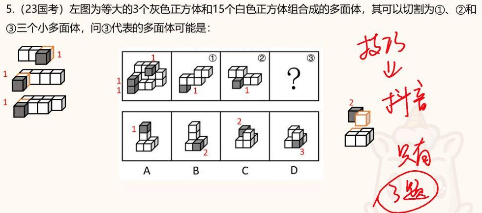

- 做法：数每个**黑块与白块“面贴面”接触**的个数。23国考中，题干三个黑块各只接触 1 个白块，①②也都是 1，所以③中黑块也只能接触 1 个。
    - A 是 1，符合；
    - B 左右各接触一个，是 2；
    - D 接触好几个；
    - C 看着像“对角接触”，其实那一块是立起来的 L 形，下面一个、侧面一个，也是 2。
    - 所以选 A。
- 老师评价：这个技巧适合在短视频里“秒杀炫技”，**能用的题不超过三道**，而立体拼合已经考了几十道。拿 26 国考一试（下面的例6）就失效：数出来的接触数区分不开选项，题目又是“除哪项外”。**不用掌握**。

> 💡 解释：技巧成立的道理是，每一小块内部的黑白接触，在拼好的整体里也一定存在，所以选项里黑块的接触数不能超过题干中的数。但它只能排除“接触太多”的选项，大部分题选项的接触数一样，自然就失效了。

**例6**（26国考，最新真题）12 个白色 + 3 个灰色正方体，给出前后两面直观图，问**除哪项外**的三个多面体可以组成它。

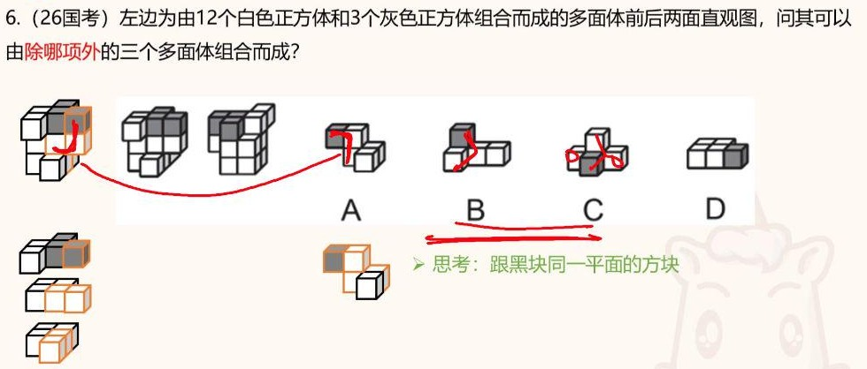

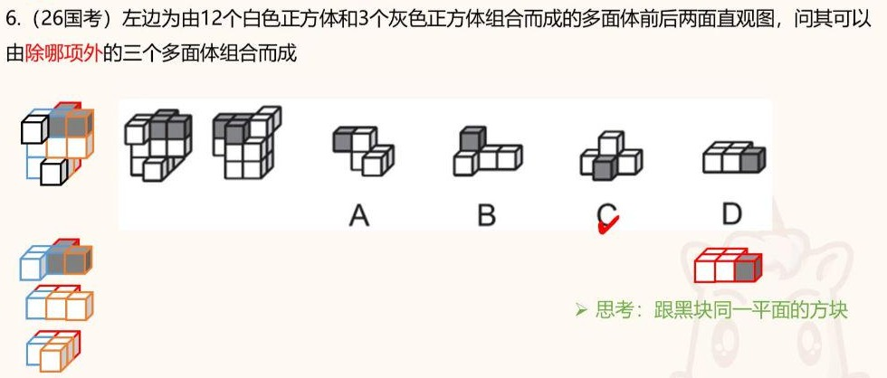

**思路**：

1. 读懂题型：去掉一个选项，剩下三个能拼成题干，要选的是**拼不进去的那个**。
2. 看每个选项里**和黑块在同一平面的方块**（背景轮廓）：
    - A 像闪电／L 形；
    - B 是 L 形；
    - C 是一个小 T 形；
    - D 整个就是一个平面，5 块连成“小汽车”。
3. **D 最明显**：题干背面就有这个 5 块平面形状（虽然转过）。用铅笔涂掉，D 能用。
4. 找第二个好代的。每块的构成：15 ÷ 3 = 5 块一组，**每组 1 黑 + 4 白**。题干里有个白块只和某一个黑块接触，这个白块**只能分给这个黑块**，否则它就断开、悬空了。顺着这个关系能感受到一个 L 形，和 **A 的外形**对上，A 能用。
5. 最后在 B、C 里选：剩余区域高三层，有 L 形，B 的 L 形对得上。C 的 T 形如果硬塞进去，会让旁边一个方块孤零零、分不到白块，“把别人的财路堵死了”。所以 C 拼不进去。
6. 老师强调：你看不到全部也没关系，只用轮廓“蜻蜓点水”地判断。真要完整拼出来，对空间想象要求非常高。

**答案**：C

---

## 3. 平面拼合（常规）

### 识别信号

- 题干给出四块碎片，问“可以拼合成选项中的哪一个”，或“下边四个图形中只有一个是由上边四个图形拼合而成”。
- 题干通常写明“**只能通过上、下、左、右平移**（不能旋转或翻转）”。

### 规律讲解

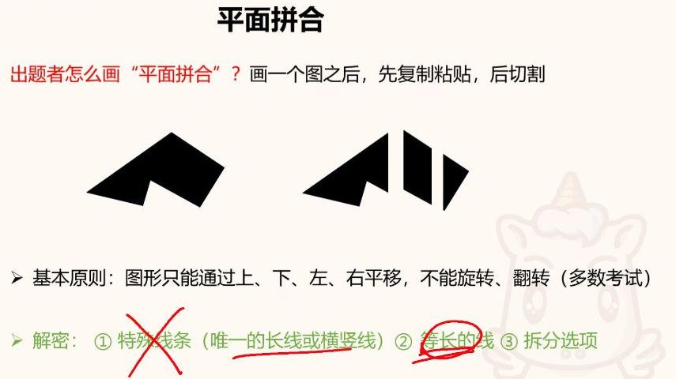

（图中红色记号是老师讲课时的圈画，不是删掉①。）

**出题人怎么画平面拼合**：先画一个图，**复制粘贴**一份，再在复制出来的图上切几刀，得到几块碎片。

- 所以正确选项和碎片拼出来的图**100% 相等**：形状、大小、长度、角度、方向都必须一致，差一点点都不行。
- **基本原则**：多数考试只能上下左右平移，**不能旋转、翻转**。

**解密三步（按优先级）：**

| 顺序 | 方法 | 怎么用 | 为什么有效 |
|---|---|---|---|
| ① | **特殊线条**（唯一的长线或横竖线） | 找题干中最长的线，或方向特殊的横线、竖线。如果它是**唯一**的（别的碎片没有和它等长的边），正确选项里一定原样出现，长度、方向都不变。选项中只有一个有，直接秒选；没有的直接排除 | 长度上特殊或方向上特殊，都是为了“好看” |
| ② | **等长的线** | 找不到唯一的长线时，找两块碎片上**长度相同、方向相同**的边，它们大概率拼在一起 | 用来确定哪两块相邻、怎么拼 |
| ③ | **拆分选项** | 把某个选项切开往回拼 | 最慢，**能不用就不用**，只在两个选项纠结时拆其中一个 |

> 💡 解释：切割线会同时成为两块碎片的边，所以一条切割线在碎片里会以“一对等长的边”出现，这就是“等长的线往往拼在一起”的原因。而一条**没有配对的边**不可能是切割线，只能是原图外轮廓的一部分。只允许平移时，它在答案里的长度和方向都不会变，所以“唯一的长线”一定会在正确选项中原样出现。

老师提醒：考场上找线条要么“最长”，要么“等长”，两个角度都行。找唯一线条时如果不小心找到了等长的线，就先把这两块拼起来，再回头接着找唯一线条。

### 易错点 / 老师提醒

- **题干写了只能平移，就绝对不考虑转过的选项**。方向一变（旋转）就直接排除，每道题都要先看清这个条件。
- 看起来像不等于对：差一点点长度、角度都不行（见例12，易错项故意放在正确选项前面）。
- 面积也要对得上：选项少一块碎片的面积，肯定错。

### 例题

**例7**（26四川）四个图形只可上下左右平移，拼成哪个选项？

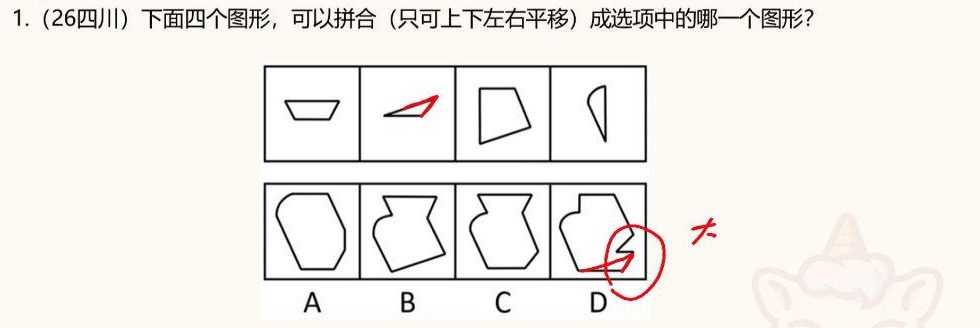

**思路**：

1. 先看比较大的③，它有一条较长的边。本想找“最长的唯一线”，结果发现另一块上有一条和它**等长**的边，那这两块就拼在一起。
2. 拼好后看旁边的倾斜程度：A 那一段太高、太长，和碎片的长度对不上（必须 100% 一致），排除 A。
3. 再找第二条较长的线，它和②的长边等长，所以②拼在下面，拼出来**底边是一条横线**。B 的底边不是横线，不能旋转，排除。
4. D 的尖角画得太夸张（老师圈出）。②的尖角顶多形成一个小尖，排除 D。只能选 C，C 的上半部分也和碎片吻合。

**答案**：C

**例8**（25联考事业，最新题）四个图形只能平移，拼成哪个选项？

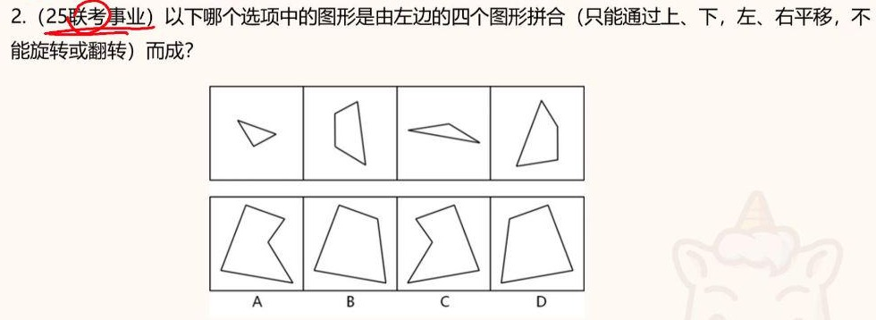

**思路**：

1. ③那条细长的线在①②④中都没有，**是唯一的，必须保留**。选项里 A、B 有这条线（长度、角度一致）；C、D 里它被转了方向，只能平移，排除 C、D。
2. 从④看也一样：④的那条边 A、B 有，C、D 角度不对。
3. A、B 的区别：②里有的那条线要不要出现。题干②里有，所以 A 错，选 B。
4. 考场上就两步：看到③的长线 → 排除转了的 C、D → 看一条线定 A、B。

**答案**：B

**例9**（22江苏）只有一个选项是由上边四个图形平移拼合而成的。

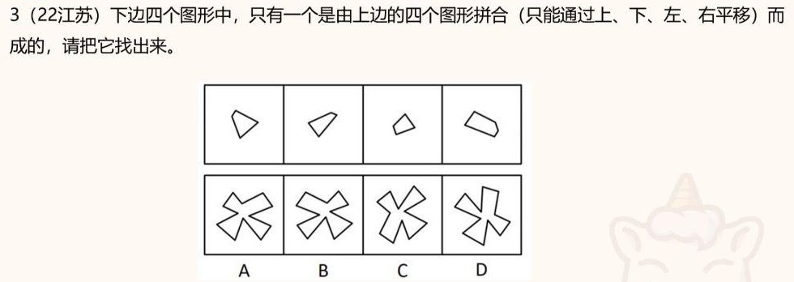

**思路**：

1. 投票时多数人选④最特殊，因为④有一条**最长的线**，没有别的碎片能和它拼，所以它必须原样出现在选项里。
2. 看选项：这条线不能移、不能转，只有 **B** 中出现了这条线。一眼就能选。
3. 从②那条差不多长的线出发也一样，只能是 B。D 与题干完全不是 100% 一致，不要选。
4. 验证：大块放在右下角，其余各块对应上，没问题。

**答案**：B

**例10**（23江苏）只有一个选项是由上边四个曲边图形平移拼合而成的。

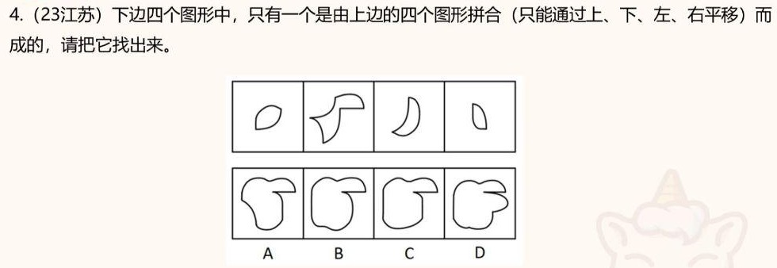

**思路**：

1. 最明显的特征是②的“**鸭嘴**”，A、B、C 都有。D 的鸭嘴画得不像，而且多了一块题干中没有的凸起，先排除 D。
2. 接着找较长的线：本想找最长线，结果在③里找到一条和它**等长**的线，说明这两块拼在一起。
3. 再找另一条最长的线，它必须保留：B 中原样出现；A 这里“手抖”变形了；C 这里画成了直线。只有 B 完全一致。
4. 真去拼也能验证：每段弧度都一一对应。但拼太慢，不建议拆分选项。

**答案**：B

**例11**（26广东）四个图形不经旋转或翻转拼接而成。

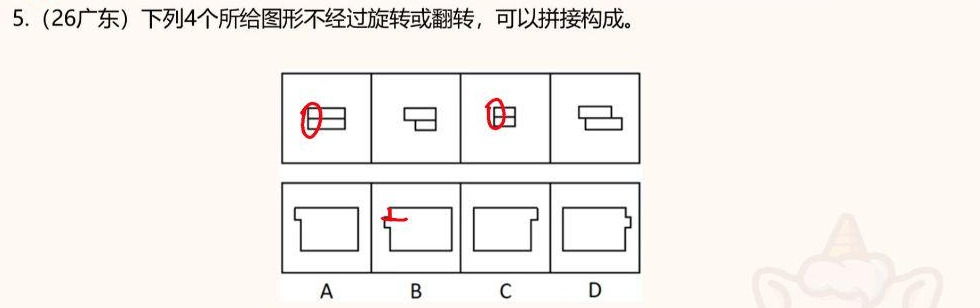

**思路**：

1. 每块都是**上下两层长条**。①③（红圈）边缘齐平、形状规则，可能的位置太多，**尽量不看**。
2. 看②④：②的直角台阶和④的台阶等长，两块能咬合，拼在一起。
3. 再找“唯一的”特征：剩下的那个**小角落**没有别的碎片能和它拼，必须保留在选项里，而且在**左边**。A、B 在左边，C、D 在右边（方向反了），排除 C、D。
4. A、B 的区别：B 左侧中间多了一个只有**一层**厚的小凸角（老师标出）。碎片都是两层厚，要凹也至少凹两层，题干里没有单层的模型。B 错，选 A。
5. 真不放心就把缺口带进 A 验证：②的轮廓出来后，剩下正好是①③的区域，A 没问题。

**答案**：A

**例12**（21江苏，挖坑题）只有一个选项是由上边四个图形平移拼合而成的。

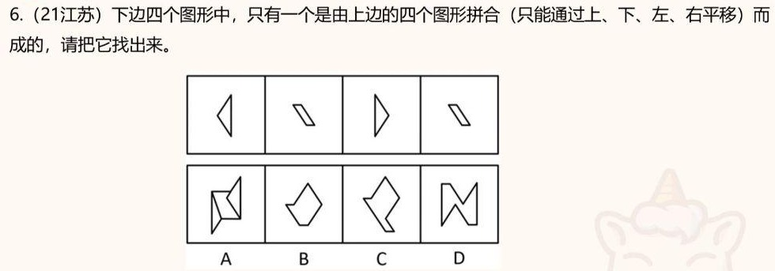

**思路**：

1. 难点：①③一样，②④一样，找不到“唯一”的线，只能用**等长的线**：三角形的边和平行四边形的边等长，可以拼在一起。
2. A：拼出这种角落不可能，两个规则的碎片拼不出这个角，排除。
3. B：少了一个平行四边形，**面积太小**，排除。
4. C（易错项）：菱形部分没问题，关键是分割线的位置。以“三角形边长 = 平行四边形边长”为参照，分割线要画得靠下，下面就只剩一条短线，第二个平行四边形长度不够，不是 100% 匹配，排除。
5. D：各段长度都相等，平均分也合理，选 D。
6. 挖坑点在**长度**上，差一点都不行（老师打★）。易错项还故意放在正确选项前面。

**答案**：D

---

## 4. 平面拼合·黑白面（江苏专考）

### 识别信号

- “四张纸片，**每张纸片一面是黑色，另一面是白色**”，允许平移、**旋转、翻转**，问能（或不能）拼成哪项。

### 规律讲解

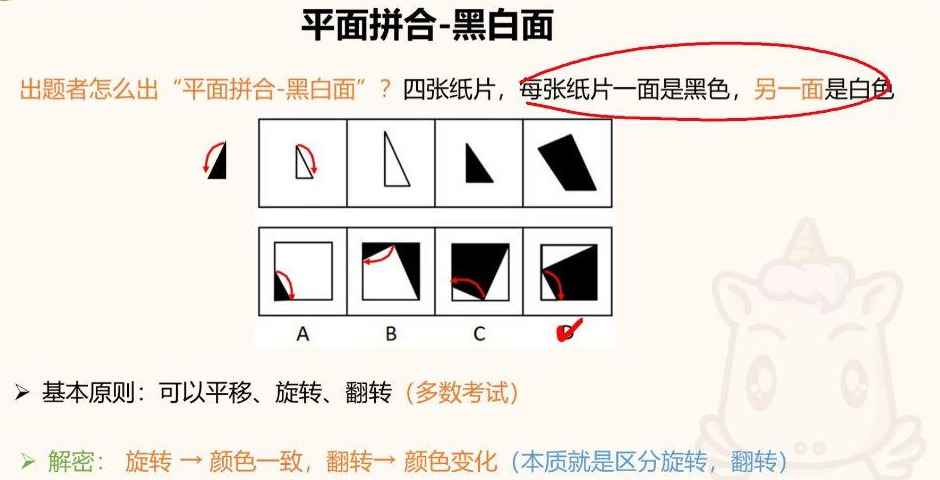

- 纸片像手掌：手心白、手背黑。**翻过来颜色就变**，但哪一面朝上拼都可以。
- **基本原则**：可以平移、旋转、翻转（多数考试）。
- **解密**：**旋转 → 颜色一致；翻转 → 颜色变化**。这类题本质就是**区分旋转和翻转**，和位置规律里的旋转／翻转是同一个知识点。
- **时针法**（区分旋转、翻转）：在同一块纸片上取固定的起点和终点，路径也一致，比如直角三角形从 **30° 角**到 **60° 角**，沿斜边画箭头，看是顺时针还是逆时针。
    - 引例（上图）：题干中白色三角形的箭头是**顺时针**；翻过来变黑后是**逆时针**（左侧小图）。
    - 所以对这块纸片来说：**顺时针 ↔ 白色，逆时针 ↔ 黑色**。
- <strong>口诀</strong>：<strong>同方向，同颜色；反方向，反颜色。</strong>两个条件要一起看，不能只看颜色。

> 💡 解释：旋转不改变图形的“绕行方向”，也不会把纸片翻面，所以方向和颜色都不变。翻转会让顶点顺序从顺时针变成逆时针，同时露出背面，颜色也跟着变。所以对同一块纸片，“方向”和“颜色”是绑在一起的：方向没变颜色就不能变，方向变了颜色就必须变。

**引例思路**：看题干第①块（白色小三角形，顺时针=白）。

- A：箭头顺时针，却是黑色，矛盾，排除；
- B：顺时针，也是黑色，排除；
- C：逆时针，应当是黑色却是白色，排除；
- D：方向和颜色都一致，正确。
- 能直接看出来的（如 A、D）不用画；旋转后不好看的（如 C）再画箭头。

**答案**：D

### 易错点 / 老师提醒

- 考场一紧张方向感就差，“看不出来的时候就画箭头”，时针法最稳。
- 只看颜色一样就判对是错的：必须**方向相同**时颜色才相同。
- 形状一样、互为翻转的两块纸片可以当成同一块，只检验一次就行（见例14）。
- 本题型只有江苏考，但它考的旋转／翻转和位置规律是相通的，听懂了对位置规律的理解也会更深。

### 例题

**例13**（22江苏）四张纸片（一面黑一面白），只有一项能由它们拼合（可平移、旋转、翻转）而成。

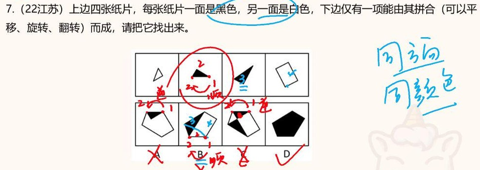

**思路**：

1. 先看大小、形状，确定选项中哪块对应哪张纸片。②（黑色三角形）在选项里基本都能直接对上，就拿②检验：30° 角记为 1，另一个锐角记为 2，从 1 画到 2，题干中是**顺时针 + 黑色**。
2. A：对应②的三角形是**逆时针**，颜色却还是黑色。方向反了颜色没变，排除。
3. B：③那块很明显，不用比。看②：B 中是**顺时针**，却是白色。同方向应当同颜色，排除。
4. C：②在 C 中又是**逆时针**。反方向应当反颜色（应为白色），C 却是黑色，排除。
5. D 直接选。

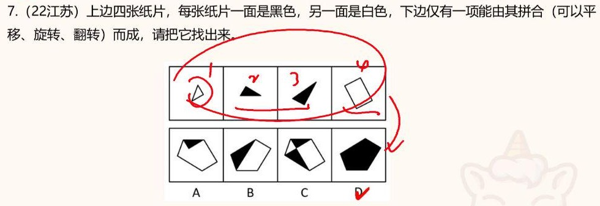

为什么 D 可以全黑？②③本来就是黑的，把①④翻过来也是黑的，四块黑面拼成一个五边形。

**答案**：D

**例14**（23江苏）四张纸片（一面白一面黑），允许平移、旋转、翻转，**哪项不能**拼成？

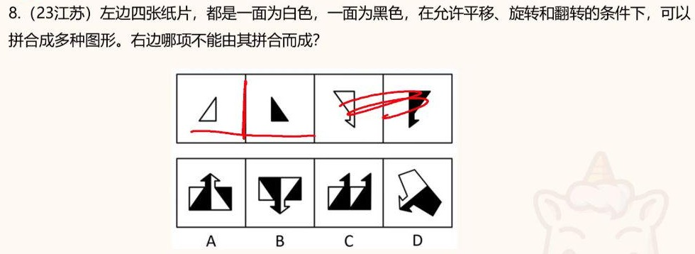

**思路**：

1. 难点：①和②相等，③和④相等。①沿竖线往右一翻，就和②一模一样（颜色也跟着换），所以这两块其实是**同一张纸片**，③④同理。这样就不用区分谁是谁，只检验三角形就够了。
2. 定规则：三角形 30° 角 → 60° 角，**黑色是顺时针，白色是逆时针**。
3. A：黑色三角形顺时针，白色三角形逆时针，都对。
4. B：白色三角形从 1 到 2 是**顺时针**，而白色应当是逆时针，已经错了。再看另一边：逆时针却是黑色，也反了。B 不能拼成。
5. 注意是**选非题**，要选“不能”的。

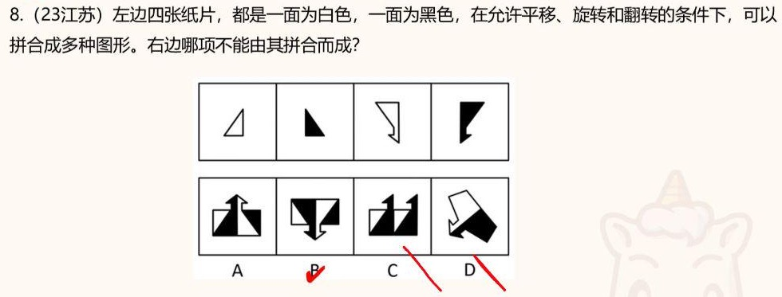

**答案**：B

---

## 5. 平面拼合·俄罗斯方块

**什么是俄罗斯方块**：不同形状、不同个数的小方块，拼接在一起。共有三种出题形式。

### 5.1 形式一：拼接成选项

#### 识别信号

- 题干给出 4 个由小方块组成的图形，问能拼成哪个选项。常写“只能通过上、下、左、右平移”。

#### 规律讲解

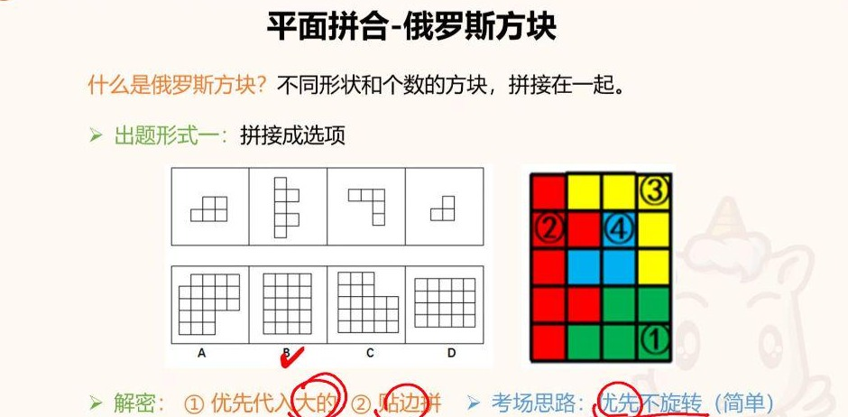

- 没有什么巧办法，就是**直接代入**。代入也有技巧：
    - ① **优先代入大的**；
    - ② **贴边拼**，沿着选项的边和角放。
- **考场思路：优先不旋转**（简单）。很多题会直接写“只能上下左右平移”；就算没写，也**先按不旋转考虑**。一考虑旋转，代入的角度就多得多，速度太慢。

> 💡 解释：大块的可选位置最少，贴着边和角放又进一步限制了位置，这样每一步几乎只有一种放法，错了马上就能发现。

**引例思路**（上图）：

1. A：先放最大的②，只有一个位置能放，放进去高度就不对，剩下的①③④也不好放，排除。
2. B：②能**贴边**放；接着③有一个直角，贴着直角放进去；剩下的位置正好是①（5 块）和④。B 可以。
3. D：②太高，根本放不进去。
4. 所以考场上只需在 B、C 中稍加核对。

**答案**：B

#### 例题

**例15**（22江苏）只有一个选项是由上边四个图形（只能上下左右平移）拼合而成的。

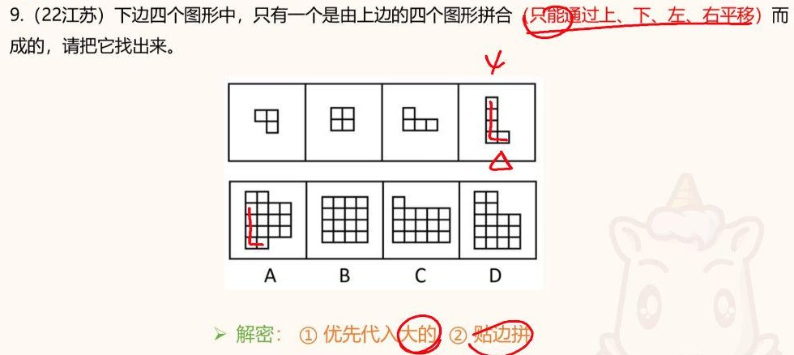

**思路**：

1. 最大的是④（L 形），**贴边**代入 A 的左侧。
2. ②③方块数相同，但③更抽象（L 形），先代③。
3. 剩下正好是一个田字形（②），再加①的直角，全部对上，A 直接选出。
4. A 已经出答案了，不必再去代 B、C、D。

**答案**：A

### 5.2 形式二：选项代入后，题干有规律

#### 识别信号

- 题干是一大块黑白方格图案，中间挖掉一块（问号），选项是小方格块，问哪一个填进去“呈现一定的规律性”。广东考得很多，一定要掌握。

#### 规律讲解

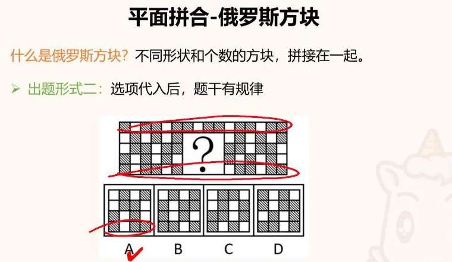

- 一行一行地看黑白排列规律，把问号处补齐。
- **引例**（上图）：
    - 有一行是“两黑一白”循环。开头只有一个黑块，是因为左边没空间了，其实少了一个；
    - 有一行是“一白一黑”交替，问号处应当是白黑白黑，只能在 A、B 里选；
    - 再看一行是“白黑黑、白黑黑”，A 那一行正好是白黑黑，选 A；
    - 另外有一行和第一行一模一样，也能直接对上。
- **提速技巧**：不用每行都分析。先**对比选项**，找四个选项**长得都不一样**的那一行，只分析这一行就能得到唯一答案。

**引例答案**：A

#### 例题

**例16**（25浙江事业，浙江首次考）选最合适的一项填入问号处。

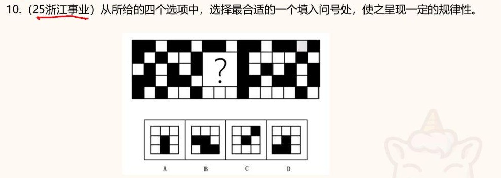

**思路**：

1. 先比选项：**第三行** A、B、C、D 各不相同，只分析这一行。
2. 题干这一行是“两个黑、一个白，两个黑、一个白……”，问号处应补“黑黑白”，**D** 的第三行正好是黑黑白。
3. 验证：
    - 第一行：白块依次是 1 个、2 个、（问号处 3 个）、4 个……递增，D 的第一行三个全白，对；
    - 第二行：白黑白交替，D 也对。
4. 这是浙江第一次考，现场得分率只有 60% 左右，其实是送分题。

**答案**：D

### 5.3 形式三：拼接成“规则图案”（没有提示，最难）

#### 识别信号

- 题干只说“最符合所给图形规律的是”，给一排由小方格组成的图形，**完全不提示是拼合**。联考、四川、广东等地出现过。

#### 规律讲解

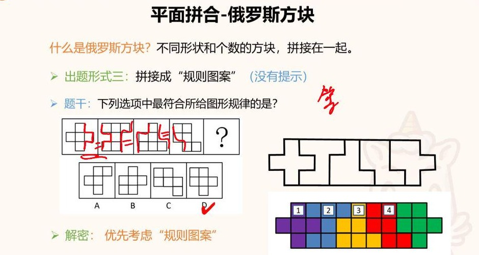

- 怎么想到拼合：
    - 正常会先数方块个数，但这里是 5、6、6……，数量上不可能有规律，从数量角度做不了；
    - 再看轮廓：前一个图形的凹凸和后一个图形**正好能咬合**，有点像前面“等长的线”在提醒你，这几个图形可以直接拼在一起。
- 拼起来之后，是一个**规则的对称图形**。第四个要补的，就是让整体保持对称的那一块，选 D。
- **解密**：优先考虑“规则图案”（对称）。这是用平面拼合的形式来考对称性。

> 💡 解释：出题人把一个对称的大图形切成几块，再按顺序排开，“规律”就是能还原成这个对称图形。它换了个形式考对称性，所以数量、线条都找不到规律的时候，要想到这一层。

**引例答案**：D

#### 例题

**例17**（21江苏事业）选出最合适的一个填入问号处，使之呈现一定的规律性。

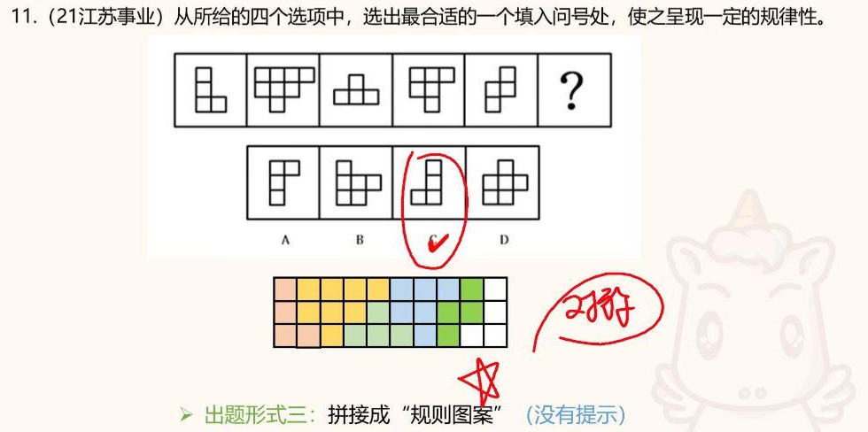

**思路**：

1. 数个数，差距太大、没规律。再看轮廓：一个图形的凹凸（比如“土”字形）和下一个图形刚好对得上，这是在提醒你**拼接**。
2. 依次把 L 形、第二块、“土”字形、第四块、第五块拼进去，得到一个**长方形**（既是轴对称又是中心对称），右下角还缺一个 **L 形**。
3. 选项中 C 是 L 形，而且形状、方向都能补齐这个长方形。
4. 老师担心以后对称性会这样考，希望以防万一准备一下。

**答案**：C

---

## 6. 不规则六面体／多面体的展开图（见第7章）

老师说明：**“不规则的六面体，在六面体那节课已经提前讲了。”**完整讲解和例题（六棱锥、21山东、22山东）在**第7章第8节**，本课只在开头提醒了一句：22山东那道“一个箭头朝左、一个箭头朝右”的题靠的就是**公共边长度**。

要点回顾：

- **识别信号**：给一个非正方体的立体图形（棱锥、盒子拼接体、斜面盒子等），问外表面展开图；面上基本没有图案。
- **为什么不用箭头法**：没有图案，找不到唯一点、唯一边。
- **答题思路：对比选项找差异，用公共边做排除（公共边长度相等）。**
    1. **不看题干**，只对比选项，找出几个选项之间不同的那一两处。
    2. **公共边等长**：相邻两个面粘在一起的边必须一样长，对不上的排除。
    3. **不能抢位置**：两个形状相同的小面朝同一方向伸出，折起来会重叠，排除。

> 💡 解释：展开图折回立体时，每一条棱都是由展开图里的两条边粘合而成的，这两条边必须一样长。立体的每个面只占一个位置，展开图里两个面折起来落到同一处，就说明多了一个面、少了另一个面。

**补充（非老师原话，方便迁移）**：遇到长方体等非正方体盒子，先用**面的形状、大小能否对上**和**公共边等长**排除；面上有图案时，再结合第7章的相对面、相邻面、箭头法处理。

---

## 本章小结

### 速查表：特征 → 规律 → 做法

| 题目特征 | 考点 | 做法 |
|---|---|---|
| 左图由①②③组成／切割成①②③，问③或“除哪项外” | 立体拼合 | **找特殊**：先代最大、最抽象的块 → 铅笔涂黑 → 看剩余轮廓（形状、层数、凸出、同一平面形状）对选项 |
| 带黑白色的立体拼合 | 立体拼合 | 按每组“几黑几白”分配；只和某黑块接触的白块必归它；看“和黑块同一平面的方块” |
| 碎片拼成选项，只能平移 | 平面拼合 | 复制粘贴 = 100% 一致；①唯一长线／横竖线 ②等长的线 ③拆分选项（尽量不用）；转了方向的选项直接排除 |
| 纸片一面黑一面白，可旋转翻转 | 黑白面 | 时针法画箭头（如 30°→60°）；**同方向同颜色，反方向反颜色** |
| 方格块拼成选项 | 俄罗斯方块·形式一 | 先代大的、贴边拼，优先不旋转 |
| 黑白方格图挖一块，选项是小方格 | 俄罗斯方块·形式二 | 先找选项差异最大的一行，按行找黑白循环规律 |
| 一排方格图形，“最符合规律”，数量无规律 | 俄罗斯方块·形式三 | 轮廓能咬合 → 拼成对称的规则图案，补缺的那块 |
| 非正方体立体，选外表面展开图 | 不规则六面体／多面体 | 不看题干 → 对比选项找差异 → 公共边等长排除 → 相同小面不能抢同一位置 |
| 魔方拧一次后的视图 | （答疑）魔方 | 先找多数黑块不动，再移动个别黑块；注意镜像关系转不出来 |
| 圆柱、圆锥、圆台截面有直线 | （答疑）截面 | 纯直线必须过顶点；切到底面才会出现直线 |

### 口诀汇总

> - 立体拼合：**找特殊——题干中最大或最抽象的块优先代入；越大越抽象，位置局限性越大。**
> - 立体拼合：**铅笔涂黑，蜻蜓点水**（看轮廓，不全拼）；**题干能代进一个就做，一个都代不进去就放弃。**
> - 平面拼合：**复制粘贴，100% 一样**；解密：**特殊线条 → 等长的线 → 拆分选项**。
> - 黑白面：**旋转颜色一致，翻转颜色变化；同方向同颜色。**
> - 俄罗斯方块：**优先代入大的，贴边拼；优先不旋转。**
> - 多面体：**对比选项找差异，用公共边做排除（公共边长度相等）。**
> - 截面：**经过顶点才能切出直线**；魔方：**先找多数黑块不需要移动的情况，再移动个别黑块。**

### 易错坑汇总

1. 立体拼合想“真的拼出来”，或者被旋转带偏。应该只认轮廓。
2. 立体拼合用黑笔涂，涂错了没法重来，要用铅笔。
3. 迷信“接触面”之类的秒杀技巧，能用的题极少，26 国考就失效。
4. 平面拼合没看清“只能平移”，把转过方向的选项当成对的。
5. 平面拼合只看“像”，不看长度：差一点点也不行（21江苏 C 是典型易错项，面积少一块的也要排除）。
6. 黑白面只看颜色、不看方向（“同颜色有什么了不起，得看箭头方向”），以及没注意是“不能”的选非题。
7. 俄罗斯方块一上来就考虑旋转，代入情况爆炸。
8. 形式三没有提示，只数个数，想不到“拼成对称图形”。
9. 多面体展开图硬去分析复杂的题干，应当直接对比选项、看公共边。
10. 截面：圆柱切不出梯形；纯直线必须过顶点，稍微偏一点就是曲线。
